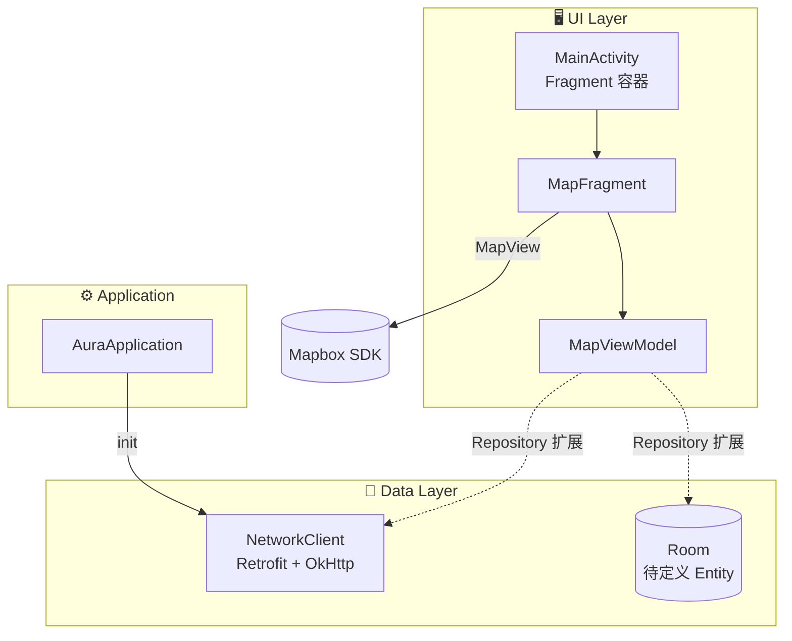

<div align="center">

# ✦ Aura

**地图驱动的 Android 体验 · MVVM · Mapbox · Retrofit**

<br/>

[](https://kotlinlang.org/)
[](https://developer.android.com/)
[](https://www.mapbox.com/)
[](https://square.github.io/retrofit/)
[](https://gradle.org/)

<br/>

`com.catclaw.aura` · minSdk **35** · targetSdk **36** · AGP **9.2** · Gradle **9.4**

[快速开始](#-快速开始) · [架构](#-架构一览) · [文档](#-文档) · [命令](#-命令速查)

</div>

---

```text
     _                    _____ _
    / \   _ __ _   _  ___|  ___| | _____      __
   / _ \ | '__| | | |/ _ \ |_  | |/ _ \ \ /\ / /
  / ___ \| |  | |_| |  __/  _| | | (_) \ V  V /
 /_/   \_\_|   \__,_|\___|_|   |_|\___/ \_/\_/
```

> **Aura** — 地图驱动的 Android 客户端。  
> 单 Activity 多 Fragment · 全屏 Mapbox 地图 · 统一网络回调 · Room 就绪。

---

## ✨ 亮点

<table>
<tr>
<td width="50%">

### 🗺️ 沉浸式地图

Mapbox Maps SDK **11.x**  
`MapFragment` + 可配置相机  
Edge-to-edge 全屏体验

</td>
<td width="50%">

### ⚡ 统一网络层

Retrofit + OkHttp  
多 Base URL · 拦截器链  
`HttpCallback` 一行发起 GET / POST

</td>
</tr>
<tr>
<td>

### 🧱 MVVM 脚手架

`BaseViewModel` · `BaseFragment`  
`StateFlow` / `SharedFlow`  
按 Feature 分包，易扩展

</td>
<td>

### 📚 中文文档

Mapbox 官方指南译本  
NetworkClient 完整示例  
Agent 协作约定 `AGENTS.md`

</td>
</tr>
</table>

---

## 🛠 技术栈

| | |
|:---:|:---|
| **语言** | Kotlin |
| **UI** | XML · ViewBinding · Material |
| **架构** | MVVM · 单 Activity + Fragment |
| **地图** | Mapbox Maps SDK 11.x |
| **网络** | Retrofit 2 · OkHttp 4 · Coroutines |
| **存储** | Room（runtime 已接入） |
| **构建** | Version Catalog · AGP 9.2 |

---

## 🚀 快速开始

<details open>
<summary><b>展开 · 四步跑起来</b></summary>

<br/>

**① 克隆**

```bash
git clone <repo-url> && cd Aura
```

**② 配置密钥** — 复制 `local.properties.example` 为 `local.properties` 并填写：

```properties
sdk.dir=/path/to/Android/Sdk
MAPBOX_ACCESS_TOKEN=pk.你的Mapbox公钥
MAPBOX_DOWNLOADS_TOKEN=sk.你的Mapbox私钥
```

| 变量 | 用途 |
|------|------|
| `MAPBOX_ACCESS_TOKEN` | 应用内地图（`pk.` 公钥） |
| `MAPBOX_DOWNLOADS_TOKEN` | Gradle 下载 Mapbox SDK（`sk.` 私钥，需 **Downloads:Read**） |

> 不要给 token 加引号。详见 [Mapbox Android 安装](https://docs.mapbox.com/android/maps/guides/install/)。

**③ 编译**（首次需联网）

```bash
./gradlew assembleDebug
```

<details>
<summary><b>编译失败？</b></summary>

| 现象 | 处理 |
|------|------|
| `Could not resolve com.mapbox.maps` | 在 `local.properties` 配置 `MAPBOX_DOWNLOADS_TOKEN`（`sk.` + Downloads:Read） |
| `No cached version` / offline 相关 | 不要用离线首次构建；`./scripts/gradlew-local.sh` 已默认联网，仅当 `AURA_GRADLE_OFFLINE=1` 时才 `--offline` |
| `Failed to find target android-36` | Android Studio → SDK Manager 安装 **Android API 36** |
| `Android BaseExtension` / Hilt | 工程已改用 `AppContainer` 手动 DI，勿再启用 Hilt 插件 |

若仍失败，请把完整报错（从 `FAILURE:` 或 `BUILD FAILED` 起）发出来。

</details>

**④ 安装**

| 方式 | 路径 / 操作 |
|------|-------------|
| APK | `app/build/outputs/apk/debug/app-debug.apk` |
| IDE | Android Studio → Run **app** |
| 设备 | API **35+** 真机或模拟器 |

</details>

---

## 🏗 架构一览



**扩展新页面**

```
ui/<feature>/
  ├── FeatureFragment.kt
  ├── FeatureViewModel.kt
  ├── FeatureUiState.kt
  └── FeatureUiEvent.kt

MainActivity.showFeatureFragment()  →  replaceFragment()
```

---

## 📁 项目结构

```
Aura/
├── 📱 app/
│   ├── 📄 docs/network.md
│   └── src/main/java/com/catclaw/aura/
│       ├── AuraApplication.kt
│       ├── MainActivity.kt
│       ├── data/network/      ← NetworkClient
│       ├── data/local/        ← Room
│       └── ui/
│           ├── base/
│           └── map/
├── 📖 docs/mapbox/            ← Mapbox 中文指南
├── gradle/libs.versions.toml
└── AGENTS.md
```

---

## 📚 文档

| | 链接 | 内容 |
|:---:|:---|:---|
| 🌐 | [**NetworkClient 手册**](./app/docs/network.md) | GET / POST · 多 Base URL · 测试 API |
| 🗺️ | [**Mapbox 指南**](./docs/mapbox/README.md) | SDK 安装 · 样式 · 标注 · 定位 |
| 🤖 | [**AGENTS.md**](./AGENTS.md) | 包结构 · 约定 · 构建命令 |

---

## ⌨️ 命令速查

```bash
./gradlew assembleDebug          # Debug APK
./gradlew assembleRelease        # Release APK
./gradlew test                   # 单元测试
./gradlew connectedAndroidTest   # 仪器化测试（需设备）
```

---

## 🔒 安全

```diff
- 切勿提交 local.properties（含 MAPBOX_ACCESS_TOKEN）
- 切勿提交 *.jks / *.keystore
+ Token 仅保存在本地 local.properties
+ 网络日志仅在 Debug 构建开启
```

---

## 🔗 外部资源

| 资源 | 用途 |
|------|------|
| [Mapbox Android Docs](https://docs.mapbox.com/android/maps/guides/) | 官方 SDK 文档 |
| [JSONPlaceholder](https://jsonplaceholder.typicode.com/) | 网络层零配置测试 API |

---

<div align="center">

<br/>

**Aura** — flow with the map.

<br/>

</div>
