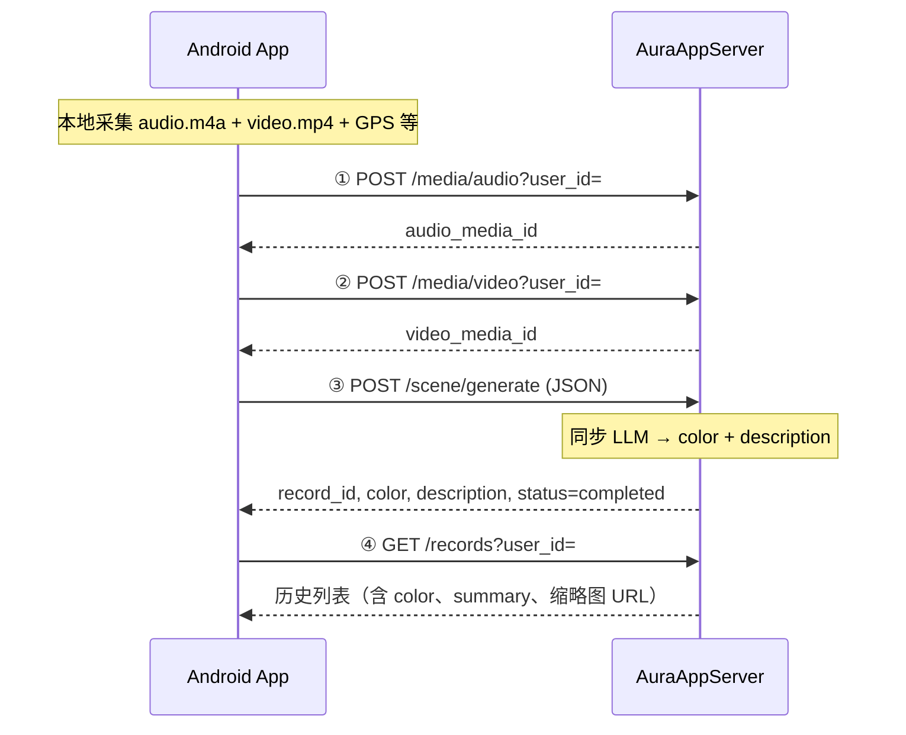

# Aura App 接口文档（Android 对接）

> 版本：v1.1  
> 日期：2026-06-07  
> 适用：Android App 对接 AuraAppServer（内测）  
> **Android 开发请优先阅读本文档**  
> 关联：[SERVER_CONFIG.md](./SERVER_CONFIG.md)（凭证与签名）| [TECH_DESIGN.md](./TECH_DESIGN.md)（架构背景）

---

## Android 开发应阅读哪些文档？

| 优先级 | 文档 | 用途 |
|--------|------|------|
| **必读 ①** | **本文档 `API.md`** | 业务流程、每个接口怎么传参、请求/响应样例、错误码 |
| **必读 ②** | [SERVER_CONFIG.md](./SERVER_CONFIG.md) | 生成/配置 `API_TOKEN`、`API_SECRET`、包名；签名算法细节 |
| **必读 ③** | 本机 `local/server.env`（不提交 Git） | 内测 `BASE_URL`、公网 IP |
| 选读 | [TECH_DESIGN.md](./TECH_DESIGN.md) | 服务端架构、数据模型、非功能需求 |
| 选读 | [LLM_SCENE_DESCRIPTION.md](./LLM_SCENE_DESCRIPTION.md) | LLM 如何生成描述与颜色（服务端内部） |
| 运维 | [DEPLOY.md](./DEPLOY.md) | 服务器部署，App 开发一般不需要 |

**Android 侧最少需要实现：**

1. 网络层：统一附加鉴权 Header + HMAC 签名（见 §3）
2. 业务层：三步采集流程（见 §2）
3. 列表页：读 `color`、`summary`、媒体 URL（下载时仍要带签名）

---

## 1. 基本信息

| 项 | 说明 |
|----|------|
| Base URL | `http://<PUBLIC_IP>:8000/api/v1`（内测；HTTPS 后改为 `https://域名/api/v1`） |
| 协议 | HTTP/1.1；JSON + `multipart/form-data` |
| 用户标识 | Query 或 JSON 中的 `user_id`（App 本地生成 UUID 并持久化） |
| 鉴权 | 除 `/health` 外，**所有接口**须 Token + HMAC |

```kotlin
object AuraApiConfig {
    const val BASE_URL = "http://<PUBLIC_IP>:8000/api/v1"  // 真实值见 local/server.env
    const val PACKAGE_NAME = "com.example.aura"              // = 服务器 ALLOWED_PACKAGE_NAME
    const val API_TOKEN = "..."                              // 见 SERVER_CONFIG.md
    const val API_SECRET = "..."                             // 仅用于本地签名，不上传
}
```

---

## 2. 业务流程（Android 推荐）

采集一次「场景记忆」的完整流程：**先传媒体，再一次性生成，最后查列表**。第三步为**同步** HTTP 调用，LLM 在服务端执行，App 需等待（建议 read timeout **≥ 120 秒**）。



| 步骤 | Android 动作 | 接口 | 成功后保存 |
|------|--------------|------|------------|
| ① | 上传环境音文件 | `POST /media/audio` | `audio_media_id` |
| ② | 上传短视频文件 | `POST /media/video` | `video_media_id` |
| ③ | 提交 media_id + 位置/元数据，**显示 loading** | `POST /scene/generate` | `record_id`、`color`、`description` |
| ④ | 刷新历史页 / 详情页 | `GET /records` 或 `GET /records/{id}` | 列表 UI 数据 |

**UI 字段映射：**

| 服务端字段 | Android 展示 |
|------------|----------------|
| `color` | 卡片背景色 / 主题色 |
| `description`（generate 响应）或 `summary`（列表） | 场景描述文案 |
| `thumbnail_url` | 列表缩略图（GET 须带签名） |
| `audio_url` / `video_url` | 播放音视频（GET 须带签名） |
| `location` | 地图/地址展示 |

---

## 3. 鉴权与签名

### 3.1 每个请求都要带的 Header

| Header | 示例 | 说明 |
|--------|------|------|
| `Authorization` | `Bearer K7xR2mN9...` | `API_TOKEN` |
| `X-App-Package` | `com.example.aura` | `applicationId` |
| `X-App-Version` | `1.0.0` | 建议传，服务端暂不校验 |
| `X-Timestamp` | `1717564800` | Unix 秒，偏差 ≤ 300s |
| `X-Nonce` | `8f3a2b1c-4d5e-...` | 每次请求新 UUID |
| `X-Signature` | 64 位 hex | 见 §3.2 |

### 3.2 签名算法

```
body_hash = SHA256(request_body).hex()
payload   = METHOD + "\n" + PATH + "\n" + Timestamp + "\n" + Nonce + "\n" + body_hash
signature = HMAC_SHA256(API_SECRET, payload).hex()
```

| 规则 | 说明 |
|------|------|
| `METHOD` | 大写：`GET`、`POST` |
| `PATH` | **含** `/api/v1`，**不含** `?user_id=...` |
| JSON 请求 | `request_body` = UTF-8 JSON 字节 |
| **multipart 上传** | `request_body` = **空字节** `byteArrayOf()` |
| GET 无 body | `request_body` = 空字节 |

```kotlin
fun sign(method: String, path: String, ts: Long, nonce: String, body: ByteArray, secret: String): String {
    val bodyHash = sha256Hex(body)
    val payload = "${method.uppercase()}\n$path\n$ts\n$nonce\n$bodyHash"
    val mac = Mac.getInstance("HmacSHA256")
    mac.init(SecretKeySpec(secret.toByteArray(), "HmacSHA256"))
    return mac.doFinal(payload.toByteArray()).joinToString("") { "%02x".format(it) }
}
```

**OkHttp Interceptor 要点：** 对 RequestBody 可重复读取的类型（如 JSON），先 `buffer()` 取 bytes 再签名；multipart 用 `path` + 空 body。

### 3.3 位置加密（`APP_ENV=production` 必填）

生产环境 `/scene/generate` **禁止**明文 `location`，须传 `location_encrypted`。

算法（与服务器 `app/infrastructure/security/crypto.py` 一致）：

1. HKDF-SHA256 派生密钥：`salt=aura-location-v1`，`info=location-encryption`，输入=`API_SECRET`
2. 明文 JSON：`{"lat":39.9,"lng":116.4,"address":"..."}`（字段同 `LocationSchema`）
3. AES-GCM 加密，12 字节 random nonce 拼在密文前
4. Base64 → `location_encrypted`

内测服务器若为 `development`，可暂传明文 `location`（见 §5.4 样例）。

---

## 4. 通用约定

### 4.1 错误响应

```json
{
  "code": "AUTH_INVALID",
  "message": "Invalid or missing token"
}
```

| HTTP | code | Android 处理建议 |
|------|------|------------------|
| 401 | `AUTH_INVALID` | 检查 Token |
| 403 | `PACKAGE_MISMATCH` | 检查 applicationId |
| 403 | `SIGNATURE_INVALID` | 检查 Secret、PATH、body 是否空（multipart） |
| 403 | `REPLAY_DETECTED` | 重新生成 nonce |
| 404 | `NOT_FOUND` | media_id 无效或类型不对 |
| 413 | `PAYLOAD_TOO_LARGE` | 压缩媒体，单文件 ≤ 30MB |
| 422 | `VALIDATION_ERROR` | 检查 JSON 字段 |
| 502 | `SCENE_GENERATION_FAILED` | 提示用户重试；可查看 `error_message`（详情接口） |
| 507 | `QUOTA_EXCEEDED` / `DISK_FULL` | 提示服务存储已满 |

### 4.2 媒体限制

| 类型 | 允许 Content-Type |
|------|-------------------|
| 音频 | `audio/mp4`、`audio/m4a`、`audio/mpeg` |
| 视频 | `video/mp4`、`video/quicktime` |
| 单文件大小 | ≤ **30MB** |

---

## 5. 逐步调用示例（含传参与返回）

以下用固定 `user_id` 演示一次完整采集；替换 `<PUBLIC_IP>` 为真实 IP。

### 5.1 公共变量（Android 伪代码）

```kotlin
val userId = "a1b2c3d4-e5f6-7890-abcd-ef1234567890"  // App 首次启动生成并持久化
val baseUrl = "http://<PUBLIC_IP>:8000"
```

---

### 5.2 步骤 ① — 上传音频

**请求：**

```http
POST /api/v1/media/audio?user_id=a1b2c3d4-e5f6-7890-abcd-ef1234567890
Content-Type: multipart/form-data; boundary=----boundary
Authorization: Bearer <API_TOKEN>
X-App-Package: com.example.aura
X-Timestamp: 1717564800
X-Nonce: 11111111-2222-3333-4444-555555555551
X-Signature: <对 PATH=/api/v1/media/audio, body=空 计算>

------boundary
Content-Disposition: form-data; name="file"; filename="ambient.m4a"
Content-Type: audio/m4a

<binary>
------boundary--
```

**Android 传参：**

| 位置 | 参数 | 类型 | 必填 |
|------|------|------|------|
| Query | `user_id` | String | ✅ |
| multipart | `file` | 文件 | ✅ |
| Header | 鉴权头 | — | ✅ |

**响应 201：**

```json
{
  "media_id": "550e8400-e29b-41d4-a716-446655440000",
  "media_url": "http://<PUBLIC_IP>:8000/api/v1/media/assets/550e8400-e29b-41d4-a716-446655440000/audio",
  "kind": "audio"
}
```

**Android：** 保存 `media_id` → 变量 `audioMediaId`。

---

### 5.3 步骤 ② — 上传视频

**请求：**

```http
POST /api/v1/media/video?user_id=a1b2c3d4-e5f6-7890-abcd-ef1234567890
Content-Type: multipart/form-data
```

multipart 字段名仍为 `file`；签名 PATH=`/api/v1/media/video`，body 为空。

**响应 201：**

```json
{
  "media_id": "660e8400-e29b-41d4-a716-446655440001",
  "media_url": "http://<PUBLIC_IP>:8000/api/v1/media/assets/660e8400-e29b-41d4-a716-446655440001/video",
  "kind": "video"
}
```

**Android：** 保存 `media_id` → 变量 `videoMediaId`。

---

### 5.4 步骤 ③ — 生成场景（核心）

**请求：**

```http
POST /api/v1/scene/generate
Content-Type: application/json
Authorization: Bearer <API_TOKEN>
X-App-Package: com.example.aura
X-Timestamp: 1717564810
X-Nonce: 11111111-2222-3333-4444-555555555552
X-Signature: <对 PATH=/api/v1/scene/generate, body=下方 JSON 字节 计算>
```

**请求体（development 内测，明文 location）：**

```json
{
  "user_id": "a1b2c3d4-e5f6-7890-abcd-ef1234567890",
  "audio_media_id": "550e8400-e29b-41d4-a716-446655440000",
  "video_media_id": "660e8400-e29b-41d4-a716-446655440001",
  "title": "周末午后",
  "location": {
    "lat": 39.9042,
    "lng": 116.4074,
    "address": "北京市东城区",
    "accuracy_meters": 12.5,
    "place_name": "天安门广场",
    "place_feature_type": "poi",
    "provider": "amap"
  },
  "captured_at_ms": 1717564800123,
  "now_playing": {
    "is_music_active": true,
    "title": "晴天",
    "artist": "周杰伦",
    "album": "叶惠美",
    "package_name": "com.netease.cloudmusic",
    "status_message": ""
  },
  "video_meta": {
    "duration_ms": 5000,
    "is_success": true,
    "error_message": null
  },
  "audio_meta": {
    "duration_ms": 5000,
    "is_success": true,
    "error_message": null
  },
  "capture_errors": []
}
```

**Android 传参：**

| JSON 字段 | 类型 | 必填 | Android 来源 |
|-----------|------|------|--------------|
| `user_id` | string | ✅ | 本地持久化 UUID |
| `audio_media_id` | UUID string | ✅ | 步骤 ① 返回 |
| `video_media_id` | UUID string | ✅ | 步骤 ② 返回 |
| `title` | string | ❌ | 用户输入或自动生成 |
| `location_encrypted` | string | production 必填 | 加密后的 GPS |
| `location` | object | development 可用 | GPS + 逆地理编码 |
| `captured_at_ms` | long | ❌ | `System.currentTimeMillis()` |
| `now_playing` | object | ❌ | `MediaSession` / 音乐 App 信息 |
| `video_meta` / `audio_meta` | object | ❌ | 录制结果 |
| `capture_errors` | string[] | ❌ | 非致命采集错误 |

**响应 200（成功）：**

```json
{
  "record_id": "770e8400-e29b-41d4-a716-446655440002",
  "color": "#8B7355",
  "description": "午后的阳光洒在旧街角，远处传来隐约的吉他声，空气里混着咖啡与树叶的气息。",
  "summary_model": "qwen3-omni-flash",
  "attached_media_kind": "video",
  "audio_media_url": "http://<PUBLIC_IP>:8000/api/v1/media/assets/550e8400-e29b-41d4-a716-446655440000/audio",
  "video_media_url": "http://<PUBLIC_IP>:8000/api/v1/media/assets/660e8400-e29b-41d4-a716-446655440001/video",
  "status": "completed",
  "created_at": "2026-06-07T01:50:00+08:00"
}
```

**Android：** 用 `color` 刷 UI；用 `description` 作为本次结果文案；可跳转详情或刷新列表。

**响应 502（LLM 失败）：**

```json
{
  "code": "SCENE_GENERATION_FAILED",
  "message": "DashScope API error: ..."
}
```

---

### 5.5 步骤 ④ — 历史列表

**请求：**

```http
GET /api/v1/records?user_id=a1b2c3d4-e5f6-7890-abcd-ef1234567890&page=1&page_size=20
```

签名：PATH=`/api/v1/records`（**不含** query），body 为空。

**响应 200：**

```json
{
  "items": [
    {
      "record_id": "770e8400-e29b-41d4-a716-446655440002",
      "title": "周末午后",
      "summary": "午后的阳光洒在旧街角，远处传来隐约的吉他声……",
      "color": "#8B7355",
      "thumbnail_url": "http://<PUBLIC_IP>:8000/api/v1/records/770e8400-e29b-41d4-a716-446655440002/thumbnail",
      "audio_url": "http://<PUBLIC_IP>:8000/api/v1/records/770e8400-e29b-41d4-a716-446655440002/audio",
      "video_url": "http://<PUBLIC_IP>:8000/api/v1/records/770e8400-e29b-41d4-a716-446655440002/media",
      "location": {
        "lat": 39.9042,
        "lng": 116.4074,
        "address": "北京市东城区"
      },
      "status": "completed",
      "created_at": "2026-06-07T01:50:00+08:00",
      "summary_model": "qwen3-omni-flash",
      "attached_media_kind": "video"
    }
  ],
  "total": 1,
  "page": 1,
  "page_size": 20
}
```

**下载缩略图/音视频：** 对 `thumbnail_url` 等发 **GET**，Query 带 `user_id`，Header 带完整签名（PATH 为 URL 的 path 部分，如 `/api/v1/records/{id}/thumbnail`）。

---

### 5.6 步骤 ④ 备选 — 单条详情

```http
GET /api/v1/records/770e8400-e29b-41d4-a716-446655440002?user_id=a1b2c3d4-e5f6-7890-abcd-ef1234567890
```

**响应 200（在列表字段基础上增加）：**

```json
{
  "record_id": "770e8400-e29b-41d4-a716-446655440002",
  "title": "周末午后",
  "summary": "午后的阳光洒在旧街角……",
  "color": "#8B7355",
  "thumbnail_url": "http://<PUBLIC_IP>:8000/api/v1/records/770e8400-e29b-41d4-a716-446655440002/thumbnail",
  "audio_url": "http://<PUBLIC_IP>:8000/api/v1/records/770e8400-e29b-41d4-a716-446655440002/audio",
  "video_url": "http://<PUBLIC_IP>:8000/api/v1/records/770e8400-e29b-41d4-a716-446655440002/media",
  "location": { "lat": 39.9042, "lng": 116.4074, "address": "北京市东城区" },
  "status": "completed",
  "created_at": "2026-06-07T01:50:00+08:00",
  "summary_model": "qwen3-omni-flash",
  "attached_media_kind": "video",
  "media_url": "http://<PUBLIC_IP>:8000/api/v1/records/770e8400-e29b-41d4-a716-446655440002/media",
  "media_type": "video",
  "error_message": null,
  "updated_at": "2026-06-07T01:50:05+08:00"
}
```

---

## 6. 接口速查表

| 方法 | 路径 | Content-Type | 鉴权 | 说明 |
|------|------|--------------|------|------|
| GET | `/health` | — | 否 | 健康检查 |
| POST | `/media/audio?user_id=` | multipart | 是 | 上传音频 → `media_id` |
| POST | `/media/video?user_id=` | multipart | 是 | 上传视频 → `media_id` |
| GET | `/media/assets/{id}/audio?user_id=` | — | 是 | 下载临时音频 |
| GET | `/media/assets/{id}/video?user_id=` | — | 是 | 下载临时视频 |
| POST | `/scene/generate` | JSON | 是 | **同步**生成 color + description |
| GET | `/records?user_id=&page=&page_size=` | — | 是 | 历史列表 |
| GET | `/records/{id}?user_id=` | — | 是 | 详情 |
| GET | `/records/{id}/media?user_id=` | — | 是 | 下载视频 |
| GET | `/records/{id}/audio?user_id=` | — | 是 | 下载音频 |
| GET | `/records/{id}/thumbnail?user_id=` | — | 是 | 下载缩略图 |

---

## 7. 旧版流程（兼容，新 App 不要用）

异步 Worker 流程，需轮询 `status`：

| 步骤 | 接口 |
|------|------|
| 1 | `POST /records` → `record_id` |
| 2 | `POST /records/{id}/upload?finalize=true` multipart |
| 3 | 轮询 `GET /records/{id}` 直到 `completed` |

---

## 8. Android 对接清单

- [ ] `BASE_URL`、`API_TOKEN`、`API_SECRET`、`PACKAGE_NAME` 与服务器 `.env` 一致
- [ ] OkHttp Interceptor 统一签名；multipart 时 body 按空算
- [ ] 每次请求新 `X-Nonce`
- [ ] `/scene/generate` read timeout ≥ **120s**；UI 显示 loading
- [ ] 列表用 `color` + `summary`；generate 响应用 `description`（二者内容相同）
- [ ] 下载 `thumbnail_url` / `audio_url` / `video_url` 时带签名 GET
- [ ] production 使用 `location_encrypted`
- [ ] 不打印 Token / Secret 到 Logcat

---

## 9. 本机快速验证

```bash
# 无需 Token
curl -s http://<PUBLIC_IP>:8000/api/v1/health

# 无 Token 应 401（说明路由存在）
curl -s -o /dev/null -w "%{http_code}\n" \
  -X POST "http://<PUBLIC_IP>:8000/api/v1/media/audio?user_id=test"
```

带签名完整测试可参考 `tests/test_api.py` 中的 `signed_headers()`。

---

## 10. 相关文档

| 文档 | 内容 |
|------|------|
| [SERVER_CONFIG.md](./SERVER_CONFIG.md) | Token 生成、`.env`、签名排错 |
| [TECH_DESIGN.md](./TECH_DESIGN.md) | 架构与数据模型 |
| [LLM_SCENE_DESCRIPTION.md](./LLM_SCENE_DESCRIPTION.md) | LLM 场景描述（服务端） |
| [DEPLOY.md](./DEPLOY.md) | 部署与运维 |

---

*文档结束*
