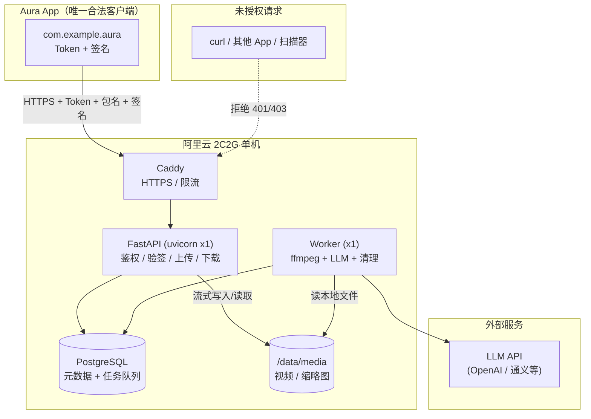
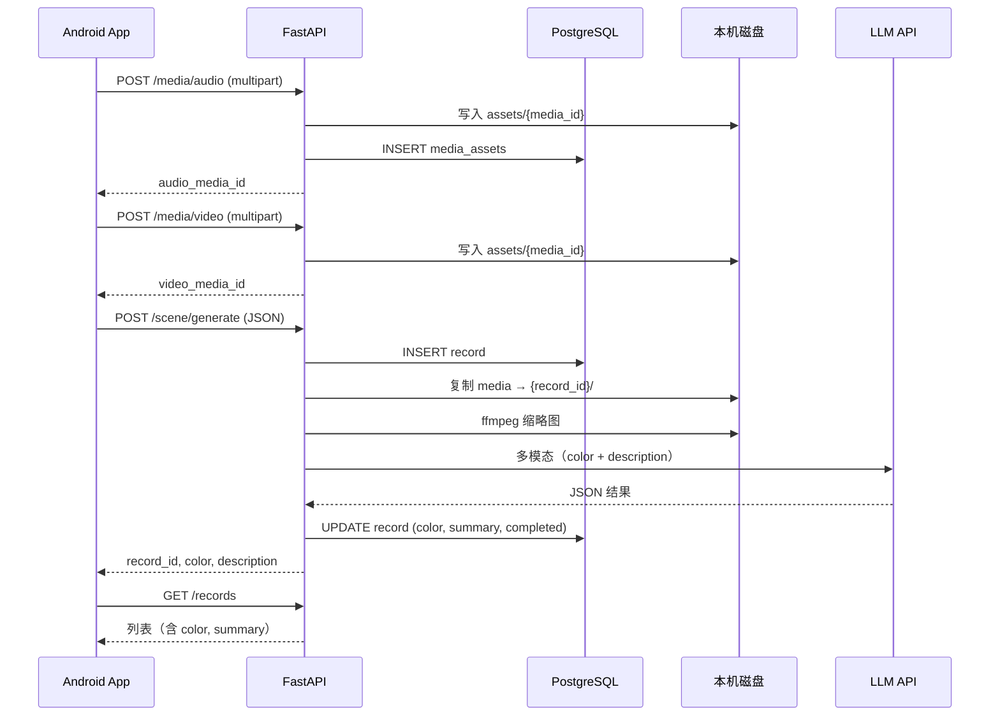
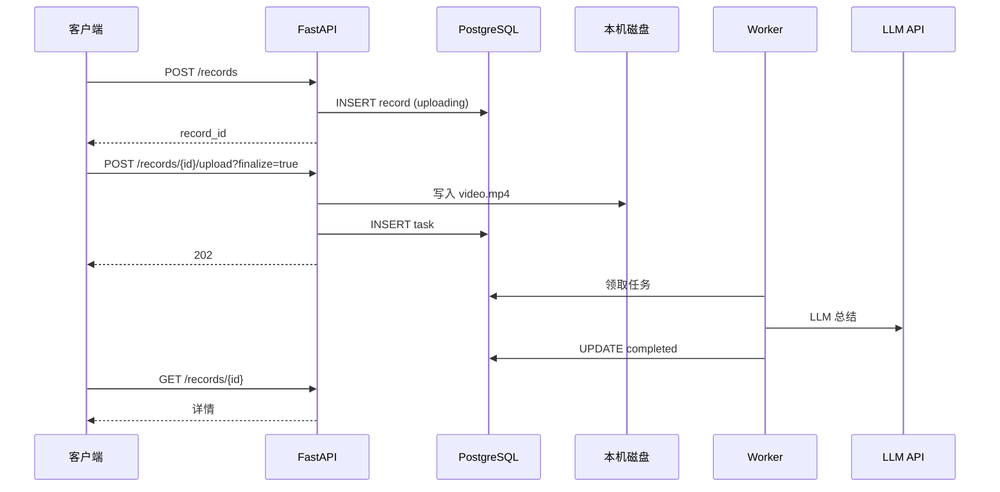
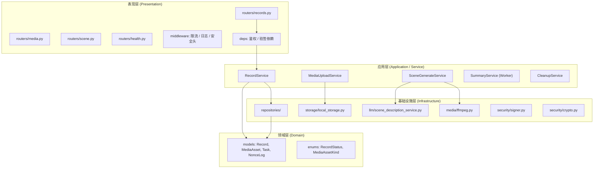
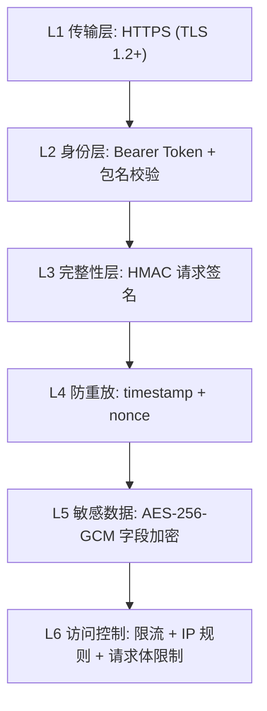
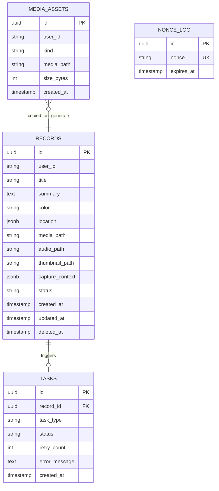
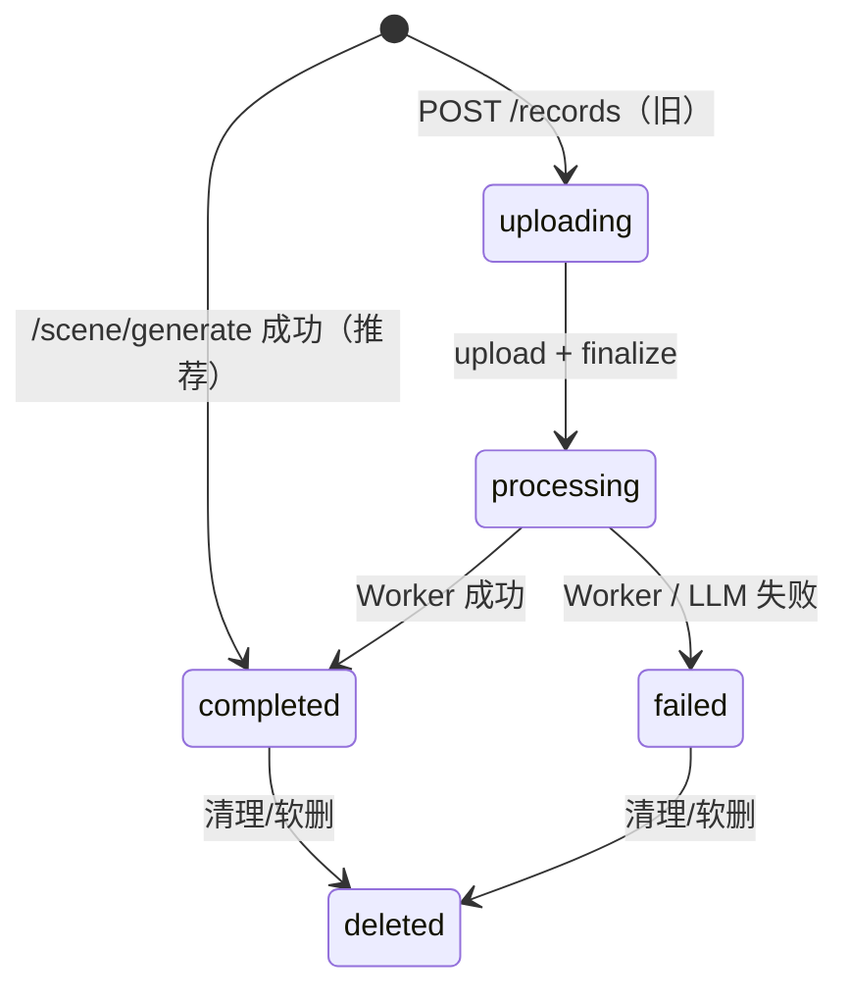
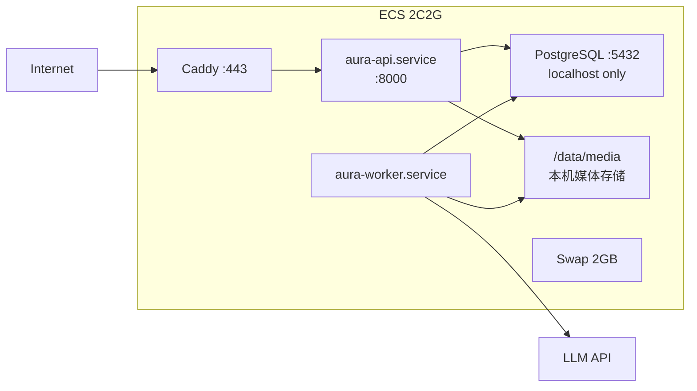

# AuraAppServer 技术设计文档

> 版本：v0.4  
> 日期：2026-06-07  
> 状态：**已实现（内测）**  
> 变更：v0.2 移除阿里云 OSS，所有媒体资源存储于本机磁盘  
> 变更：v0.3 移除多 App / app_id 租户隔离，改为单一授权客户端访问控制  
> 变更：v0.4 新增同步场景采集 API（`/media/*` + `/scene/generate`），列表返回 `color`  
> **Android 对接详见 [API.md](./API.md)**

---

## 1. 文档目的

本文档明确 Aura App 服务端的业务需求、技术选型、系统架构、安全方案与部署策略，作为后续开发与测试的唯一基准。

**评审通过后**，开发将遵循以下原则：

- 业务尽可能解耦（分层 + 接口隔离）
- 逻辑清晰、性能优秀
- 在目标机器（阿里云 2C2G）上完成测试并提供部署说明

---

## 2. 项目背景

Aura 是一款 AI 类移动应用。服务端负责接收客户端上传的媒体与位置信息，调用大模型生成文字总结，持久化后供客户端查询历史列表。

### 2.1 当前阶段

- **内测阶段**：仅允许自有 App 访问（Token + 包名校验），拒绝未授权请求
- **部署环境**：单台阿里云服务器（2 Core / 2 GB RAM）
- **稳定性要求**：线上可用，资源可控，可恢复

### 2.2 不在本期范围

- 用户注册 / 登录体系（内测使用预分配 Token）
- 本地大模型推理（LLM 调用外部 API）
- 多机集群 / 高可用
- 管理后台 UI

---

## 3. 功能需求

### 3.1 能力一：场景采集（推荐，同步 API）

| 编号 | 需求 | 说明 |
|------|------|------|
| F-1.1 | 上传音频 | `POST /media/audio`，返回 `media_id` |
| F-1.2 | 上传视频 | `POST /media/video`，返回 `media_id` |
| F-1.3 | 同步生成 | `POST /scene/generate`，提交 media_id + 位置/元数据，**同步**调用 LLM |
| F-1.4 | 返回 color | LLM 输出主题色 Hex + 场景描述，写入 `records.color`、`records.summary` |
| F-1.5 | 持久化 | 媒体复制到 `{record_id}/` 目录，缩略图 ffmpeg 生成 |
| F-1.6 | 存储清理 | 配额超限或磁盘不足时拒绝上传 / 触发清理 |

**处理流程（Android 推荐）：**

```
鉴权 → 上传 audio(media_id) → 上传 video(media_id)
    → POST /scene/generate（同步 LLM，≤120s）
    → 返回 record_id + color + description（status=completed）
```

### 3.2 能力二：历史列表

| 编号 | 需求 | 说明 |
|------|------|------|
| F-2.1 | 分页列表 | 按 `user_id` 隔离，按创建时间倒序 |
| F-2.2 | 详情查询 | 返回 `summary`、`color`、缩略图/音视频 URL、位置、状态 |
| F-2.3 | 媒体下载 | 鉴权 GET `/records/{id}/media|audio|thumbnail` |
| F-2.4 | 软删除 | 支持标记删除（可选，内测可先不做） |

### 3.3 能力三：旧版异步流程（兼容）

| 编号 | 需求 | 说明 |
|------|------|------|
| F-3.1 | 创建记录 | `POST /records` → `record_id` |
| F-3.2 | 上传媒体 | `POST /records/{id}/upload`，`finalize=true` 创建 Worker 任务 |
| F-3.3 | 异步总结 | Worker 调用 LLM，客户端轮询 `status` |

> 新 Android 版本请使用 §3.1，不要使用 §3.3。

### 3.4 客户端访问控制（安全需求）

> **说明：** 服务端不区分多个 App 租户。安全目标是：**只有我们自有的 Aura App 能访问接口**，任意未授权请求一律拒绝。

| 编号 | 需求 | 说明 |
|------|------|------|
| F-4.1 | Token 校验 | 请求携带预分配 Token，服务端比对后放行 |
| F-4.2 | 包名校验 | 请求头 `X-App-Package` 必须与服务端配置的合法包名一致 |
| F-4.3 | 请求验签 | HMAC 签名 + timestamp + nonce，防篡改与重放 |
| F-4.4 | 默认拒绝 | 鉴权失败返回 401/403，**不进入任何业务逻辑** |

**合法客户端配置（服务端 `.env`，非 DB 多租户）：**

```env
ALLOWED_PACKAGE_NAME=com.example.aura
API_TOKEN=<内测 Token>
API_SECRET=<签名密钥>
```

**拒绝场景示例：**

| 场景 | 结果 |
|------|------|
| 无 Token / Token 错误 | 401 |
| 包名不匹配（如其他 App 伪造请求） | 403 |
| 签名错误或重放 | 403 |
| 通过 curl / Postman 随意调用 | 403（缺签名或包名不对） |

---

## 4. 非功能需求

### 4.1 性能（2C2G 约束下）

| 指标 | 目标 |
|------|------|
| API 响应（非上传） | P95 < 200ms |
| 上传 | 流式写入本机磁盘，不整文件加载到内存 |
| 并发上传 | **最多 2 路**（2C2G 保护） |
| Worker 并发 | **1**（同时只处理 1 条媒体任务） |
| API Worker | uvicorn **1** 进程 |

### 4.2 可用性

| 指标 | 目标 |
|------|------|
| 服务可用性 | 内测阶段 ≥ 99%（允许计划维护） |
| 故障恢复 | systemd 自动重启，进程崩溃 < 30s 恢复 |
| 数据备份 | PostgreSQL 每日备份；`/data/media` 按需 rsync 异地 |

### 4.3 安全

| 指标 | 目标 |
|------|------|
| 传输加密 | 全站 HTTPS（TLS 1.2+） |
| 请求验签 | 防篡改、防重放 |
| 敏感字段 | 可选 AES 加密（见 §7） |
| 防攻击 | 限流、IP 黑名单、请求体大小限制 |
| Token | 哈希存储，明文不落库 |

### 4.4 可维护性

- 业务层与基础设施层解耦（Repository / Service / Router 分离）
- 配置外置（环境变量 + `.env`，密钥不进 Git）
- 结构化日志，便于排查

---

## 5. 技术选型

### 5.1 选型总览

| 层级 | 技术 | 理由 |
|------|------|------|
| 语言 | Python 3.11+ | AI / 媒体处理生态成熟 |
| Web 框架 | **FastAPI** | 异步、类型校验、OpenAPI 文档 |
| ASGI 服务器 | uvicorn | 轻量，单机 1 worker |
| 数据库 | **PostgreSQL 15+** | 并发可靠、JSON 支持、任务队列 |
| 任务队列 | **PostgreSQL 任务表** | 省内存，2G 机器不引入 Redis |
| 文件存储 | **本机磁盘**（`/data/media`） | 无 OSS，所有资源存同一台机器 |
| 反向代理 | **Caddy** | 自动 HTTPS；媒体经 API 鉴权下载，不公开目录 |
| 进程管理 | **systemd** | 无 Docker 开销，2G 友好 |
| 媒体处理 | ffmpeg | 抽帧、缩略图 |
| LLM | 外部 API（可配置） | OpenAI / 通义 / 智谱等 |

### 5.2 刻意不选用的组件

| 组件 | 原因 |
|------|------|
| Docker | 2G 内存开销大 |
| Redis | 内存紧张，PG 任务表足够 |
| Celery | 过重，单机单 Worker 无需 |
| MinIO / OSS | 不使用云存储，直接本机目录 |
| SQLite | 并发写入弱，不适合 Worker + API 同时写 |

### 5.3 本机文件存储设计

**目录结构：**

```
/data/media/
├── assets/
│   ├── {media_id}.m4a          # 临时上传的音频（scene 前）
│   └── {media_id}.mp4          # 临时上传的视频
└── {record_id}/
    ├── video.mp4               # generate 后复制的视频
    ├── audio.m4a               # generate 后复制的音频
    └── thumbnail.jpg           # ffmpeg 缩略图
```

**设计要点：**

| 项 | 方案 |
|----|------|
| 写入方式 | FastAPI `UploadFile` 流式写入，chunk 64KB，不整文件进内存 |
| 路径存 DB | 存相对路径（如 `{record_id}/original.mp4`），便于迁移 |
| 读取方式 | `GET /records/{id}/media` 鉴权后流式返回，**不映射为 Caddy 公开静态目录** |
| 缩略图 | 同上，`GET /records/{id}/thumbnail` |
| 权限 | 鉴权通过后，校验 `user_id` 与记录归属一致，防止跨用户访问 |
| 磁盘监控 | 启动时 + 上传前 + 定时任务检查剩余空间 |

**磁盘规划（2C2G 建议）：**

| 项 | 建议 |
|----|------|
| 系统盘总量 | ≥ 40GB |
| 媒体目录 | `/data/media`（可与系统同盘，或挂载数据盘） |
| 预留系统空间 | ≥ 10GB（OS + PG + 日志） |
| 可用于媒体 | 剩余空间 - 预留，全局配额控制 |
| 全局存储配额 | 默认按磁盘可用空间动态计算，上限可配置（如 20GB） |

---

## 6. 系统架构

### 6.1 总体架构图



### 6.2 请求时序（推荐：场景采集 + 同步生成）



### 6.2.1 旧版时序（异步 Worker，兼容）



### 6.3 分层架构（业务解耦）



**解耦原则：**

| 规则 | 说明 |
|------|------|
| Router 不含业务逻辑 | 只做参数解析、调用 Service、返回响应 |
| Service 不直接操作 SQL | 通过 Repository 接口访问数据 |
| Infrastructure 可替换 | LocalStorage / LLM 实现抽象接口，便于测试和切换 |
| Worker 复用 Service 层 | 与 API 共享业务逻辑，避免重复代码 |

---

## 7. 安全设计

### 7.1 安全层次



### 7.2 客户端鉴权（仅允许自有 App）

**设计原则：** 所有业务接口（除 `/health`）必须先通过鉴权中间件。鉴权基于**服务端配置的单一合法客户端**，不使用 `app_id` 多租户模型。

**请求头（必填）：**

```http
Authorization: Bearer <api_token>
X-App-Package: com.example.aura
X-App-Version: 1.0.0
X-Timestamp: 1717564800
X-Nonce: 8f3a2b1c-4d5e-6f7a-8b9c-0d1e2f3a4b5c
X-Signature: <hmac_sha256_hex>
```

**校验流程（任一失败即拒绝）：**

1. 校验 `Authorization` Token 与 `.env` 中 `API_TOKEN` 一致（或哈希比对）
2. 校验 `X-App-Package` 与 `.env` 中 `ALLOWED_PACKAGE_NAME` **完全一致**
3. 校验时间戳（允许 ±300s 偏差）
4. 校验 nonce 未被使用过（`nonce_log` 表，TTL 10 分钟）
5. 校验 HMAC 签名（使用 `API_SECRET`）
6. 通过后注入请求上下文，进入业务逻辑

**与业务数据的关系：**

- 鉴权层只回答「是不是我们的 App」
- 业务层用 `user_id` 区分用户数据，与鉴权层职责分离

#### 7.2.1 Token 获取与配置

内测阶段 **不提供** Token 申请 API。Token 由开发者预生成，配置在服务器与 App 两端。

| 步骤 | 说明 |
|------|------|
| 生成 | 运行 `scripts/generate_credentials.sh` 或用 Python/OpenSSL 生成随机串 |
| 服务器 | 写入 `.env` 的 `API_TOKEN`、`API_SECRET`、`ALLOWED_PACKAGE_NAME` |
| App | 将同一套 Token / Secret / 包名内置到 Android App |
| 验证 | 服务端比对 `.env` 值，不一致则 401/403 |

完整生成方法、`.env` 模板、App 配置流程、轮换与排错，见 **[服务配置文档 SERVER_CONFIG.md](./SERVER_CONFIG.md)**。

### 7.3 请求签名算法

```
签名字符串 = HTTP_METHOD + "\n"
           + REQUEST_PATH + "\n"
           + X-Timestamp + "\n"
           + X-Nonce + "\n"
           + SHA256(request_body)

X-Signature = HMAC-SHA256(api_secret, 签名字符串)
```

- `api_secret`：即服务端 `API_SECRET`，与 Token 配对内置在自有 App 中，**不参与传输**
- GET 请求 body 为空字符串的 SHA256
- **multipart 上传**（`/media/audio`、`/media/video`、`/records/{id}/upload`）body 按**空字节**参与 SHA256
- 服务端用同一算法验签

### 7.4 敏感字段加解密

适用于位置等隐私字段（可选启用，内测建议开启）：

| 项 | 方案 |
|----|------|
| 算法 | AES-256-GCM |
| 密钥 | 由 `API_SECRET` 派生（HKDF-SHA256） |
| 传输格式 | Base64(nonce + ciphertext + tag) |
| 字段示例 | `location_encrypted` 替代明文 `location` |

**明文 location（服务端解密后）：**

```json
{
  "lat": 39.9042,
  "lng": 116.4074,
  "address": "北京市东城区"
}
```

### 7.5 防攻击策略

| 威胁 | 对策 |
|------|------|
| 暴力请求 | Caddy / 应用层限流：60 req/min/IP |
| 重放攻击 | timestamp + nonce 去重 |
| 篡改请求 | HMAC 签名 |
| 超大请求体 | JSON body ≤ 64KB；媒体走独立 multipart 上传接口，单文件 ≤ 30MB |
| SQL 注入 | SQLAlchemy ORM 参数化查询 |
| 恶意上传 | 限制文件类型（video/mp4, image/jpeg, image/png）、大小 ≤ 30MB |
| 扫描探测 | 隐藏 Server 头；非 API 路径返回 404 |
| DDoS（基础） | 阿里云安全组仅开放 443/22；fail2ban 封禁异常 IP |
| 磁盘被打满 | 上传前检查剩余空间；拒绝新上传；触发清理 |
| Token 泄露 | 支持 Token 轮换；哈希存储；审计日志 |

### 7.6 密钥管理

| 密钥 | 存储位置 | 说明 |
|------|----------|------|
| `DATABASE_URL` | 服务器 `.env` | 数据库连接 |
| `MEDIA_ROOT` | 服务器 `.env` | 媒体根目录，默认 `/data/media` |
| `ALLOWED_PACKAGE_NAME` | 服务器 `.env` | 唯一合法 App 包名 |
| `API_TOKEN` | 服务器 `.env` | 内测 Token（建议哈希比对） |
| `API_SECRET` | 服务器 `.env` | HMAC 签名密钥 |
| `LLM_API_KEY` | 服务器 `.env` | LLM 服务商密钥 |
| TLS 证书 | Caddy 自动管理 | Let's Encrypt |

**禁止：** 任何密钥进入 Git 仓库。

---

## 8. 数据模型

### 8.1 ER 关系



> `app_clients` 表已移除。客户端凭证通过 `.env` 配置，内测阶段足够且更简单。

### 8.2 记录状态机



---

## 9. API 设计

> **完整接口说明、Android 传参与请求/响应样例见 [API.md](./API.md)。** 本节为架构速查。

Base URL: `http(s)://<host>/api/v1`

### 9.1 接口列表（当前）

| 方法 | 路径 | 说明 | 鉴权 |
|------|------|------|------|
| GET | `/health` | 健康检查 | 否 |
| POST | `/media/audio` | 上传音频 → `media_id` | 是 |
| POST | `/media/video` | 上传视频 → `media_id` | 是 |
| GET | `/media/assets/{id}/audio\|video` | 下载临时媒体 | 是 |
| POST | `/scene/generate` | **同步** LLM → `color` + `description` | 是 |
| GET | `/records` | 历史列表（含 `color`） | 是 |
| GET | `/records/{id}` | 详情 | 是 |
| GET | `/records/{id}/media\|audio\|thumbnail` | 下载媒体 | 是 |
| POST | `/records` | 创建记录（旧流程） | 是 |
| POST | `/records/{id}/upload` | 上传 + Worker（旧流程） | 是 |

### 9.2 推荐流程响应示例

`POST /scene/generate` 成功（200）：

```json
{
  "record_id": "770e8400-e29b-41d4-a716-446655440002",
  "color": "#8B7355",
  "description": "午后的阳光洒在旧街角……",
  "status": "completed",
  "created_at": "2026-06-07T01:50:00+08:00"
}
```

`GET /records` 列表项含 `color`、`summary`、`audio_url`、`video_url`。

### 9.3 错误码

| HTTP | code | 说明 |
|------|------|------|
| 401 | `AUTH_INVALID` | Token 无效 |
| 403 | `PACKAGE_MISMATCH` | 包名不匹配 |
| 403 | `SIGNATURE_INVALID` | 签名错误 |
| 403 | `REPLAY_DETECTED` | 重放攻击 |
| 429 | `RATE_LIMITED` | 限流 |
| 413 | `PAYLOAD_TOO_LARGE` | 请求体过大 |
| 502 | `SCENE_GENERATION_FAILED` | LLM 生成失败 |
| 507 | `QUOTA_EXCEEDED` | 存储配额已满 |
| 507 | `DISK_FULL` | 本机磁盘空间不足 |

---

## 10. 模块目录规划

```
AuraAppServer/
├── app/
│   ├── main.py
│   ├── config.py
│   ├── deps/auth.py, services.py
│   ├── routers/
│   │   ├── health.py
│   │   ├── media.py          # POST /media/audio|video
│   │   ├── scene.py          # POST /scene/generate
│   │   └── records.py
│   ├── services/
│   │   ├── record_service.py
│   │   ├── scene_service.py  # MediaUpload + SceneGenerate
│   │   ├── summary_service.py
│   │   └── cleanup_service.py
│   ├── infrastructure/
│   │   ├── llm/              # scene_description_service 等
│   │   ├── storage/local_storage.py
│   │   ├── media/ffmpeg.py
│   │   └── security/
│   └── worker/main.py
├── migrations/               # 001 → 003
├── docs/
│   ├── API.md                # Android 对接（主文档）
│   ├── TECH_DESIGN.md
│   └── SERVER_CONFIG.md
└── scripts/
```

---

## 11. 存储清理策略

### 11.1 触发条件（满足任一）

- 全局已用存储 ≥ 配置上限（`STORAGE_QUOTA_MB`）
- 本机磁盘剩余空间 < 15%（或低于配置的 `MIN_FREE_GB`）
- 记录总数超过上限（可配置）

### 11.2 清理顺序

```
1. 查询最旧、最久未访问的 completed/failed 记录
2. 软删除 DB 记录 (deleted_at = now)
3. 删除本机文件（original + thumbnail）
4. 写 cleanup_log
5. 每次最多清理 N 条（默认 10），避免 Worker 长时间占用
```

### 11.3 调度

- Worker 内置定时检查：每 6 小时执行一次
- 上传前同步检查配额，超限直接拒绝

---

## 12. 部署架构（2C2G 阿里云）

### 12.1 部署拓扑



### 12.2 系统要求

| 项 | 要求 |
|----|------|
| OS | Alibaba Cloud Linux 3 / Ubuntu 22.04 |
| Python | 3.11+ |
| PostgreSQL | 15+ |
| Swap | 2GB（必须） |
| 安全组 | 入站：443, 22；5432 不对公网 |
| 磁盘 | 系统盘 ≥ 40GB；`/data/media` 存放全部媒体，需预留 ≥ 10GB 给系统 |

### 12.3 资源限制

| 服务 | 内存上限建议 |
|------|-------------|
| PostgreSQL | ~350MB（shared_buffers=128MB） |
| FastAPI | ~200MB |
| Worker | ~512MB |
| Caddy | ~50MB |
| OS + 缓冲 | ~600MB |
| Swap | 2GB（溢出缓冲） |

### 12.4 systemd 服务（预览）

编码阶段将提供完整 unit 文件，核心思路：

- `aura-api.service`：uvicorn，1 worker，`Restart=always`
- `aura-worker.service`：独立进程，`Restart=always`
- 启动顺序：postgresql → aura-api → aura-worker

---

## 13. 测试计划

### 13.1 单元测试

- 签名生成 / 验签
- AES 加解密
- Service 层业务逻辑（Mock Repository）

### 13.2 集成测试

- 创建记录 → 上传媒体 → Worker 处理 → 查询完整流程
- 未授权请求（错误 Token / 包名 / 签名）被拒绝
- 配额超限拒绝上传

### 13.3 安全测试

- 错误 Token → 401
- 错误包名（非自有 App） → 403
- 错误签名 → 403
- 过期 timestamp → 403
- 重复 nonce → 403
- 超限流 → 429

### 13.4 性能测试（2C2G 基准）

- 50 并发 GET 列表，P95 < 200ms
- 单 Worker 处理 1 条 30MB 视频，记录耗时

---

## 14. 风险与应对

| 风险 | 影响 | 应对 |
|------|------|------|
| 2G 内存 OOM | 服务崩溃 | Swap + 单 Worker + 内存限制 |
| 本机磁盘满 | 上传失败 / 服务异常 | 配额 + 定时清理 + 上传前检查 |
| LLM API 不可用 | 总结失败 | 重试 1 次，标记 failed，API 仍可用 |
| Token 泄露 | 数据风险 | 支持 Token 轮换，审计日志 |
| 单机故障 | 全站不可用 | 每日 DB 备份；内测阶段可接受 |

---

## 15. 里程碑

| 阶段 | 内容 | 交付物 |
|------|------|--------|
| **M0** | 技术文档评审 | 本文档 ✅ |
| **M1** | 项目骨架 + 鉴权/验签/加解密 | ✅ |
| **M2** | 媒体上传 + 同步 scene/generate | ✅ [API.md](./API.md) |
| **M3** | Worker 旧流程 + LLM | ✅ |
| **M4** | 清理策略 + 限流 | ✅ |
| **M5** | 部署 + 文档 | ✅ [DEPLOY.md](./DEPLOY.md) |

---

## 16. 待确认事项

请评审时确认以下决策：

| # | 问题 | 默认方案 |
|---|------|----------|
| 1 | LLM 提供商 | 通义千问（可配置切换） |
| 2 | 位置字段加密 | 内测开启 AES 加密 |
| 3 | 单视频大小上限 | 30MB |
| 4 | 全局存储配额 | 按磁盘可用空间配置（建议预留 10GB 给系统） |
| 5 | 是否需要软删除 API | 内测暂不做 |
| 6 | 客户端平台 | Android（包名校验） |
| 7 | 合法包名 | 请提供正式包名（如 `com.xxx.aura`） |
| 8 | 媒体存储路径 | `/data/media`（与系统同盘） |
| 9 | 磁盘总量 | 请确认 ECS 磁盘大小（建议 ≥ 40GB） |

---

## 17. 文档索引

| 读者 | 文档 |
|------|------|
| **Android 开发** | [API.md](./API.md) → [SERVER_CONFIG.md](./SERVER_CONFIG.md) |
| 运维 / 部署 | [DEPLOY.md](./DEPLOY.md) |
| 架构背景 | 本文档 |
| LLM 实现 | [LLM_SCENE_DESCRIPTION.md](./LLM_SCENE_DESCRIPTION.md) |

---

*文档结束*
