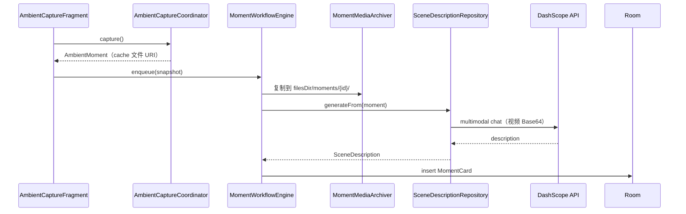
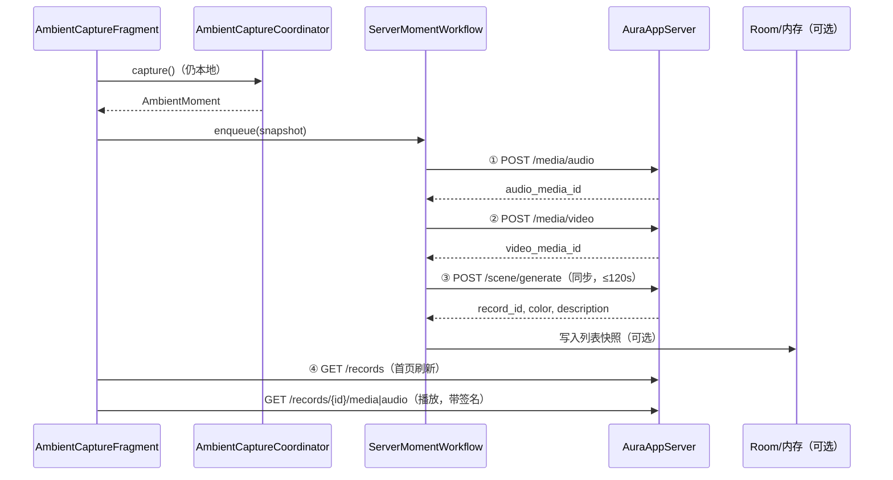

# AuraFlow 客户端 → 服务端迁移方案（Review 草案）

> 版本：v0.3（title / 分页已确认）  
> 日期：2026-06-07  
> 分支：`gds/change_to_server`  
> 依据：[ServerAPIdoc](./ServerAPIdoc/)、[AuraAppServer](file:///home/saber/startup/AuraAppServer) 源码

---

## 1. 目标与范围

### 1.1 目标

将当前 **本地闭环** 的数据处理链路，改为 **「本地采集 + 服务端存储与计算」**：

| 能力 | 现状（本地） | 目标（服务端） |
|------|-------------|----------------|
| 健康检查 | 无 | `GET /health` |
| 音视频存储 | `filesDir/moments/{id}/` | `POST /media/audio`、`POST /media/video` |
| 场景描述 / 主题色 | App 直连 DashScope + `SceneMediaEncoder` | `POST /scene/generate`（服务端同步 LLM） |
| 历史列表 | Room `moment_cards` | `GET /records` |
| 视频播放 | 本地 `videoPath` | `GET /records/{id}/media` 或列表 `video_url`（带签名） |
| 音频播放 | 本地 `audioPath` | `GET /records/{id}/audio` 或列表 `audio_url`（带签名） |
| 缩略图 | 本地 `posterPath`（封面帧） | 列表 `thumbnail_url`（服务端 ffmpeg 生成） |

### 1.2 明确保留在本地

以下逻辑 **不迁移**，仍由 App 完成：

- 相机 / 麦克风 **采集**（`AmbientVideoCapture`、`AmbientAudioCapture`）
- GPS + Mapbox **逆地理编码**（`AmbientLocationCapture`、`MapboxReverseGeocoding`）
- 正在播放音乐探测（`AmbientNowPlayingProbe`）
- `user_id` 生成与持久化（服务端用其隔离数据，非登录体系）

### 1.3 明确废弃 / 降级（服务端化之后）

| 模块 | 处理建议 |
|------|----------|
| `DashScopeSceneDescriptionRemote` | **删除**（API Key 不再进 App） |
| `SceneMediaEncoder` | **删除**（Base64 编码在服务端） |
| `SceneDescriptionPromptBuilder` | **删除**（Prompt 在服务端） |
| `SceneDescriptionRepository.generateFrom` | **替换**为 `SceneGenerateRemote` |
| `MomentMediaArchiver` | **降级**为可选本地缓存层，或删除 |
| Room `MomentCardEntity` | **仅首屏缓存**；列表/媒体以服务端为准，进入 App 后 `GET /records` 刷新 |
| `BuildConfig.DASHSCOPE_API_KEY` | **移除** |

---

## 2. 服务端 API 与本地模块映射

你列出的 7 项与文档接口对应关系如下：

| # | 你的需求 | 服务端接口 | 鉴权 | 本地将替代的代码 |
|---|----------|------------|------|------------------|
| 1 | 健康查询 | `GET /api/v1/health` | 否 | （新增）启动 / 设置页探测 |
| 2 | 视频上传 | `POST /api/v1/media/video?user_id=` | 是 | `MomentMediaArchiver` 归档视频 |
| 3 | 音频上传 | `POST /api/v1/media/audio?user_id=` | 是 | `MomentMediaArchiver` 归档音频 |
| 4 | 大模型处理 | `POST /api/v1/scene/generate` | 是 | `SceneDescriptionRepository` + DashScope |
| 5 | 拉取列表 | `GET /api/v1/records?user_id=&page=&page_size=` | 是 | `MomentCardDao.observeAll` 作为主数据源 |
| 6 | 获取视频 | `GET /api/v1/records/{id}/media?user_id=` | 是 | 读本地 `videoPath` |
| 7 | 获取音频 | `GET /api/v1/records/{id}/audio?user_id=` | 是 | 读本地 `audioPath` |

补充（列表已带 URL，实现时可二选一）：

- 缩略图：`GET /records/{id}/thumbnail`
- 单条详情：`GET /records/{id}`（详情页刷新用）
- 临时媒体：`GET /media/assets/{id}/video|audio`（generate 前一般不需要 App 下载）

---

## 2.1 三个 ID 的含义（已对照 AuraAppServer 源码）

这是客户端迁移时最容易混淆的概念：

| ID | 谁生成 | 存在哪里 | 生命周期 | 用途 |
|----|--------|----------|----------|------|
| **`workflowId`** | **仅 Android 客户端** | `MomentWorkflowStore`、前台通知 | 一次采样任务从开始到结束 | 追踪 UI 进度（上传中/生成中）；**服务端完全不认识** |
| **`media_id`** | 服务端 | `media_assets` 表 + `assets/{id}/` 磁盘 | 上传后永久残留（服务端**无自动清理**） | `POST /media/audio\|video` 返回；供 `scene/generate` 引用 |
| **`record_id`** | 服务端 | `records` 表 + `{record_id}/` 磁盘 | 一条「场景记忆」的永久主键 | `POST /scene/generate` 成功返回；列表/详情/下载皆用它 |

关系示意：

```
客户端 workflowId（本地任务追踪，UUID.randomUUID()）
    │
    ├─① POST /media/audio  → audio_media_id（服务端临时 staging）
    ├─② POST /media/video  → video_media_id（服务端临时 staging）
    └─③ POST /scene/generate(audio_media_id, video_media_id, …)
              → record_id（永久记录）
              → 服务端把 assets/ 复制到 records/{record_id}/
```

**客户端推荐映射：**

```kotlin
data class PendingUploadTask(
    val workflowId: String,           // 本地进度条用，不上传
    var audioMediaId: String? = null,   // ① 返回后写入，然后可删本地音频
    var videoMediaId: String? = null,   // ② 返回后写入，然后可删本地视频
    var recordId: String? = null,       // ③ 成功后写入，成为 Room/UI 主键
)
```

- **列表 / 详情 / 播放 / 删除本地缓存**：一律用 `record_id`
- **`workflowId`**：仅在进行中 Banner、通知、`ActiveWorkflow` 里使用；`generate` 成功后该任务从进行中列表移除
- **`media_id`**：仅在一次上传流程的内存/DB 草稿里暂存；**不要**当作列表主键

**失败时服务端行为（影响重试策略）：**

| 失败点 | 服务端 | 客户端应对 |
|--------|--------|------------|
| 上传前/校验失败 | 无 `record_id` | 删本地 cache，整流程重来 |
| `scene/generate` 502（LLM 失败） | 可能已有 `status=failed` 的 `record_id` + 永久媒体 | 列表刷新可见失败项；**不要**复用旧 `media_id` 重试，应重新采集或整流程重传 |
| 仅音频上传成功、视频未传 | 两个 `media_id` 不配对 | 删本地 + 放弃本次 `media_id`（服务端临时文件会残留，内测可接受） |

---

## 2.2 `user_id` 生成策略（已确认）

**服务端规则**（`AuraAppServer`）：

- 任意非空字符串，最长 128 字符；**不校验 UUID 格式**
- 用于 **数据隔离**（列表、媒体归属校验），**不是**登录账号
- 鉴权靠 `API_TOKEN + 签名 + 包名`，与 `user_id` 无关
- 服务端**不绑定设备**；换 `user_id` 即视为另一个用户的数据空间

**客户端实现（已确认）：一机一个，DataStore 持久化**

```kotlin
// 首次启动
val userId = UUID.randomUUID().toString()  // 例如 a1b2c3d4-e5f6-...
// 写入 DataStore，以后每次请求 Query/Body 带同一 userId
```

- 卸载重装会生成新 `user_id` → 看不到旧列表（符合内测预期）
- 不做账号体系前，**不要**让用户改 `user_id`

---

## 3. 流程对比

### 3.1 当前本地流程



### 3.2 目标服务端流程（API.md 推荐）



---

## 4. 本地架构改造设计

### 4.1 新增 `:data` 网络子模块（建议目录）

```
data/src/main/java/com/catclaw/aura/data/
├── aura/                          # 新建：Aura 服务端专用
│   ├── AuraApiConfig.kt           # BASE_URL / TOKEN / SECRET（BuildConfig）
│   ├── AuraUserIdStore.kt         # user_id UUID 持久化
│   ├── auth/
│   │   ├── AuraSignature.kt       # HMAC-SHA256 签名
│   │   └── AuraAuthInterceptor.kt # OkHttp：Header + 签名
│   ├── api/
│   │   ├── AuraApiService.kt      # Retrofit 接口定义
│   │   └── dto/                   # 请求/响应 DTO
│   ├── remote/
│   │   ├── AuraHealthRemote.kt
│   │   ├── AuraMediaUploadRemote.kt
│   │   ├── AuraSceneGenerateRemote.kt
│   │   └── AuraRecordsRemote.kt
│   └── repository/
│       └── ServerMomentRepositoryImpl.kt
```

### 4.2 网络层改造要点

**现状：** `NetworkClient` + `DynamicApiService` 面向通用 JSONPlaceholder / Mapbox / DashScope。

**改造：**

1. 新增 `NetworkConstants.BASE_URL_AURA = "aura"`，在 `AppContainer.ensureNetworkInitialized()` 注册真实 Base URL（来自 `local.properties` 的 `AURA_API_BASE_URL`）。
2. 为 Aura 专用 OkHttpClient 增加 `AuraAuthInterceptor`（与 Mapbox 客户端 **分离**，避免签名逻辑污染其他 Host）。
3. 签名规则严格按 [API.md §3](./ServerAPIdoc/API.md#3-鉴权与签名)：
   - `PATH` 含 `/api/v1`，**不含** query
   - **multipart 上传**时 `body = byteArrayOf()`
   - JSON 请求对 body 字节做 SHA256
4. 超时配置：
   - 普通 GET：30s
   - `/scene/generate`：**120s**（必须）
   - multipart 上传：60s（视 30MB 上限）

**凭证存放（不进 Git）：**

```properties
# local.properties.example 新增
AURA_API_BASE_URL=http://<PUBLIC_IP>:8000/api/v1
AURA_API_TOKEN=...
AURA_API_SECRET=...
```

```kotlin
// data BuildConfig
MAPBOX_ACCESS_TOKEN  // 保留
// 移除 DASHSCOPE_API_KEY
AURA_API_TOKEN
AURA_API_SECRET
AURA_API_BASE_URL
```

### 4.3 包名校验（⚠️ 需与运维对齐）

文档示例为 `com.example.aura`，**当前 App 为 `com.catclaw.aura`**。

服务端 `.env` 的 `ALLOWED_PACKAGE_NAME` 必须改为 `com.catclaw.aura`，否则全部 403。

---

## 5. 领域层（`:domain`）变更

### 5.1 模型扩展

`MomentCard` 建议扩展（或新建 `AuraRecord` 再映射）：

| 新字段 | 来源 | UI 用途 |
|--------|------|---------|
| `themeColor: String?` | `color` | 卡片背景色 |
| `thumbnailUrl: String?` | `thumbnail_url` | 列表封面（Coil/签名 GET） |
| `videoUrl: String?` | `video_url` | 流媒体播放 |
| `audioUrl: String?` | `audio_url` | 音频播放 |
| `serverRecordId: String` | `record_id` | 主键（替代本地 workflow UUID） |
| `status: String` | `status` | completed / failed |
| `summaryModel: String?` | `summary_model` | 调试展示 |

本地路径字段 `posterPath` / `videoPath` / `audioPath`：

- **方案 A（推荐）**：保留，表示「已缓存到本地的路径」；URL 字段表示远端。
- **方案 B**：删除，播放一律走 URL + 磁盘缓存。

### 5.2 Repository 接口调整

```kotlin
// 新增
interface AuraServerRepository {
    suspend fun checkHealth(): Result<HealthStatus>
    suspend fun uploadAudio(userId: String, file: File): Result<MediaUploadResult>
    suspend fun uploadVideo(userId: String, file: File): Result<MediaUploadResult>
    suspend fun generateScene(request: SceneGenerateRequest): Result<SceneGenerateResult>
    suspend fun fetchRecords(userId: String, page: Int, pageSize: Int): Result<RecordListPage>
    suspend fun fetchRecordDetail(userId: String, recordId: String): Result<AuraRecord>
}

// MomentCardRepository 职责变化
interface MomentCardRepository {
    fun observeCards(): Flow<List<MomentCard>>   // 数据源改为：先读缓存，后台 refresh
    suspend fun refreshFromServer(): Result<Unit>
    suspend fun getCard(id: String): MomentCard?
    suspend fun delete(cardId: String)         // 内测可仅删本地缓存；服务端软删待 API
}
```

### 5.3 UseCase 变更

| UseCase | 变更 |
|---------|------|
| `CaptureAmbientMomentUseCase` | 采集逻辑不变；`startWorkflow` 改为服务端工作流 |
| `ObserveHomeListUseCase` | 合并「进行中上传任务」+「服务端列表缓存」 |
| `GetMomentCardUseCase` | 优先本地缓存，miss 时 `GET /records/{id}` |
| `ObserveGeneratingStatusUseCase` | Phase 改为 `UPLOADING_AUDIO` → `UPLOADING_VIDEO` → `GENERATING_SCENE` |
| **新增** `CheckServerHealthUseCase` | 启动时 / 设置页调用 |
| **新增** `RefreshMomentListUseCase` | 下拉刷新 / 进入首页 |

---

## 6. 数据层（`:data`）逐文件改造清单

### 6.1 工作流：替换 `MomentWorkflowEngine`

**现状职责：**

1. `ARCHIVING_MEDIA` → 本地复制
2. `GENERATING_DESCRIPTION` → DashScope
3. `save(MomentCard)` → Room

**目标 `ServerMomentWorkflowEngine`：**

| Phase | 动作 |
|-------|------|
| `QUEUED` | 入队 |
| `UPLOADING_AUDIO` | `POST /media/audio`（cache 中 `ambient_audio_*.m4a`） |
| `UPLOADING_VIDEO` | `POST /media/video`（cache 中 `ambient_video_*.mp4`） |
| `GENERATING_DESCRIPTION` | `POST /scene/generate`（阻塞至多 120s） |
| `COMPLETED` | 将响应写入 Room；删除 cache 临时文件（可选） |
| `FAILED` | 记录 `error_message`，保留 cache 供重试 |

**`POST /scene/generate` 请求体映射**（来自 `MomentCaptureSnapshot`）：

| JSON 字段 | 本地来源 |
|-----------|----------|
| `user_id` | `AuraUserIdStore` |
| `audio_media_id` / `video_media_id` | 上两步响应 |
| `title` | **内测固定 `null`**（不传或显式 null） |
| `location` | `latitude/longitude/placeName/...`（内测明文） |
| `captured_at_ms` | `capturedAtEpochMs` |
| `now_playing` | music 字段 |
| `video_meta` / `audio_meta` | duration + isSuccess |
| `capture_errors` | `captureErrorSummary()` 拆分 |

**删除依赖：** `SceneDescriptionRepository`、`MomentMediaArchiver`（若不做本地归档）。

**保留：** `MomentWorkflowStore`、`MomentWorkflowService`（前台通知）、`WorkflowNotificationScheduler`（文案改为上传/生成中）。

### 6.2 列表：`MomentCardRepositoryImpl`（已确认：服务端为准）

**策略：Server-authoritative + Room 作首屏缓存**

```
进入 App / 下拉刷新：
  GET /records?user_id=&page=1&page_size=10
  → 全量替换 Room 快照（upsert + 删除本地有而服务端无的项）
  加载更多：page++，items 追加；total ≤ 当前已加载条数时停止

observeCards():
  Room Flow（仅用于首屏秒开，数据可能过期）

播放 / 缩略图：
  不读 Room 里的本地路径；按 record_id 从服务端 URL 下载到 playback cache
```

| 场景 | 行为 |
|------|------|
| 冷启动 | 先展示 Room 上次缓存 → 后台 `refreshFromServer()` → Diff 更新 UI |
| 刷新成功 | **以服务端列表为准**覆盖 Room |
| 刷新失败 | 保留 Room 缓存 + 提示；不伪造新数据 |
| 进行中任务 | 仅 `MomentWorkflowStore`（`workflowId`），**不进 Room**，直到有 `record_id` |

**Room 表结构变更（v3 migration）：**

- 主键 `id` = 服务端 `record_id`（`generate` 成功后才入库）
- 新增：`theme_color`, `thumbnail_url`, `video_url`, `audio_url`, `server_status`, `synced_at_ms`
- **移除或弃用**：`poster_path`, `video_path`, `audio_path` 作为数据源（可保留作 playback cache 路径，见 §6.3）

### 6.3 媒体播放：`AmbientCaptureFragment` / `MomentDetailFragment`

**现状：** `FileProvider` + `file://` 本地路径。

**目标：**

| 场景 | 策略 |
|------|------|
| 列表缩略图 | Coil 加载 `thumbnail_url`，OkHttp 带 `AuraAuthInterceptor` |
| 视频播放 | `VideoView` / ExoPlayer 播 `video_url`（签名 GET）；或先下载到 cache 再播 |
| 音频播放 | `MediaPlayer.setDataSource(url)` 需处理鉴权 Header → **建议先下载到 cache** |

> **注意：** `MediaPlayer` / `VideoView` 对自定义 Header 支持差。实践上建议封装 `AuraMediaDownloader`，用已签名的 OkHttp 下载到 `cacheDir/playback/{record_id}/`，再本地播放。

**数据一致性策略（已确认，配合「先下载再播」）：**

| 规则 | 说明 |
|------|------|
| 单一真相源 | 元数据（文案/color/URL）以 `GET /records` 为准 |
| 播放文件 | `playback cache` 是衍生数据；`record_id + etag/updated_at` 不一致时重新下载 |
| 列表刷新后 | 对比 `record_id` 集合：服务端删除的（未来）→ 删 Room + 删 playback cache |
| 用户删 moment（内测） | **仅删 Room + 本地 playback cache**；服务端记录仍在 |
| 缓存键 | `playback/{record_id}/video.mp4`、`audio.m4a`、`thumbnail.jpg` |
| 并发 | 同 `record_id` 下载加互斥，避免双开 MediaPlayer 与下载竞争 |
| 磁盘 | 播放 cache LRU 上限（如 200MB）；与「上传用 cache」目录分离 |

**本地采集文件清理（已确认）：**

```
采集完成 → cacheDir/ambient_audio_*.m4a, ambient_video_*.mp4
    ① 音频上传成功 → 保存 audio_media_id → 立即删除本地音频文件
    ② 视频上传成功 → 保存 video_media_id → 立即删除本地视频文件
    ③ scene/generate 成功 → 保存 record_id → 清除 PendingUploadTask
    ✗ 任一步失败需重试整次采集 → 删除本地残留 + 丢弃已得 media_id（重新上传）
```

- 上传完成后 **本地不再保留** 原始采集文件，只保留 `media_id`（内存/轻量 Room 草稿行，可选）
- `poster` 封面帧：内测可不传；列表缩略图用服务端 `thumbnail_url`

### 6.4 健康检查

```kotlin
// GET /health — 无鉴权
suspend fun checkHealth(): Boolean
```

**调用时机（建议）：**

- `AuraApplication.warmUp()` 之后异步探测一次（仅打 Log / 可选 UI 提示）
- 采样前若 health 失败，提示「服务不可用」并仍允许仅本地预览（可选）

### 6.5 位置加密（内测明文；production 实现已对齐服务端）

**内测（已确认）：** `APP_ENV=development` 时传明文 JSON `location`。

**production 服务端逻辑**（`AuraAppServer/app/services/scene_service.py` + `crypto.py`）：

- 有 `location_encrypted` → 解密使用
- 有明文 `location` → **仅 development 允许**；production 返回错误
- 两者皆无 → `location=null`（允许）

**加密算法（与 `crypto.py` 完全一致，Phase 4 实现）：**

```kotlin
// 1. HKDF-SHA256 派生 32 字节密钥
//    salt = "aura-location-v1" (UTF-8 bytes)
//    info = "location-encryption"
//    input  = API_SECRET (UTF-8)
// 2. 明文 JSON = LocationSchema { lat, lng, address, accuracy_meters, place_name, ... }
// 3. AES-GCM：12 字节 random nonce + ciphertext → Base64
fun encryptLocation(apiSecret: String, location: LocationJson): String
```

实现时直接 port `AuraAppServer/app/infrastructure/security/crypto.py`，并加 round-trip 单元测试。

客户端结构：

```kotlin
interface LocationPayloadFactory {
    fun forSceneGenerate(snapshot: MomentCaptureSnapshot): LocationField
}
// development → LocationField.Plain(location)
// production  → LocationField.Encrypted(encryptLocation(API_SECRET, location))
```

---

## 7. 表现层（`:app`）变更清单

| 文件 | 变更 |
|------|------|
| `AppContainer` | 注册 Aura 网络；注入 `ServerMomentWorkflowEngine`；移除 DashScope 相关 |
| `AmbientCaptureViewModel` | 完成文案改为「上传并生成中」；展示服务端返回的 `color` / `description` |
| `MapFragment` / `HomeViewModel` | 进入时 `refreshFromServer()`；列表项展示 `themeColor` |
| `MomentCardListAdapter` | 缩略图改 URL；背景色用 `color` |
| `MomentDetailFragment` | 播放入口改 URL/cache；展示 `summary` |
| `local.properties.example` | 增加 Aura 三项配置 |

**UI 新增字段：**

- 卡片背景色 ← `color`（API 新能力，本地原先无）

---

## 8. 分阶段实施计划（建议）

### Phase 0 — 基础设施（1～2 天）

- [ ] `AuraApiConfig` + BuildConfig + `local.properties.example`
- [ ] `AuraSignature` + `AuraAuthInterceptor` + 单元测试（对照 `tests/test_api.py`）
- [ ] `AuraHealthRemote.check()`
- [ ] 验证包名 `com.catclaw.aura` 与服务端一致

### Phase 1 — 上传 + 生成（核心，2～3 天）

- [ ] `AuraMediaUploadRemote`（audio / video multipart）
- [ ] `AuraSceneGenerateRemote` + DTO 映射
- [ ] `ServerMomentWorkflowEngine` 替换原 `runWorkflow` 主路径
- [ ] 移除 `DashScopeSceneDescriptionRemote` 调用链
- [ ] 前台 Service 通知文案更新

### Phase 2 — 列表 + 详情（1～2 天）

- [ ] `AuraRecordsRemote`（list + detail）
- [ ] `MomentCardRepositoryImpl.refreshFromServer()`
- [ ] Room migration v3
- [ ] `MapFragment` 进入刷新

### Phase 3 — 媒体下载与播放（1～2 天）

- [ ] `AuraMediaDownloader`（signed GET → cache file）
- [ ] 列表缩略图 / 详情音视频播放改用 cache 或 URL
- [ ] 缓存清理策略（LRU / 按 record 删除）

### Phase 4 — 加固（可选）

- [ ] `location_encrypted` production 路径
- [ ] 失败重试 / 断点续传（上传）
- [ ] 离线模式（仅展示 Room 缓存）

---

## 9. Review 结论（v0.2 已确认）

| # | 决策 | 状态 |
|---|------|------|
| 1 | 列表以服务端为准；Room 仅首屏缓存；视频/音频/缩略图均从服务端拉取 | ✅ |
| 2 | 播放：先签名下载到 `playback cache` 再播；需 §6.3 一致性策略 | ✅ |
| 3 | `workflowId` 纯本地进度；`media_id` 上传临时引用；`record_id` 永久主键（见 §2.1） | ✅ |
| 4 | **上传成功即删**本地采集文件；流程未完成要重来则清空 `media_id` + 本地文件 | ✅ |
| 5 | 删除 moment：**仅删本地** Room + playback cache；服务端 API 后续再做 | ✅ |
| 6 | `user_id`：首次启动 `UUID` → **DataStore** 持久化，一机一个 | ✅ |
| 7 | 服务端 `ALLOWED_PACKAGE_NAME=com.catclaw.aura` | ✅（你已改服务端） |
| 8 | 内测 `location` 明文；production 按 `crypto.py` 加密 | ✅ |
| 9 | 不保留 App 直连 DashScope 降级 | ✅（隐含） |
| 10 | `title`：内测传 `null`，列表主文案仍用 `summary` | ✅ |
| 11 | 列表分页 `page_size=10`（首页默认 `page=1`） | ✅ |

---

## 10. 测试计划（实施后）

| 用例 | 步骤 | 预期 |
|------|------|------|
| T1 健康检查 | App 启动 | `/health` 返回 ok |
| T2 完整采集 | 采样 → 等待 | 通知阶段：上传音频→上传视频→生成；最终有 `record_id` |
| T3 列表 | 回首页 | 展示 `color`、`summary`、缩略图 |
| T4 详情播放 | 点开卡片 | 视频/音频可播放 |
| T5 鉴权失败 | 故意错 Token | 401，UI 有明确提示 |
| T6 大包体 | 接近 30MB 视频 | 413 或上传成功 |
| T7 LLM 超时 | 模拟 120s+ | 502，卡片 status=failed |

---

## 11. 不在本次范围

- 用户登录 / 注册
- 服务端记录删除 API 对接（除非 Phase 2 确认需要）
- HTTPS 证书 pinning
- 多设备 `user_id` 同步

---

## 12. Review 检查表（v0.2）

- [x] 同意整体架构：**采集本地、存储+LLM+列表服务端**
- [x] 同意分 4 个 Phase 实施顺序
- [x] 播放策略：**签名下载 → playback cache → 播放**
- [x] 列表以服务端为准 + Room 首屏缓存
- [x] 服务端包名 `com.catclaw.aura`
- [x] 内测 `location` 明文
- [x] `title`：内测传 `null`；列表主文案用 `summary`
- [x] 列表 `page_size=10`，`page=1` 起；下拉加载更多时 `page++`

**下一步：** 按 Phase 0 开始改代码（你说一声即可开工）。

---

*文档结束 — v0.2 Review 已纳入*
