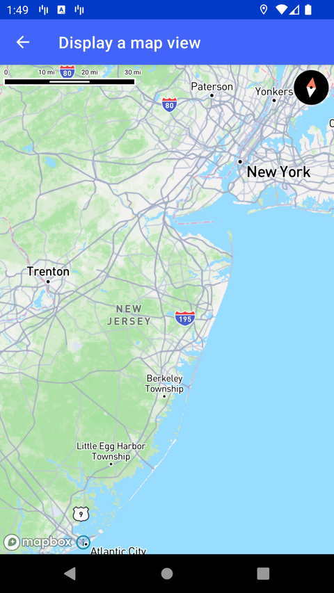

# 显示地图（Display a map view）

> 官方示例：[display-a-map-view](https://docs.mapbox.com/android/maps/examples/android-view/display-a-map-view/)

## 示例效果



## 功能说明

创建并显示使用 Mapbox Standard 默认样式的地图。初始化 `MapView` 作为 Activity 内容，并通过 `setCamera()` 设置中心点与缩放级别。

<details>
<summary>英文原文</summary>

This example demonstrates how to display a map using the Mapbox Maps SDK for Android. The code below initializes a MapView and sets it as the ContentView of the application. Once the map is rendered,setCamera() centers the camera on a Point with the defined latitude and longitude coordinates and sets the zoom level to 9.0.

</details>

## 示例 Activity

- `SimpleMapActivity.kt`

## 示例代码

```kotlin
package com.mapbox.maps.testapp.examples

import android.os.Bundle
import androidx.appcompat.app.AppCompatActivity
import com.mapbox.geojson.Point
import com.mapbox.maps.CameraOptions
import com.mapbox.maps.MapView

/**
 * Example of displaying a map.
 */
class SimpleMapActivity : AppCompatActivity() {

  override fun onCreate(savedInstanceState: Bundle?) {
    super.onCreate(savedInstanceState)
    val mapView = MapView(this)
    setContentView(mapView)
    mapView.mapboxMap
      .apply {
        setCamera(
          CameraOptions.Builder()
            .center(Point.fromLngLat(LONGITUDE, LATITUDE))
            .zoom(9.0)
            .build()
        )
      }
  }

  companion object {
    private const val LATITUDE = 40.0
    private const val LONGITUDE = -74.5
  }
}
```

## 在 Aura 项目中使用

- UI 框架：**Android View**（与 Aura 当前 `MapFragment` + `MapView` 一致）
- 包名请替换为 `com.catclaw.aura`
- 需在 `local.properties` 配置 `MAPBOX_ACCESS_TOKEN`
- 部分示例依赖 `assets/` 或额外布局文件，请参考 GitHub 示例工程

## 参考链接

- [官方文档（英文）](https://docs.mapbox.com/android/maps/examples/android-view/display-a-map-view/)
- [GitHub 源码](https://github.com/mapbox/mapbox-maps-android/blob/v11.24.3/app/src/main/java/com/mapbox/maps/testapp/examples/SimpleMapActivity.kt)
- [Android View 示例索引](./README.md)
- [Mapbox 中文指南](../../README.md)
