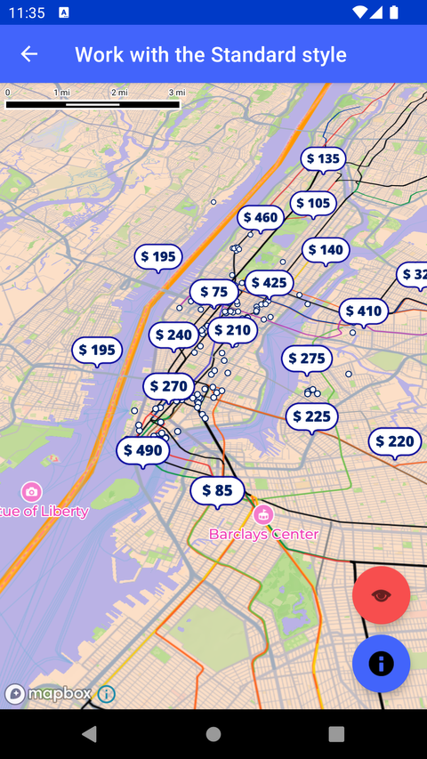

# 使用 Standard 样式（Work with the Standard style）

> 官方示例：[work-with-the-standard-style](https://docs.mapbox.com/android/maps/examples/android-view/work-with-the-standard-style/)

## 示例效果



## 功能说明

演示如何使用 Standard 样式导入，并在运行时动态修改主题、光照预设、标签与 3D 对象等配置。

<details>
<summary>英文原文</summary>

This example demonstrates how to work with style imports and the Mapbox Standard style using the Mapbox Maps SDK for Android. It showcases loading a style from a local JSON file that imports Mapbox Standard as a basemap. It includes setting up a GeojsonSource and applying styling to a LineLayer, rendered on top of other layers. Users can interact with the activity by clicking on buttons to adjust settings such as themes, light presets, labels visibility, and 3D object display within the Standard style. These interactions trigger changes in the style configuration properties dynamically.

</details>

## 示例 Activity

- `StandardStyleActivity.kt`

## 示例代码

```kotlin
package com.mapbox.maps.testapp.examples

import android.os.Bundle
import android.view.View
import android.widget.Toast
import androidx.appcompat.app.AppCompatActivity
import com.google.android.material.snackbar.Snackbar
import com.mapbox.bindgen.Value
import com.mapbox.geojson.LineString
import com.mapbox.geojson.Point
import com.mapbox.maps.CameraOptions
import com.mapbox.maps.ClickInteraction
import com.mapbox.maps.MapboxExperimental
import com.mapbox.maps.MapboxMap
import com.mapbox.maps.extension.style.expressions.dsl.generated.rgb
import com.mapbox.maps.extension.style.layers.generated.lineLayer
import com.mapbox.maps.extension.style.sources.generated.geoJsonSource
import com.mapbox.maps.extension.style.style
import com.mapbox.maps.interactions.FeatureState
import com.mapbox.maps.interactions.TypedFeaturesetDescriptor
import com.mapbox.maps.logI
import com.mapbox.maps.testapp.databinding.ActivityStandardStyleBinding

/**
 * Example of working with style imports and the Standard style.
 * Additionally showcases the map interactions.
 */
class StandardStyleActivity : AppCompatActivity() {

  private lateinit var mapboxMap: MapboxMap
  private val line = LineString.fromLngLats(LINE_COORDINATES)
  private var lightSetting: LightPresets = LightPresets.DUSK
  private var themeSetting: Theme = Theme.DEFAULT
  private var labelsSetting = true
  private var show3dObjectsSetting = true
  private lateinit var binding: ActivityStandardStyleBinding

  private var hotelPriceAlertBar: Snackbar? = null

  override fun onCreate(savedInstanceState: Bundle?) {
    super.onCreate(savedInstanceState)
    binding = ActivityStandardStyleBinding.inflate(layoutInflater)
    mapboxMap = binding.mapView.mapboxMap
    setContentView(binding.root)

    // Set the camera options to center on New York City
    mapboxMap.setCamera(
      CameraOptions.Builder()
        .center(Point.fromLngLat(LONGITUDE, LATITUDE))
        .zoom(11.0)
        .pitch(45.0)
        .build()
    )

    // Load a style which imports Mapbox Standard as a basemap
    mapboxMap.loadStyle(
      style(style = STYLE_URL) {
        // Create a new GeoJSON data source of the line's coordinates
        +geoJsonSource(id = "line-layer") {
          geometry(line)
        }
        // Create and apply basic styling to the fill layer, assign the layer to the "middle" slot
        +lineLayer(layerId = "line-layer", sourceId = "line-layer") {
          lineColor(rgb(255.0, 165.0, 0.0))
          lineWidth(8.0)
          // Order of adding layers matter. This line layer has the same slot as the water layer
          // (see [STYLE_URL]) but it will be rendered on top of the water because it's added later.
          slot("bottom")
        }
      }
    )
    addOnClickListeners()
  }

  @OptIn(MapboxExperimental::class)
  private fun addOnClickListeners() {
    binding.mapView.mapboxMap.addInteraction(
      ClickInteraction.featureset(
        id = "hotels-price"
      ) { selectedPriceLabel, _ ->
        hotelPriceAlertBar = Snackbar.make(
          binding.mapView,
          "Last selected hotel price: ${selectedPriceLabel.properties.getString("price")}",
          Snackbar.LENGTH_INDEFINITE
        ).apply {
          show()
        }
        mapboxMap.setFeatureState(
          selectedPriceLabel,
          FeatureState {
            addBooleanState("active", true)
          }
        ) {
          mapboxMap.getFeatureState(selectedPriceLabel) {
            logI(TAG, "getFeatureState returned state: ${it.asJsonString()}")
          }
        }
        // return true meaning we consume this click and
        // do not dispatch it to the map interaction declared below
        return@featureset true
      }
    )

    binding.mapView.mapboxMap.addInteraction(
      // handle click interactions on the map itself (outside of hotels' price POIs)
      ClickInteraction { _ ->
        hotelPriceAlertBar?.dismiss()
        mapboxMap.resetFeatureStates(TypedFeaturesetDescriptor.Featureset(featuresetId = "hotels-price"))
        return@ClickInteraction true
      }
    )

    binding.fabThemeSetting.setOnClickListener {
      mapboxMap.getStyle { style ->
        themeSetting = when (themeSetting) {
          Theme.DEFAULT -> Theme.FADED
          Theme.FADED -> Theme.MONOCHROME
          Theme.MONOCHROME -> Theme.DEFAULT
        }
        style.setStyleImportConfigProperty(
          IMPORT_ID_FOR_STANDARD_STYLE,
          "theme",
          themeSetting.value
        )
        showAction(it, themeSetting.value.toString())
      }
    }

    // When a user clicks the light setting button change the `lightPreset` config property on the Standard style import
    binding.fabLightSetting.setOnClickListener {
      mapboxMap.getStyle { style ->
        lightSetting = when (lightSetting) {
          LightPresets.DAY -> LightPresets.DAWN
          LightPresets.DAWN -> LightPresets.DUSK
          LightPresets.DUSK -> LightPresets.NIGHT
          LightPresets.NIGHT -> LightPresets.DAY
        }
        style.setStyleImportConfigProperty(
          IMPORT_ID_FOR_STANDARD_STYLE,
          "lightPreset",
          lightSetting.value
        )
        showAction(it, lightSetting.value.toString())
      }
    }

    // When a user clicks the labels setting button change the label config properties on the Standard style import to show/hide them
    // To identify which configuration properties are available on an imported style you can use `style.getStyleImportSchema()`
    binding.fabLabelsSetting.setOnClickListener {
      mapboxMap.getStyle { style ->
        labelsSetting = !labelsSetting
        style.setStyleImportConfigProperty(
          IMPORT_ID_FOR_STANDARD_STYLE,
          "showPlaceLabels",
          Value.valueOf(labelsSetting)
        )
        style.setStyleImportConfigProperty(
          IMPORT_ID_FOR_STANDARD_STYLE,
          "showRoadLabels",
          Value.valueOf(labelsSetting)
        )
        style.setStyleImportConfigProperty(
          IMPORT_ID_FOR_STANDARD_STYLE,
          "showPointInterestLabels",
          Value.valueOf(labelsSetting)
        )
        style.setStyleImportConfigProperty(
          IMPORT_ID_FOR_STANDARD_STYLE,
          "showTransitLabels",
          Value.valueOf(labelsSetting)
        )
        showAction(it, labelsSetting.toString())
      }
    }
    binding.fab3dObjectsSetting.setOnClickListener {
      mapboxMap.getStyle { style ->
        show3dObjectsSetting = !show3dObjectsSetting
        style.setStyleImportConfigProperty(
          IMPORT_ID_FOR_STANDARD_STYLE,
          "show3dObjects",
          Value.valueOf(show3dObjectsSetting)
        )
        showAction(it, show3dObjectsSetting.toString())
      }
    }
  }

  private fun showAction(it: View, value: String) {
    Toast.makeText(
      this@StandardStyleActivity,
      it.contentDescription.toString() + value,
      Toast.LENGTH_SHORT
    ).show()
  }

  private enum class LightPresets(val value: Value) {
    DAY(Value.valueOf("day")),
    DAWN(Value.valueOf("dawn")),
    DUSK(Value.valueOf("dusk")),
    NIGHT(Value.valueOf("night"))
  }

  private enum class Theme(val value: Value) {
    FADED(Value.valueOf("faded")),
    MONOCHROME(Value.valueOf("monochrome")),
    DEFAULT(Value.valueOf("default"))
  }

  companion object {
    private const val TAG = "StandardStyleActivity"

    /**
     * The ID used in [STYLE_URL] that references the `standard` style.
     */
    private const val IMPORT_ID_FOR_STANDARD_STYLE = "standard"
    private const val LATITUDE = 40.72
    private const val LONGITUDE = -73.99
    private const val STYLE_URL = "asset://fragment-realestate-NY.json"

    /**
     * Boundary line between New York and New Jersey.
     */
    private val LINE_COORDINATES = listOf(
      Point.fromLngLat(-73.91912400100642, 40.913503418907936),
      Point.fromLngLat(-73.9615887363045, 40.82943110786286),
      Point.fromLngLat(-74.01409059085539, 40.75461056309348),
      Point.fromLngLat(-74.02798814058939, 40.69522028220487),
      Point.fromLngLat(-74.05655532615407, 40.65188756398558),
      Point.fromLngLat(-74.13916853846217, 40.64339339389301)
    )
  }
}
```

## 在 Aura 项目中使用

- UI 框架：**Android View**（与 Aura 当前 `MapFragment` + `MapView` 一致）
- 包名请替换为 `com.catclaw.aura`
- 需在 `local.properties` 配置 `MAPBOX_ACCESS_TOKEN`
- 部分示例依赖 `assets/` 或额外布局文件，请参考 GitHub 示例工程

## 参考链接

- [官方文档（英文）](https://docs.mapbox.com/android/maps/examples/android-view/work-with-the-standard-style/)
- [GitHub 源码](https://github.com/mapbox/mapbox-maps-android/blob/v11.24.3/app/src/main/java/com/mapbox/maps/testapp/examples/StandardStyleActivity.kt)
- [Android View 示例索引](./README.md)
- [Mapbox 中文指南](../../README.md)
