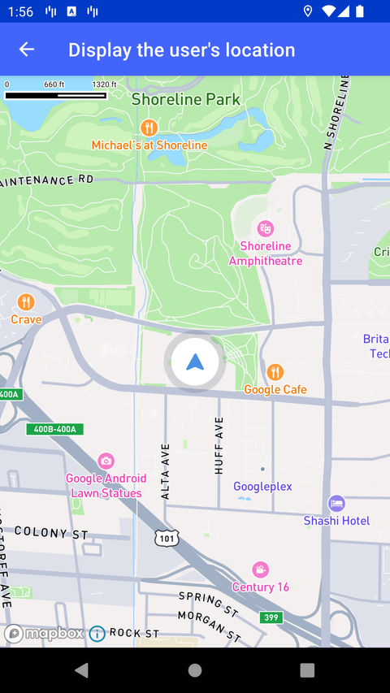

# 显示用户位置（Display the user’s location）

> 官方示例：[display-the-users-location](https://docs.mapbox.com/android/maps/examples/android-view/display-the-users-location/)

## 示例效果



## 功能说明

在地图上显示用户当前位置，使用默认的定位 puck（LocationComponent）。

<details>
<summary>英文原文</summary>

This example demonstrates how to track and display the user's location with the Mapbox Maps SDK for Android. The code below handles the user location tracking, gesture movements, and camera updates based on location changes. The user's location is displayed on the map, once the LocationPermissionHelper, built in the test app, manages location permissions from the user.

</details>

## 示例 Activity

- `LocationTrackingActivity.kt`

## 示例代码

```kotlin
package com.mapbox.maps.testapp.examples

import android.os.Bundle
import android.widget.Toast
import androidx.appcompat.app.AppCompatActivity
import com.mapbox.android.gestures.MoveGestureDetector
import com.mapbox.maps.CameraOptions
import com.mapbox.maps.ImageHolder
import com.mapbox.maps.MapView
import com.mapbox.maps.Style
import com.mapbox.maps.extension.style.expressions.dsl.generated.interpolate
import com.mapbox.maps.plugin.LocationPuck2D
import com.mapbox.maps.plugin.PuckBearing
import com.mapbox.maps.plugin.gestures.OnMoveListener
import com.mapbox.maps.plugin.gestures.gestures
import com.mapbox.maps.plugin.locationcomponent.OnIndicatorBearingChangedListener
import com.mapbox.maps.plugin.locationcomponent.OnIndicatorPositionChangedListener
import com.mapbox.maps.plugin.locationcomponent.location
import com.mapbox.maps.testapp.R
import com.mapbox.maps.testapp.utils.LocationPermissionHelper
import java.lang.ref.WeakReference

/**
 * Tracks the user location on screen, simulates a navigation session.
 */
class LocationTrackingActivity : AppCompatActivity() {

  private lateinit var locationPermissionHelper: LocationPermissionHelper

  private val onIndicatorBearingChangedListener = OnIndicatorBearingChangedListener {
    mapView.mapboxMap.setCamera(CameraOptions.Builder().bearing(it).build())
  }

  private val onIndicatorPositionChangedListener = OnIndicatorPositionChangedListener {
    mapView.mapboxMap.setCamera(CameraOptions.Builder().center(it).build())
    mapView.gestures.focalPoint = mapView.mapboxMap.pixelForCoordinate(it)
  }

  private val onMoveListener = object : OnMoveListener {
    override fun onMoveBegin(detector: MoveGestureDetector) {
      onCameraTrackingDismissed()
    }

    override fun onMove(detector: MoveGestureDetector): Boolean {
      return false
    }

    override fun onMoveEnd(detector: MoveGestureDetector) {}
  }
  private lateinit var mapView: MapView

  override fun onCreate(savedInstanceState: Bundle?) {
    super.onCreate(savedInstanceState)
    mapView = MapView(this)
    setContentView(mapView)
    locationPermissionHelper = LocationPermissionHelper(WeakReference(this))
    locationPermissionHelper.checkPermissions {
      onMapReady()
    }
  }

  private fun onMapReady() {
    mapView.mapboxMap.setCamera(
      CameraOptions.Builder()
        .zoom(14.0)
        .build()
    )
    mapView.mapboxMap.loadStyle(
      Style.STANDARD
    ) {
      initLocationComponent()
      setupGesturesListener()
    }
  }

  private fun setupGesturesListener() {
    mapView.gestures.addOnMoveListener(onMoveListener)
  }

  private fun initLocationComponent() {
    val locationComponentPlugin = mapView.location
    locationComponentPlugin.updateSettings {
      puckBearing = PuckBearing.COURSE
      puckBearingEnabled = true
      enabled = true
      locationPuck = LocationPuck2D(
        bearingImage = ImageHolder.from(R.drawable.mapbox_user_puck_icon),
        shadowImage = ImageHolder.from(R.drawable.mapbox_user_icon_shadow),
        scaleExpression = interpolate {
          linear()
          zoom()
          stop {
            literal(0.0)
            literal(0.6)
          }
          stop {
            literal(20.0)
            literal(1.0)
          }
        }.toJson()
      )
    }
    locationComponentPlugin.addOnIndicatorPositionChangedListener(onIndicatorPositionChangedListener)
    locationComponentPlugin.addOnIndicatorBearingChangedListener(onIndicatorBearingChangedListener)
  }

  private fun onCameraTrackingDismissed() {
    Toast.makeText(this, "onCameraTrackingDismissed", Toast.LENGTH_SHORT).show()
    mapView.location
      .removeOnIndicatorPositionChangedListener(onIndicatorPositionChangedListener)
    mapView.location
      .removeOnIndicatorBearingChangedListener(onIndicatorBearingChangedListener)
    mapView.gestures.removeOnMoveListener(onMoveListener)
  }

  override fun onDestroy() {
    super.onDestroy()
    mapView.location
      .removeOnIndicatorBearingChangedListener(onIndicatorBearingChangedListener)
    mapView.location
      .removeOnIndicatorPositionChangedListener(onIndicatorPositionChangedListener)
    mapView.gestures.removeOnMoveListener(onMoveListener)
  }

  override fun onRequestPermissionsResult(
    requestCode: Int,
    permissions: Array<String>,
    grantResults: IntArray
  ) {
    super.onRequestPermissionsResult(requestCode, permissions, grantResults)
    locationPermissionHelper.onRequestPermissionsResult(requestCode, permissions, grantResults)
  }
}
```

## 在 Aura 项目中使用

- UI 框架：**Android View**（与 Aura 当前 `MapFragment` + `MapView` 一致）
- 包名请替换为 `com.catclaw.aura`
- 需在 `local.properties` 配置 `MAPBOX_ACCESS_TOKEN`
- 部分示例依赖 `assets/` 或额外布局文件，请参考 GitHub 示例工程

## 参考链接

- [官方文档（英文）](https://docs.mapbox.com/android/maps/examples/android-view/display-the-users-location/)
- [GitHub 源码](https://github.com/mapbox/mapbox-maps-android/blob/v11.24.3/app/src/main/java/com/mapbox/maps/testapp/examples/LocationTrackingActivity.kt)
- [Android View 示例索引](./README.md)
- [Mapbox 中文指南](../../README.md)
