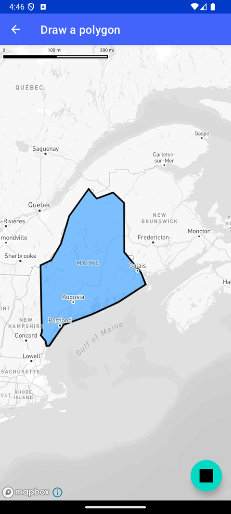

# 绘制多边形（Draw a polygon）

> 官方示例：[draw-a-polygon](https://docs.mapbox.com/android/maps/examples/android-view/draw-a-polygon/)

## 示例效果



## 功能说明

在地图上绘制矢量多边形（FillLayer + GeoJSON 数据源）。

<details>
<summary>英文原文</summary>

This example demonstrates how to draw a vector polygon on a map using the Mapbox Android SDK. The code below grabs data from a GeoJSON data source adds the information to a LineLayer to display the polygon outline and a FillLayer to color in the shape. The example also includes functionality to add a pattern fill to the polygon by setting a custom image as the fill pattern. This is achieved by loading the image from resources, adding it to the style, and updating the FillLayer with the new fill pattern.

</details>

## 示例 Activity

- `DrawPolygonActivity.kt`

## 示例代码

```kotlin
package com.mapbox.maps.testapp.examples.linesandpolygons

import android.graphics.Color
import android.os.Bundle
import androidx.appcompat.app.AppCompatActivity
import androidx.core.content.ContextCompat
import androidx.core.graphics.drawable.toBitmap
import com.mapbox.bindgen.Value
import com.mapbox.geojson.Point
import com.mapbox.maps.Style
import com.mapbox.maps.dsl.cameraOptions
import com.mapbox.maps.extension.style.layers.generated.FillLayer
import com.mapbox.maps.extension.style.layers.generated.fillLayer
import com.mapbox.maps.extension.style.layers.generated.lineLayer
import com.mapbox.maps.extension.style.layers.getLayer
import com.mapbox.maps.extension.style.sources.generated.geoJsonSource
import com.mapbox.maps.extension.style.style
import com.mapbox.maps.testapp.R
import com.mapbox.maps.testapp.databinding.ActivityDdsDrawPolygonBinding

/**
 * Draw a vector polygon on a map with the Mapbox Android SDK.
 */
class DrawPolygonActivity : AppCompatActivity() {

  override fun onCreate(savedInstanceState: Bundle?) {
    super.onCreate(savedInstanceState)
    val binding = ActivityDdsDrawPolygonBinding.inflate(layoutInflater)
    setContentView(binding.root)
    binding.mapView.mapboxMap.setCamera(
      START_CAMERA_POSITION
    )
    binding.mapView.mapboxMap.loadStyle(
      style(style = Style.STANDARD) {
        +geoJsonSource(SOURCE_ID) {
          data(SOURCE_URL)
        }
        +fillLayer(LAYER_ID, SOURCE_ID) {
          fillColor(Color.parseColor("#0080ff")).fillOpacity(0.5)
          slot("middle")
        }
        +lineLayer(
          TOP_LAYER_ID, SOURCE_ID
        ) {
          lineColor(ContextCompat.getColor(this@DrawPolygonActivity, R.color.black))
          lineWidth(3.0)
        }
      }
    ) {
      binding.mapView.mapboxMap.setStyleImportConfigProperty("basemap", "theme", Value.valueOf("monochrome"))
    }
    binding.patternFab.setOnClickListener {
      binding.mapView.mapboxMap.getStyle { style ->
        val bitmap = ContextCompat.getDrawable(this@DrawPolygonActivity, R.drawable.pattern)
          ?.toBitmap(128, 128)!!
        style.addImage(IMAGE_ID, bitmap)
        val layer = style.getLayer(LAYER_ID) as FillLayer
        layer.fillPattern(IMAGE_ID)
        layer.fillOpacity(0.7)
      }
    }
  }

  companion object {
    private const val IMAGE_ID = "stripe-pattern"
    private const val LAYER_ID = "layer-id"
    private const val SOURCE_ID = "source-id"
    private const val TOP_LAYER_ID = "line-layer"
    private const val SETTLEMENT_LABEL = "settlement-major-label"
    private const val SOURCE_URL = "asset://maine_polygon.geojson"
    private val START_CAMERA_POSITION = cameraOptions {
      center(
        Point.fromLngLat(-68.137343, 45.137451)
      )
      zoom(5.0)
      bearing(0.0)
      pitch(0.0)
    }
  }
}
```

## 在 Aura 项目中使用

- UI 框架：**Android View**（与 Aura 当前 `MapFragment` + `MapView` 一致）
- 包名请替换为 `com.catclaw.aura`
- 需在 `local.properties` 配置 `MAPBOX_ACCESS_TOKEN`
- 部分示例依赖 `assets/` 或额外布局文件，请参考 GitHub 示例工程

## 参考链接

- [官方文档（英文）](https://docs.mapbox.com/android/maps/examples/android-view/draw-a-polygon/)
- [GitHub 源码](https://github.com/mapbox/mapbox-maps-android/blob/v11.24.3/app/src/main/java/com/mapbox/maps/testapp/examples/linesandpolygons/DrawPolygonActivity.kt)
- [Android View 示例索引](./README.md)
- [Mapbox 中文指南](../../README.md)
