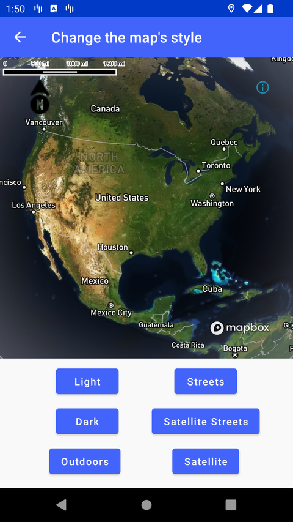

# 切换地图样式（Change the map’s style）

> 官方示例：[change-the-maps-style](https://docs.mapbox.com/android/maps/examples/android-view/change-the-maps-style/)

## 示例效果



## 功能说明

在同一 `MapView` 上切换自定义样式与 Mapbox 默认样式。

<details>
<summary>英文原文</summary>

This example demonstrates how to change the map style at runtime using the Mapbox Maps SDK for Android. This example uses classic Mapbox styles (for example: MAPBOX_STREETS,SATELLITE, OUTDOORS, etc). These styles are no longer maintained and may not include the latest features or updates. Developers are encouraged to use the Mapbox Standard or Mapbox Standard Satellite styles](https://docs.mapbox.com/map-styles/standard/guides#mapbox-standard-satellite) or to build a custom style using Mapbox Studio. The code below renders UI buttons which change the style using the loadStyle() method. The available styles are MAPBOX_STREETS, LIGHT, DARK, STANDARD_SATELLITE, SATELLITE, OUTDOORS, STANDARD, and custom.

</details>

## 示例 Activity

- `StyleSwitchActivity.kt`

## 示例代码

```kotlin
package com.mapbox.maps.testapp.examples

import android.os.Bundle
import android.webkit.URLUtil
import android.widget.EditText
import android.widget.Toast
import androidx.appcompat.app.AlertDialog
import androidx.appcompat.app.AppCompatActivity
import com.mapbox.geojson.Point
import com.mapbox.maps.CameraOptions
import com.mapbox.maps.MapboxMap
import com.mapbox.maps.Style
import com.mapbox.maps.testapp.databinding.ActivityStyleSwitchBinding

/**
 * Example of changing style for a map in runtime.
 */
class StyleSwitchActivity : AppCompatActivity() {

  private lateinit var mapboxMap: MapboxMap
  private lateinit var binding: ActivityStyleSwitchBinding

  override fun onCreate(savedInstanceState: Bundle?) {
    super.onCreate(savedInstanceState)
    binding = ActivityStyleSwitchBinding.inflate(layoutInflater)
    setContentView(binding.root)

    mapboxMap = binding.mapView.mapboxMap
    mapboxMap.setCamera(
      CameraOptions.Builder()
        .center(Point.fromLngLat(-0.1213, 51.5015))
        .zoom(15.0)
        .bearing(57.0)
        .pitch(60.0)
        .build()
    )

    // Instead of this you can add your default style to the map layout with xml attribute `app:mapbox_styleUri="mapbox://styles/streets-v12"`
    mapboxMap.loadStyle(Style.STANDARD)

    binding.streetsButton.setOnClickListener {
      mapboxMap.loadStyle(Style.MAPBOX_STREETS)
    }
    binding.lightButton.setOnClickListener {
      mapboxMap.loadStyle(Style.LIGHT)
    }
    binding.darkButton.setOnClickListener {
      mapboxMap.loadStyle(Style.DARK)
    }
    binding.customStyleButton.setOnClickListener {
      showStyleInputDialog()
    }
    binding.satelliteButton.setOnClickListener {
      mapboxMap.loadStyle(Style.SATELLITE)
    }
    binding.outdoorsButton.setOnClickListener {
      mapboxMap.loadStyle(Style.OUTDOORS)
    }
    binding.standardButton.setOnClickListener {
      mapboxMap.loadStyle(Style.STANDARD)
    }
    binding.standardSatelliteButton.setOnClickListener {
      mapboxMap.loadStyle(Style.STANDARD_SATELLITE)
    }
  }

  private fun showStyleInputDialog() {
    val editText = EditText(this)
    val dialog = AlertDialog.Builder(this)
      .setTitle("Mapbox Style URL")
      .setMessage("Paste the “Share URL” for your public Mapbox style")
      .setView(editText)
      .setPositiveButton("Save") { _, _ ->
        val input = editText.text.toString()
        saveStyleURLInput(input)
      }
      .setNegativeButton("Cancel", null)
      .create()
    dialog.show()
  }

  private fun saveStyleURLInput(input: String) {
    if (input.isValidUri()) {
      mapboxMap.loadStyle(input)
    } else {
      Toast.makeText(this, "Invalid URL. Please check your Mapbox Studio Style URL.", Toast.LENGTH_SHORT).show()
    }
  }

  private fun String.isValidUri(): Boolean {
    val isMapboxStyleUri = startsWith("mapbox://", ignoreCase = true)
    val isMapboxAssetUri = startsWith("asset://", ignoreCase = true)
    val isMapboxFileUri = startsWith("file://", ignoreCase = true)
    return isMapboxStyleUri || isMapboxAssetUri || isMapboxFileUri || URLUtil.isValidUrl(this)
  }
}
```

## 在 Aura 项目中使用

- UI 框架：**Android View**（与 Aura 当前 `MapFragment` + `MapView` 一致）
- 包名请替换为 `com.catclaw.aura`
- 需在 `local.properties` 配置 `MAPBOX_ACCESS_TOKEN`
- 部分示例依赖 `assets/` 或额外布局文件，请参考 GitHub 示例工程

## 参考链接

- [官方文档（英文）](https://docs.mapbox.com/android/maps/examples/android-view/change-the-maps-style/)
- [GitHub 源码](https://github.com/mapbox/mapbox-maps-android/blob/v11.24.3/app/src/main/java/com/mapbox/maps/testapp/examples/StyleSwitchActivity.kt)
- [Android View 示例索引](./README.md)
- [Mapbox 中文指南](../../README.md)
