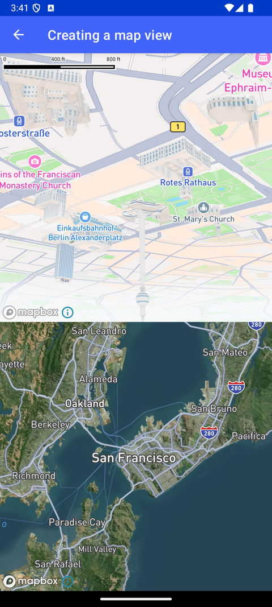

# 创建 MapView（Creating a map view）

> 官方示例：[creating-a-map-view](https://docs.mapbox.com/android/maps/examples/android-view/creating-a-map-view/)

## 示例效果



## 功能说明

演示如何通过 XML 或代码自定义 `MapView` 的创建与配置。

<details>
<summary>英文原文</summary>

This example demonstrates customizing a MapView both programmatically and from XML using the Mapbox Maps SDK for Android. The code below showcases how to adjust MapOptions to customize the MapView, such as setting a camera position, adjusting the font, adding a logo and attribution and changing the style to the Mapbox Standard style.

</details>

## 示例 Activity

- `MapViewCustomizationActivity.kt`

## 示例代码

```kotlin
package com.mapbox.maps.testapp.examples

import android.os.Bundle
import android.widget.LinearLayout
import androidx.appcompat.app.AppCompatActivity
import com.mapbox.common.MapboxOptions
import com.mapbox.common.TileStore
import com.mapbox.geojson.Point
import com.mapbox.maps.CameraOptions
import com.mapbox.maps.ConstrainMode
import com.mapbox.maps.GlyphsRasterizationMode
import com.mapbox.maps.GlyphsRasterizationOptions
import com.mapbox.maps.MapInitOptions
import com.mapbox.maps.MapOptions
import com.mapbox.maps.MapView
import com.mapbox.maps.Style
import com.mapbox.maps.TileStoreUsageMode
import com.mapbox.maps.applyDefaultParams
import com.mapbox.maps.mapsOptions
import com.mapbox.maps.plugin.Plugin
import com.mapbox.maps.plugin.Plugin.Companion.MAPBOX_ATTRIBUTION_PLUGIN_ID
import com.mapbox.maps.plugin.Plugin.Companion.MAPBOX_LOGO_PLUGIN_ID
import com.mapbox.maps.testapp.databinding.ActivityMapViewCustomizationBinding

/**
 * Example of customizing your [MapView].
 * This example will show how to create [MapView] both programmatically and from xml
 * and apply various options.
 */
class MapViewCustomizationActivity : AppCompatActivity() {

  private lateinit var customMapView: MapView
  // Users should keep a reference to the customised tileStore instance (if there's any)
  private val tileStore by lazy { TileStore.create() }
  private lateinit var binding: ActivityMapViewCustomizationBinding

  override fun onCreate(savedInstanceState: Bundle?) {
    super.onCreate(savedInstanceState)

    val initialTileStore = MapboxOptions.mapsOptions.tileStore
    val initialTileStoreUsageMode = MapboxOptions.mapsOptions.tileStoreUsageMode
    // Set tile store and tile store usage mode so that all MapViews created from now on will apply
    // these settings.
    MapboxOptions.mapsOptions.tileStore = tileStore
    MapboxOptions.mapsOptions.tileStoreUsageMode = TileStoreUsageMode.READ_ONLY

    binding = ActivityMapViewCustomizationBinding.inflate(layoutInflater)

    setContentView(binding.root)

    // all options provided in xml file - so we just load style
    // But you can also add your style to the map layout with xml attribute `app:mapbox_styleUri="mapbox://styles/mapbox/standard"`
    binding.mapView.mapboxMap.loadStyle(Style.STANDARD)
    configureMapViewFromCode()

    // Reset to original state
    MapboxOptions.mapsOptions.tileStore = initialTileStore
    MapboxOptions.mapsOptions.tileStoreUsageMode = initialTileStoreUsageMode
  }

  private fun configureMapViewFromCode() {
    // set map options
    val mapOptions = MapOptions.Builder().applyDefaultParams(this)
      .constrainMode(ConstrainMode.HEIGHT_ONLY)
      .glyphsRasterizationOptions(
        GlyphsRasterizationOptions.Builder()
          .rasterizationMode(GlyphsRasterizationMode.IDEOGRAPHS_RASTERIZED_LOCALLY)
          // Font family is required when the GlyphsRasterizationMode is set to IDEOGRAPHS_RASTERIZED_LOCALLY or ALL_GLYPHS_RASTERIZED_LOCALLY
          .fontFamily("sans-serif")
          .build()
      )
      .build()

    // plugins configuration
    val plugins = listOf(
      Plugin.Mapbox(MAPBOX_LOGO_PLUGIN_ID),
      Plugin.Mapbox(MAPBOX_ATTRIBUTION_PLUGIN_ID)
    )

    // Set tile store and tile store usage mode so that all MapViews created from now on will apply
    // these settings.
    MapboxOptions.mapsOptions.tileStore = tileStore
    MapboxOptions.mapsOptions.tileStoreUsageMode = TileStoreUsageMode.DISABLED

    // set initial camera position
    val initialCameraOptions = CameraOptions.Builder()
      .center(Point.fromLngLat(-122.4194, 37.7749))
      .zoom(9.0)
      .bearing(120.0)
      .build()

    // set MapInitOptions together with desired style
    val mapInitOptions =
      MapInitOptions(this, mapOptions, plugins, initialCameraOptions, true, Style.STANDARD_SATELLITE)

    // create view programmatically and add to root layout
    customMapView = MapView(this, mapInitOptions)
    val params = LinearLayout.LayoutParams(
      LinearLayout.LayoutParams.MATCH_PARENT,
      0,
      1.0f
    )
    binding.rootLayout.addView(customMapView, params)
  }

  override fun onStart() {
    super.onStart()
    customMapView.onStart()
  }

  override fun onStop() {
    super.onStop()
    customMapView.onStop()
  }

  override fun onLowMemory() {
    super.onLowMemory()
    customMapView.onLowMemory()
  }

  override fun onDestroy() {
    super.onDestroy()
    customMapView.onDestroy()
  }
}
```

## 在 Aura 项目中使用

- UI 框架：**Android View**（与 Aura 当前 `MapFragment` + `MapView` 一致）
- 包名请替换为 `com.catclaw.aura`
- 需在 `local.properties` 配置 `MAPBOX_ACCESS_TOKEN`
- 部分示例依赖 `assets/` 或额外布局文件，请参考 GitHub 示例工程

## 参考链接

- [官方文档（英文）](https://docs.mapbox.com/android/maps/examples/android-view/creating-a-map-view/)
- [GitHub 源码](https://github.com/mapbox/mapbox-maps-android/blob/v11.24.3/app/src/main/java/com/mapbox/maps/testapp/examples/MapViewCustomizationActivity.kt)
- [Android View 示例索引](./README.md)
- [Mapbox 中文指南](../../README.md)
