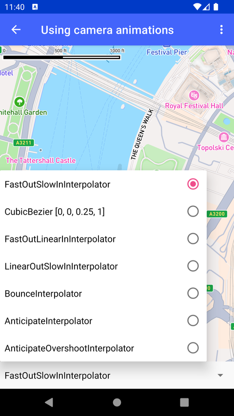

# 相机动画（Using camera animations）

> 官方示例：[using-camera-animations](https://docs.mapbox.com/android/maps/examples/android-view/using-camera-animations/)

## 示例效果



## 功能说明

使用 `setCamera()` 实现相机位置动画。

<details>
<summary>英文原文</summary>

This example demonstrates the usage of predefined animators with the camera animation system in Mapbox Maps SDK for Android. It initializes a MapboxMap instance and adds the CameraAnimationsPlugin, handles animation start, end, and cancel events, and provides functionality to set different interpolation options for camera animations. It includes methods to reset the camera position, stop ongoing animations, prepare animation options with specified durations, and play animations based on different menu items. The activity sets up a spinner that allows the selection of various interpolators such as FastOutSlowInInterpolator, FastOutLinearInInterpolator, LinearOutSlowInInterpolator, BounceInterpolator, and more, and enables different camera actions like jumping to a target, easing to a target, flying to a target, changing pitch, scaling, moving, and rotating the camera. Each update is triggered by the setCamera method, which animates the camera to the specified target position with the selected interpolator and duration.

</details>

## 示例 Activity

- `CameraPredefinedAnimatorsActivity.kt`

## 示例代码

```kotlin
package com.mapbox.maps.testapp.examples.camera

import android.animation.Animator
import android.animation.AnimatorListenerAdapter
import android.os.Bundle
import android.view.Menu
import android.view.MenuItem
import android.view.View
import android.view.animation.AnticipateInterpolator
import android.view.animation.AnticipateOvershootInterpolator
import android.view.animation.BounceInterpolator
import android.widget.AdapterView
import android.widget.ArrayAdapter
import android.widget.Spinner
import androidx.appcompat.app.AppCompatActivity
import androidx.interpolator.view.animation.FastOutLinearInInterpolator
import androidx.interpolator.view.animation.FastOutSlowInInterpolator
import androidx.interpolator.view.animation.LinearOutSlowInInterpolator
import com.mapbox.common.Cancelable
import com.mapbox.geojson.Point
import com.mapbox.maps.MapboxMap
import com.mapbox.maps.ScreenCoordinate
import com.mapbox.maps.Style
import com.mapbox.maps.dsl.cameraOptions
import com.mapbox.maps.extension.style.style
import com.mapbox.maps.plugin.animation.*
import com.mapbox.maps.plugin.animation.CameraAnimatorsFactory.Companion.DEFAULT_ANIMATION_DURATION_MS
import com.mapbox.maps.plugin.animation.MapAnimationOptions.Companion.mapAnimationOptions
import com.mapbox.maps.plugin.animation.animator.CameraAnimator
import com.mapbox.maps.testapp.R
import com.mapbox.maps.testapp.databinding.ActivityCameraPredefinedAnimatorsBinding

/**
 * Example of using predefined animators with camera animation system.
 */
class CameraPredefinedAnimatorsActivity : AppCompatActivity() {

  private lateinit var mapboxMap: MapboxMap
  private lateinit var cameraAnimationsPlugin: CameraAnimationsPlugin

  private var currentAnimators: Array<CameraAnimator<Any>> = arrayOf()
  private var runningCancelableAnimator: Cancelable? = null
  private lateinit var binding: ActivityCameraPredefinedAnimatorsBinding
  private val animatorListener = object : AnimatorListenerAdapter() {
    override fun onAnimationStart(animation: Animator) {
      super.onAnimationStart(animation)
      runOnUiThread {
        binding.buttonCancel.visibility = View.VISIBLE
      }
    }

    override fun onAnimationEnd(animation: Animator) {
      super.onAnimationEnd(animation)
      runOnUiThread {
        binding.buttonCancel.visibility = View.INVISIBLE
      }
    }

    override fun onAnimationCancel(animation: Animator) {
      super.onAnimationCancel(animation)
      runOnUiThread {
        binding.buttonCancel.visibility = View.INVISIBLE
      }
    }
  }

  override fun onCreate(savedInstanceState: Bundle?) {
    super.onCreate(savedInstanceState)
    binding = ActivityCameraPredefinedAnimatorsBinding.inflate(layoutInflater)
    setContentView(binding.root)
    mapboxMap = binding.mapView.mapboxMap
    cameraAnimationsPlugin = binding.mapView.camera
    mapboxMap.loadStyle(
      style(Style.STANDARD) {
        mapboxMap.setCamera(START_CAMERA_POSITION)
      }
    )
    binding.buttonCancel.setOnClickListener {
      runningCancelableAnimator?.cancel()
    }
    initSpinner()
  }

  private fun initSpinner() {
    val spinner: Spinner = findViewById(R.id.spinnerView)
    val adapter = ArrayAdapter.createFromResource(
      this, R.array.interpolators_array, R.layout.item_spinner_view
    )
    adapter.setDropDownViewResource(android.R.layout.simple_spinner_dropdown_item)
    spinner.adapter = adapter
    spinner.onItemSelectedListener = object : AdapterView.OnItemSelectedListener {
      override fun onNothingSelected(parent: AdapterView<*>?) {}

      override fun onItemSelected(parent: AdapterView<*>?, view: View?, position: Int, id: Long) {
        stopAnimation()
        mapboxMap.setCamera(START_CAMERA_POSITION)
        when (position) {
          0 -> {
            CameraAnimatorsFactory.setDefaultAnimatorOptions {
              duration = DEFAULT_ANIMATION_DURATION_MS
              interpolator = FastOutSlowInInterpolator()
            }
          }
          1 -> {
            CameraAnimatorsFactory.setDefaultAnimatorOptions {
              duration = DEFAULT_ANIMATION_DURATION_MS
              interpolator = CameraAnimatorsFactory.CUBIC_BEZIER_INTERPOLATOR
            }
          }
          2 -> {
            CameraAnimatorsFactory.setDefaultAnimatorOptions {
              duration = DEFAULT_ANIMATION_DURATION_MS
              interpolator = FastOutLinearInInterpolator()
            }
          }
          3 -> {
            CameraAnimatorsFactory.setDefaultAnimatorOptions {
              duration = DEFAULT_ANIMATION_DURATION_MS
              interpolator = LinearOutSlowInInterpolator()
            }
          }
          4 -> {
            CameraAnimatorsFactory.setDefaultAnimatorOptions {
              duration = DEFAULT_ANIMATION_DURATION_MS
              interpolator = BounceInterpolator()
            }
          }
          5 -> {
            CameraAnimatorsFactory.setDefaultAnimatorOptions {
              duration = DEFAULT_ANIMATION_DURATION_MS
              interpolator = AnticipateInterpolator()
            }
          }
          6 -> {
            CameraAnimatorsFactory.setDefaultAnimatorOptions {
              duration = DEFAULT_ANIMATION_DURATION_MS
              interpolator = AnticipateOvershootInterpolator()
            }
          }
        }
      }
    }
  }

  override fun onCreateOptionsMenu(menu: Menu): Boolean {
    menuInflater.inflate(R.menu.menu_predefined_animators, menu)
    return true
  }

  override fun onOptionsItemSelected(item: MenuItem): Boolean {
    if (item.itemId != android.R.id.home) {
      resetCameraPosition()
      playAnimation(item.itemId)
    }
    return super.onOptionsItemSelected(item)
  }

  private fun resetCameraPosition() {
    mapboxMap.setCamera(START_CAMERA_POSITION)
  }

  private fun stopAnimation() {
    cameraAnimationsPlugin.cancelAllAnimators()
    cameraAnimationsPlugin.unregisterAnimators(*currentAnimators)
  }

  private fun prepareAnimationOptions(duration: Long) = mapAnimationOptions {
    duration(duration)
  }

  private fun playAnimation(itemId: Int) {
    stopAnimation()
    runningCancelableAnimator = when (itemId) {
      R.id.menu_action_jump_to -> {
        mapboxMap.setCamera(START_CAMERA_POSITION)
        null
      }
      R.id.menu_action_ease_to ->
        mapboxMap.easeTo(
          EASE_TO_TARGET_CAMERA_POSITION,
          prepareAnimationOptions(2000),
          animatorListener
        )
      R.id.menu_action_fly_to ->
        mapboxMap.flyTo(
          EASE_TO_TARGET_CAMERA_POSITION,
          prepareAnimationOptions(2000),
          animatorListener
        )
      R.id.menu_action_pitch_by ->
        mapboxMap.pitchBy(
          70.0,
          prepareAnimationOptions(2000),
          animatorListener
        )
      R.id.menu_action_scale_by ->
        mapboxMap.scaleBy(
          15.0,
          ScreenCoordinate(10.0, 10.0),
          prepareAnimationOptions(2000),
          animatorListener
        )
      R.id.menu_action_move_by ->
        mapboxMap.moveBy(
          ScreenCoordinate(500.0, 500.0),
          prepareAnimationOptions(3000),
          animatorListener
        )
      R.id.menu_action_rotate_by ->
        mapboxMap.rotateBy(
          ScreenCoordinate(0.0, 0.0),
          ScreenCoordinate(500.0, 500.0),
          prepareAnimationOptions(7000),
          animatorListener
        )
      else -> null
    }
  }

  companion object {

    private val START_CAMERA_POSITION = cameraOptions {
      center(Point.fromLngLat(-0.11968, 51.50325)) // Sets the new camera position
      zoom(15.0) // Sets the zoom
      bearing(0.0) // Rotate the camera
      pitch(0.0) // Set the camera pitch
    }

    private val EASE_TO_TARGET_CAMERA_POSITION = cameraOptions {
      center(Point.fromLngLat(-0.07520, 51.50550))
      zoom(17.0)
      bearing(180.0)
      pitch(30.0)
    }
  }
}
```

## 在 Aura 项目中使用

- UI 框架：**Android View**（与 Aura 当前 `MapFragment` + `MapView` 一致）
- 包名请替换为 `com.catclaw.aura`
- 需在 `local.properties` 配置 `MAPBOX_ACCESS_TOKEN`
- 部分示例依赖 `assets/` 或额外布局文件，请参考 GitHub 示例工程

## 参考链接

- [官方文档（英文）](https://docs.mapbox.com/android/maps/examples/android-view/using-camera-animations/)
- [GitHub 源码](https://github.com/mapbox/mapbox-maps-android/blob/v11.24.3/app/src/main/java/com/mapbox/maps/testapp/examples/camera/CameraPredefinedAnimatorsActivity.kt)
- [Android View 示例索引](./README.md)
- [Mapbox 中文指南](../../README.md)
