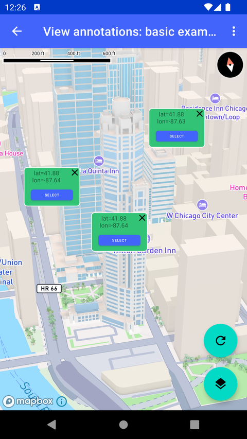

# View Annotation 基础示例（View annotations - basic example）

> 官方示例：[view-annotations-basic-example](https://docs.mapbox.com/android/maps/examples/android-view/view-annotations-basic-example/)

## 示例效果



## 功能说明

在地图点击位置添加 View Annotation。

<details>
<summary>英文原文</summary>

This example demonstrates how to add view annotations by clicking on the map using the Mapbox Maps SDK for Android. It implements the OnMapClickListener interface to handle map clicks, and uses the ViewAnnotationManager to manage view annotations. When a map click event occurs, a view annotation is added to the map, displaying a ItemCalloutViewBinding with options such as allowing overlap, ignoring camera padding, and permitting overlap with the "puck" (location indicator). The activity includes functionality to change the map style, reframe the map camera based on added view annotations, update view annotation selection, and remove view annotations. Additionally, options are provided in the menu to set the view annotation update mode as either MAP_FIXED_DELAY or MAP_SYNCHRONIZED. The app provides users with visual feedback through Toast messages, prompting them to interact with the map or add view annotations for camera reframing. There are several ways to add markers, annotations, and other shapes to the map using the Maps SDK. To choose the appropriate approach for your application, read the Markers and annotations guide.

</details>

## 示例 Activity

- `ViewAnnotationBasicAddActivity.kt`

## 示例代码

```kotlin
package com.mapbox.maps.testapp.examples.markersandcallouts.viewannotation

import android.annotation.SuppressLint
import android.os.Bundle
import android.view.Menu
import android.view.MenuItem
import android.view.View
import android.view.ViewGroup
import android.widget.Button
import android.widget.Toast
import androidx.appcompat.app.AppCompatActivity
import com.mapbox.geojson.Point
import com.mapbox.maps.MapboxMap
import com.mapbox.maps.Style
import com.mapbox.maps.plugin.animation.flyTo
import com.mapbox.maps.plugin.gestures.OnMapClickListener
import com.mapbox.maps.plugin.gestures.addOnMapClickListener
import com.mapbox.maps.testapp.R
import com.mapbox.maps.testapp.databinding.ActivityViewAnnotationShowcaseBinding
import com.mapbox.maps.testapp.databinding.ItemCalloutViewBinding
import com.mapbox.maps.viewannotation.ViewAnnotationManager
import com.mapbox.maps.viewannotation.ViewAnnotationUpdateMode
import com.mapbox.maps.viewannotation.geometry
import com.mapbox.maps.viewannotation.viewAnnotationOptions

/**
 * Example how to add view annotations by clicking on the map.
 */
class ViewAnnotationBasicAddActivity : AppCompatActivity(), OnMapClickListener {

  private lateinit var mapboxMap: MapboxMap
  private lateinit var viewAnnotationManager: ViewAnnotationManager
  private val viewAnnotationViews = mutableListOf<View>()

  // Increase-on-access priority assigned to the most recent selected annotation,
  // keeping it on top of other selected annotation.
  private var topPriority: Long = 0
    get() = ++field

  override fun onCreate(savedInstanceState: Bundle?) {
    super.onCreate(savedInstanceState)
    val binding = ActivityViewAnnotationShowcaseBinding.inflate(layoutInflater)
    setContentView(binding.root)

    viewAnnotationManager = binding.mapView.viewAnnotationManager

    mapboxMap = binding.mapView.mapboxMap.apply {
      loadStyle(Style.STANDARD) {
        addOnMapClickListener(this@ViewAnnotationBasicAddActivity)
        binding.fabStyleToggle.setOnClickListener {
          when (style?.styleURI) {
            Style.STANDARD -> loadStyle(Style.STANDARD_SATELLITE)
            Style.STANDARD_SATELLITE -> loadStyle(Style.STANDARD)
          }
        }
        Toast.makeText(this@ViewAnnotationBasicAddActivity, STARTUP_TEXT, Toast.LENGTH_LONG).show()
      }
    }

    binding.fabReframe.setOnClickListener {
      if (viewAnnotationViews.isNotEmpty()) {
        viewAnnotationManager.cameraForAnnotations(viewAnnotationViews) {
          mapboxMap.flyTo(it)
        }
      } else {
        Toast.makeText(this@ViewAnnotationBasicAddActivity, ADD_VIEW_ANNOTATION_TEXT, Toast.LENGTH_LONG).show()
      }
    }
  }

  override fun onCreateOptionsMenu(menu: Menu): Boolean {
    menuInflater.inflate(R.menu.menu_view_annotation, menu)
    return true
  }

  override fun onOptionsItemSelected(item: MenuItem): Boolean {
    return when (item.itemId) {
      R.id.action_view_annotation_fixed_delay -> {
        viewAnnotationManager.setViewAnnotationUpdateMode(ViewAnnotationUpdateMode.MAP_FIXED_DELAY)
        true
      }
      R.id.action_view_annotation_map_synchronized -> {
        viewAnnotationManager.setViewAnnotationUpdateMode(ViewAnnotationUpdateMode.MAP_SYNCHRONIZED)
        true
      }
      else -> super.onOptionsItemSelected(item)
    }
  }

  override fun onMapClick(point: Point): Boolean {
    addViewAnnotation(point)
    return true
  }

  @SuppressLint("SetTextI18n")
  private fun addViewAnnotation(point: Point) {
    val viewAnnotation = viewAnnotationManager.addViewAnnotation(
      resId = R.layout.item_callout_view,
      options = viewAnnotationOptions {
        geometry(point)
        allowOverlap(true)
        ignoreCameraPadding(true)
        allowOverlapWithPuck(true)
      }
    )
    viewAnnotationViews.add(viewAnnotation)
    ItemCalloutViewBinding.bind(viewAnnotation).apply {
      textNativeView.text = "lat=%.2f\nlon=%.2f".format(point.latitude(), point.longitude())
      closeNativeView.setOnClickListener {
        viewAnnotationManager.removeViewAnnotation(viewAnnotation)
        viewAnnotationViews.remove(viewAnnotation)
      }
      selectButton.setOnClickListener { b ->
        val button = b as Button
        val isSelected = button.text.toString().equals("SELECT", true)
        val pxDelta = if (isSelected) SELECTED_ADD_COEF_PX else -SELECTED_ADD_COEF_PX
        button.text = if (isSelected) "DESELECT" else "SELECT"
        viewAnnotationManager.updateViewAnnotation(
          viewAnnotation,
          viewAnnotationOptions {
            allowOverlap(true)
            priority(if (isSelected) topPriority else 0)
          }
        )
        (button.layoutParams as ViewGroup.MarginLayoutParams).apply {
          bottomMargin += pxDelta
          rightMargin += pxDelta
          leftMargin += pxDelta
        }
        button.requestLayout()
      }
    }
  }

  private companion object {
    const val SELECTED_ADD_COEF_PX = 25
    const val STARTUP_TEXT = "Click on a map to add a view annotation."
    const val ADD_VIEW_ANNOTATION_TEXT = "Add view annotations to re-frame map camera"
  }
}
```

## 在 Aura 项目中使用

- UI 框架：**Android View**（与 Aura 当前 `MapFragment` + `MapView` 一致）
- 包名请替换为 `com.catclaw.aura`
- 需在 `local.properties` 配置 `MAPBOX_ACCESS_TOKEN`
- 部分示例依赖 `assets/` 或额外布局文件，请参考 GitHub 示例工程

## 参考链接

- [官方文档（英文）](https://docs.mapbox.com/android/maps/examples/android-view/view-annotations-basic-example/)
- [GitHub 源码](https://github.com/mapbox/mapbox-maps-android/blob/v11.24.3/app/src/main/java/com/mapbox/maps/testapp/examples/markersandcallouts/viewannotation/ViewAnnotationBasicAddActivity.kt)
- [Android View 示例索引](./README.md)
- [Mapbox 中文指南](../../README.md)
