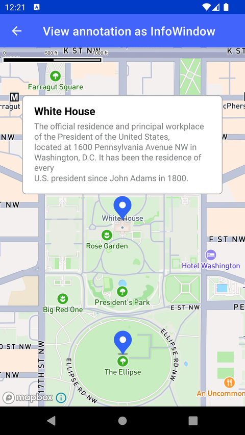

# View Annotation 作为 InfoWindow（View annotation as InfoWindow）

> 官方示例：[view-annotation-as-infowindow](https://docs.mapbox.com/android/maps/examples/android-view/view-annotation-as-infowindow/)

## 示例效果



## 功能说明

使用 View Annotation 实现传统 InfoWindow 效果。

<details>
<summary>英文原文</summary>

This example demonstrates View Annotation API and point annotations to display markers on the map in the Mapbox Maps SDK for Android. By utilizing the MarkerManager and Marker classes  (custom classes available in the Maps SDK examples app), the activity adds markers with titles, snippets, icons, and positions on the map. Additionally, it demonstrates how to handle custom markers, remove markers on long clicks, and provide detailed information within an information window associated with a specific marker. The example replicates the functionality of the Maps SDK v9 InfoWindow API, offering a way to interact with markers and callouts on the map interface. There are several ways to add markers, annotations, and other shapes to the map using the Maps SDK. To choose the appropriate approach for your application, read the Markers and annotations guide.

</details>

## 示例 Activity

- `InfoWindowActivity.kt`

## 示例代码

```kotlin
package com.mapbox.maps.testapp.examples.markersandcallouts.infowindow

import android.view.View
import com.mapbox.geojson.Point
import com.mapbox.maps.MapView
import com.mapbox.maps.ScreenCoordinate
import com.mapbox.maps.plugin.annotation.AnnotationConfig
import com.mapbox.maps.plugin.annotation.annotations
import com.mapbox.maps.plugin.annotation.generated.OnPointAnnotationClickListener
import com.mapbox.maps.plugin.annotation.generated.PointAnnotation
import com.mapbox.maps.plugin.annotation.generated.PointAnnotationManager
import com.mapbox.maps.plugin.annotation.generated.createPointAnnotationManager
import com.mapbox.maps.plugin.gestures.OnMapClickListener
import com.mapbox.maps.plugin.gestures.addOnMapClickListener
import com.mapbox.maps.plugin.gestures.removeOnMapClickListener
import com.mapbox.maps.viewannotation.OnViewAnnotationUpdatedListener
import com.mapbox.maps.viewannotation.viewAnnotationOptions
import java.util.concurrent.CopyOnWriteArrayList
import kotlin.math.abs

/**
 * Manager class helping to control the [Marker]s.
 */
class MarkerManager(
  private val mapView: MapView
) : OnPointAnnotationClickListener, OnMapClickListener {

  private val pointAnnotationManager: PointAnnotationManager =
    mapView.annotations.createPointAnnotationManager(
      AnnotationConfig(
        layerId = LAYER_ID
      )
    )

  // using copy on write just in case as potentially remove may be called while we're iterating in on click listener
  private val markerList = CopyOnWriteArrayList<Marker>()

  init {
    pointAnnotationManager.addClickListener(this)
    // by adding regular map click listener we implement deselecting all info windows on map click
    // in legacy code it was controlled by flag in API
    mapView.mapboxMap.addOnMapClickListener(this)
  }

  override fun onAnnotationClick(annotation: PointAnnotation): Boolean {
    markerList.forEach { marker ->
      if (marker.pointAnnotation == annotation) {
        selectMarker(marker, deselectIfSelected = true)
      }
    }
    return true
  }

  override fun onMapClick(point: Point): Boolean {
    markerList.forEach(::deselectMarker)
    return true
  }

  fun addMarker(marker: Marker): Marker {
    marker.prepareAnnotationMarker(pointAnnotationManager, LAYER_ID)
    marker.prepareViewAnnotation(mapView)
    markerList.add(marker)
    // do not show info window by default
    deselectMarker(marker)
    return marker
  }

  fun removeMarker(marker: Marker) {
    if (!marker.prepared) {
      return
    }
    markerList.remove(marker)
    mapView.viewAnnotationManager.removeViewAnnotation(marker.viewAnnotation)
    pointAnnotationManager.delete(marker.pointAnnotation)
  }

  fun selectMarker(marker: Marker, deselectIfSelected: Boolean = false) {
    if (marker.isSelected()) {
      if (deselectIfSelected) {
        deselectMarker(marker)
      }
      return
    }
    // Need to deselect any currently selected annotation first
    markerList.forEach(::deselectMarker)
    adjustViewAnnotationXOffset(marker)
    mapView.viewAnnotationManager.updateViewAnnotation(
      marker.viewAnnotation,
      viewAnnotationOptions {
        selected(true)
      }
    )
    marker.viewAnnotation.visibility = View.VISIBLE
  }

  private fun deselectMarker(marker: Marker) {
    mapView.viewAnnotationManager.updateViewAnnotation(
      marker.viewAnnotation,
      viewAnnotationOptions {
        selected(false)
        marker.anchor?.let {
          variableAnchors(
            listOf(it.toBuilder().offsetX(0.0).build())
          )
        }
      }
    )
    marker.viewAnnotation.visibility = View.INVISIBLE
  }

  fun destroy() {
    markerList.forEach(::removeMarker)
    pointAnnotationManager.removeClickListener(this)
    mapView.mapboxMap.removeOnMapClickListener(this)
  }

  // adjust offsetX to fit on the screen if the info window is shown near screen edge
  private fun adjustViewAnnotationXOffset(marker: Marker) {
    mapView.viewAnnotationManager.addOnViewAnnotationUpdatedListener(
      object : OnViewAnnotationUpdatedListener {
        override fun onViewAnnotationPositionUpdated(
          view: View,
          leftTopCoordinate: ScreenCoordinate,
          width: Double,
          height: Double,
        ) {
          if (view == marker.viewAnnotation) {
            updateOffsetX(marker, leftTopCoordinate, width)
            mapView.viewAnnotationManager.removeOnViewAnnotationUpdatedListener(this)
          }
        }
      })
  }

  private fun updateOffsetX(marker: Marker, leftTop: ScreenCoordinate, width: Double) {
    val resultOffsetX = if (leftTop.x < 0) {
      abs(leftTop.x) + ADDITIONAL_EDGE_PADDING_PX
    } else if (leftTop.x + width > mapView.mapboxMap.getSize().width) {
      mapView.mapboxMap.getSize().width - leftTop.x - width - ADDITIONAL_EDGE_PADDING_PX
    } else {
      0.0
    }
    val anchor = marker.anchor?.toBuilder()
      ?.offsetX(resultOffsetX)
      ?.build()

    mapView.viewAnnotationManager.updateViewAnnotation(
      marker.viewAnnotation,
      viewAnnotationOptions {
        if (anchor != null) {
          variableAnchors(listOf(anchor))
        }
      }
    )
  }

  private fun Marker.isSelected() =
    mapView.viewAnnotationManager.getViewAnnotationOptions(viewAnnotation)?.selected == true

  private companion object {
    // additional padding when offsetting view near the screen edge
    const val ADDITIONAL_EDGE_PADDING_PX = 20.0
    const val LAYER_ID = "annotation-layer"
  }
}
```

## 在 Aura 项目中使用

- UI 框架：**Android View**（与 Aura 当前 `MapFragment` + `MapView` 一致）
- 包名请替换为 `com.catclaw.aura`
- 需在 `local.properties` 配置 `MAPBOX_ACCESS_TOKEN`
- 部分示例依赖 `assets/` 或额外布局文件，请参考 GitHub 示例工程

## 参考链接

- [官方文档（英文）](https://docs.mapbox.com/android/maps/examples/android-view/view-annotation-as-infowindow/)
- [GitHub 源码](https://github.com/mapbox/mapbox-maps-android/blob/main/app/src/main/java/com/mapbox/maps/testapp/examples/markersandcallouts/infowindow/MarkerManager.kt)
- [Android View 示例索引](./README.md)
- [Mapbox 中文指南](../../README.md)
