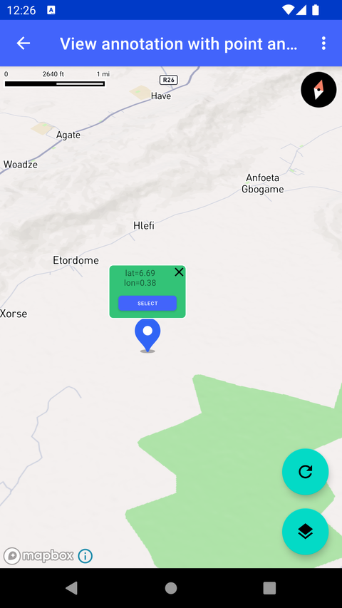

# View Annotation 与点标注（View annotation with point annotation）

> 官方示例：[view-annotation-with-point-annotation](https://docs.mapbox.com/android/maps/examples/android-view/view-annotation-with-point-annotation/)

## 示例效果



## 功能说明

在 Point Annotation 上附加 View Annotation（类似带弹窗的 marker）。

<details>
<summary>英文原文</summary>

This example demonstrates how to add a view annotation to a point annotation on a map using the Maps SDK for Android. The functionality creates a map marker with popup-style content containing additional information.  It utilizes various classes and interfaces from the Mapbox Maps SDK for Android, such as MapView, Point, loadStyle, and ViewAnnotationManager, among others. The activity includes methods to set up and configure the view annotation, handle marker interactions, update the camera position, and manage the visibility and position of the annotations. Users can interact with the marker by dragging and clicking on it to show or hide the associated view annotation view. Additionally, options are provided to reset the camera, toggle the visibility mode of the view annotation, and update the view annotation whenever the marker is dragged. There are several ways to add markers, annotations, and other shapes to the map using the Maps SDK. To choose the appropriate approach for your application, read the Markers and annotations guide.

</details>

## 示例 Activity

- `ViewAnnotationWithPointAnnotationActivity.kt`

## 示例代码

```kotlin
package com.mapbox.maps.testapp.examples.markersandcallouts.viewannotation

import android.annotation.SuppressLint
import android.graphics.Bitmap
import android.os.Bundle
import android.view.Menu
import android.view.MenuItem
import android.view.View
import android.view.ViewGroup
import android.widget.Button
import androidx.appcompat.app.AppCompatActivity
import androidx.core.view.isVisible
import com.mapbox.geojson.Point
import com.mapbox.maps.CameraOptions
import com.mapbox.maps.MapView
import com.mapbox.maps.Style
import com.mapbox.maps.ViewAnnotationAnchor
import com.mapbox.maps.extension.style.layers.properties.generated.IconAnchor
import com.mapbox.maps.plugin.annotation.Annotation
import com.mapbox.maps.plugin.annotation.AnnotationConfig
import com.mapbox.maps.plugin.annotation.annotations
import com.mapbox.maps.plugin.annotation.generated.OnPointAnnotationDragListener
import com.mapbox.maps.plugin.annotation.generated.PointAnnotation
import com.mapbox.maps.plugin.annotation.generated.PointAnnotationManager
import com.mapbox.maps.plugin.annotation.generated.PointAnnotationOptions
import com.mapbox.maps.plugin.annotation.generated.createPointAnnotationManager
import com.mapbox.maps.testapp.R
import com.mapbox.maps.testapp.databinding.ActivityViewAnnotationShowcaseBinding
import com.mapbox.maps.testapp.databinding.ItemCalloutViewBinding
import com.mapbox.maps.testapp.utils.BitmapUtils.bitmapFromDrawableRes
import com.mapbox.maps.viewannotation.ViewAnnotationManager
import com.mapbox.maps.viewannotation.ViewAnnotationUpdateMode
import com.mapbox.maps.viewannotation.annotationAnchor
import com.mapbox.maps.viewannotation.geometry
import com.mapbox.maps.viewannotation.viewAnnotationOptions

/**
 * Example how to add view annotation to the point annotation.
 */
class ViewAnnotationWithPointAnnotationActivity : AppCompatActivity() {

  private lateinit var viewAnnotationManager: ViewAnnotationManager
  private lateinit var pointAnnotationManager: PointAnnotationManager
  private lateinit var pointAnnotation: PointAnnotation
  private lateinit var viewAnnotation: View
  private lateinit var binding: ActivityViewAnnotationShowcaseBinding

  @SuppressLint("SetTextI18n")
  override fun onCreate(savedInstanceState: Bundle?) {
    super.onCreate(savedInstanceState)
    binding = ActivityViewAnnotationShowcaseBinding.inflate(layoutInflater)
    setContentView(binding.root)

    viewAnnotationManager = binding.mapView.viewAnnotationManager

    resetCamera()

    binding.mapView.mapboxMap.loadStyle(Style.STANDARD) {
      prepareAnnotationMarker(binding.mapView, bitmapFromDrawableRes(R.drawable.ic_blue_marker))
      prepareViewAnnotation()
      // show / hide view annotation based on a marker click
      pointAnnotationManager.addClickListener { clickedAnnotation ->
        if (pointAnnotation == clickedAnnotation) {
          viewAnnotation.toggleViewVisibility()
        }
        true
      }
      // show / hide view annotation based on marker visibility
      binding.fabStyleToggle.setOnClickListener {
        if (pointAnnotation.iconImageBitmap == null) {
          pointAnnotation.iconImageBitmap = bitmapFromDrawableRes(R.drawable.ic_blue_marker)
          viewAnnotation.isVisible = true
        } else {
          pointAnnotation.iconImageBitmap = null
          viewAnnotation.isVisible = false
        }
        pointAnnotationManager.update(pointAnnotation)
      }

      // reset annotations and camera position
      binding.fabReframe.setOnClickListener {
        resetCamera()
        pointAnnotation.point = POINT
        pointAnnotationManager.update(pointAnnotation)
        syncAnnotationPosition()
      }

      // update view annotation geometry if dragging the marker
      pointAnnotationManager.addDragListener(object : OnPointAnnotationDragListener {
        override fun onAnnotationDragStarted(annotation: Annotation<*>) {
        }

        override fun onAnnotationDrag(annotation: Annotation<*>) {
          if (annotation == pointAnnotation) {
            syncAnnotationPosition()
          }
        }

        override fun onAnnotationDragFinished(annotation: Annotation<*>) {
        }
      })
    }
  }

  private fun resetCamera() {
    binding.mapView.mapboxMap.setCamera(
      CameraOptions.Builder()
        .center(POINT)
        .pitch(45.0)
        .zoom(12.5)
        .bearing(-17.6)
        .build()
    )
  }

  private fun syncAnnotationPosition() {
    viewAnnotationManager.updateViewAnnotation(
      viewAnnotation,
      viewAnnotationOptions {
        geometry(pointAnnotation.geometry)
      }
    )
    ItemCalloutViewBinding.bind(viewAnnotation).apply {
      textNativeView.text = "lat=%.2f\nlon=%.2f".format(
        pointAnnotation.geometry.latitude(),
        pointAnnotation.geometry.longitude()
      )
    }
  }

  override fun onCreateOptionsMenu(menu: Menu): Boolean {
    menuInflater.inflate(R.menu.menu_view_annotation, menu)
    return true
  }

  override fun onOptionsItemSelected(item: MenuItem): Boolean {
    return when (item.itemId) {
      R.id.action_view_annotation_fixed_delay -> {
        viewAnnotationManager.setViewAnnotationUpdateMode(ViewAnnotationUpdateMode.MAP_FIXED_DELAY)
        true
      }

      R.id.action_view_annotation_map_synchronized -> {
        viewAnnotationManager.setViewAnnotationUpdateMode(ViewAnnotationUpdateMode.MAP_SYNCHRONIZED)
        true
      }

      else -> super.onOptionsItemSelected(item)
    }
  }

  private fun View.toggleViewVisibility() {
    visibility = if (visibility == View.VISIBLE) View.GONE else View.VISIBLE
  }

  @SuppressLint("SetTextI18n")
  private fun prepareViewAnnotation() {
    viewAnnotation = viewAnnotationManager.addViewAnnotation(
      resId = R.layout.item_callout_view,
      options = viewAnnotationOptions {
        geometry(pointAnnotation.geometry)
        annotationAnchor {
          anchor(ViewAnnotationAnchor.BOTTOM)
          offsetY((pointAnnotation.iconImageBitmap?.height!!.toDouble()))
        }
      }
    )
    ItemCalloutViewBinding.bind(viewAnnotation).apply {
      textNativeView.text = "lat=%.2f\nlon=%.2f".format(POINT.latitude(), POINT.longitude())
      closeNativeView.setOnClickListener {
        viewAnnotationManager.removeViewAnnotation(viewAnnotation)
      }
      selectButton.setOnClickListener { b ->
        val button = b as Button
        val isSelected = button.text.toString().equals("SELECT", true)
        val pxDelta = if (isSelected) SELECTED_ADD_COEF_PX else -SELECTED_ADD_COEF_PX
        button.text = if (isSelected) "DESELECT" else "SELECT"
        (button.layoutParams as ViewGroup.MarginLayoutParams).apply {
          bottomMargin += pxDelta
          rightMargin += pxDelta
          leftMargin += pxDelta
        }
        button.requestLayout()
      }
    }
  }

  private fun prepareAnnotationMarker(mapView: MapView, iconBitmap: Bitmap) {
    val annotationPlugin = mapView.annotations
    val pointAnnotationOptions: PointAnnotationOptions = PointAnnotationOptions()
      .withPoint(POINT)
      .withIconImage(iconBitmap)
      .withIconAnchor(IconAnchor.BOTTOM)
      .withDraggable(true)
    pointAnnotationManager = annotationPlugin.createPointAnnotationManager(
      AnnotationConfig(
        layerId = LAYER_ID
      )
    )
    pointAnnotation = pointAnnotationManager.create(pointAnnotationOptions)
  }

  private companion object {
    const val SELECTED_ADD_COEF_PX = 25
    val POINT: Point = Point.fromLngLat(0.381457, 6.687337)
    val LAYER_ID = "layer-id"
  }
}
```

## 在 Aura 项目中使用

- UI 框架：**Android View**（与 Aura 当前 `MapFragment` + `MapView` 一致）
- 包名请替换为 `com.catclaw.aura`
- 需在 `local.properties` 配置 `MAPBOX_ACCESS_TOKEN`
- 部分示例依赖 `assets/` 或额外布局文件，请参考 GitHub 示例工程

## 参考链接

- [官方文档（英文）](https://docs.mapbox.com/android/maps/examples/android-view/view-annotation-with-point-annotation/)
- [GitHub 源码](https://github.com/mapbox/mapbox-maps-android/blob/v11.24.3/app/src/main/java/com/mapbox/maps/testapp/examples/markersandcallouts/viewannotation/ViewAnnotationWithPointAnnotationActivity.kt)
- [Android View 示例索引](./README.md)
- [Mapbox 中文指南](../../README.md)
