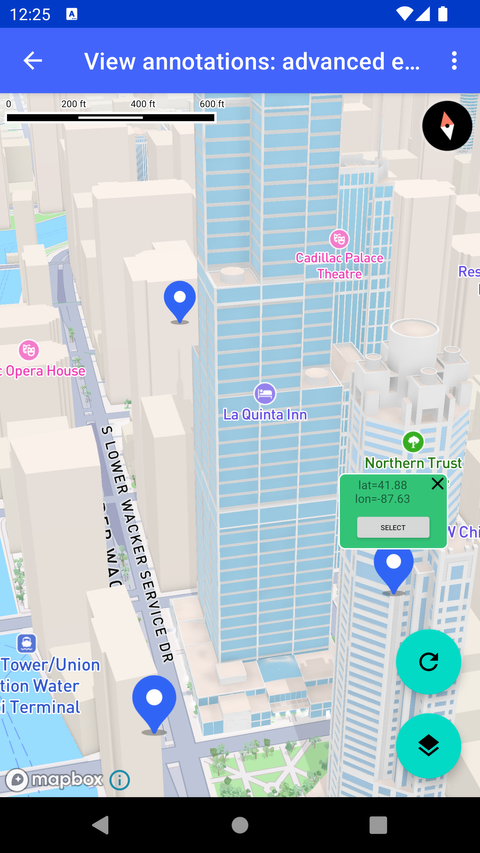

# View Annotation 高级示例（View annotations - advanced example）

> 官方示例：[view-annotations-advanced-example](https://docs.mapbox.com/android/maps/examples/android-view/view-annotations-advanced-example/)

## 示例效果



## 功能说明

将 View Annotation 锚定到 SymbolLayer 要素。

<details>
<summary>英文原文</summary>

This example demonstrates how to add and manage view annotations using the Mapbox Maps SDK for Android. View annotations are interactive UI components that are anchored to specific geographic points on the map. This example integrates annotations with marker icons, providing functionality like MarkerView in earlier versions of the Maps SDK. Users can add markers by long-clicking on the map, which also associates a view annotation to each marker. Clicking on an annotation toggles its visibility, allowing for a dynamic and interactive mapping experience. The activity also supports switching between different map styles, such as standard and satellite views, while preserving marker annotations. Key features of this implementation include asynchronous layout inflation for annotations, customizable annotation update modes, and seamless integration with the map style and GeoJSON source/layer system. The example provides options to configure the behavior of annotations, such as overlap allowance and anchor positioning, and includes user interaction elements like close buttons and selection toggles within the annotations. By leveraging the ViewAnnotationManager and Mapbox APIs, the activity showcases a robust and scalable approach to creating interactive map experiences. There are several ways to add markers, annotations, and other shapes to the map using the Maps SDK. To choose the appropriate approach for your application, read the Markers and annotations guide.

</details>

## 示例 Activity

- `ViewAnnotationShowcaseActivity.kt`

## 示例代码

```kotlin
package com.mapbox.maps.testapp.examples.markersandcallouts.viewannotation

import android.annotation.SuppressLint
import android.graphics.Bitmap
import android.os.Bundle
import android.util.TypedValue
import android.view.Menu
import android.view.MenuItem
import android.view.View
import android.view.ViewGroup
import android.widget.Button
import android.widget.ImageView
import android.widget.TextView
import android.widget.Toast
import androidx.appcompat.app.AppCompatActivity
import androidx.asynclayoutinflater.view.AsyncLayoutInflater
import androidx.core.content.ContextCompat
import androidx.core.graphics.drawable.toBitmap
import com.mapbox.bindgen.Expected
import com.mapbox.geojson.Feature
import com.mapbox.geojson.FeatureCollection
import com.mapbox.geojson.Point
import com.mapbox.maps.*
import com.mapbox.maps.extension.style.image.image
import com.mapbox.maps.extension.style.layers.generated.symbolLayer
import com.mapbox.maps.extension.style.layers.properties.generated.IconAnchor
import com.mapbox.maps.extension.style.sources.generated.GeoJsonSource
import com.mapbox.maps.extension.style.sources.generated.geoJsonSource
import com.mapbox.maps.extension.style.sources.generated.rasterDemSource
import com.mapbox.maps.extension.style.sources.getSourceAs
import com.mapbox.maps.extension.style.style
import com.mapbox.maps.extension.style.terrain.generated.terrain
import com.mapbox.maps.plugin.gestures.*
import com.mapbox.maps.testapp.R
import com.mapbox.maps.testapp.databinding.ActivityViewAnnotationShowcaseBinding
import com.mapbox.maps.viewannotation.ViewAnnotationManager
import com.mapbox.maps.viewannotation.ViewAnnotationUpdateMode
import com.mapbox.maps.viewannotation.annotatedLayerFeature
import com.mapbox.maps.viewannotation.annotationAnchor
import com.mapbox.maps.viewannotation.viewAnnotationOptions
import java.util.concurrent.CopyOnWriteArrayList

/**
 * Example how to add view annotations to the map.
 *
 * Specifically view annotations will be associated with marker icons
 * showcasing how to implement functionality similar to MarkerView from Maps v9.
 */
class ViewAnnotationShowcaseActivity :
  AppCompatActivity(),
  OnMapClickListener,
  OnMapLongClickListener {

  private lateinit var mapboxMap: MapboxMap
  private lateinit var viewAnnotationManager: ViewAnnotationManager
  private val pointList = CopyOnWriteArrayList<Feature>()
  private var markerId = 0

  private var markerWidth = 0
  private var markerHeight = 0

  private val asyncInflater by lazy { AsyncLayoutInflater(this) }

  override fun onCreate(savedInstanceState: Bundle?) {
    super.onCreate(savedInstanceState)
    val binding = ActivityViewAnnotationShowcaseBinding.inflate(layoutInflater)
    setContentView(binding.root)

    viewAnnotationManager = binding.mapView.viewAnnotationManager

    val bitmap = ContextCompat.getDrawable(this, R.drawable.ic_blue_marker)!!.toBitmap()
    markerWidth = bitmap.width
    markerHeight = bitmap.height

    mapboxMap = binding.mapView.mapboxMap.apply {
      loadStyle(
        styleExtension = prepareStyle(Style.STANDARD, bitmap)
      ) {
        addOnMapClickListener(this@ViewAnnotationShowcaseActivity)
        addOnMapLongClickListener(this@ViewAnnotationShowcaseActivity)
        binding.fabStyleToggle.setOnClickListener {
          when (style?.styleURI) {
            Style.STANDARD -> loadStyle(prepareStyle(Style.STANDARD_SATELLITE, bitmap))
            Style.STANDARD_SATELLITE -> loadStyle(prepareStyle(Style.STANDARD, bitmap))
          }
        }
        Toast.makeText(this@ViewAnnotationShowcaseActivity, STARTUP_TEXT, Toast.LENGTH_LONG).show()
      }
    }
  }

  override fun onCreateOptionsMenu(menu: Menu): Boolean {
    menuInflater.inflate(R.menu.menu_view_annotation, menu)
    return true
  }

  override fun onOptionsItemSelected(item: MenuItem): Boolean {
    return when (item.itemId) {
      R.id.action_view_annotation_fixed_delay -> {
        viewAnnotationManager.setViewAnnotationUpdateMode(ViewAnnotationUpdateMode.MAP_FIXED_DELAY)
        true
      }

      R.id.action_view_annotation_map_synchronized -> {
        viewAnnotationManager.setViewAnnotationUpdateMode(ViewAnnotationUpdateMode.MAP_SYNCHRONIZED)
        true
      }

      else -> super.onOptionsItemSelected(item)
    }
  }

  private fun prepareStyle(styleUri: String, bitmap: Bitmap) = style(styleUri) {
    +image(BLUE_ICON_ID, bitmap)
    +geoJsonSource(SOURCE_ID) {
      featureCollection(FeatureCollection.fromFeatures(pointList))
    }
    if (styleUri == Style.STANDARD_SATELLITE) {
      +rasterDemSource(TERRAIN_SOURCE) {
        url(TERRAIN_URL_TILE_RESOURCE)
      }
      +terrain(TERRAIN_SOURCE)
    }
    +symbolLayer(LAYER_ID, SOURCE_ID) {
      iconImage(BLUE_ICON_ID)
      iconAnchor(IconAnchor.BOTTOM)
      iconAllowOverlap(false)
    }
  }

  override fun onMapLongClick(point: Point): Boolean {
    val markerId = addMarkerAndReturnId(point)
    addViewAnnotation(point, markerId)
    return true
  }

  override fun onMapClick(point: Point): Boolean {
    mapboxMap.queryRenderedFeatures(
      RenderedQueryGeometry(mapboxMap.pixelForCoordinate(point)),
      RenderedQueryOptions(listOf(LAYER_ID), null)
    ) {
      onFeatureClicked(it) { feature ->
        feature.id()?.let { featureId ->
          viewAnnotationManager.getViewAnnotation(
            AnnotatedLayerFeature.Builder()
              .layerId(LAYER_ID)
              .featureId(featureId)
              .build()
          )?.toggleViewVisibility()
        }
      }
    }
    return true
  }

  private fun onFeatureClicked(
    expected: Expected<String, List<QueriedRenderedFeature>>,
    onFeatureClicked: (Feature) -> Unit
  ) {
    if (expected.isValue && expected.value?.size!! > 0) {
      expected.value?.get(0)?.queriedFeature?.feature?.let { feature ->
        onFeatureClicked.invoke(feature)
      }
    }
  }

  private fun View.toggleViewVisibility() {
    visibility = if (visibility == View.VISIBLE) View.GONE else View.VISIBLE
  }

  private fun addMarkerAndReturnId(point: Point): String {
    val currentId = "$MARKER_ID_PREFIX${(markerId++)}"
    pointList.add(Feature.fromGeometry(point, null, currentId))
    val featureCollection = FeatureCollection.fromFeatures(pointList)
    mapboxMap.getStyle { style ->
      style.getSourceAs<GeoJsonSource>(SOURCE_ID)?.featureCollection(featureCollection)
    }
    return currentId
  }

  @SuppressLint("SetTextI18n")
  private fun addViewAnnotation(point: Point, featureId: String) {
    viewAnnotationManager.addViewAnnotation(
      resId = R.layout.item_callout_view,
      options = viewAnnotationOptions {
        annotatedLayerFeature(LAYER_ID) {
          featureId(featureId)
        }
        annotationAnchor {
          anchor(ViewAnnotationAnchor.BOTTOM)
        }
        allowOverlap(false)
      },
      asyncInflater = asyncInflater
    ) { viewAnnotation ->
      viewAnnotation.visibility = View.GONE
      // calculate offsetY manually taking into account icon height only because of bottom anchoring
      viewAnnotationManager.updateViewAnnotation(
        viewAnnotation,
        viewAnnotationOptions {
          annotationAnchor {
            anchor(ViewAnnotationAnchor.BOTTOM)
            offsetY(markerHeight.toDouble())
          }
        }
      )
      viewAnnotation.findViewById<TextView>(R.id.textNativeView).text =
        "lat=%.2f\nlon=%.2f".format(point.latitude(), point.longitude())
      viewAnnotation.findViewById<ImageView>(R.id.closeNativeView).setOnClickListener { _ ->
        viewAnnotationManager.removeViewAnnotation(viewAnnotation)
      }
      viewAnnotation.findViewById<Button>(R.id.selectButton).setOnClickListener { b ->
        val button = b as Button
        val isSelected = button.text.toString().equals("SELECT", true)
        val pxDelta =
          (if (isSelected) SELECTED_ADD_COEF_DP.dpToPx() else -SELECTED_ADD_COEF_DP.dpToPx()).toInt()
        button.text = if (isSelected) "DESELECT" else "SELECT"
        viewAnnotationManager.updateViewAnnotation(
          viewAnnotation,
          viewAnnotationOptions {
            priority(if (isSelected) 1 else 0)
          }
        )
        (button.layoutParams as ViewGroup.MarginLayoutParams).apply {
          bottomMargin += pxDelta
          rightMargin += pxDelta
          leftMargin += pxDelta
        }
        button.requestLayout()
      }
    }
  }

  private fun Float.dpToPx() = TypedValue.applyDimension(
    TypedValue.COMPLEX_UNIT_DIP,
    this,
    this@ViewAnnotationShowcaseActivity.resources.displayMetrics
  )

  private companion object {
    const val BLUE_ICON_ID = "blue"
    const val SOURCE_ID = "source_id"
    const val LAYER_ID = "layer_id"
    const val TERRAIN_SOURCE = "TERRAIN_SOURCE"
    const val TERRAIN_URL_TILE_RESOURCE = "mapbox://mapbox.mapbox-terrain-dem-v1"
    const val MARKER_ID_PREFIX = "view_annotation_"
    const val SELECTED_ADD_COEF_DP: Float = 8f
    const val STARTUP_TEXT =
      "Long click on a map to add a marker and click on a marker to pop-up annotation."
  }
}
```

## 在 Aura 项目中使用

- UI 框架：**Android View**（与 Aura 当前 `MapFragment` + `MapView` 一致）
- 包名请替换为 `com.catclaw.aura`
- 需在 `local.properties` 配置 `MAPBOX_ACCESS_TOKEN`
- 部分示例依赖 `assets/` 或额外布局文件，请参考 GitHub 示例工程

## 参考链接

- [官方文档（英文）](https://docs.mapbox.com/android/maps/examples/android-view/view-annotations-advanced-example/)
- [GitHub 源码](https://github.com/mapbox/mapbox-maps-android/blob/v11.24.3/app/src/main/java/com/mapbox/maps/testapp/examples/markersandcallouts/viewannotation/ViewAnnotationShowcaseActivity.kt)
- [Android View 示例索引](./README.md)
- [Mapbox 中文指南](../../README.md)
