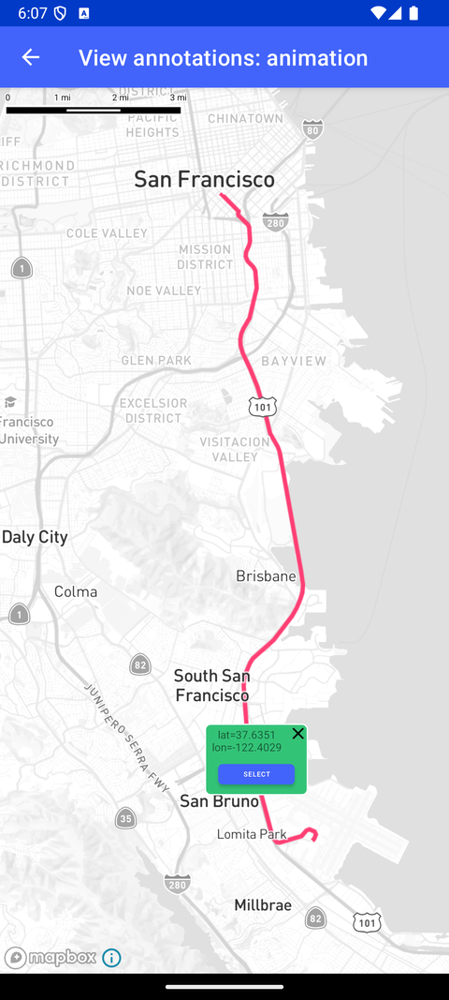

# View Annotation 动画（View annotations - animation）

> 官方示例：[view-annotations-animation](https://docs.mapbox.com/android/maps/examples/android-view/view-annotations-animation/)

## 示例效果



## 功能说明

通过持续更新坐标对 View Annotation 进行动画。

<details>
<summary>英文原文</summary>

This example demonstrates how to animate a view annotation on top of a route using the ViewAnnotationManager provided by the Mapbox Maps SDK for Android. It showcases the animation of a View object along a given route. The animation is achieved by updating the view annotation's position along a sequence of Point coordinates representing the route. The activity utilizes ValueAnimator for smooth animations and updates the ViewAnnotationOptions to animate the view along the route displayed on the map. The animation progression and timing are calculated based on the route length and distance between route points using functions from the TurfMeasurement API. There are several ways to add markers, annotations, and other shapes to the map using the Maps SDK. To choose the appropriate approach for your application, read the Markers and annotations guide.

</details>

## 示例 Activity

- `ViewAnnotationAnimationActivity.kt`

## 示例代码

```kotlin
package com.mapbox.maps.testapp.examples.markersandcallouts.viewannotation

import android.animation.Animator
import android.animation.AnimatorListenerAdapter
import android.animation.TypeEvaluator
import android.animation.ValueAnimator
import android.animation.ValueAnimator.AnimatorUpdateListener
import android.graphics.Color
import android.os.Bundle
import android.view.View
import android.widget.TextView
import androidx.appcompat.app.AppCompatActivity
import androidx.lifecycle.lifecycleScope
import com.mapbox.bindgen.Value
import com.mapbox.geojson.FeatureCollection
import com.mapbox.geojson.LineString
import com.mapbox.geojson.Point
import com.mapbox.maps.CameraOptions
import com.mapbox.maps.MapView
import com.mapbox.maps.Style
import com.mapbox.maps.ViewAnnotationOptions
import com.mapbox.maps.extension.style.layers.generated.lineLayer
import com.mapbox.maps.extension.style.sources.generated.geoJsonSource
import com.mapbox.maps.extension.style.style
import com.mapbox.maps.testapp.R
import com.mapbox.maps.testapp.databinding.ItemCalloutViewBinding
import com.mapbox.maps.testapp.examples.annotation.AnnotationUtils
import com.mapbox.maps.viewannotation.ViewAnnotationManager
import com.mapbox.maps.viewannotation.geometry
import com.mapbox.turf.TurfConstants.UNIT_DEFAULT
import com.mapbox.turf.TurfMeasurement
import kotlinx.coroutines.Dispatchers
import kotlinx.coroutines.launch
import kotlinx.coroutines.withContext
import kotlin.math.roundToLong

/**
 * Example how to animate a view annotations on top of a route.
 */
class ViewAnnotationAnimationActivity : AppCompatActivity() {

  private lateinit var viewAnnotationManager: ViewAnnotationManager
  private lateinit var annotationView: View
  private lateinit var textView: TextView
  private var routeCoordinateList = mutableListOf<Point>()
  private var currentRouteCoordinate = 0
  private var totalLength = 0.0
  private var currentAnimator: Animator? = null

  override fun onCreate(savedInstanceState: Bundle?) {
    super.onCreate(savedInstanceState)
    val mapView = MapView(this)
    setContentView(mapView)

    lifecycleScope.launch {
      // load feature collection from assets file
      val featureCollection = withContext(Dispatchers.Default) {
        FeatureCollection.fromJson(
          AnnotationUtils.loadStringFromAssets(
            this@ViewAnnotationAnimationActivity, ROUTE_FILE_NAME
          )
        )
      }

      // calculate the route length, get coordinates from route geometry
      val lineString = featureCollection.features()!![0].geometry() as LineString
      routeCoordinateList = lineString.coordinates()
      totalLength = TurfMeasurement.length(lineString, UNIT_DEFAULT)

      // initialize the mapview
      mapView.mapboxMap.apply {
        loadStyle(
          style(Style.STANDARD) {
          // source for displaying the route
          +geoJsonSource(SOURCE_ID) {
            featureCollection(featureCollection)
          }
          // layer for displaying the route
          +lineLayer(LINE_ID, SOURCE_ID) {
            lineColor(Color.parseColor(COLOR_PINK_HEX))
            lineWidth(4.0)
          }
        }
        ) {
          mapView.mapboxMap.setStyleImportConfigProperty("basemap", "theme", Value.valueOf("monochrome"))
          // center camera around SF airport
          setCamera(
            CameraOptions.Builder()
              .center(Point.fromLngLat(-122.3915, 37.6177))
              .zoom(11.0)
              .build()
          )
          // get initial point
          val initialPoint = routeCoordinateList[0]

          // create view annotation callout item
          viewAnnotationManager = mapView.viewAnnotationManager
          annotationView = viewAnnotationManager.addViewAnnotation(
            R.layout.item_callout_view,
            ViewAnnotationOptions.Builder()
              .geometry(initialPoint)
              .build()
          )

          ItemCalloutViewBinding.bind(annotationView).apply {
            textView = textNativeView
          }

          animateNextStep()
        }
      }
    }
  }

  override fun onStop() {
    super.onStop()
    currentAnimator?.removeAllListeners()
    currentAnimator?.cancel()
  }

  private fun animateNextStep() {
    currentRouteCoordinate %= (routeCoordinateList.size - 1)
    val currentPoint = routeCoordinateList[currentRouteCoordinate]
    val nextPoint = routeCoordinateList[currentRouteCoordinate + 1]

    val progress = TurfMeasurement.distance(currentPoint, nextPoint) / totalLength
    val animateDuration = progress * ANIMATION_DURATION_TOTAL_MS
    currentAnimator = ValueAnimator.ofObject(pointEvaluator, currentPoint, nextPoint).apply {
      duration = animateDuration.roundToLong()
      addUpdateListener(animatorUpdateListener)
      addListener(object : AnimatorListenerAdapter() {
        override fun onAnimationEnd(animation: Animator) {
          super.onAnimationEnd(animation)
          currentRouteCoordinate++
          animateNextStep()
        }
      })
      start()
    }
  }

  private val animatorUpdateListener =
    AnimatorUpdateListener { valueAnimator ->
      val animatedPosition: Point = valueAnimator.animatedValue as Point
      viewAnnotationManager.updateViewAnnotation(
        annotationView,
        ViewAnnotationOptions.Builder().geometry(animatedPosition).build()
      )
      textView.text = "lat=%.4f\nlon=%.4f".format(
        animatedPosition.latitude(),
        animatedPosition.longitude()
      )
    }

  private val pointEvaluator: TypeEvaluator<Point> =
    TypeEvaluator<Point> { fraction, startValue, endValue ->
      Point.fromLngLat(
        (
          startValue.longitude() +
            ((endValue.longitude() - startValue.longitude()) * fraction)
          ),
        startValue.latitude() +
          (endValue.latitude() - startValue.latitude()) * fraction
      )
    }

  private companion object {
    const val LINE_ID = "line"
    const val SOURCE_ID = "source"
    const val COLOR_PINK_HEX = "#F13C6E"
    const val ANIMATION_DURATION_TOTAL_MS = 50000
    const val ROUTE_FILE_NAME = "sf_airport_route.geojson"
  }
}
```

## 在 Aura 项目中使用

- UI 框架：**Android View**（与 Aura 当前 `MapFragment` + `MapView` 一致）
- 包名请替换为 `com.catclaw.aura`
- 需在 `local.properties` 配置 `MAPBOX_ACCESS_TOKEN`
- 部分示例依赖 `assets/` 或额外布局文件，请参考 GitHub 示例工程

## 参考链接

- [官方文档（英文）](https://docs.mapbox.com/android/maps/examples/android-view/view-annotations-animation/)
- [GitHub 源码](https://github.com/mapbox/mapbox-maps-android/blob/v11.24.3/app/src/main/java/com/mapbox/maps/testapp/examples/markersandcallouts/viewannotation/ViewAnnotationAnimationActivity.kt)
- [Android View 示例索引](./README.md)
- [Mapbox 中文指南](../../README.md)
