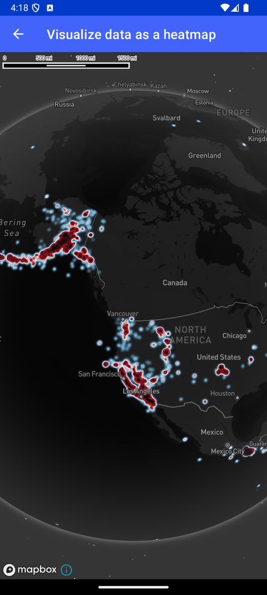

# 热力图（Visualize data as a heatmap）

> 官方示例：[visualize-data-as-a-heatmap](https://docs.mapbox.com/android/maps/examples/android-view/visualize-data-as-a-heatmap/)

## 示例效果



## 功能说明

从 GeoJSON 加载地震频率数据，用 HeatmapLayer 渲染热力图。

<details>
<summary>英文原文</summary>

This example demonstrates adding earthquake frequency data from a GeoJSON file to a map and visualizing it as a heatmap in an Android application. The implementation involves creating a GeoJsonSource with earthquake data, defining a HeatmapLayer to display the data with a color ramp based on density, and adjusting attributes like weight, intensity, radius, and opacity at different zoom levels. A CircleLayer is used to represent earthquake data with varying circle sizes and colors depending on the magnitude of the event. Various interpolation techniques are employed to achieve smooth transitions and visual effects on the map.

</details>

## 示例 Activity

- `HeatmapLayerGlobeActivity.kt`

## 示例代码

```kotlin
package com.mapbox.maps.testapp.examples.globe

import android.os.Bundle
import androidx.appcompat.app.AppCompatActivity
import com.mapbox.bindgen.Value
import com.mapbox.maps.MapboxMap
import com.mapbox.maps.Style
import com.mapbox.maps.extension.style.expressions.dsl.generated.interpolate
import com.mapbox.maps.extension.style.layers.addLayer
import com.mapbox.maps.extension.style.layers.generated.CircleLayer
import com.mapbox.maps.extension.style.layers.generated.HeatmapLayer
import com.mapbox.maps.extension.style.layers.generated.circleLayer
import com.mapbox.maps.extension.style.layers.generated.heatmapLayer
import com.mapbox.maps.extension.style.layers.properties.generated.ProjectionName
import com.mapbox.maps.extension.style.projection.generated.projection
import com.mapbox.maps.extension.style.sources.addSource
import com.mapbox.maps.extension.style.sources.generated.GeoJsonSource
import com.mapbox.maps.extension.style.sources.generated.geoJsonSource
import com.mapbox.maps.extension.style.style
import com.mapbox.maps.testapp.databinding.ActivityHeatmapLayerBinding

/**
 * Add earthquake frequency data to a style from a GeoJSON file and render
 * it on a map in globe projection using a HeatmapLayer.
 */
class HeatmapLayerGlobeActivity : AppCompatActivity() {

  private lateinit var mapboxMap: MapboxMap

  override fun onCreate(savedInstanceState: Bundle?) {
    super.onCreate(savedInstanceState)
    val binding = ActivityHeatmapLayerBinding.inflate(layoutInflater)
    setContentView(binding.root)

    mapboxMap = binding.mapView.mapboxMap.apply {
      loadStyle(
        style(Style.STANDARD) {
          +projection(ProjectionName.GLOBE)
        }
      ) { style ->
        addRuntimeLayers(style)
        mapboxMap.setStyleImportConfigProperty("basemap", "theme", Value.valueOf("monochrome"))
        mapboxMap.setStyleImportConfigProperty("basemap", "lightPreset", Value.valueOf("night"))
      }
    }
  }

  private fun addRuntimeLayers(style: Style) {
    style.addSource(createEarthquakeSource())
    style.addLayer(createHeatmapLayer())
    style.addLayer(createCircleLayer())
  }

  private fun createEarthquakeSource(): GeoJsonSource {
    return geoJsonSource(EARTHQUAKE_SOURCE_ID) {
      data(EARTHQUAKE_SOURCE_URL)
    }
  }

  private fun createHeatmapLayer(): HeatmapLayer {
    return heatmapLayer(
      HEATMAP_LAYER_ID,
      EARTHQUAKE_SOURCE_ID
    ) {
      maxZoom(9.0)
      sourceLayer(HEATMAP_LAYER_SOURCE)
      // Begin color ramp at 0-stop with a 0-transparancy color
      // to create a blur-like effect.
      heatmapColor(
        interpolate {
          linear()
          heatmapDensity()
          stop {
            literal(0)
            rgba(33.0, 102.0, 172.0, 0.0)
          }
          stop {
            literal(0.2)
            rgb(103.0, 169.0, 207.0)
          }
          stop {
            literal(0.4)
            rgb(209.0, 229.0, 240.0)
          }
          stop {
            literal(0.6)
            rgb(253.0, 219.0, 240.0)
          }
          stop {
            literal(0.8)
            rgb(239.0, 138.0, 98.0)
          }
          stop {
            literal(1)
            rgb(178.0, 24.0, 43.0)
          }
        }
      )
      // Increase the heatmap weight based on frequency and property magnitude
      heatmapWeight(
        interpolate {
          linear()
          get { literal("mag") }
          stop {
            literal(0)
            literal(0)
          }
          stop {
            literal(6)
            literal(1)
          }
        }
      )
      // Increase the heatmap color weight weight by zoom level
      // heatmap-intensity is a multiplier on top of heatmap-weight
      heatmapIntensity(
        interpolate {
          linear()
          zoom()
          stop {
            literal(0)
            literal(1)
          }
          stop {
            literal(9)
            literal(3)
          }
        }
      )
      // Adjust the heatmap radius by zoom level
      heatmapRadius(
        interpolate {
          linear()
          zoom()
          stop {
            literal(0)
            literal(2)
          }
          stop {
            literal(9)
            literal(20)
          }
        }
      )
      // Transition from heatmap to circle layer by zoom level
      heatmapOpacity(
        interpolate {
          linear()
          zoom()
          stop {
            literal(7)
            literal(1)
          }
          stop {
            literal(9)
            literal(0)
          }
        }
      )
      slot("middle")
    }
  }

  private fun createCircleLayer(): CircleLayer {
    return circleLayer(
      CIRCLE_LAYER_ID,
      EARTHQUAKE_SOURCE_ID
    ) {
      circleRadius(
        interpolate {
          linear()
          zoom()
          stop {
            literal(7)
            interpolate {
              linear()
              get { literal("mag") }
              stop {
                literal(1)
                literal(1)
              }
              stop {
                literal(6)
                literal(4)
              }
            }
          }
          stop {
            literal(16)
            interpolate {
              linear()
              get { literal("mag") }
              stop {
                literal(1)
                literal(5)
              }
              stop {
                literal(6)
                literal(50)
              }
            }
          }
        }
      )
      circleColor(
        interpolate {
          linear()
          get { literal("mag") }
          stop {
            literal(1)
            rgba(33.0, 102.0, 172.0, 0.0)
          }
          stop {
            literal(2)
            rgb(102.0, 169.0, 207.0)
          }
          stop {
            literal(3)
            rgb(209.0, 229.0, 240.0)
          }
          stop {
            literal(4)
            rgb(253.0, 219.0, 199.0)
          }
          stop {
            literal(5)
            rgb(239.0, 138.0, 98.0)
          }
          stop {
            literal(6)
            rgb(178.0, 24.0, 43.0)
          }
        }
      )
      circleOpacity(
        interpolate {
          linear()
          zoom()
          stop {
            literal(7)
            literal(0)
          }
          stop {
            literal(8)
            literal(1)
          }
        }
      )
      circleStrokeColor("white")
      circleStrokeWidth(0.1)
      slot("middle")
    }
  }

  companion object {
    private const val EARTHQUAKE_SOURCE_URL =
      "https://www.mapbox.com/mapbox-gl-js/assets/earthquakes.geojson"
    private const val EARTHQUAKE_SOURCE_ID = "earthquakes"
    private const val HEATMAP_LAYER_ID = "earthquakes-heat"
    private const val HEATMAP_LAYER_SOURCE = "earthquakes"
    private const val CIRCLE_LAYER_ID = "earthquakes-circle"
  }
}
```

## 在 Aura 项目中使用

- UI 框架：**Android View**（与 Aura 当前 `MapFragment` + `MapView` 一致）
- 包名请替换为 `com.catclaw.aura`
- 需在 `local.properties` 配置 `MAPBOX_ACCESS_TOKEN`
- 部分示例依赖 `assets/` 或额外布局文件，请参考 GitHub 示例工程

## 参考链接

- [官方文档（英文）](https://docs.mapbox.com/android/maps/examples/android-view/visualize-data-as-a-heatmap/)
- [GitHub 源码](https://github.com/mapbox/mapbox-maps-android/blob/v11.24.3/app/src/main/java/com/mapbox/maps/testapp/examples/globe/HeatmapLayerGlobeActivity.kt)
- [Android View 示例索引](./README.md)
- [Mapbox 中文指南](../../README.md)
