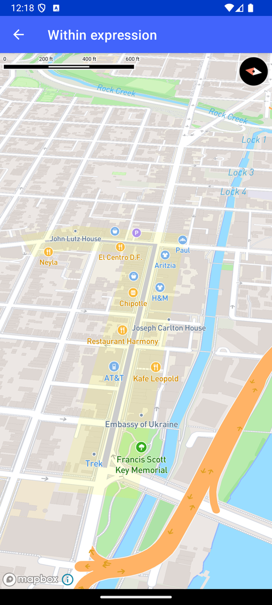

# Within 表达式（Within expression）

> 官方示例：[within-expression](https://docs.mapbox.com/android/maps/examples/android-view/within-expression/)

## 示例效果



## 功能说明

在缓冲几何体上使用 within 表达式。

<details>
<summary>英文原文</summary>

This example demonstrates the within expression to filter features outside a specific geometry. The activity sets up a MapView displaying a map with a camera positioned above Washington, D.C. It includes the creation of a buffer around a linestring geometry and the visualization of a route represented by an array of coordinates. Features are filtered using the within expression to show only POI labels inside the designated geometry.
The app hides various types of labels to emphasize the POI labels on the map. The activity utilizes classes such as SymbolLayer, LineLayer, FillLayer, and MapAnimationOptions, along with methods like setCamera and easeTo for map interactions and animations. Customized styling with specific colors, opacities, and visibility settings is applied to enhance the map visualization.

</details>

## 示例 Activity

- `WithinExpressionActivity.kt`

## 示例代码

```kotlin
package com.mapbox.maps.testapp.examples

import android.graphics.Color
import android.os.Bundle
import androidx.appcompat.app.AppCompatActivity
import com.mapbox.geojson.*
import com.mapbox.maps.CameraOptions
import com.mapbox.maps.MapView
import com.mapbox.maps.Style
import com.mapbox.maps.extension.style.expressions.dsl.generated.within
import com.mapbox.maps.extension.style.layers.addLayerBelow
import com.mapbox.maps.extension.style.layers.generated.SymbolLayer
import com.mapbox.maps.extension.style.layers.generated.fillLayer
import com.mapbox.maps.extension.style.layers.generated.lineLayer
import com.mapbox.maps.extension.style.layers.getLayer
import com.mapbox.maps.extension.style.layers.properties.generated.Visibility
import com.mapbox.maps.extension.style.sources.generated.geoJsonSource
import com.mapbox.maps.extension.style.style
import com.mapbox.maps.plugin.animation.MapAnimationOptions.Companion.mapAnimationOptions
import com.mapbox.maps.plugin.animation.camera

/**
 * An Activity that showcases the within expression to filter features outside a geometry
 */
class WithinExpressionActivity : AppCompatActivity() {

  override fun onCreate(savedInstanceState: Bundle?) {
    super.onCreate(savedInstanceState)
    val mapView = MapView(this)
    setContentView(mapView)

    val center = Point.fromLngLat(LON, LAT)

    // Setup camera position above Georgetown
    mapView.mapboxMap.setCamera(
      CameraOptions.Builder()
        .center(center)
        .zoom(15.5)
        .build()
    )

    // Assume the route is represented by an array of coordinates.
    val coordinates = listOf<Point>(
      Point.fromLngLat(
        -77.06866264343262,
        38.90506061276737
      ),
      Point.fromLngLat(
        -77.06283688545227,
        38.905194197410545
      ),
      Point.fromLngLat(
        -77.06285834312439,
        38.906429843444094
      ),
      Point.fromLngLat(
        -77.0630407333374,
        38.90680554236621
      )
    )

    // Create buffer around linestring
    val bufferedRouteGeometry = bufferLineStringGeometry()

    mapView.mapboxMap.loadStyle(
      style(Style.MAPBOX_STREETS) {
        +geoJsonSource(POINT_ID) {
          geometry(LineString.fromLngLats(coordinates))
        }
        +geoJsonSource(FILL_ID) {
          featureCollection(FeatureCollection.fromFeature(Feature.fromGeometry(bufferedRouteGeometry)))
          buffer(0)
          tolerance(0.0)
        }
        +layerAtPosition(
          lineLayer(LINE_ID, POINT_ID) {
            lineWidth(7.5)
            lineColor(Color.LTGRAY)
          },
          below = POI_LABEL
        )
      }
    ) { // Add fill layer to represent buffered LineString
      it.addLayerBelow(
        fillLayer(FILL_ID, FILL_ID) {
          fillOpacity(0.12)
          fillColor(Color.YELLOW)
        },
        LINE_ID
      )

      // Move to a new camera position
      mapView.camera.easeTo(
        CameraOptions.Builder()
          .zoom(16.0)
          .center(Point.fromLngLat(-77.06535338052844, 38.905156245642814))
          .bearing(80.68015859462369)
          .pitch(55.0)
          .build(),
        mapAnimationOptions {
          duration(1750)
          startDelay(2000)
        }
      )

      // Show only POI labels inside geometry using within expression
      val symbolLayer = it.getLayer(POI_LABEL) as SymbolLayer
      symbolLayer.filter(within(bufferedRouteGeometry))

      // Hide other types of labels to highlight POI labels
      (it.getLayer(ROAD_LABEL) as SymbolLayer).visibility(
        Visibility.NONE
      )
      (it.getLayer(TRANSIT_LABEL) as SymbolLayer).visibility(
        Visibility.NONE
      )
      (it.getLayer(ROAD_NUMBER_SHIELD) as SymbolLayer).visibility(
        Visibility.NONE
      )
    }
  }

  private fun bufferLineStringGeometry(): Polygon {
    // TODO replace static data by Turf#Buffer: mapbox-java/issues/987
    return FeatureCollection.fromJson(
      """
    {
      "type": "FeatureCollection",
      "features": [
        {
          "type": "Feature",
          "properties": {},
          "geometry": {
            "type": "Polygon",
            "coordinates": [
              [
                [
                  -77.06867337226866,
                  38.90467655551809
                ],
                [
                  -77.06233263015747,
                  38.90479344272695
                ],
                [
                  -77.06234335899353,
                  38.906463238984344
                ],
                [
                  -77.06290125846863,
                  38.907206285691615
                ],
                [
                  -77.06364154815674,
                  38.90684728656818
                ],
                [
                  -77.06326603889465,
                  38.90637140121084
                ],
                [
                  -77.06321239471436,
                  38.905561553883246
                ],
                [
                  -77.0691454410553,
                  38.905436318935635
                ],
                [
                  -77.06912398338318,
                  38.90466820642439
                ],
                [
                  -77.06867337226866,
                  38.90467655551809
                ]
              ]
            ]
          }
        }
      ]
    }
      """.trimIndent()
    ).features()!![0].geometry() as Polygon
  }

  companion object {
    const val POINT_ID = "point"
    const val FILL_ID = "fill"
    const val LINE_ID = "line"
    const val LAT = 38.90628988399711
    const val LON = -77.06574689337494
    const val POI_LABEL = "poi-label"
    const val ROAD_LABEL = "road-label"
    const val TRANSIT_LABEL = "transit-label"
    const val ROAD_NUMBER_SHIELD = "road-number-shield"
  }
}
```

## 在 Aura 项目中使用

- UI 框架：**Android View**（与 Aura 当前 `MapFragment` + `MapView` 一致）
- 包名请替换为 `com.catclaw.aura`
- 需在 `local.properties` 配置 `MAPBOX_ACCESS_TOKEN`
- 部分示例依赖 `assets/` 或额外布局文件，请参考 GitHub 示例工程

## 参考链接

- [官方文档（英文）](https://docs.mapbox.com/android/maps/examples/android-view/within-expression/)
- [GitHub 源码](https://github.com/mapbox/mapbox-maps-android/blob/v11.24.3/app/src/main/java/com/mapbox/maps/testapp/examples/WithinExpressionActivity.kt)
- [Android View 示例索引](./README.md)
- [Mapbox 中文指南](../../README.md)
