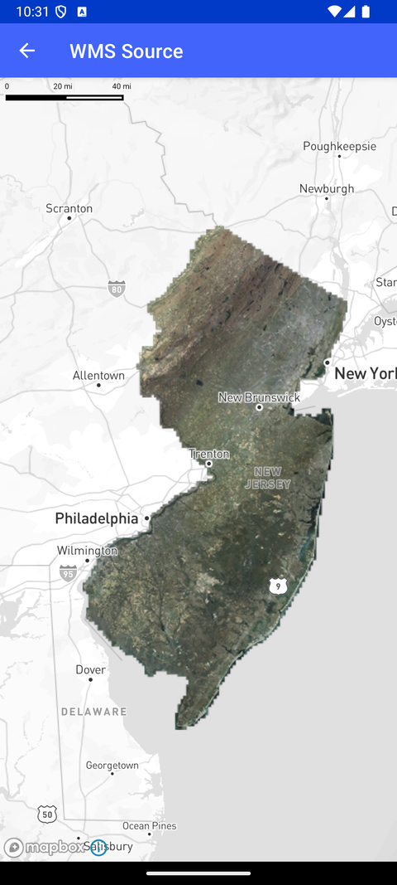

# WMS 源（WMS Source）

> 官方示例：[wms-source](https://docs.mapbox.com/android/maps/examples/android-view/wms-source/)

## 示例效果



## 功能说明

通过 TileSet API 向地图添加外部 WMS（Web Map Service）栅格源。

<details>
<summary>英文原文</summary>

This example demonstrates how to integrate an external Web Map Service (WMS) layer into a map using the Mapbox Maps SDK for Android. The WMS source is added to the map by specifying the WMS source URL, ID, and tile properties using the rasterSource method. The app adds a RasterLayer to display the WMS layer on the map, positioning it either below a specific layer identified by BELOW_LAYER_ID or as the base layer if no such layer exists.

</details>

## 示例 Activity

- `WmsSourceActivity.kt`

## 示例代码

```kotlin
package com.mapbox.maps.testapp.examples

import android.os.Bundle
import androidx.appcompat.app.AppCompatActivity
import com.mapbox.bindgen.Value
import com.mapbox.maps.Style
import com.mapbox.maps.extension.style.layers.addLayer
import com.mapbox.maps.extension.style.layers.generated.RasterLayer
import com.mapbox.maps.extension.style.sources.addSource
import com.mapbox.maps.extension.style.sources.generated.rasterSource
import com.mapbox.maps.testapp.databinding.ActivityWmsSourceBinding

/**
 * Adding an external Web Map Service layer to the map.
 */
class WmsSourceActivity : AppCompatActivity() {

  override fun onCreate(savedInstanceState: Bundle?) {
    super.onCreate(savedInstanceState)
    val binding = ActivityWmsSourceBinding.inflate(layoutInflater)
    setContentView(binding.root)
    binding.mapView.mapboxMap.loadStyle(
      Style.STANDARD
    ) {
      it.addSource(
        rasterSource(WMS_SOURCE_ID) {
          tileSize(256)
          tileSet(TILESET_JSON, listOf(WMS_SOURCE_URL)) {}
        }
      )
      it.addLayer(RasterLayer(RASTER_LAYER_ID, WMS_SOURCE_ID).slot("bottom"))
      binding.mapView.mapboxMap.setStyleImportConfigProperty("basemap", "theme", Value.valueOf("monochrome"))
    }
  }

  companion object {
    const val WMS_SOURCE_URL = "https://img.nj.gov/imagerywms/Natural2015?bbox={bbox-epsg-3857}" +
      "&format=image/png&service=WMS&version=1.1.1&request=GetMap&srs=EPSG:3857" +
      "&transparent=true&width=256&height=256&layers=Natural2015"
    const val WMS_SOURCE_ID = "web-map-source"
    const val RASTER_LAYER_ID = "web-map-layer"
    const val TILESET_JSON = "tileset"
  }
}
```

## 在 Aura 项目中使用

- UI 框架：**Android View**（与 Aura 当前 `MapFragment` + `MapView` 一致）
- 包名请替换为 `com.catclaw.aura`
- 需在 `local.properties` 配置 `MAPBOX_ACCESS_TOKEN`
- 部分示例依赖 `assets/` 或额外布局文件，请参考 GitHub 示例工程

## 参考链接

- [官方文档（英文）](https://docs.mapbox.com/android/maps/examples/android-view/wms-source/)
- [GitHub 源码](https://github.com/mapbox/mapbox-maps-android/blob/v11.24.3/app/src/main/java/com/mapbox/maps/testapp/examples/WmsSourceActivity.kt)
- [Android View 示例索引](./README.md)
- [Mapbox 中文指南](../../README.md)
