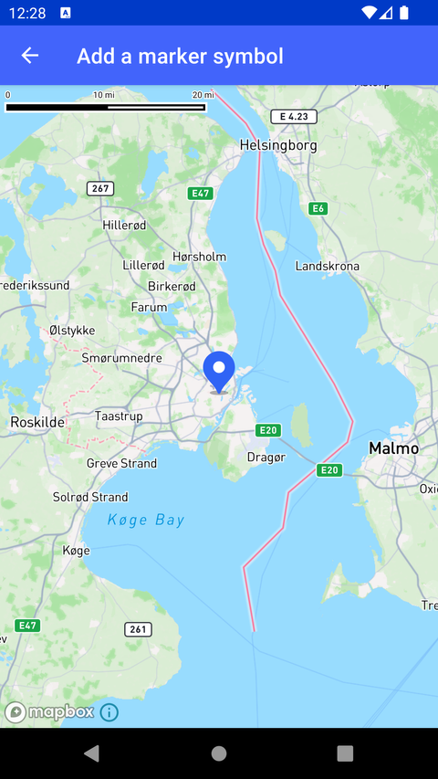

# 添加 Symbol 标记（Add a marker symbol）

> 官方示例：[add-a-marker-symbol](https://docs.mapbox.com/android/maps/examples/android-view/add-a-marker-symbol/)

## 示例效果



## 功能说明

向样式添加蓝色水滴形 marker 图片，并通过 `SymbolLayer` 显示在地图上。

<details>
<summary>英文原文</summary>

This example demonstrates adding a marker to a Mapbox style with the SymbolLayer on the Maps SDK for Android. The AddOneMarkerSymbolActivity class extends AppCompatActivity and sets up a mapView with a blue marker at a specified location on the map. The implementation includes loading a custom marker, creating a GeoJSON source with the marker's location, and defining a symbol layer to display the marker with the IconAnchor. The activity also sets the initial camera position at the specified latitude and longitude.

</details>

## 示例 Activity

- `AddOneMarkerSymbolActivity.kt`

## 示例代码

```kotlin
package com.mapbox.maps.testapp.examples.markersandcallouts

import android.os.Bundle
import androidx.appcompat.app.AppCompatActivity
import androidx.core.content.ContextCompat
import androidx.core.graphics.drawable.toBitmap
import com.mapbox.geojson.Point
import com.mapbox.maps.CameraOptions
import com.mapbox.maps.MapView
import com.mapbox.maps.Style
import com.mapbox.maps.extension.style.image.image
import com.mapbox.maps.extension.style.layers.generated.symbolLayer
import com.mapbox.maps.extension.style.layers.properties.generated.IconAnchor
import com.mapbox.maps.extension.style.sources.generated.geoJsonSource
import com.mapbox.maps.extension.style.style
import com.mapbox.maps.testapp.R

/**
 * Add a blue teardrop-shaped marker image to a style and display it on the
 * map using a SymbolLayer.
 */
class AddOneMarkerSymbolActivity : AppCompatActivity() {

  override fun onCreate(savedInstanceState: Bundle?) {
    super.onCreate(savedInstanceState)
    val mapView = MapView(this)
    setContentView(mapView)

    mapView.mapboxMap.also {
      it.setCamera(
        CameraOptions.Builder()
          .center(Point.fromLngLat(LONGITUDE, LATITUDE))
          .zoom(8.0)
          .build()
      )
    }.loadStyle(
      styleExtension = style(Style.STANDARD) {
        // prepare blue marker from resources
        +image(
          BLUE_ICON_ID,
          ContextCompat.getDrawable(this@AddOneMarkerSymbolActivity, R.drawable.ic_blue_marker)!!.toBitmap()
        )
        +geoJsonSource(SOURCE_ID) {
          geometry(Point.fromLngLat(LONGITUDE, LATITUDE))
        }
        +symbolLayer(LAYER_ID, SOURCE_ID) {
          iconImage(BLUE_ICON_ID)
          iconAnchor(IconAnchor.BOTTOM)
        }
      }
    )
  }

  companion object {
    private const val BLUE_ICON_ID = "blue"
    private const val SOURCE_ID = "source_id"
    private const val LAYER_ID = "layer_id"
    private const val LATITUDE = 55.665957
    private const val LONGITUDE = 12.550343
  }
}
```

## 在 Aura 项目中使用

- UI 框架：**Android View**（与 Aura 当前 `MapFragment` + `MapView` 一致）
- 包名请替换为 `com.catclaw.aura`
- 需在 `local.properties` 配置 `MAPBOX_ACCESS_TOKEN`
- 部分示例依赖 `assets/` 或额外布局文件，请参考 GitHub 示例工程

## 参考链接

- [官方文档（英文）](https://docs.mapbox.com/android/maps/examples/android-view/add-a-marker-symbol/)
- [GitHub 源码](https://github.com/mapbox/mapbox-maps-android/blob/v11.24.3/app/src/main/java/com/mapbox/maps/testapp/examples/markersandcallouts/AddOneMarkerSymbolActivity.kt)
- [Android View 示例索引](./README.md)
- [Mapbox 中文指南](../../README.md)
