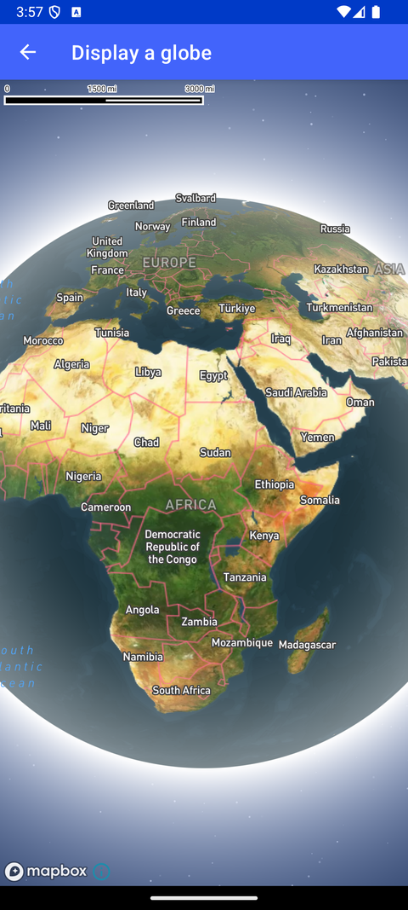

# 显示地球投影（Display a globe）

> 官方示例：[display-a-globe](https://docs.mapbox.com/android/maps/examples/android-view/display-a-globe/)

## 示例效果



## 功能说明

使用 globe 投影创建地球视图地图。

<details>
<summary>英文原文</summary>

This example showcases how to display a map as a 3D globe instead of the default Mercator projection, using the Mapbox Maps SDK for Android. The code below create a map using the STANDARD_SATELLITE style which pulls scanned images of the planet from satellite data and sets the projection mode to ProjectionName.GLOBE to render the 3D globe. Our satellite data is pulled from various sources. To learn more about it, see our Satellite Documentation.

</details>

## 示例 Activity

- `GlobeActivity.kt`

## 示例代码

```kotlin
package com.mapbox.maps.testapp.examples.globe

import android.os.Bundle
import androidx.appcompat.app.AppCompatActivity
import com.mapbox.geojson.Point
import com.mapbox.maps.MapView
import com.mapbox.maps.Style
import com.mapbox.maps.dsl.cameraOptions
import com.mapbox.maps.extension.style.atmosphere.generated.atmosphere
import com.mapbox.maps.extension.style.layers.properties.generated.ProjectionName
import com.mapbox.maps.extension.style.projection.generated.projection
import com.mapbox.maps.extension.style.style

/**
 * This example uses the Style DSL [projection] to display the map as a 3D globe instead of the default Mercator projection.
 * A starry sky and atmosphere effects are added with Style DSL [atmosphere].
 */
class GlobeActivity : AppCompatActivity() {

  override fun onCreate(savedInstanceState: Bundle?) {
    super.onCreate(savedInstanceState)
    val mapView = MapView(this)
    setContentView(mapView)

    mapView.mapboxMap.apply {
      setCamera(
        cameraOptions {
          center(CENTER)
          zoom(ZOOM)
        }
      )
      loadStyle(
        style(Style.STANDARD_SATELLITE) {
          +atmosphere { }
          +projection(ProjectionName.GLOBE)
        }
      )
    }
  }

  private companion object {
    private const val ZOOM = 0.45
    private val CENTER = Point.fromLngLat(30.0, 50.0)
  }
}
```

## 在 Aura 项目中使用

- UI 框架：**Android View**（与 Aura 当前 `MapFragment` + `MapView` 一致）
- 包名请替换为 `com.catclaw.aura`
- 需在 `local.properties` 配置 `MAPBOX_ACCESS_TOKEN`
- 部分示例依赖 `assets/` 或额外布局文件，请参考 GitHub 示例工程

## 参考链接

- [官方文档（英文）](https://docs.mapbox.com/android/maps/examples/android-view/display-a-globe/)
- [GitHub 源码](https://github.com/mapbox/mapbox-maps-android/blob/v11.24.3/app/src/main/java/com/mapbox/maps/testapp/examples/globe/GlobeActivity.kt)
- [Android View 示例索引](./README.md)
- [Mapbox 中文指南](../../README.md)
