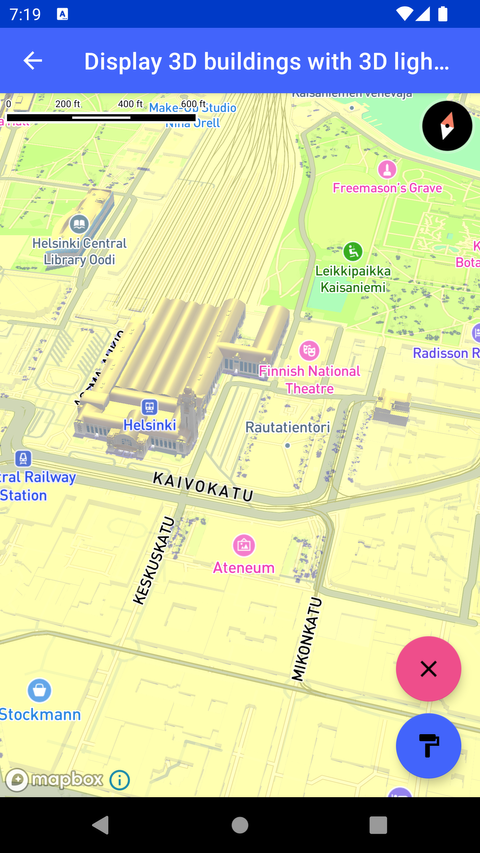

# 3D 建筑与 3D 光照（Display 3D buildings with 3D lights）

> 官方示例：[display-3d-buildings-with-3d-lights](https://docs.mapbox.com/android/maps/examples/android-view/display-3d-buildings-with-3d-lights/)

## 示例效果



## 功能说明

在 Standard 样式中挤出 3D 建筑层，并配置 3D 光照位置。

<details>
<summary>英文原文</summary>

This example demonstrates how add lights to a 3d map with the Mapbox SDK for Android. The code below creates an ambientLight with white hue and an intensity of 0.5, as well as a directionalLight with a yellow hue, an intensity of 0.9, and enables shadows pointed at an angle of 15 degrees. Once the lights are created, they are then applied to the map style using the setLight method. The example also includes functionality to interact with the lights dynamically. Clicking the "fabLightColor" button toggles the ambient light's color between white and red, while clicking the "fabLightPosition" button adjusts the direction of the directional light by increments of 5 degrees within a range of 90 degrees.

</details>

## 示例 Activity

- `Lights3DActivity.kt`

## 示例代码

```kotlin
package com.mapbox.maps.testapp.examples.terrain3D

import android.graphics.Color
import android.os.Bundle
import androidx.appcompat.app.AppCompatActivity
import com.mapbox.geojson.Point
import com.mapbox.maps.CameraOptions
import com.mapbox.maps.Style
import com.mapbox.maps.extension.style.light.generated.ambientLight
import com.mapbox.maps.extension.style.light.generated.directionalLight
import com.mapbox.maps.extension.style.light.setLight
import com.mapbox.maps.testapp.databinding.ActivityFillExtrusionBinding

/**
 * Extrude the building layer in the Mapbox Standard style
 * and set up the light position.
 */
class Lights3DActivity : AppCompatActivity() {

  private var isRedColor: Boolean = false
  private lateinit var binding: ActivityFillExtrusionBinding

  override fun onCreate(savedInstanceState: Bundle?) {
    super.onCreate(savedInstanceState)
    binding = ActivityFillExtrusionBinding.inflate(layoutInflater)
    setContentView(binding.root)
    val mapboxMap = binding.mapView.mapboxMap
    mapboxMap.setCamera(
      CameraOptions.Builder()
        .center(Point.fromLngLat(24.943849, 60.171924))
        .bearing(-17.6)
        .pitch(45.0)
        .zoom(16.0)
        .build()
    )

    mapboxMap.loadStyle(
      Style.STANDARD
    ) { style ->
      setupLights3D(style)
    }
  }

  private fun setupLights3D(style: Style) {
    // setup 3d light
    val ambientLight = ambientLight(AMBIENT_LIGHT_ID) {
      color(Color.WHITE)
      intensity(0.5)
    }
    val directionalLight = directionalLight(DIRECTIONAL_LIGHT_ID) {
      color(Color.YELLOW)
      intensity(0.9)
      castShadows(true)
      direction(listOf(0.0, 15.0))
    }
    style.setLight(
      ambientLight,
      directionalLight,
    )
    // change color on fab click
    binding.fabLightColor.setOnClickListener {
      isRedColor = !isRedColor
      if (isRedColor) {
        ambientLight.color(Color.RED)
      } else {
        ambientLight.color(Color.WHITE)
      }
    }

    binding.fabLightPosition.setOnClickListener {
      directionalLight.direction(listOf(0.0, (directionalLight.direction!![1] + 5.0) % 90.0))
    }
  }

  private companion object {
    private const val AMBIENT_LIGHT_ID = "ambient_id"
    private const val DIRECTIONAL_LIGHT_ID = "directional_id"
  }
}
```

## 在 Aura 项目中使用

- UI 框架：**Android View**（与 Aura 当前 `MapFragment` + `MapView` 一致）
- 包名请替换为 `com.catclaw.aura`
- 需在 `local.properties` 配置 `MAPBOX_ACCESS_TOKEN`
- 部分示例依赖 `assets/` 或额外布局文件，请参考 GitHub 示例工程

## 参考链接

- [官方文档（英文）](https://docs.mapbox.com/android/maps/examples/android-view/display-3d-buildings-with-3d-lights/)
- [GitHub 源码](https://github.com/mapbox/mapbox-maps-android/blob/v11.24.3/app/src/main/java/com/mapbox/maps/testapp/examples/terrain3D/Lights3DActivity.kt)
- [Android View 示例索引](./README.md)
- [Mapbox 中文指南](../../README.md)
