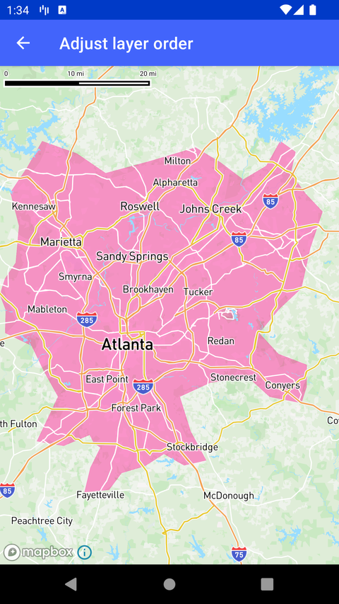

# 调整图层顺序（Adjust layer order）

> 官方示例：[adjust-layer-order](https://docs.mapbox.com/android/maps/examples/android-view/adjust-layer-order/)

## 示例效果



## 功能说明

将指定图层插入到其他图层的上方或下方。

<details>
<summary>英文原文</summary>

This example demonstrates how to add a GeoJsonSource to a Mapbox Maps SDK for Android application. The GeoJsonLayerInStackActivity class loads a MapView with a MapboxMap instance. It utilizes the Mapbox Maps SDK to load a map style with the MAPBOX_STREETS base style and adds a GeoJsonSource representing urban areas from a remote URL. A fill layer is then added to render the GeoJson polygons with a specific fill color and opacity, positioned below the "water" layer in the style stack. Additionally, the map's camera focuses on a specific geographical point with a predefined zoom level using the CameraOptions class and Point from the Mapbox GeoJson library. This example uses classic Mapbox styles (for example: MAPBOX_STREETS,SATELLITE, OUTDOORS, etc). These styles are no longer maintained and may not include the latest features or updates. Developers are encouraged to use the Mapbox Standard or Mapbox Standard Satellite styles](https://docs.mapbox.com/map-styles/standard/guides#mapbox-standard-satellite) or to build a custom style using Mapbox Studio.

</details>

## 示例 Activity

- `GeoJsonLayerInStackActivity.kt`

## 示例代码

```kotlin
package com.mapbox.maps.testapp.examples

import android.os.Bundle
import androidx.appcompat.app.AppCompatActivity
import com.mapbox.geojson.Point
import com.mapbox.maps.CameraOptions
import com.mapbox.maps.MapView
import com.mapbox.maps.MapboxMap
import com.mapbox.maps.Style
import com.mapbox.maps.extension.style.layers.generated.fillLayer
import com.mapbox.maps.extension.style.sources.generated.geoJsonSource
import com.mapbox.maps.extension.style.style

class GeoJsonLayerInStackActivity : AppCompatActivity() {

  private lateinit var mapboxMap: MapboxMap

  override fun onCreate(savedInstanceState: Bundle?) {
    super.onCreate(savedInstanceState)
    val mapView = MapView(this)
    setContentView(mapView)
    mapboxMap = mapView.mapboxMap

    mapboxMap.loadStyle(
      style(style = Style.MAPBOX_STREETS) {
        +geoJsonSource("urban-areas") {
          data("https://d2ad6b4ur7yvpq.cloudfront.net/naturalearth-3.3.0/ne_50m_urban_areas.geojson")
        }
        +layerAtPosition(
          fillLayer(layerId = "urban-areas-fill", sourceId = "urban-areas") {
            fillColor("#ff0088")
            fillOpacity(0.4)
          },
          below = "water"
        )
      }
    )

    mapboxMap.setCamera(
      CameraOptions.Builder()
        .center(Point.fromLngLat(-84.381546, 33.749909))
        .zoom(8.471903)
        .build()
    )
  }
}
```

## 在 Aura 项目中使用

- UI 框架：**Android View**（与 Aura 当前 `MapFragment` + `MapView` 一致）
- 包名请替换为 `com.catclaw.aura`
- 需在 `local.properties` 配置 `MAPBOX_ACCESS_TOKEN`
- 部分示例依赖 `assets/` 或额外布局文件，请参考 GitHub 示例工程

## 参考链接

- [官方文档（英文）](https://docs.mapbox.com/android/maps/examples/android-view/adjust-layer-order/)
- [GitHub 源码](https://github.com/mapbox/mapbox-maps-android/blob/v11.24.3/app/src/main/java/com/mapbox/maps/testapp/examples/GeoJsonLayerInStackActivity.kt)
- [Android View 示例索引](./README.md)
- [Mapbox 中文指南](../../README.md)
