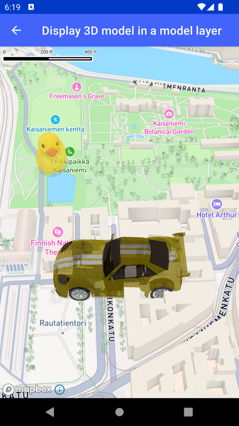

# 3D 模型图层（3D Model Layer）

> 官方示例：[3D-model-layer](https://docs.mapbox.com/android/maps/examples/android-view/3D-model-layer/)

## 示例效果



## 功能说明

演示 3D 模型图层（Model Layer）的用法。

<details>
<summary>英文原文</summary>

This example demonstrates how to add 3D models using the modelLayer in the Mapbox Maps SDK for Android. The activity sets up the map view, adds two 3D models with specified URIs, creates a geoJsonSource, and configures a modelLayer to display the models in the specified locations. The camera is positioned at a specific center point, zoom level and pitch using cameraOptions. A custom style is loaded to the map to render the models in a 3D view. The models are rendered with specified scaling, translation, rotation, opacity, and ambient occlusion intensity settings according to properties defined in the modelLayer.

</details>

## 示例 Activity

- `ModelLayerActivity.kt`

## 示例代码

```kotlin
package com.mapbox.maps.testapp.examples.terrain3D

import android.os.Bundle
import androidx.appcompat.app.AppCompatActivity
import com.mapbox.geojson.Feature
import com.mapbox.geojson.FeatureCollection
import com.mapbox.geojson.Point
import com.mapbox.maps.MapView
import com.mapbox.maps.MapboxExperimental
import com.mapbox.maps.Style
import com.mapbox.maps.dsl.cameraOptions
import com.mapbox.maps.extension.style.expressions.dsl.generated.get
import com.mapbox.maps.extension.style.layers.generated.modelLayer
import com.mapbox.maps.extension.style.layers.properties.generated.ModelType
import com.mapbox.maps.extension.style.model.model
import com.mapbox.maps.extension.style.sources.generated.geoJsonSource
import com.mapbox.maps.extension.style.style
import com.mapbox.turf.TurfMeasurement

/**
 * Showcase adding 3D models using model layer.
 */
@MapboxExperimental
class ModelLayerActivity : AppCompatActivity() {
  private lateinit var mapView: MapView

  override fun onCreate(savedInstanceState: Bundle?) {
    super.onCreate(savedInstanceState)
    mapView = MapView(this)
    setContentView(mapView)

    mapView.mapboxMap.apply {
      setCamera(
        cameraOptions {
          center(TurfMeasurement.midpoint(MODEL1_COORDINATES, MAPBOX_HELSINKI))
          zoom(CAMERA_ZOOM)
          pitch(CAMERA_PITCH)
        }
      )
      loadStyle(
        style(Style.STANDARD) {
          +model(MODEL_ID_1) {
            uri(SAMPLE_MODEL_URI_1)
          }
          +model(MODEL_ID_2) {
            uri(SAMPLE_MODEL_URI_2)
          }
          +geoJsonSource(SOURCE_ID) {
            featureCollection(
              FeatureCollection.fromFeatures(
                listOf(
                  Feature.fromGeometry(MODEL1_COORDINATES).also { it.addStringProperty(MODEL_ID_KEY, MODEL_ID_1) },
                  Feature.fromGeometry(MAPBOX_HELSINKI).also { it.addStringProperty(MODEL_ID_KEY, MODEL_ID_2) }
                )
              )
            )
          }
          +modelLayer(MODEL_LAYER_ID, SOURCE_ID) {
            modelId(get(MODEL_ID_KEY))
            modelType(ModelType.COMMON_3D)
            modelScale(listOf(40.0, 40.0, 40.0))
            modelTranslation(listOf(0.0, 0.0, 0.0))
            modelRotation(listOf(0.0, 0.0, 90.0))
            modelOpacity(0.7)
            modelAmbientOcclusionIntensity(1.0)
          }
        }
      )
    }
  }

  private companion object {
    const val CAMERA_ZOOM = 16.0
    const val CAMERA_PITCH = 45.0
    const val SOURCE_ID = "source-id"
    const val MODEL_LAYER_ID = "model-layer-id"
    const val MODEL_ID_KEY = "model-id-key"
    const val MODEL_ID_1 = "model-id-1"
    const val MODEL_ID_2 = "model-id-2"
    const val SAMPLE_MODEL_URI_1 =
      "https://raw.githubusercontent.com/KhronosGroup/glTF-Sample-Models/master/2.0/Duck/glTF-Embedded/Duck.gltf"
    const val SAMPLE_MODEL_URI_2 = "asset://sportcar.glb"
    val MAPBOX_HELSINKI = Point.fromLngLat(24.945389069265598, 60.17195694011002)
    val MODEL1_COORDINATES = Point.fromLngLat(MAPBOX_HELSINKI.longitude() - 0.002, MAPBOX_HELSINKI.latitude() + 0.002)
  }
}
```

## 在 Aura 项目中使用

- UI 框架：**Android View**（与 Aura 当前 `MapFragment` + `MapView` 一致）
- 包名请替换为 `com.catclaw.aura`
- 需在 `local.properties` 配置 `MAPBOX_ACCESS_TOKEN`
- 部分示例依赖 `assets/` 或额外布局文件，请参考 GitHub 示例工程

## 参考链接

- [官方文档（英文）](https://docs.mapbox.com/android/maps/examples/android-view/3D-model-layer/)
- [GitHub 源码](https://github.com/mapbox/mapbox-maps-android/blob/v11.24.3/app/src/main/java/com/mapbox/maps/testapp/examples/terrain3D/ModelLayerActivity.kt)
- [Android View 示例索引](./README.md)
- [Mapbox 中文指南](../../README.md)
