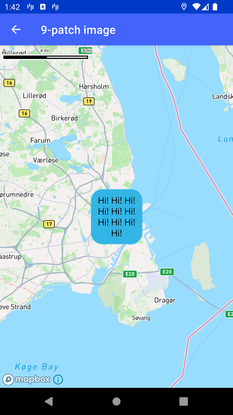

# 9-patch 图片（9-patch image）

> 官方示例：[patch-image](https://docs.mapbox.com/android/maps/examples/android-view/patch-image/)

## 示例效果



## 功能说明

向样式添加 9-patch 拉伸图片。

<details>
<summary>英文原文</summary>

This example demonstrates how to add a 9-patch image to your Mapbox Maps SDK for Android and illustrates the behavior of the image when stretched. The image is loaded using the image9Patch extension function and displayed using a SymbolLayer with stretching enabled in both the X and Y axes. Text is appended to the image in a loop, and the icon is dynamically updated by a runnable task providing a visual representation of the stretched 9-patch image with added text. For more about 9-patch images, see the Android documentation.

</details>

## 示例 Activity

- `NinePatchImageActivity.kt`

## 示例代码

```kotlin
package com.mapbox.maps.testapp.examples

import android.graphics.BitmapFactory
import android.os.Bundle
import androidx.appcompat.app.AppCompatActivity
import com.mapbox.geojson.Feature
import com.mapbox.geojson.Point
import com.mapbox.maps.CameraOptions
import com.mapbox.maps.MapView
import com.mapbox.maps.Style
import com.mapbox.maps.extension.style.image.image9Patch
import com.mapbox.maps.extension.style.layers.generated.SymbolLayer
import com.mapbox.maps.extension.style.layers.generated.symbolLayer
import com.mapbox.maps.extension.style.layers.getLayer
import com.mapbox.maps.extension.style.layers.properties.generated.IconTextFit
import com.mapbox.maps.extension.style.sources.generated.geoJsonSource
import com.mapbox.maps.extension.style.style
import com.mapbox.maps.testapp.R

/**
 * Example showcasing of adding 9-patch image to style
 * and demonstrating how it works when stretching image.
 */
class NinePatchImageActivity : AppCompatActivity() {

  private var appendTextCounter = 1
  private lateinit var style: Style
  private lateinit var mapView: MapView
  override fun onCreate(savedInstanceState: Bundle?) {
    super.onCreate(savedInstanceState)
    mapView = MapView(this)
    setContentView(mapView)
    mapView.mapboxMap.loadStyle(
      styleExtension = style(Style.STANDARD) {
        +image9Patch(
          NINE_PATCH_ID,
          BitmapFactory.decodeResource(resources, R.drawable.blue_round_nine)
        )
        +geoJsonSource(SOURCE_ID) {
          feature(Feature.fromGeometry(CENTER))
        }
        +symbolLayer(LAYER_ID, SOURCE_ID) {
          iconImage(NINE_PATCH_ID)
          // make sure we stretch image both in X and Y
          iconTextFit(IconTextFit.BOTH)
          iconTextFitPadding(listOf(5.0, 5.0, 5.0, 5.0))
          textField(TEXT_BASE)
        }
      }
    ) {
      style = it
      updateIconText()
    }
    mapView.mapboxMap.setCamera(
      CameraOptions.Builder()
        .center(CENTER)
        .zoom(ZOOM)
        .build()
    )
  }

  private val runnable = {
    if (style.isValid()) {
      val layer = (style.getLayer(LAYER_ID) as SymbolLayer)
      layer.textField("${layer.textField?.getTextAsString()} $TEXT_BASE")
      appendTextCounter++
      if (appendTextCounter.rem(3) == 0) {
        layer.textField("${layer.textField?.getTextAsString()}\n")
      }
      updateIconText()
    }
  }

  // start appending text in a loop, stretching icon in both X and Y
  private fun updateIconText() {
    mapView.postDelayed(
      runnable,
      TEXT_UPDATE_TIME_MS
    )
  }

  override fun onStop() {
    super.onStop()
    mapView.removeCallbacks(runnable)
  }
  companion object {
    private const val NINE_PATCH_ID = "red"
    private const val SOURCE_ID = "source_id"
    private const val LAYER_ID = "layer_id"
    private val CENTER = Point.fromLngLat(12.554729, 55.70651)
    private const val ZOOM = 9.0
    private const val TEXT_BASE = "Hi!"
    private const val TEXT_UPDATE_TIME_MS = 1500L
  }
}
```

## 在 Aura 项目中使用

- UI 框架：**Android View**（与 Aura 当前 `MapFragment` + `MapView` 一致）
- 包名请替换为 `com.catclaw.aura`
- 需在 `local.properties` 配置 `MAPBOX_ACCESS_TOKEN`
- 部分示例依赖 `assets/` 或额外布局文件，请参考 GitHub 示例工程

## 参考链接

- [官方文档（英文）](https://docs.mapbox.com/android/maps/examples/android-view/patch-image/)
- [GitHub 源码](https://github.com/mapbox/mapbox-maps-android/blob/v11.24.3/app/src/main/java/com/mapbox/maps/testapp/examples/NinePatchImageActivity.kt)
- [Android View 示例索引](./README.md)
- [Mapbox 中文指南](../../README.md)
