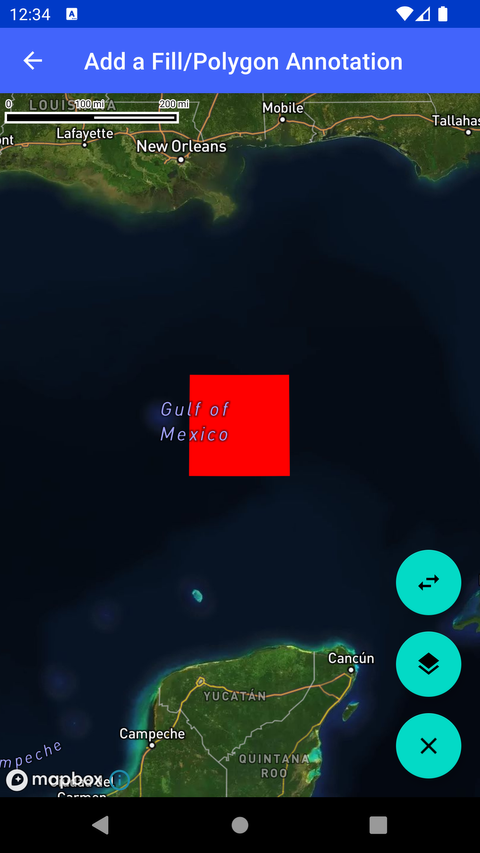

# 添加面标注（Add a Fill/Polygon Annotation）

> 官方示例：[add-a-fill-polygon-annotation](https://docs.mapbox.com/android/maps/examples/android-view/add-a-fill-polygon-annotation/)

## 示例效果



## 功能说明

在地图上显示面标注（Fill/Polygon Annotation）。

<details>
<summary>英文原文</summary>

This example demonstrates how to add Polygon annotations to a map using the Mapbox Maps SDK for Android. The example loads a PolygonAnnotation via AnnotationPlugin and it's createPolygonAnnotationManager function. The example then uses associated interaction & click listeners to allow users to interact with the Polygon annotation. It listens for annotation clicks and interactions, such as selecting or deselecting annotations.
The Polygons is defined by a list of Point coordinates and customized using PolygonAnnotationOptions making the annotation draggable and setting the fill color. The example also includes UI buttons to remove the annotation from the map, the change the maps style and move the annotation into different slots which causes the annotation to render above or below different layers of the map depending on the slot selected.

</details>

## 示例 Activity

- `PolygonAnnotationActivity.kt`

## 示例代码

```kotlin
package com.mapbox.maps.testapp.examples.markersandcallouts

import android.graphics.Color
import android.os.Bundle
import android.widget.Toast
import androidx.appcompat.app.AppCompatActivity
import androidx.lifecycle.lifecycleScope
import com.google.gson.JsonPrimitive
import com.mapbox.geojson.FeatureCollection
import com.mapbox.geojson.Point
import com.mapbox.maps.dsl.cameraOptions
import com.mapbox.maps.plugin.annotation.AnnotationPlugin
import com.mapbox.maps.plugin.annotation.annotations
import com.mapbox.maps.plugin.annotation.generated.OnPolygonAnnotationClickListener
import com.mapbox.maps.plugin.annotation.generated.OnPolygonAnnotationInteractionListener
import com.mapbox.maps.plugin.annotation.generated.OnPolygonAnnotationLongClickListener
import com.mapbox.maps.plugin.annotation.generated.PolygonAnnotation
import com.mapbox.maps.plugin.annotation.generated.PolygonAnnotationManager
import com.mapbox.maps.plugin.annotation.generated.PolygonAnnotationOptions
import com.mapbox.maps.plugin.annotation.generated.createPolygonAnnotationManager
import com.mapbox.maps.testapp.databinding.ActivityAnnotationBinding
import com.mapbox.maps.testapp.examples.annotation.AnnotationUtils
import com.mapbox.maps.testapp.examples.annotation.AnnotationUtils.showShortToast
import kotlinx.coroutines.Dispatchers
import kotlinx.coroutines.launch
import kotlinx.coroutines.withContext

/**
 * Example showing how to add Polygon annotations
 */
class PolygonAnnotationActivity : AppCompatActivity() {
  private var polygonAnnotationManager: PolygonAnnotationManager? = null
  private var styleIndex: Int = 0
  private var slotIndex: Int = 0

  private val nextStyle: String
    get() {
      return AnnotationUtils.STYLES[styleIndex++ % AnnotationUtils.STYLES.size]
    }
  private val nextSlot: String
    get() {
      return AnnotationUtils.SLOTS[slotIndex++ % AnnotationUtils.SLOTS.size]
    }
  private lateinit var annotationPlugin: AnnotationPlugin

  override fun onCreate(savedInstanceState: Bundle?) {
    super.onCreate(savedInstanceState)
    val binding = ActivityAnnotationBinding.inflate(layoutInflater)
    setContentView(binding.root)
    binding.mapView.mapboxMap.setCamera(INITIAL_CAMERA_POS)
    binding.mapView.mapboxMap.loadStyle(nextStyle) {
      annotationPlugin = binding.mapView.annotations
      polygonAnnotationManager = annotationPlugin.createPolygonAnnotationManager().apply {
        addClickListener(
          OnPolygonAnnotationClickListener {
            Toast.makeText(this@PolygonAnnotationActivity, "click ${it.id}", Toast.LENGTH_SHORT)
              .show()
            false
          }
        )

        addLongClickListener(
          OnPolygonAnnotationLongClickListener {
            Toast.makeText(this@PolygonAnnotationActivity, "long click ${it.id}", Toast.LENGTH_SHORT)
              .show()
            false
          }
        )

        addInteractionListener(object : OnPolygonAnnotationInteractionListener {
          override fun onSelectAnnotation(annotation: PolygonAnnotation) {
            Toast.makeText(
              this@PolygonAnnotationActivity,
              "onSelectAnnotation ${annotation.id}",
              Toast.LENGTH_SHORT
            ).show()
          }

          override fun onDeselectAnnotation(annotation: PolygonAnnotation) {
            Toast.makeText(
              this@PolygonAnnotationActivity,
              "onDeselectAnnotation ${annotation.id}",
              Toast.LENGTH_SHORT
            ).show()
          }
        })

        val points = listOf(
          listOf(
            Point.fromLngLat(-89.857177734375, 24.51713945052515),
            Point.fromLngLat(-87.967529296875, 24.51713945052515),
            Point.fromLngLat(-87.967529296875, 26.244156283890756),
            Point.fromLngLat(-89.857177734375, 26.244156283890756),
            Point.fromLngLat(-89.857177734375, 24.51713945052515)
          )
        )

        val polygonAnnotationOptions: PolygonAnnotationOptions = PolygonAnnotationOptions()
          .withPoints(points)
          .withData(JsonPrimitive("Foobar"))
          .withFillColor(Color.RED)
          .withDraggable(true)
        create(polygonAnnotationOptions)

        lifecycleScope.launch {
          val featureCollection = withContext(Dispatchers.Default) {
            FeatureCollection.fromJson(
              AnnotationUtils.loadStringFromAssets(
                this@PolygonAnnotationActivity,
                "annotations.json"
              )
            )
          }
          create(featureCollection)
        }
      }
    }

    binding.deleteAll.setOnClickListener {
      polygonAnnotationManager?.let {
        annotationPlugin.removeAnnotationManager(it)
      }
    }
    binding.changeStyle.setOnClickListener { binding.mapView.mapboxMap.loadStyle(nextStyle) }
    binding.changeSlot.setOnClickListener {
      val slot = nextSlot
      showShortToast("Switching to $slot slot")
      polygonAnnotationManager?.slot = slot
    }
  }

  private companion object {
    private val INITIAL_CAMERA_POS = cameraOptions {
      center(Point.fromLngLat(-88.90136, 25.04579))
      zoom(5.0)
    }
  }
}
```

## 在 Aura 项目中使用

- UI 框架：**Android View**（与 Aura 当前 `MapFragment` + `MapView` 一致）
- 包名请替换为 `com.catclaw.aura`
- 需在 `local.properties` 配置 `MAPBOX_ACCESS_TOKEN`
- 部分示例依赖 `assets/` 或额外布局文件，请参考 GitHub 示例工程

## 参考链接

- [官方文档（英文）](https://docs.mapbox.com/android/maps/examples/android-view/add-a-fill-polygon-annotation/)
- [GitHub 源码](https://github.com/mapbox/mapbox-maps-android/blob/v11.24.3/app/src/main/java/com/mapbox/maps/testapp/examples/markersandcallouts/PolygonAnnotationActivity.kt)
- [Android View 示例索引](./README.md)
- [Mapbox 中文指南](../../README.md)
