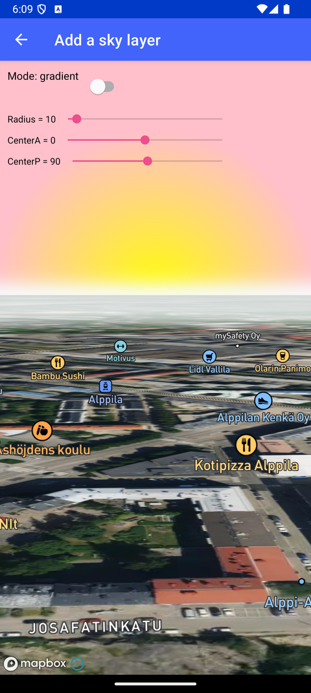

# 添加天空图层（Add a sky layer）

> 官方示例：[add-a-sky-layer](https://docs.mapbox.com/android/maps/examples/android-view/add-a-sky-layer/)

## 示例效果



## 功能说明

添加可定制的天空图层，配合 Terrain 模拟自然光照。

<details>
<summary>英文原文</summary>

This example showcases the usage of the skyLayer in the Mapbox Maps SDK for Android. The activity demonstrates the customization of the skyLayer by allowing the user to adjust various properties such as gradient radius, center azimuth, center polar, atmosphere sun intensity, and colors. The SkyLayerShowcaseActivity class implements these functionalities, providing controls for the user to interact with the skyLayer settings. The skyLayer type can be toggled between gradient and atmosphere, each with specific configuration options. The activity loads a style with Standard Satellite and sets the initial skyLayer properties based on the selected sky type. Users can dynamically change the sky settings using seek bars, affecting parameters like gradient radius and atmosphere sun intensity. The interface updates in real-time as users interact with the controls, adjusting the skyLayer appearance. This activity serves as a visual representation of how the skyLayer can be customized within a Mapbox mapView for creating immersive visual experiences.

</details>

## 示例 Activity

- `SkyLayerShowcaseActivity.kt`

## 示例代码

```kotlin
package com.mapbox.maps.testapp.examples.sky

import android.os.Bundle
import android.view.View
import android.widget.SeekBar
import androidx.appcompat.app.AppCompatActivity
import com.mapbox.maps.Style
import com.mapbox.maps.dsl.cameraOptions
import com.mapbox.maps.extension.style.expressions.dsl.generated.interpolate
import com.mapbox.maps.extension.style.layers.generated.SkyLayer
import com.mapbox.maps.extension.style.layers.generated.skyLayer
import com.mapbox.maps.extension.style.layers.getLayerAs
import com.mapbox.maps.extension.style.layers.properties.generated.SkyType
import com.mapbox.maps.extension.style.style
import com.mapbox.maps.plugin.scalebar.scalebar
import com.mapbox.maps.testapp.R
import com.mapbox.maps.testapp.databinding.ActivitySkyLayerBinding

/**
 * Showcase for Sky layer.
 */
class SkyLayerShowcaseActivity : AppCompatActivity() {

  private var skyLayer: SkyLayer? = null
  private var skyType = SkyType.GRADIENT

  // could be between 0.0 and 180.0
  private var skyGradientRadius = 10.0

  // azimuth, could be between -180.0 and 180.0
  private var skyGradientCenterA = 0.0

  // polar, could be between 0.0 and 180.0
  private var skyGradientCenterP = 90.0

  // could be between 0.0 and 100.0
  private var skyAtmosphereSunIntensity = 10.0

  // azimuth, could be between -180.0 and 180.0
  private var skyAtmosphereCenterA = 0.0

  // polar, could be between 0.0 and 180.0
  private var skyAtmosphereCenterP = 90.0

  private lateinit var binding: ActivitySkyLayerBinding

  override fun onCreate(savedInstanceState: Bundle?) {
    super.onCreate(savedInstanceState)
    binding = ActivitySkyLayerBinding.inflate(layoutInflater)
    setContentView(binding.root)
    applyControls()
    binding.mapView.mapboxMap.loadStyle(
      styleExtension = style(Style.STANDARD_SATELLITE) {
        +skyLayer(SKY_LAYER) {
          skyType(skyType)
          when (skyType) {
            SkyType.GRADIENT -> {
              skyGradient(
                interpolate {
                  linear()
                  skyRadialProgress()
                  literal(0.0)
                  literal(SKY_GRADIENT_COLOR_START)
                  literal(1.0)
                  literal(SKY_GRADIENT_COLOR_END)
                }
              )
              skyGradientRadius(skyGradientRadius)
              skyGradientCenter(listOf(skyGradientCenterA, skyGradientCenterP))
            }
            SkyType.ATMOSPHERE -> {
              skyAtmosphereColor(SKY_ATMOSPHERE_COLOR)
              skyAtmosphereHaloColor(SKY_ATMOSPHERE_HALO_COLOR)
              skyAtmosphereSun(listOf(skyAtmosphereCenterA, skyAtmosphereCenterP))
              skyAtmosphereSunIntensity(skyAtmosphereSunIntensity)
            }
          }
        }
      }
    ) {
      binding.mapView.mapboxMap.setCamera(
        cameraOptions {
          zoom(16.0)
          pitch(85.0)
        }
      )
      binding.mapView.scalebar.enabled = false
      skyLayer = it.getLayerAs(SKY_LAYER)
    }
  }

  private fun applyControls() {
    applyInitials()
    binding.switchSkyMode.setOnCheckedChangeListener { _, isChecked ->
      if (isChecked) {
        skyType = SkyType.ATMOSPHERE
        binding.textSkyMode.text = getString(R.string.sky_mode, skyType.value)
        binding.layoutGradient.visibility = View.GONE
        binding.layoutAtmosphere.visibility = View.VISIBLE
      } else {
        skyType = SkyType.GRADIENT
        binding.textSkyMode.text = getString(R.string.sky_mode, skyType.value)
        binding.layoutGradient.visibility = View.VISIBLE
        binding.layoutAtmosphere.visibility = View.GONE
      }
      applySkyProperties()
    }
    applySkyGradientControls()
    applySkyAtmosphereControls()
  }

  private fun applyInitials() {
    binding.textSkyMode.text = getString(R.string.sky_mode, skyType.value)
    binding.captionAtmosphereCenterA.text = getString(R.string.sky_center_azimuth, skyAtmosphereCenterA.toInt())
    binding.captionAtmosphereCenterP.text = getString(R.string.sky_center_polar, skyAtmosphereCenterP.toInt())
    binding.captionGradientCenterA.text = getString(R.string.sky_center_azimuth, skyGradientCenterA.toInt())
    binding.captionGradientCenterP.text = getString(R.string.sky_center_polar, skyGradientCenterP.toInt())
    binding.captionAtmosphereSunIntensity.text = getString(R.string.sky_sun_intensity, skyAtmosphereSunIntensity.toInt())
    binding.captionGradientRadius.text = getString(R.string.sky_gradient_radius, skyGradientRadius.toInt())
  }

  private fun applySkyGradientControls() {
    binding.seekBarGradientRadius.setOnSeekBarChangeListener(object : SeekBar.OnSeekBarChangeListener {
      override fun onProgressChanged(seekBar: SeekBar?, progress: Int, fromUser: Boolean) {
        skyGradientRadius = progress.toDouble()
        binding.captionGradientRadius.text = getString(R.string.sky_gradient_radius, skyGradientRadius.toInt())
        applySkyProperties()
      }

      override fun onStartTrackingTouch(seekBar: SeekBar?) {}

      override fun onStopTrackingTouch(seekBar: SeekBar?) {}
    })
    binding.seekBarGradientCenterA.setOnSeekBarChangeListener(object : SeekBar.OnSeekBarChangeListener {
      override fun onProgressChanged(seekBar: SeekBar?, progress: Int, fromUser: Boolean) {
        // convert [0, 360] range to [-180, 180]
        skyGradientCenterA = progress.toDouble() - 180.0
        binding.captionGradientCenterA.text = getString(R.string.sky_center_azimuth, skyGradientCenterA.toInt())
        applySkyProperties()
      }

      override fun onStartTrackingTouch(seekBar: SeekBar?) {}

      override fun onStopTrackingTouch(seekBar: SeekBar?) {}
    })
    binding.seekBarGradientCenterP.setOnSeekBarChangeListener(object : SeekBar.OnSeekBarChangeListener {
      override fun onProgressChanged(seekBar: SeekBar?, progress: Int, fromUser: Boolean) {
        skyGradientCenterP = progress.toDouble()
        binding.captionGradientCenterP.text = getString(R.string.sky_center_polar, skyGradientCenterP.toInt())
        applySkyProperties()
      }

      override fun onStartTrackingTouch(seekBar: SeekBar?) {}

      override fun onStopTrackingTouch(seekBar: SeekBar?) {}
    })
  }

  private fun applySkyAtmosphereControls() {
    binding.seekBarAtmosphereSunIntensity.setOnSeekBarChangeListener(object : SeekBar.OnSeekBarChangeListener {
      override fun onProgressChanged(seekBar: SeekBar?, progress: Int, fromUser: Boolean) {
        skyAtmosphereSunIntensity = progress.toDouble()
        binding.captionAtmosphereSunIntensity.text = getString(R.string.sky_sun_intensity, skyAtmosphereSunIntensity.toInt())
        applySkyProperties()
      }

      override fun onStartTrackingTouch(seekBar: SeekBar?) {}

      override fun onStopTrackingTouch(seekBar: SeekBar?) {}
    })
    binding.seekBarAtmosphereCenterA.setOnSeekBarChangeListener(object : SeekBar.OnSeekBarChangeListener {
      override fun onProgressChanged(seekBar: SeekBar?, progress: Int, fromUser: Boolean) {
        // convert [0, 360] range to [-180, 180]
        skyAtmosphereCenterA = progress.toDouble() - 180.0
        binding.captionAtmosphereCenterA.text = getString(R.string.sky_center_azimuth, skyAtmosphereCenterA.toInt())
        applySkyProperties()
      }

      override fun onStartTrackingTouch(seekBar: SeekBar?) {}

      override fun onStopTrackingTouch(seekBar: SeekBar?) {}
    })
    binding.seekBarAtmosphereCenterP.setOnSeekBarChangeListener(object : SeekBar.OnSeekBarChangeListener {
      override fun onProgressChanged(seekBar: SeekBar?, progress: Int, fromUser: Boolean) {
        skyAtmosphereCenterP = progress.toDouble()
        binding.captionAtmosphereCenterP.text = getString(R.string.sky_center_polar, skyAtmosphereCenterP.toInt())
        applySkyProperties()
      }

      override fun onStartTrackingTouch(seekBar: SeekBar?) {}

      override fun onStopTrackingTouch(seekBar: SeekBar?) {}
    })
  }

  private fun applySkyProperties() {
    skyLayer?.skyType(skyType)
    when (skyType) {
      SkyType.GRADIENT -> applySkyGradientProperties()
      SkyType.ATMOSPHERE -> applySkyAtmosphereProperties()
    }
  }

  private fun applySkyGradientProperties() {
    skyLayer?.skyGradientRadius(skyGradientRadius)
    skyLayer?.skyGradientCenter(listOf(skyGradientCenterA, skyGradientCenterP))
  }

  private fun applySkyAtmosphereProperties() {
    skyLayer?.skyAtmosphereSunIntensity(skyAtmosphereSunIntensity)
    skyLayer?.skyAtmosphereSun(listOf(skyAtmosphereCenterA, skyAtmosphereCenterP))
  }

  companion object {
    private const val SKY_LAYER = "sky"

    private const val SKY_GRADIENT_COLOR_START = "yellow"
    private const val SKY_GRADIENT_COLOR_END = "pink"

    private const val SKY_ATMOSPHERE_COLOR = "blue"
    private const val SKY_ATMOSPHERE_HALO_COLOR = "pink"
  }
}
```

## 在 Aura 项目中使用

- UI 框架：**Android View**（与 Aura 当前 `MapFragment` + `MapView` 一致）
- 包名请替换为 `com.catclaw.aura`
- 需在 `local.properties` 配置 `MAPBOX_ACCESS_TOKEN`
- 部分示例依赖 `assets/` 或额外布局文件，请参考 GitHub 示例工程

## 参考链接

- [官方文档（英文）](https://docs.mapbox.com/android/maps/examples/android-view/add-a-sky-layer/)
- [GitHub 源码](https://github.com/mapbox/mapbox-maps-android/blob/v11.24.3/app/src/main/java/com/mapbox/maps/testapp/examples/sky/SkyLayerShowcaseActivity.kt)
- [Android View 示例索引](./README.md)
- [Mapbox 中文指南](../../README.md)
