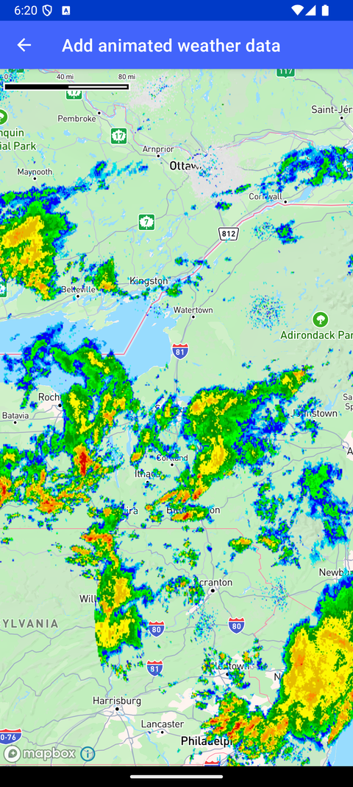

# 动画天气数据（Add animated weather data）

> 官方示例：[add-animated-weather-data](https://docs.mapbox.com/android/maps/examples/android-view/add-animated-weather-data/)

## 示例效果



## 功能说明

使用 ImageSource 加载栅格图像，通过 RasterLayer 显示动画天气数据。

<details>
<summary>英文原文</summary>

This example demonstrates the usage of the Mapbox Maps SDK for Android to load a raster image to a style by utilizing ImageSource and displaying it on a map as animated weather data using RasterLayer. This example includes logic to handle the loading and display of the animated image source on the map. In this example, a raster image is loaded to the map style through an ImageSource defined with specific coordinates, and displayed using a RasterLayer. An internal class is used to update the image displayed on the map with animated weather data. The Runnable class updates the image on the map at regular intervals, cycling through a set of drawable resources representing different weather states.

</details>

## 示例 Activity

- `AnimatedImageSourceActivity.kt`

## 示例代码

```kotlin
package com.mapbox.maps.testapp.examples

import android.os.Bundle
import androidx.appcompat.app.AppCompatActivity
import androidx.lifecycle.Lifecycle
import androidx.lifecycle.lifecycleScope
import androidx.lifecycle.repeatOnLifecycle
import com.mapbox.maps.Image
import com.mapbox.maps.MapboxDelicateApi
import com.mapbox.maps.Style
import com.mapbox.maps.extension.style.layers.generated.rasterLayer
import com.mapbox.maps.extension.style.sources.generated.ImageSource
import com.mapbox.maps.extension.style.sources.generated.imageSource
import com.mapbox.maps.extension.style.sources.getSourceAs
import com.mapbox.maps.extension.style.sources.updateImage
import com.mapbox.maps.extension.style.style
import com.mapbox.maps.testapp.R
import com.mapbox.maps.testapp.databinding.ActivityAnimatedImagesourceBinding
import com.mapbox.maps.testapp.utils.BitmapUtils.bitmapFromDrawableRes
import com.mapbox.maps.toMapboxImage
import kotlinx.coroutines.delay
import kotlinx.coroutines.isActive
import kotlinx.coroutines.launch

/**
 * Load a raster image to a style using ImageSource and display it on a map as
 * animated weather data using RasterLayer.
 */
class AnimatedImageSourceActivity : AppCompatActivity() {

  @OptIn(MapboxDelicateApi::class)
  override fun onCreate(savedInstanceState: Bundle?) {
    super.onCreate(savedInstanceState)
    val binding = ActivityAnimatedImagesourceBinding.inflate(layoutInflater)
    setContentView(binding.root)
    val mapboxMap = binding.mapView.mapboxMap
    mapboxMap.loadStyle(
      style(style = Style.STANDARD) {
        +imageSource(ID_IMAGE_SOURCE) {
          coordinates(
            listOf(
              listOf(-80.425, 46.437),
              listOf(-71.516, 46.437),
              listOf(-71.516, 37.936),
              listOf(-80.425, 37.936)
            )
          )
        }
        +rasterLayer(ID_IMAGE_LAYER, ID_IMAGE_SOURCE) { }
      }
    )
    val drawables: List<Image> = listOf(
      bitmapFromDrawableRes(R.drawable.southeast_radar_0).toMapboxImage(),
      bitmapFromDrawableRes(R.drawable.southeast_radar_1).toMapboxImage(),
      bitmapFromDrawableRes(R.drawable.southeast_radar_2).toMapboxImage(),
      bitmapFromDrawableRes(R.drawable.southeast_radar_3).toMapboxImage(),
    )
    var drawableIndex = 0
    mapboxMap.getStyle {
      val imageSource: ImageSource = it.getSourceAs(ID_IMAGE_SOURCE)!!
      // Create a new coroutine in the lifecycleScope
      lifecycleScope.launch {
        // repeatOnLifecycle launches the block in a new coroutine every time the
        // lifecycle is in the STARTED state (or above) and cancels it when it's STOPPED.
        repeatOnLifecycle(Lifecycle.State.STARTED) {
          while (isActive) {
            imageSource.updateImage(drawables[drawableIndex++])
            drawableIndex %= drawables.size
            delay(1000L)
          }
        }
      }
    }
  }

  companion object {
    private const val ID_IMAGE_SOURCE = "animated_image_source"
    private const val ID_IMAGE_LAYER = "animated_image_layer"
  }
}
```

## 在 Aura 项目中使用

- UI 框架：**Android View**（与 Aura 当前 `MapFragment` + `MapView` 一致）
- 包名请替换为 `com.catclaw.aura`
- 需在 `local.properties` 配置 `MAPBOX_ACCESS_TOKEN`
- 部分示例依赖 `assets/` 或额外布局文件，请参考 GitHub 示例工程

## 参考链接

- [官方文档（英文）](https://docs.mapbox.com/android/maps/examples/android-view/add-animated-weather-data/)
- [GitHub 源码](https://github.com/mapbox/mapbox-maps-android/blob/v11.24.3/app/src/main/java/com/mapbox/maps/testapp/examples/AnimatedImageSourceActivity.kt)
- [Android View 示例索引](./README.md)
- [Mapbox 中文指南](../../README.md)
