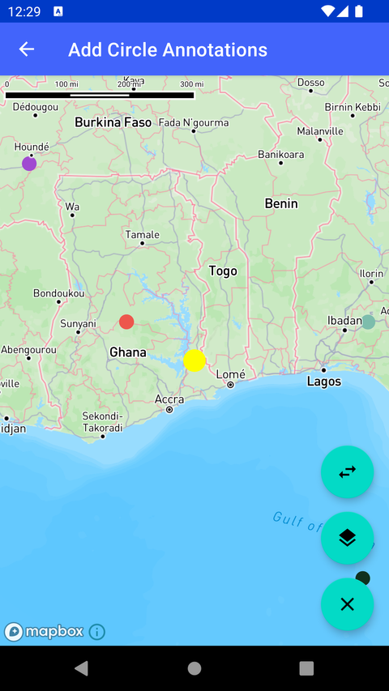

# 添加圆标注（Add Circle Annotations）

> 官方示例：[add-circle-annotations](https://docs.mapbox.com/android/maps/examples/android-view/add-circle-annotations/)

## 示例效果



## 功能说明

在地图上显示圆标注（Circle Annotation）。

<details>
<summary>英文原文</summary>

This example demonstrates how to add Circle annotations using the CircleAnnotation class on the Maps SDK for Android. By implementing various listener interfaces such as OnCircleAnnotationClickListener, OnCircleAnnotationLongClickListener, and OnCircleAnnotationInteractionListener, the example allows users to interact with the annotations. The annotations can be clicked to display a message, long-clicked to enable dragging, selected, and deselected, triggering corresponding events. Additionally, the example includes the functionality to randomly add a large number of Circle annotations worldwide and to load annotations from a GeoJSON file. The map camera settings, annotation color, and radius can be customized, and the annotations can be removed collectively using a button. The example also features switching between different map styles and annotation slots depending on the selected style. There are several ways to add markers, annotations, and other shapes to the map using the Maps SDK. To choose the appropriate approach for your application, read the Markers and annotations guide.

</details>

## 示例 Activity

- `CircleAnnotationActivity.kt`

## 示例代码

```kotlin
package com.mapbox.maps.testapp.examples.markersandcallouts

import android.graphics.Color
import android.os.Bundle
import android.widget.Toast
import androidx.appcompat.app.AppCompatActivity
import androidx.lifecycle.lifecycleScope
import com.mapbox.geojson.FeatureCollection
import com.mapbox.geojson.Point
import com.mapbox.maps.CameraOptions
import com.mapbox.maps.Style
import com.mapbox.maps.plugin.annotation.AnnotationPlugin
import com.mapbox.maps.plugin.annotation.annotations
import com.mapbox.maps.plugin.annotation.generated.CircleAnnotation
import com.mapbox.maps.plugin.annotation.generated.CircleAnnotationOptions
import com.mapbox.maps.plugin.annotation.generated.OnCircleAnnotationClickListener
import com.mapbox.maps.plugin.annotation.generated.OnCircleAnnotationInteractionListener
import com.mapbox.maps.plugin.annotation.generated.OnCircleAnnotationLongClickListener
import com.mapbox.maps.plugin.annotation.generated.createCircleAnnotationManager
import com.mapbox.maps.testapp.databinding.ActivityAnnotationBinding
import com.mapbox.maps.testapp.examples.annotation.AnnotationUtils
import com.mapbox.maps.testapp.examples.annotation.AnnotationUtils.showShortToast
import kotlinx.coroutines.Dispatchers
import kotlinx.coroutines.launch
import kotlinx.coroutines.withContext
import java.util.Random

/**
 * Example showing how to add Circle annotations
 */
class CircleAnnotationActivity : AppCompatActivity() {
  private val random = Random()
  private var styleIndex: Int = 0
  private var slotIndex: Int = 0
  private val nextStyle: String
    get() {
      return AnnotationUtils.STYLES[styleIndex++ % AnnotationUtils.STYLES.size]
    }
  private val nextSlot: String
    get() {
      return AnnotationUtils.SLOTS[slotIndex++ % AnnotationUtils.SLOTS.size]
    }
  private lateinit var annotationPlugin: AnnotationPlugin
  private lateinit var binding: ActivityAnnotationBinding

  override fun onCreate(savedInstanceState: Bundle?) {
    super.onCreate(savedInstanceState)
    binding = ActivityAnnotationBinding.inflate(layoutInflater)
    setContentView(binding.root)
    // Load initial style
    switchToNextStyle()
    Toast.makeText(this, "Long click a circle to enable dragging.", Toast.LENGTH_LONG).show()
    annotationPlugin = binding.mapView.annotations
    val circleAnnotationManager = annotationPlugin.createCircleAnnotationManager().apply {
      // Setup the default properties for all annotations added to this manager
      circleColorInt = Color.YELLOW
      circleRadius = 8.0

      addClickListener(
        OnCircleAnnotationClickListener {
          Toast.makeText(this@CircleAnnotationActivity, "click: ${it.id}", Toast.LENGTH_SHORT)
            .show()
          false
        }
      )
      addLongClickListener(
        OnCircleAnnotationLongClickListener {
          it.isDraggable = true
          Toast.makeText(this@CircleAnnotationActivity, "long click: ${it.id}", Toast.LENGTH_SHORT)
            .show()
          false
        }
      )
      binding.mapView.mapboxMap.setCamera(
        CameraOptions.Builder()
          .center(Point.fromLngLat(CIRCLE_LONGITUDE, CIRCLE_LATITUDE))
          .pitch(0.0)
          .zoom(3.0)
          .bearing(0.0)
          .build()
      )
      addInteractionListener(
        object : OnCircleAnnotationInteractionListener {
          override fun onSelectAnnotation(annotation: CircleAnnotation) {
            Toast.makeText(
              this@CircleAnnotationActivity,
              "onSelectAnnotation: ${annotation.id}",
              Toast.LENGTH_SHORT
            ).show()
          }

          override fun onDeselectAnnotation(annotation: CircleAnnotation) {
            Toast.makeText(
              this@CircleAnnotationActivity,
              "onDeselectAnnotation: ${annotation.id}",
              Toast.LENGTH_SHORT
            ).show()
          }
        }
      )

      val circleAnnotationOptions: CircleAnnotationOptions = CircleAnnotationOptions()
        .withPoint(Point.fromLngLat(CIRCLE_LONGITUDE, CIRCLE_LATITUDE))
        // overwrite circleAnnotationManager base circle annotation's radius to the specific value of 12.0
        .withCircleRadius(12.0)
        .withDraggable(false)
      create(circleAnnotationOptions)

      lifecycleScope.launch {
        // random add circles across the globe
        val circleAnnotationOptionsList = withContext(Dispatchers.Default) {
          List(2_000) {
            val color =
              Color.argb(255, random.nextInt(256), random.nextInt(256), random.nextInt(256))
            CircleAnnotationOptions()
              .withPoint(AnnotationUtils.createRandomPoint())
              // overwrite circleAnnotationManager base circle color for this specific annotation to random color.
              .withCircleColor(color)
              .withDraggable(false)
          }
        }
        create(circleAnnotationOptionsList)
        val annotationsJsonContents = withContext(Dispatchers.Default) {
          FeatureCollection.fromJson(
            AnnotationUtils.loadStringFromAssets(
              this@CircleAnnotationActivity,
              "annotations.json"
            )
          )
        }
        create(annotationsJsonContents)
      }
    }

    binding.deleteAll.setOnClickListener {
      annotationPlugin.removeAnnotationManager(circleAnnotationManager)
    }
    binding.changeStyle.setOnClickListener {
      switchToNextStyle()
    }
    binding.changeSlot.setOnClickListener {
      val slot = nextSlot
      showShortToast("Switching to $slot slot")
      circleAnnotationManager.slot = slot
    }
  }

  private fun switchToNextStyle() {
    val style = nextStyle
    binding.mapView.mapboxMap.loadStyle(style)
    // only standard based styles support slots
    binding.changeSlot.isEnabled = (style == Style.STANDARD || style == Style.STANDARD_SATELLITE)
  }

  companion object {
    private const val CIRCLE_LONGITUDE = 0.381457
    private const val CIRCLE_LATITUDE = 6.687337
  }
}
```

## 在 Aura 项目中使用

- UI 框架：**Android View**（与 Aura 当前 `MapFragment` + `MapView` 一致）
- 包名请替换为 `com.catclaw.aura`
- 需在 `local.properties` 配置 `MAPBOX_ACCESS_TOKEN`
- 部分示例依赖 `assets/` 或额外布局文件，请参考 GitHub 示例工程

## 参考链接

- [官方文档（英文）](https://docs.mapbox.com/android/maps/examples/android-view/add-circle-annotations/)
- [GitHub 源码](https://github.com/mapbox/mapbox-maps-android/blob/v11.24.3/app/src/main/java/com/mapbox/maps/testapp/examples/markersandcallouts/CircleAnnotationActivity.kt)
- [Android View 示例索引](./README.md)
- [Mapbox 中文指南](../../README.md)
