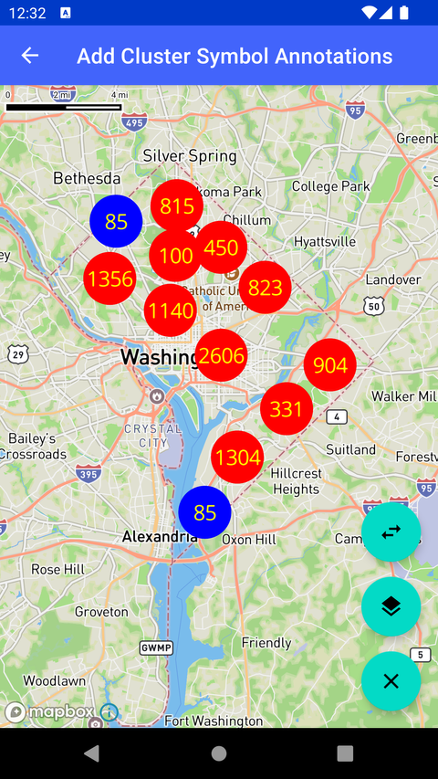

# Symbol 聚合标注（Add Cluster Symbol Annotations）

> 官方示例：[add-cluster-symbol-annotations](https://docs.mapbox.com/android/maps/examples/android-view/add-cluster-symbol-annotations/)

## 示例效果



## 功能说明

以聚合方式显示华盛顿特区消防栓等 Symbol 标注。

<details>
<summary>英文原文</summary>

This example demonstrates how to use cluster annotations on a Mapbox Maps SDK for Android application. The PointAnnotationClusterActivity class extends AppCompatActivity and implements CoroutineScope to handle asynchronous operations. The class manages the creation of cluster annotations and includes methods to handle data loading and UI interactions. The example involves using the PointAnnotationManager cluster annotations with different styles, including defining colors and text sizes for clusters. It fetches GeoJSON data from a provided URL, shuffles the features, and creates point annotation options for the features. Additionally, the class features methods for changing styles, switching slots, and deleting all point annotations as part of the map interaction functionality.

</details>

## 示例 Activity

- `PointAnnotationClusterActivity.kt`

## 示例代码

```kotlin
package com.mapbox.maps.testapp.examples.markersandcallouts

import android.graphics.Color
import android.os.Bundle
import android.view.View
import android.widget.Toast
import androidx.appcompat.app.AppCompatActivity
import com.mapbox.geojson.FeatureCollection
import com.mapbox.geojson.Point
import com.mapbox.maps.CameraOptions
import com.mapbox.maps.MapboxMap
import com.mapbox.maps.Style
import com.mapbox.maps.extension.style.expressions.dsl.generated.literal
import com.mapbox.maps.extension.style.expressions.generated.Expression.Companion.color
import com.mapbox.maps.logE
import com.mapbox.maps.plugin.annotation.AnnotationConfig
import com.mapbox.maps.plugin.annotation.AnnotationSourceOptions
import com.mapbox.maps.plugin.annotation.ClusterOptions
import com.mapbox.maps.plugin.annotation.annotations
import com.mapbox.maps.plugin.annotation.generated.OnPointAnnotationClickListener
import com.mapbox.maps.plugin.annotation.generated.OnPointAnnotationLongClickListener
import com.mapbox.maps.plugin.annotation.generated.PointAnnotationManager
import com.mapbox.maps.plugin.annotation.generated.PointAnnotationOptions
import com.mapbox.maps.plugin.annotation.generated.createPointAnnotationManager
import com.mapbox.maps.testapp.databinding.ActivityAnnotationBinding
import com.mapbox.maps.testapp.examples.annotation.AnnotationUtils
import com.mapbox.maps.testapp.examples.annotation.AnnotationUtils.showShortToast
import kotlinx.coroutines.CoroutineScope
import kotlinx.coroutines.Dispatchers
import kotlinx.coroutines.Job
import kotlinx.coroutines.launch

/**
 * Example showing how to add Symbol cluster annotations
 */
class PointAnnotationClusterActivity : AppCompatActivity(), CoroutineScope {
  private var mapboxMap: MapboxMap? = null
  private val job = Job()
  override val coroutineContext = job + Dispatchers.IO
  private var pointAnnotationManager: PointAnnotationManager? = null
  private var options: List<PointAnnotationOptions>? = null
  private var styleIndex: Int = 0
  private var slotIndex: Int = 0

  // STANDARD style doesn't support ICON_FIRE_STATION image
  private val styles =
    AnnotationUtils.STYLES.filterNot { it == Style.STANDARD || it == Style.STANDARD_SATELLITE }
  private val nextStyle: String
    get() = styles[styleIndex++ % styles.size]
  private val nextSlot: String
    get() = AnnotationUtils.SLOTS[slotIndex++ % AnnotationUtils.SLOTS.size]
  private lateinit var binding: ActivityAnnotationBinding

  override fun onCreate(savedInstanceState: Bundle?) {
    super.onCreate(savedInstanceState)
    binding = ActivityAnnotationBinding.inflate(layoutInflater)
    setContentView(binding.root)
    binding.progress.visibility = View.VISIBLE
    mapboxMap = binding.mapView.mapboxMap
      .apply {
        setCamera(
          CameraOptions.Builder()
            .center(Point.fromLngLat(LONGITUDE, LATITUDE))
            .zoom(10.0)
            .build()
        )
        loadStyle(nextStyle) {
          val annotationPlugin = binding.mapView.annotations
          val annotationConfig = AnnotationConfig(
            annotationSourceOptions = AnnotationSourceOptions(
              clusterOptions = ClusterOptions(
                textColorExpression = color(Color.YELLOW),
                textColor = Color.BLACK, // Will not be applied as textColorExpression has been set
                textSize = 20.0,
                circleRadiusExpression = literal(25.0),
                colorLevels = listOf(
                  Pair(100, Color.RED),
                  Pair(50, Color.BLUE),
                  Pair(0, Color.GREEN)
                )
              )
            )
          )
          pointAnnotationManager =
            annotationPlugin.createPointAnnotationManager(annotationConfig).apply {
              // Set the icon image for this point annotation manager, so it will be applied to all annotations
              iconImage = ICON_FIRE_STATION
              addClickListener(
                OnPointAnnotationClickListener {
                  Toast.makeText(
                    this@PointAnnotationClusterActivity,
                    "Click: ${it.id}",
                    Toast.LENGTH_SHORT
                  ).show()
                  true
                }
              )
              addLongClickListener(
                OnPointAnnotationLongClickListener {
                  Toast.makeText(
                    this@PointAnnotationClusterActivity,
                    "Long Click: ${it.id}",
                    Toast.LENGTH_SHORT
                  )
                    .show()
                  true
                }
              )
              addClusterClickListener {
                Toast.makeText(
                  this@PointAnnotationClusterActivity,
                  "Cluster Click ID: ${it.clusterId}, points:  ${it.pointCount}, abbreviatedCount: ${it.pointCountAbbreviated}",
                  Toast.LENGTH_SHORT
                ).show()
                true
              }
              addClusterLongClickListener {
                Toast.makeText(
                  this@PointAnnotationClusterActivity,
                  "Cluster Long Click ID:${it.clusterId}, points:  ${it.pointCount}, abbreviatedCount: ${it.pointCountAbbreviated}",
                  Toast.LENGTH_SHORT
                ).show()
                true
              }
            }

          launch {
            loadData()
          }
        }
      }

    binding.deleteAll.setOnClickListener { pointAnnotationManager?.deleteAll() }
    binding.changeStyle.setOnClickListener {
      binding.mapView.mapboxMap.loadStyle(nextStyle)
    }
    binding.changeSlot.setOnClickListener {
      val slot = nextSlot
      showShortToast("Switching to $slot slot")
      pointAnnotationManager?.slot = slot
    }
  }

  private fun loadData() {
    val json = AnnotationUtils.loadStringFromNet(this@PointAnnotationClusterActivity, POINTS_URL)
    if (json == null) {
      runOnUiThread {
        Toast.makeText(this@PointAnnotationClusterActivity, "Failed to download data from network", Toast.LENGTH_LONG).show()
        binding.progress.visibility = View.GONE
      }
      return
    }
    try {
      FeatureCollection.fromJson(json).features()?.let { features ->
        features.shuffle()
        options = features.take(AMOUNT).map { feature ->
          PointAnnotationOptions()
            .withGeometry((feature.geometry() as Point))
        }
      }
    } catch (e: Exception) {
      logE(TAG, "Failed to parse GeoJSON: ${e.message}")
      runOnUiThread {
        Toast.makeText(this@PointAnnotationClusterActivity, "Failed to parse GeoJSON: ${e.message}", Toast.LENGTH_LONG).show()
      }
    }
    runOnUiThread {
      options?.let {
        pointAnnotationManager?.create(it)
      }
      binding.progress.visibility = View.GONE
    }
  }

  companion object {
    private const val TAG = "PointAnnotationCluster"
    private const val AMOUNT = 10000
    private const val ICON_FIRE_STATION = "fire-station"
    private const val LONGITUDE = -77.00897
    private const val LATITUDE = 38.87031
    private const val POINTS_URL =
      "https://opendata.arcgis.com/datasets/01d0ff375695466d93d1fa2a976e2bdd_5.geojson"
  }
}
```

## 在 Aura 项目中使用

- UI 框架：**Android View**（与 Aura 当前 `MapFragment` + `MapView` 一致）
- 包名请替换为 `com.catclaw.aura`
- 需在 `local.properties` 配置 `MAPBOX_ACCESS_TOKEN`
- 部分示例依赖 `assets/` 或额外布局文件，请参考 GitHub 示例工程

## 参考链接

- [官方文档（英文）](https://docs.mapbox.com/android/maps/examples/android-view/add-cluster-symbol-annotations/)
- [GitHub 源码](https://github.com/mapbox/mapbox-maps-android/blob/v11.24.3/app/src/main/java/com/mapbox/maps/testapp/examples/markersandcallouts/PointAnnotationClusterActivity.kt)
- [Android View 示例索引](./README.md)
- [Mapbox 中文指南](../../README.md)
