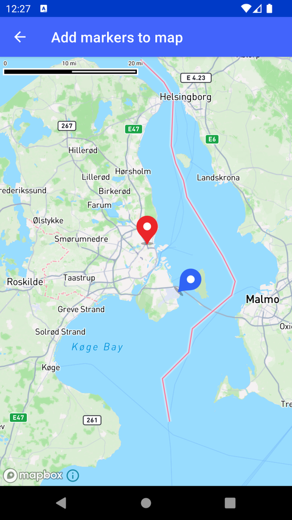

# 添加多种图标标记（Add markers to map）

> 官方示例：[add-markers-to-map](https://docs.mapbox.com/android/maps/examples/android-view/add-markers-to-map/)

## 示例效果



## 功能说明

添加使用不同图标的 marker。

<details>
<summary>英文原文</summary>

This example demonstrates how to use the Mapbox Maps SDK for Android to add markers with different icons and properties to a map. It uses a geoJsonSource to define the marker data, including custom properties such as icon_key to determine the marker style. This example prepares two marker icons (RED_ICON_ID and BLUE_ICON_ID) from drawable resources and adds them to the map style using the image method. A symbolLayer is used to display the markers, with the iconImage and iconRotate properties dynamically set using the match expression. This enables conditional styling of markers based on their icon_key value, allowing customization of both the icon image and rotation. The example also demonstrates key configuration options, such as iconAllowOverlap and iconAnchor, to control marker behavior and appearance. For further details, refer to the Mapbox Style Specification. There are several ways to add markers, annotations, and other shapes to the map using the Maps SDK. To choose the appropriate approach for your application, read the Markers and annotations guide.

</details>

## 示例 Activity

- `AddMarkersSymbolActivity.kt`

## 示例代码

```kotlin
package com.mapbox.maps.testapp.examples.markersandcallouts

import android.os.Bundle
import androidx.appcompat.app.AppCompatActivity
import androidx.core.content.ContextCompat
import androidx.core.graphics.drawable.toBitmap
import com.mapbox.geojson.Feature
import com.mapbox.geojson.FeatureCollection
import com.mapbox.geojson.Point
import com.mapbox.maps.Style
import com.mapbox.maps.extension.style.expressions.dsl.generated.match
import com.mapbox.maps.extension.style.image.image
import com.mapbox.maps.extension.style.layers.generated.symbolLayer
import com.mapbox.maps.extension.style.layers.properties.generated.IconAnchor
import com.mapbox.maps.extension.style.sources.generated.geoJsonSource
import com.mapbox.maps.extension.style.style
import com.mapbox.maps.testapp.R
import com.mapbox.maps.testapp.databinding.ActivityAddMarkerSymbolBinding

/**
 * Example showing how to add 2 different markers based on their type
 */
class AddMarkersSymbolActivity : AppCompatActivity() {

  override fun onCreate(savedInstanceState: Bundle?) {
    super.onCreate(savedInstanceState)
    val binding = ActivityAddMarkerSymbolBinding.inflate(layoutInflater)
    setContentView(binding.root)

    binding.mapView.mapboxMap.loadStyle(
      styleExtension = style(Style.STANDARD) {
        // prepare red marker from resources
        +image(
          RED_ICON_ID,
          ContextCompat.getDrawable(this@AddMarkersSymbolActivity, R.drawable.ic_red_marker)!!.toBitmap()
        )
        // prepare blue marker from resources
        +image(
          BLUE_ICON_ID,
          ContextCompat.getDrawable(this@AddMarkersSymbolActivity, R.drawable.ic_blue_marker)!!.toBitmap()
        )
        // prepare source that will hold icons and add extra string property to each of it
        // to identify what marker icon should be used
        +geoJsonSource(SOURCE_ID) {
          featureCollection(
            FeatureCollection.fromFeatures(
              arrayOf(
                Feature.fromGeometry(
                  Point.fromLngLat(
                    12.554729,
                    55.70651
                  )
                ).apply {
                  addStringProperty(ICON_KEY, ICON_RED_PROPERTY)
                },
                Feature.fromGeometry(
                  Point.fromLngLat(
                    12.65147,
                    55.608166
                  )
                ).apply {
                  addStringProperty(ICON_KEY, ICON_BLUE_PROPERTY)
                }
              )
            )
          )
        }
        // finally prepare symbol layer with
        // if get(ICON_KEY) == ICON_RED_PROPERTY
        //  then
        //    RED_MARKER
        //  else if get(ICON_KEY) == ICON_BLUE_PROPERTY
        //    BLUE_MARKER
        //  else
        //    RED_MARKER
        // rotate the blue marker with 45 degrees.
        +symbolLayer(LAYER_ID, SOURCE_ID) {
          iconImage(
            match {
              get {
                literal(ICON_KEY)
              }
              stop {
                literal(ICON_RED_PROPERTY)
                literal(RED_ICON_ID)
              }
              stop {
                literal(ICON_BLUE_PROPERTY)
                literal(BLUE_ICON_ID)
              }
              literal(RED_ICON_ID)
            }
          )
          iconRotate(
            match {
              get {
                literal(ICON_KEY)
              }
              stop {
                literal(ICON_BLUE_PROPERTY)
                literal(45.0)
              }
              literal(0.0)
            }
          )
          iconAllowOverlap(true)
          iconAnchor(IconAnchor.BOTTOM)
        }
      }
    )
  }

  companion object {
    private const val RED_ICON_ID = "red"
    private const val BLUE_ICON_ID = "blue"
    private const val SOURCE_ID = "source_id"
    private const val LAYER_ID = "layer_id"
    private const val ICON_KEY = "icon_key"
    private const val ICON_RED_PROPERTY = "icon_red_property"
    private const val ICON_BLUE_PROPERTY = "icon_blue_property"
  }
}
```

## 在 Aura 项目中使用

- UI 框架：**Android View**（与 Aura 当前 `MapFragment` + `MapView` 一致）
- 包名请替换为 `com.catclaw.aura`
- 需在 `local.properties` 配置 `MAPBOX_ACCESS_TOKEN`
- 部分示例依赖 `assets/` 或额外布局文件，请参考 GitHub 示例工程

## 参考链接

- [官方文档（英文）](https://docs.mapbox.com/android/maps/examples/android-view/add-markers-to-map/)
- [GitHub 源码](https://github.com/mapbox/mapbox-maps-android/blob/v11.24.3/app/src/main/java/com/mapbox/maps/testapp/examples/markersandcallouts/AddMarkersSymbolActivity.kt)
- [Android View 示例索引](./README.md)
- [Mapbox 中文指南](../../README.md)
