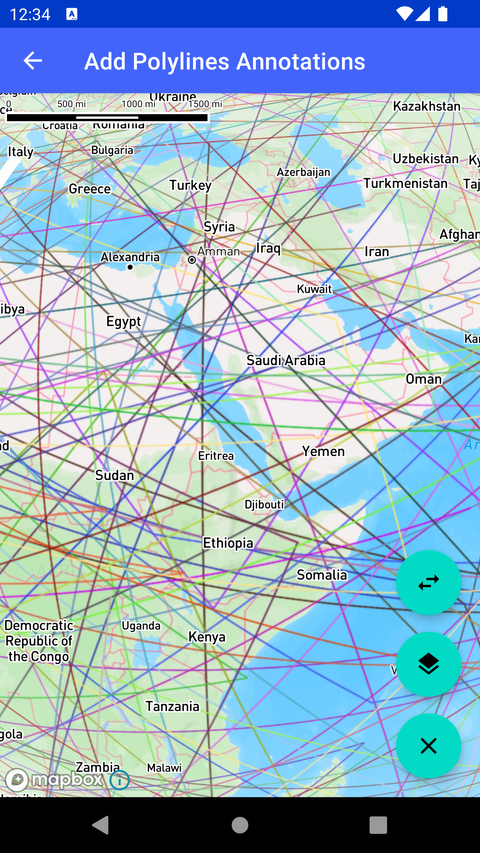

# 添加折线标注（Add Polylines Annotations）

> 官方示例：[add-polylines-annotations](https://docs.mapbox.com/android/maps/examples/android-view/add-polylines-annotations/)

## 示例效果



## 功能说明

在地图上显示折线标注（Polyline Annotation）。

<details>
<summary>英文原文</summary>

This example demonstrates how to add Line annotations using Mapbox Maps SDK for Android. In the PolylineAnnotationActivity class, PolylinAnnotation are added to the MapView. The class handles creating Line annotations, setting their specific configurations such as line color and width, and managing interaction with the annotations. The example includes functionalities such as clicking on Line annotations to show a Toast message, selecting and deselecting annotations with corresponding messages, and loading different styles for the MapView. Additionally, it showcases the usage of PolylineAnnotationOptions to specify points, line color, and width for each Line annotation. Random lines are generated globally, and the app allows for switching between different slots for annotations. This activity serves as a guide for incorporating Line annotations to enhance mapping applications. There are several ways to add markers, annotations, and other shapes to the map using the Maps SDK. To choose the appropriate approach for your application, read the Markers and annotations guide.

</details>

## 示例 Activity

- `PolylineAnnotationActivity.kt`

## 示例代码

```kotlin
package com.mapbox.maps.testapp.examples.markersandcallouts

import android.graphics.Color
import android.os.Bundle
import android.widget.Toast
import androidx.appcompat.app.AppCompatActivity
import androidx.lifecycle.lifecycleScope
import com.mapbox.geojson.FeatureCollection
import com.mapbox.geojson.Point
import com.mapbox.maps.CameraOptions
import com.mapbox.maps.extension.style.layers.getLayer
import com.mapbox.maps.plugin.annotation.AnnotationConfig
import com.mapbox.maps.plugin.annotation.AnnotationPlugin
import com.mapbox.maps.plugin.annotation.annotations
import com.mapbox.maps.plugin.annotation.generated.OnPolylineAnnotationClickListener
import com.mapbox.maps.plugin.annotation.generated.OnPolylineAnnotationInteractionListener
import com.mapbox.maps.plugin.annotation.generated.OnPolylineAnnotationLongClickListener
import com.mapbox.maps.plugin.annotation.generated.PolylineAnnotation
import com.mapbox.maps.plugin.annotation.generated.PolylineAnnotationManager
import com.mapbox.maps.plugin.annotation.generated.PolylineAnnotationOptions
import com.mapbox.maps.plugin.annotation.generated.createPolylineAnnotationManager
import com.mapbox.maps.testapp.databinding.ActivityAnnotationBinding
import com.mapbox.maps.testapp.examples.annotation.AnnotationUtils
import com.mapbox.maps.testapp.examples.annotation.AnnotationUtils.showShortToast
import kotlinx.coroutines.Dispatchers
import kotlinx.coroutines.launch
import kotlinx.coroutines.withContext
import java.util.Random

/**
 * Example showing how to add Line annotations
 */
class PolylineAnnotationActivity : AppCompatActivity() {
  private val random = Random()
  private var polylineAnnotationManager: PolylineAnnotationManager? = null
  private var styleIndex: Int = 0
  private var slotIndex: Int = 0
  private val nextStyle: String
    get() {
      return AnnotationUtils.STYLES[styleIndex++ % AnnotationUtils.STYLES.size]
    }
  private val nextSlot: String
    get() {
      return AnnotationUtils.SLOTS[slotIndex++ % AnnotationUtils.SLOTS.size]
    }

  private lateinit var annotationPlugin: AnnotationPlugin

  override fun onCreate(savedInstanceState: Bundle?) {
    super.onCreate(savedInstanceState)
    val binding = ActivityAnnotationBinding.inflate(layoutInflater)
    setContentView(binding.root)
    binding.mapView.mapboxMap.setCamera(
      CameraOptions.Builder()
        .center(Point.fromLngLat(-7.0, -1.0))
        .pitch(0.0)
        .zoom(4.0)
        .bearing(0.0)
        .build()
    )
    binding.mapView.mapboxMap.loadStyle(nextStyle) {
      annotationPlugin = binding.mapView.annotations
      polylineAnnotationManager = annotationPlugin.createPolylineAnnotationManager(
        annotationConfig = AnnotationConfig(PITCH_OUTLINE, LAYER_ID, SOURCE_ID)
      ).apply {
        it.getLayer(LAYER_ID)?.let { layer ->
          Toast.makeText(this@PolylineAnnotationActivity, layer.layerId, Toast.LENGTH_LONG).show()
        }
        addClickListener(
          OnPolylineAnnotationClickListener {
            Toast.makeText(this@PolylineAnnotationActivity, "click ${it.id}", Toast.LENGTH_SHORT)
              .show()
            false
          }
        )
        addLongClickListener(
          OnPolylineAnnotationLongClickListener {
            Toast.makeText(this@PolylineAnnotationActivity, "long click ${it.id}", Toast.LENGTH_SHORT)
              .show()
            false
          }
        )

        addInteractionListener(object : OnPolylineAnnotationInteractionListener {
          override fun onSelectAnnotation(annotation: PolylineAnnotation) {
            Toast.makeText(
              this@PolylineAnnotationActivity,
              "onSelectAnnotation ${annotation.id}",
              Toast.LENGTH_SHORT
            ).show()
          }

          override fun onDeselectAnnotation(annotation: PolylineAnnotation) {
            Toast.makeText(
              this@PolylineAnnotationActivity,
              "onDeselectAnnotation ${annotation.id}",
              Toast.LENGTH_SHORT
            ).show()
          }
        })

        val points = listOf(
          Point.fromLngLat(-4.375974, -2.178992),
          Point.fromLngLat(-7.639772, -4.107888),
          Point.fromLngLat(-11.439207, 2.798737),
        )

        val polylineAnnotationOptions: PolylineAnnotationOptions = PolylineAnnotationOptions()
          .withPoints(points)
          .withLineColor(Color.RED)
          .withLineWidth(5.0)
        create(polylineAnnotationOptions)

        // random add lines across the globe
        val lineOptionsList = List(100) {
          val color = Color.argb(255, random.nextInt(256), random.nextInt(256), random.nextInt(256))
          PolylineAnnotationOptions()
            .withPoints(AnnotationUtils.createRandomPoints())
            .withLineColor(color)
        }

        create(lineOptionsList)

        lifecycleScope.launch {
          val featureCollection = withContext(Dispatchers.Default) {
            FeatureCollection.fromJson(
              AnnotationUtils.loadStringFromAssets(
                this@PolylineAnnotationActivity,
                "annotations.json"
              )
            )
          }
          create(featureCollection)
        }
      }
    }

    binding.deleteAll.setOnClickListener {
      polylineAnnotationManager?.let {
        annotationPlugin.removeAnnotationManager(it)
      }
    }
    binding.changeStyle.setOnClickListener {
      binding.mapView.mapboxMap.loadStyle(nextStyle)
    }
    binding.changeSlot.setOnClickListener {
      val slot = nextSlot
      showShortToast("Switching to $slot slot")
      polylineAnnotationManager?.slot = slot
    }
  }

  companion object {
    private const val LAYER_ID = "line_layer"
    private const val SOURCE_ID = "line_source"
    private const val PITCH_OUTLINE = "pitch-outline"
  }
}
```

## 在 Aura 项目中使用

- UI 框架：**Android View**（与 Aura 当前 `MapFragment` + `MapView` 一致）
- 包名请替换为 `com.catclaw.aura`
- 需在 `local.properties` 配置 `MAPBOX_ACCESS_TOKEN`
- 部分示例依赖 `assets/` 或额外布局文件，请参考 GitHub 示例工程

## 参考链接

- [官方文档（英文）](https://docs.mapbox.com/android/maps/examples/android-view/add-polylines-annotations/)
- [GitHub 源码](https://github.com/mapbox/mapbox-maps-android/blob/v11.24.3/app/src/main/java/com/mapbox/maps/testapp/examples/markersandcallouts/PolylineAnnotationActivity.kt)
- [Android View 示例索引](./README.md)
- [Mapbox 中文指南](../../README.md)
