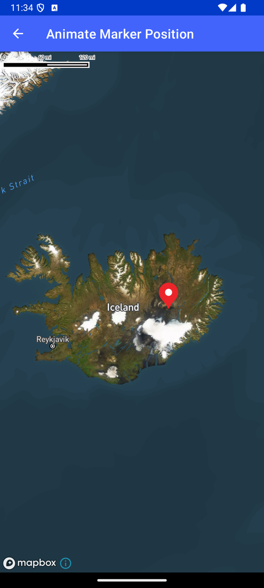

# 标记位置动画（Animate Marker Position）

> 官方示例：[animate-marker-position](https://docs.mapbox.com/android/maps/examples/android-view/animate-marker-position/)

## 示例效果



## 功能说明

动画更新 marker/annotation 的位置。

<details>
<summary>英文原文</summary>

This example demonstrates how to use animations to move a marker to where a user clicks on the map with Mapbox Maps SDK for Android. The code below allows the user to click on the map to trigger an animation moving the marker to the clicked location. The onMapClick() event starts the animation, moving the marker from its current position towards the clicked position. A guard is in place to interrupt a current animation to move to a new trajectory, if the user clicks while the animation is playing. To learn more about how to add markers, annotations, and other shapes to the map, read the Markers and annotations guide.

</details>

## 示例 Activity

- `AnimatedMarkerActivity.kt`

## 示例代码

```kotlin
package com.mapbox.maps.testapp.examples.markersandcallouts

import android.animation.TypeEvaluator
import android.animation.ValueAnimator
import android.os.Bundle
import android.widget.Toast
import androidx.appcompat.app.AppCompatActivity
import androidx.core.content.ContextCompat
import androidx.core.graphics.drawable.toBitmap
import com.mapbox.geojson.Feature
import com.mapbox.geojson.Point
import com.mapbox.maps.Style
import com.mapbox.maps.extension.style.image.image
import com.mapbox.maps.extension.style.layers.generated.symbolLayer
import com.mapbox.maps.extension.style.sources.generated.GeoJsonSource
import com.mapbox.maps.extension.style.sources.generated.geoJsonSource
import com.mapbox.maps.extension.style.style
import com.mapbox.maps.plugin.gestures.OnMapClickListener
import com.mapbox.maps.plugin.gestures.addOnMapClickListener
import com.mapbox.maps.plugin.gestures.removeOnMapClickListener
import com.mapbox.maps.testapp.R
import com.mapbox.maps.testapp.databinding.ActivityAnimatedMarkerBinding

/**
 * Example of animating a map marker on click.
 */
class AnimatedMarkerActivity : AppCompatActivity(), OnMapClickListener {

  private lateinit var geojsonSource: GeoJsonSource
  private var currentPoint = Point.fromLngLat(-18.167040, 64.900932)
  private var animator: ValueAnimator? = null
  private lateinit var binding: ActivityAnimatedMarkerBinding

  override fun onCreate(savedInstanceState: Bundle?) {
    super.onCreate(savedInstanceState)
    binding = ActivityAnimatedMarkerBinding.inflate(layoutInflater)
    setContentView(binding.root)

    geojsonSource = geoJsonSource("source-id") {
      feature(Feature.fromGeometry(currentPoint))
    }

    val mapboxMap = binding.mapView.mapboxMap
    mapboxMap.loadStyle(
      style(Style.STANDARD_SATELLITE) {
        +image(
          "marker_icon",
          ContextCompat.getDrawable(this@AnimatedMarkerActivity, R.drawable.ic_red_marker)!!.toBitmap()
        )
        +geojsonSource
        +symbolLayer(layerId = "layer-id", sourceId = "source-id") {
          iconImage("marker_icon")
          iconIgnorePlacement(true)
          iconAllowOverlap(true)
        }
      }
    ) {
      Toast.makeText(
        this@AnimatedMarkerActivity,
        getString(R.string.tap_on_map_instruction),
        Toast.LENGTH_LONG
      ).show()
      mapboxMap.addOnMapClickListener(this@AnimatedMarkerActivity)
    }
  }

  override fun onMapClick(point: Point): Boolean {
    // When the user clicks on the map, we want to animate the marker to that location.
    animator?.let {
      if (it.isStarted) {
        currentPoint = it.animatedValue as Point
        it.cancel()
      }
    }

    val pointEvaluator = TypeEvaluator<Point> { fraction, startValue, endValue ->
      Point.fromLngLat(
        startValue.longitude() + fraction * (endValue.longitude() - startValue.longitude()),
        startValue.latitude() + fraction * (endValue.latitude() - startValue.latitude())
      )
    }
    animator = ValueAnimator().apply {
      setObjectValues(currentPoint, point)
      setEvaluator(pointEvaluator)
      addUpdateListener {
        geojsonSource.geometry(it.animatedValue as Point)
      }
      duration = 2000
      start()
    }
    currentPoint = point
    return true
  }

  override fun onDestroy() {
    super.onDestroy()
    animator?.cancel()
    binding.mapView.mapboxMap.removeOnMapClickListener(this)
  }
}
```

## 在 Aura 项目中使用

- UI 框架：**Android View**（与 Aura 当前 `MapFragment` + `MapView` 一致）
- 包名请替换为 `com.catclaw.aura`
- 需在 `local.properties` 配置 `MAPBOX_ACCESS_TOKEN`
- 部分示例依赖 `assets/` 或额外布局文件，请参考 GitHub 示例工程

## 参考链接

- [官方文档（英文）](https://docs.mapbox.com/android/maps/examples/android-view/animate-marker-position/)
- [GitHub 源码](https://github.com/mapbox/mapbox-maps-android/blob/v11.24.3/app/src/main/java/com/mapbox/maps/testapp/examples/markersandcallouts/AnimatedMarkerActivity.kt)
- [Android View 示例索引](./README.md)
- [Mapbox 中文指南](../../README.md)
