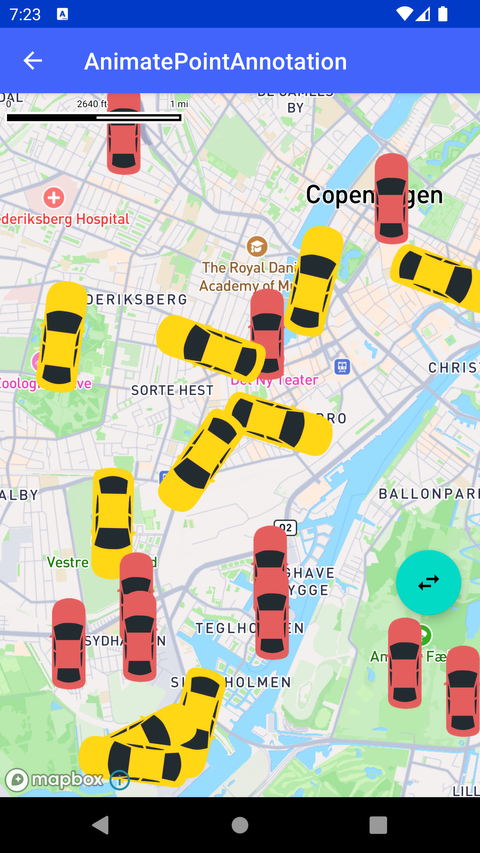

# 点标注动画（Animate Point Annotations）

> 官方示例：[animate-point-annotation](https://docs.mapbox.com/android/maps/examples/android-view/animate-point-annotation/)

## 示例效果



## 功能说明

对地图上的 Point Annotation 进行动画。

<details>
<summary>英文原文</summary>

This example demonstrates how to add animations to point annotations using the Mapbox Maps SDK for Android. The code below renders several point annotations with R.drawable.ic_car_top image from the drawables folder of the TestApp. Some of these ViewAnnotations are statically spawned on the map while the other set receive animations. The list of cars with animations is the iterated through, updating their location on screen. To learn more about how to add markers, annotations, and other shapes to the map, read the Markers and annotations guide.

</details>

## 示例 Activity

- `AnimatePointAnnotationActivity.kt`

## 示例代码

```kotlin
package com.mapbox.maps.testapp.examples.annotation

import android.animation.TypeEvaluator
import android.animation.ValueAnimator
import android.os.Bundle
import android.view.View
import android.view.animation.LinearInterpolator
import androidx.appcompat.app.AppCompatActivity
import androidx.core.animation.addListener
import com.mapbox.geojson.Point
import com.mapbox.maps.CoordinateBounds
import com.mapbox.maps.MapLoaded
import com.mapbox.maps.MapLoadedCallback
import com.mapbox.maps.MapboxMap
import com.mapbox.maps.dsl.cameraOptions
import com.mapbox.maps.extension.style.layers.properties.generated.IconPitchAlignment
import com.mapbox.maps.plugin.annotation.annotations
import com.mapbox.maps.plugin.annotation.generated.PointAnnotation
import com.mapbox.maps.plugin.annotation.generated.PointAnnotationManager
import com.mapbox.maps.plugin.annotation.generated.PointAnnotationOptions
import com.mapbox.maps.plugin.annotation.generated.createPointAnnotationManager
import com.mapbox.maps.testapp.R
import com.mapbox.maps.testapp.databinding.ActivityAnnotationBinding
import com.mapbox.maps.testapp.utils.BitmapUtils.bitmapFromDrawableRes
import com.mapbox.maps.toCameraOptions
import com.mapbox.turf.TurfMeasurement
import java.util.Random

/**
 * Example showing how to add point annotations and animate them
 */
class AnimatePointAnnotationActivity : AppCompatActivity(), MapLoadedCallback {
  private var pointAnnotationManager: PointAnnotationManager? = null
  private var animateCarList = listOf<PointAnnotation>()
  private val animators: MutableList<ValueAnimator> = mutableListOf()
  private var noAnimateCarNum: Int = 10
  private var animateCarNum: Int = 10
  private var animateDuration = 5000L
  private lateinit var mapboxMap: MapboxMap
  private lateinit var binding: ActivityAnnotationBinding

  override fun onCreate(savedInstanceState: Bundle?) {
    super.onCreate(savedInstanceState)
    binding = ActivityAnnotationBinding.inflate(layoutInflater)
    setContentView(binding.root)
    mapboxMap = binding.mapView.mapboxMap
    mapboxMap.apply {
      setCamera(
        cameraOptions {
          center(
            Point.fromLngLat(
              LONGITUDE,
              LATITUDE
            )
          )
          zoom(12.0)
        }
      )
      subscribeMapLoaded(this@AnimatePointAnnotationActivity)
    }

    binding.deleteAll.visibility = View.GONE
    binding.changeStyle.visibility = View.GONE
    binding.changeSlot.visibility = View.GONE
  }

  override fun run(eventData: MapLoaded) {
    pointAnnotationManager = binding.mapView.annotations.createPointAnnotationManager().apply {
      iconPitchAlignment = IconPitchAlignment.MAP
      val carTop = bitmapFromDrawableRes(R.drawable.ic_car_top)
      val noAnimationOptionList = List(noAnimateCarNum) {
        PointAnnotationOptions()
          .withPoint(getPointInBounds())
          .withIconImage(carTop)
      }
      create(noAnimationOptionList)

      val taxiTop = bitmapFromDrawableRes(R.drawable.ic_taxi_top)
      val animationOptionList = List(animateCarNum) {
        PointAnnotationOptions()
          .withPoint(getPointInBounds())
          .withIconImage(taxiTop)
      }
      animateCarList = create(animationOptionList)
    }
    animateCars()
  }

  override fun onDestroy() {
    super.onDestroy()
    cleanAnimation()
  }

  private fun animateCars() {
    cleanAnimation()
    val carEvaluator = CarEvaluator()
    animateCarList.forEach { animatedCar ->
      val nextPoint = getPointInBounds()
      val animator =
        ValueAnimator.ofObject(
          carEvaluator,
          animatedCar.point,
          nextPoint
        ).setDuration(animateDuration)
      animatedCar.iconRotate = TurfMeasurement.bearing(animatedCar.point, nextPoint)
      animator.interpolator = LinearInterpolator()
      animator.addUpdateListener { valueAnimator ->
        animatedCar.point = valueAnimator.animatedValue as Point
      }
      animator.start()
      animators.add(animator)
    }
    // Endless repeat animations
    animators[0].addListener(
      onEnd = {
        runOnUiThread {
          animateCars()
        }
      }
    )
    animators[0].addUpdateListener {
      // Update all annotations in batch
      pointAnnotationManager?.update(animateCarList)
    }
  }

  private fun getPointInBounds(): Point {
    val bounds: CoordinateBounds =
      mapboxMap.coordinateBoundsForCamera(mapboxMap.cameraState.toCameraOptions())
    val generator = Random()
    val lat =
      bounds.southwest.latitude() + (bounds.northeast.latitude() - bounds.southwest.latitude()) * generator.nextDouble()
    val lon =
      bounds.southwest.longitude() + (bounds.northeast.longitude() - bounds.southwest.longitude()) * generator.nextDouble()
    return Point.fromLngLat(lon, lat)
  }

  private fun cleanAnimation() {
    animators.forEach {
      it.removeAllListeners()
      it.cancel()
    }
    animators.clear()
  }

  private class CarEvaluator : TypeEvaluator<Point> {
    override fun evaluate(
      fraction: Float,
      startValue: Point,
      endValue: Point
    ): Point {
      val lat =
        startValue.latitude() + (endValue.latitude() - startValue.latitude()) * fraction
      val lon =
        startValue.longitude() + (endValue.longitude() - startValue.longitude()) * fraction
      return Point.fromLngLat(lon, lat)
    }
  }

  companion object {
    private const val LATITUDE = 55.665957
    private const val LONGITUDE = 12.550343
  }
}
```

## 在 Aura 项目中使用

- UI 框架：**Android View**（与 Aura 当前 `MapFragment` + `MapView` 一致）
- 包名请替换为 `com.catclaw.aura`
- 需在 `local.properties` 配置 `MAPBOX_ACCESS_TOKEN`
- 部分示例依赖 `assets/` 或额外布局文件，请参考 GitHub 示例工程

## 参考链接

- [官方文档（英文）](https://docs.mapbox.com/android/maps/examples/android-view/animate-point-annotation/)
- [GitHub 源码](https://github.com/mapbox/mapbox-maps-android/blob/v11.24.3/app/src/main/java/com/mapbox/maps/testapp/examples/annotation/AnimatePointAnnotationActivity.kt)
- [Android View 示例索引](./README.md)
- [Mapbox 中文指南](../../README.md)
