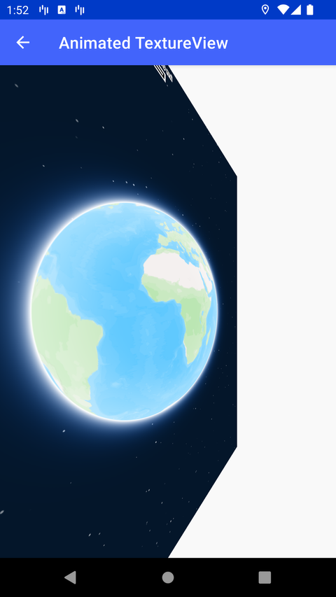

# TextureView 动画（Animated TextureView）

> 官方示例：[animated-textureview](https://docs.mapbox.com/android/maps/examples/android-view/animated-textureview/)

## 示例效果



## 功能说明

在 TextureView 上应用 View 动画。

<details>
<summary>英文原文</summary>

This example demonstrates how to apply an animation to a Mapbox map using TextureView with the Mapbox Maps SDK for Android. The code below rotates the map around, turning the flat frame at different intervals with creating an animation with the ObjectAnimator.ofFloat() function. Simultaneously, the flyTo() function is applied to a list of Points, moving the camera of the MapView around the view each Point in the list.

</details>

## 示例 Activity

- `TextureViewAnimateActivity.kt`

## 示例代码

```kotlin
package com.mapbox.maps.testapp.examples

import android.animation.ObjectAnimator
import android.os.Bundle
import android.os.Handler
import android.os.Looper
import androidx.appcompat.app.AppCompatActivity
import com.mapbox.geojson.Point
import com.mapbox.maps.*
import com.mapbox.maps.plugin.animation.MapAnimationOptions.Companion.mapAnimationOptions
import com.mapbox.maps.plugin.animation.camera
import com.mapbox.maps.testapp.databinding.ActivityTextureViewBinding

/**
 * Example of applying animation to a map which renders to TextureView.
 */
class TextureViewAnimateActivity : AppCompatActivity() {

  private val handler: Handler = Handler(Looper.getMainLooper())
  private lateinit var animation: ObjectAnimator

  private val places: Array<Point> = arrayOf(
    Point.fromLngLat(-122.4194, 37.7749), // SF
    Point.fromLngLat(-77.0369, 38.9072), // DC
    Point.fromLngLat(4.8952, 52.3702), // AMS
    Point.fromLngLat(24.9384, 60.1699), // HEL
    Point.fromLngLat(-74.2236, -13.1639), // AYA
    Point.fromLngLat(13.4050, 52.5200), // BER
    Point.fromLngLat(77.5946, 12.9716), // BAN
    Point.fromLngLat(121.4737, 31.2304), // SHA
    Point.fromLngLat(27.56667, 53.9) // MSK
  )

  override fun onCreate(savedInstanceState: Bundle?) {
    super.onCreate(savedInstanceState)
    val binding = ActivityTextureViewBinding.inflate(layoutInflater)
    setContentView(binding.root)

    binding.mapView.mapboxMap.loadStyle(Style.STANDARD)
    val cameraPlugin = binding.mapView.camera

    for (i in places.indices) {
      handler.postDelayed(
        {
          cameraPlugin.flyTo(
            CameraOptions.Builder()
              .center(places[i])
              .zoom(14.0 - i)
              .build(),
            mapAnimationOptions { duration(DURATION_MS) }
          )
        },
        i * DURATION_MS
      )
    }

    // Animate the map view
    animation = ObjectAnimator.ofFloat(
      binding.mapView,
      "rotationY",
      0.0f,
      360f
    ).apply {
      duration = 5_000L
      repeatCount = ObjectAnimator.INFINITE
      start()
    }
  }

  override fun onDestroy() {
    super.onDestroy()
    animation.cancel()
    handler.removeCallbacksAndMessages(null)
  }

  companion object {
    private const val DURATION_MS = 10_000L
  }
}
```

## 在 Aura 项目中使用

- UI 框架：**Android View**（与 Aura 当前 `MapFragment` + `MapView` 一致）
- 包名请替换为 `com.catclaw.aura`
- 需在 `local.properties` 配置 `MAPBOX_ACCESS_TOKEN`
- 部分示例依赖 `assets/` 或额外布局文件，请参考 GitHub 示例工程

## 参考链接

- [官方文档（英文）](https://docs.mapbox.com/android/maps/examples/android-view/animated-textureview/)
- [GitHub 源码](https://github.com/mapbox/mapbox-maps-android/blob/v11.24.3/app/src/main/java/com/mapbox/maps/testapp/examples/TextureViewAnimateActivity.kt)
- [Android View 示例索引](./README.md)
- [Mapbox 中文指南](../../README.md)
