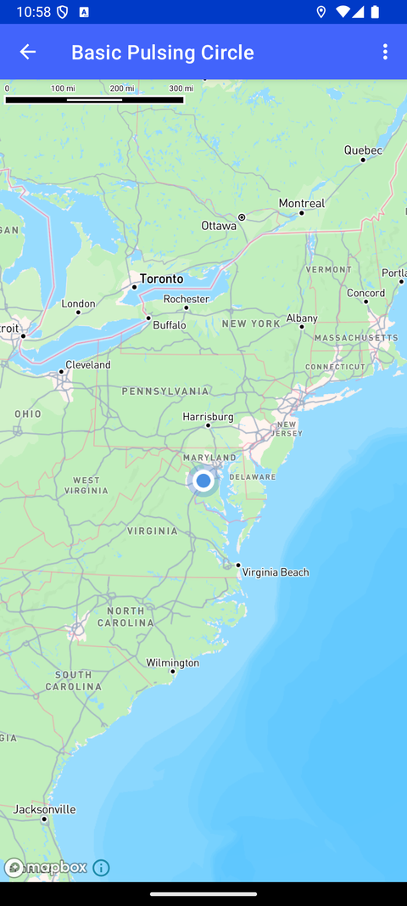

# 基础脉冲圆（Basic Pulsing Circle）

> 官方示例：[basic-pulsing-circle](https://docs.mapbox.com/android/maps/examples/android-view/basic-pulsing-circle/)

## 示例效果



## 功能说明

显示 LocationComponent 默认的脉冲圆效果。

<details>
<summary>英文原文</summary>

This example showcases how to add a pulsing circle to your map in the Mapbox Maps SDK for Android. The code below allows you to enable or disable the location component, start or stop the pulsing animation, and display a radius ring around the point.

</details>

## 示例 Activity

- `BasicLocationPulsingCircleActivity.kt`

## 示例代码

```kotlin
package com.mapbox.maps.testapp.examples

import android.annotation.SuppressLint
import android.os.Bundle
import android.view.Menu
import android.view.MenuItem
import androidx.appcompat.app.AppCompatActivity
import com.mapbox.bindgen.Value
import com.mapbox.maps.CameraOptions
import com.mapbox.maps.MapboxMap
import com.mapbox.maps.Style
import com.mapbox.maps.plugin.gestures.gestures
import com.mapbox.maps.plugin.locationcomponent.LocationComponentConstants
import com.mapbox.maps.plugin.locationcomponent.location
import com.mapbox.maps.testapp.R
import com.mapbox.maps.testapp.databinding.ActivityLocationLayerBasicPulsingCircleBinding
import com.mapbox.maps.testapp.utils.LocationPermissionHelper
import java.lang.ref.WeakReference

/**
 * This activity shows a basic usage of the LocationComponent's pulsing circle. There's no
 * customization of the pulsing circle's color, radius, speed, etc.
 */
class BasicLocationPulsingCircleActivity : AppCompatActivity() {

  private lateinit var mapboxMap: MapboxMap
  private lateinit var locationPermissionHelper: LocationPermissionHelper
  private var lastStyleTheme = StyleTheme.DARK
  private lateinit var binding: ActivityLocationLayerBasicPulsingCircleBinding
  private enum class StyleTheme {
    LIGHT,
    DARK
  }

  override fun onCreate(savedInstanceState: Bundle?) {
    super.onCreate(savedInstanceState)
    binding = ActivityLocationLayerBasicPulsingCircleBinding.inflate(layoutInflater)
    setContentView(binding.root)
    mapboxMap = binding.mapView.mapboxMap
    binding.mapView.location.addOnIndicatorPositionChangedListener {
      mapboxMap.setCamera(CameraOptions.Builder().center(it).build())
      binding.mapView.gestures.focalPoint = binding.mapView.mapboxMap.pixelForCoordinate(it)
    }
    locationPermissionHelper = LocationPermissionHelper(WeakReference(this))
    locationPermissionHelper.checkPermissions {
      onMapReady()
    }
  }

  private fun onMapReady() {
    mapboxMap.loadStyle(
      Style.STANDARD
    )
  }

  override fun onCreateOptionsMenu(menu: Menu): Boolean {
    menuInflater.inflate(R.menu.menu_pulsing_location_mode, menu)
    return true
  }

  @SuppressLint("MissingPermission")
  override fun onOptionsItemSelected(item: MenuItem): Boolean {
    when (item.itemId) {
      R.id.action_map_style_change -> {
        toggleMapStyle()
        return true
      }
      R.id.action_component_disable -> {
        binding.mapView.location.enabled = false
        return true
      }
      R.id.action_component_enabled -> {
        binding.mapView.location.enabled = true
        return true
      }
      R.id.action_stop_pulsing -> {
        binding.mapView.location.pulsingEnabled = false
        return true
      }
      R.id.action_start_pulsing -> {
        binding.mapView.location.apply {
          pulsingEnabled = true
          pulsingMaxRadius = 10f * resources.displayMetrics.density
        }
        return true
      }
      R.id.action_pulsing_follow_accuracy_radius -> {
        binding.mapView.location.apply {
          showAccuracyRing = true
          pulsingEnabled = true
          pulsingMaxRadius = LocationComponentConstants.PULSING_MAX_RADIUS_FOLLOW_ACCURACY
        }
        return true
      }
      else -> return super.onOptionsItemSelected(item)
    }
  }

  private fun toggleMapStyle() {
    if (lastStyleTheme == StyleTheme.DARK) {
      binding.mapView.mapboxMap.setStyleImportConfigProperty(
        "basemap",
        "theme",
        Value.valueOf("monochrome")
      )
      binding.mapView.mapboxMap.setStyleImportConfigProperty(
        "basemap",
        "lightPreset",
        Value.valueOf("day")
      )
      lastStyleTheme = StyleTheme.LIGHT
    } else {
      binding.mapView.mapboxMap.setStyleImportConfigProperty(
        "basemap",
        "theme",
        Value.valueOf("monochrome")
      )
      binding.mapView.mapboxMap.setStyleImportConfigProperty(
        "basemap",
        "lightPreset",
        Value.valueOf("night")
      )
      lastStyleTheme = StyleTheme.DARK
    }
  }

  override fun onRequestPermissionsResult(
    requestCode: Int,
    permissions: Array<String>,
    grantResults: IntArray
  ) {
    super.onRequestPermissionsResult(requestCode, permissions, grantResults)
    locationPermissionHelper.onRequestPermissionsResult(requestCode, permissions, grantResults)
  }
}
```

## 在 Aura 项目中使用

- UI 框架：**Android View**（与 Aura 当前 `MapFragment` + `MapView` 一致）
- 包名请替换为 `com.catclaw.aura`
- 需在 `local.properties` 配置 `MAPBOX_ACCESS_TOKEN`
- 部分示例依赖 `assets/` 或额外布局文件，请参考 GitHub 示例工程

## 参考链接

- [官方文档（英文）](https://docs.mapbox.com/android/maps/examples/android-view/basic-pulsing-circle/)
- [GitHub 源码](https://github.com/mapbox/mapbox-maps-android/blob/v11.24.3/app/src/main/java/com/mapbox/maps/testapp/examples/BasicLocationPulsingCircleActivity.kt)
- [Android View 示例索引](./README.md)
- [Mapbox 中文指南](../../README.md)
