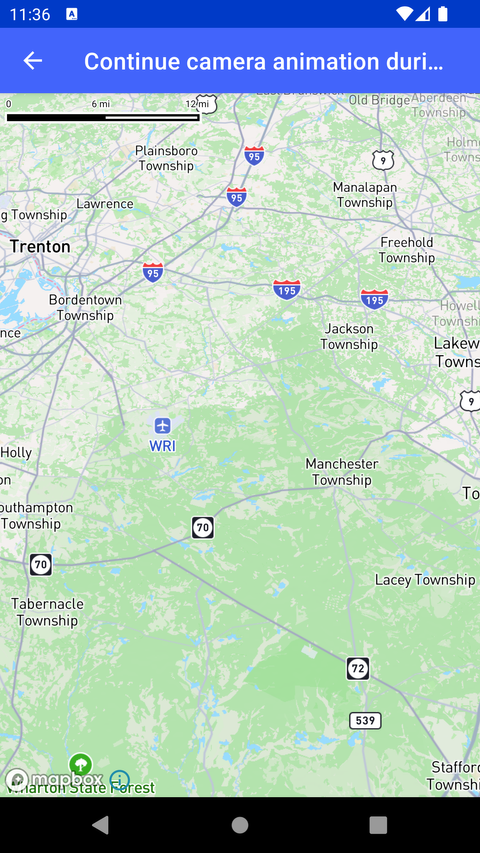

# 手势期间继续相机动画（Continue camera animation during gestures）

> 官方示例：[continue-camera-animation-during-gestures](https://docs.mapbox.com/android/maps/examples/android-view/continue-camera-animation-during-gestures/)

## 示例效果



## 功能说明

在用户手势操作期间继续播放相机动画。

<details>
<summary>英文原文</summary>

This example demonstrates how to animate the pitch of the map using the Mapbox Maps SDK for Android. The code below applies an animation to the MapView by adjusting CameraAnimatorOptions for example the start and end pitch values, animation duration, and interpolation. The animation repeats continuously, pausing for a second and then repeating. The animation continues to occur, even when a user gesture is activated due to the addProtectedAnimationOwner() function.

</details>

## 示例 Activity

- `OngoingAnimationActivity.kt`

## 示例代码

```kotlin
package com.mapbox.maps.testapp.examples

import android.animation.ValueAnimator
import android.os.Bundle
import android.view.animation.LinearInterpolator
import androidx.appcompat.app.AppCompatActivity
import com.mapbox.geojson.Point
import com.mapbox.maps.CameraOptions
import com.mapbox.maps.MapView
import com.mapbox.maps.plugin.animation.CameraAnimatorOptions
import com.mapbox.maps.plugin.animation.camera
import com.mapbox.maps.plugin.gestures.gestures
import java.util.concurrent.TimeUnit

class OngoingAnimationActivity : AppCompatActivity() {

  override fun onCreate(savedInstanceState: Bundle?) {
    super.onCreate(savedInstanceState)
    val mapView = MapView(this)
    setContentView(mapView)
    mapView.mapboxMap
      .apply {
        setCamera(
          CameraOptions.Builder()
            .center(Point.fromLngLat(LONGITUDE, LATITUDE))
            .zoom(9.0)
            .build()
        )
      }

    mapView.gestures.addProtectedAnimationOwner(OWNER)

    val anim = mapView.camera.createPitchAnimator(
      CameraAnimatorOptions.cameraAnimatorOptions(0.0, 30.0) {
        owner(OWNER)
      }
    ) {
      repeatCount = ValueAnimator.INFINITE
      repeatMode = ValueAnimator.REVERSE
      duration = TimeUnit.SECONDS.toMillis(2)
      interpolator = LinearInterpolator()
    }

    mapView.camera.registerAnimators(anim)

    anim.start()
  }

  companion object {
    private const val OWNER = "Example"
    private const val LATITUDE = 40.0
    private const val LONGITUDE = -74.5
  }
}
```

## 在 Aura 项目中使用

- UI 框架：**Android View**（与 Aura 当前 `MapFragment` + `MapView` 一致）
- 包名请替换为 `com.catclaw.aura`
- 需在 `local.properties` 配置 `MAPBOX_ACCESS_TOKEN`
- 部分示例依赖 `assets/` 或额外布局文件，请参考 GitHub 示例工程

## 参考链接

- [官方文档（英文）](https://docs.mapbox.com/android/maps/examples/android-view/continue-camera-animation-during-gestures/)
- [GitHub 源码](https://github.com/mapbox/mapbox-maps-android/blob/v11.24.3/app/src/main/java/com/mapbox/maps/testapp/examples/OngoingAnimationActivity.kt)
- [Android View 示例索引](./README.md)
- [Mapbox 中文指南](../../README.md)
