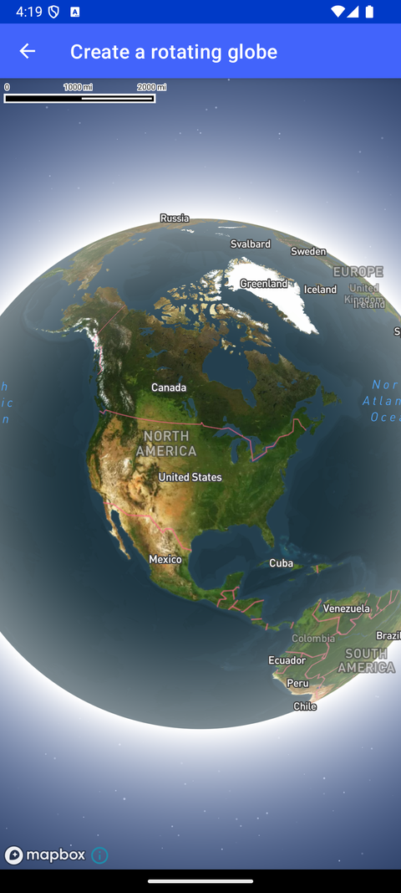

# 旋转地球（Create a rotating globe）

> 官方示例：[create-a-rotating-globe](https://docs.mapbox.com/android/maps/examples/android-view/create-a-rotating-globe/)

## 示例效果



## 功能说明

将地图显示为可交互、可旋转的地球。

<details>
<summary>英文原文</summary>

This example demonstrates how to create a spinning globe with the Mapbox Maps SDK for Android. The code below adds a rotation animation, that recursively calls spinGlobe which uses MapboxMap.easeTo() to smoothly animate the rotation of the globe. The rotation pauses during user interaction (such as moving, rotating, and scaling) and continues the animation once finished. The rotation speed also varies based on the current zoom level. The further a user zooms into the map, the slower the globe spins until at the zoom level reaches 5, then it stops all together.

</details>

## 示例 Activity

- `SpinningGlobeActivity.kt`

## 示例代码

```kotlin
package com.mapbox.maps.testapp.examples.globe

import android.animation.Animator
import android.animation.AnimatorListenerAdapter
import android.os.Bundle
import android.view.animation.LinearInterpolator
import androidx.appcompat.app.AppCompatActivity
import com.mapbox.android.gestures.MoveGestureDetector
import com.mapbox.android.gestures.RotateGestureDetector
import com.mapbox.android.gestures.StandardScaleGestureDetector
import com.mapbox.common.Cancelable
import com.mapbox.geojson.Point
import com.mapbox.maps.MapView
import com.mapbox.maps.MapboxMap
import com.mapbox.maps.Style
import com.mapbox.maps.dsl.cameraOptions
import com.mapbox.maps.extension.style.atmosphere.generated.atmosphere
import com.mapbox.maps.extension.style.layers.properties.generated.ProjectionName
import com.mapbox.maps.extension.style.projection.generated.projection
import com.mapbox.maps.extension.style.style
import com.mapbox.maps.plugin.animation.MapAnimationOptions.Companion.mapAnimationOptions
import com.mapbox.maps.plugin.animation.easeTo
import com.mapbox.maps.plugin.gestures.OnMoveListener
import com.mapbox.maps.plugin.gestures.OnRotateListener
import com.mapbox.maps.plugin.gestures.OnScaleListener
import com.mapbox.maps.plugin.gestures.gestures

/**
 * This example combines a [GlobeActivity] and camera animation to create a rotating planet effect.
 *
 * The rotation animation is continued indefinitely by calling [MapboxMap.easeTo] on animation end.
 * Rotation is paused on user interaction and slows to a stop at high zoom levels.
 */
class SpinningGlobeActivity : AppCompatActivity() {

  private var userInteracting = false
  private var spinEnabled = true

  private lateinit var mapboxMap: MapboxMap
  private lateinit var runningAnimation: Cancelable

  private fun spinGlobe() {
    val zoom = mapboxMap.cameraState.zoom
    if (spinEnabled && !userInteracting && zoom < MAX_SPIN_ZOOM) {
      var distancePerSecond = 360.0 / SECONDS_PER_REVOLUTION
      if (zoom > SLOW_SPIN_ZOOM) {
        // Slow spinning at higher zooms
        val zoomDif = (MAX_SPIN_ZOOM - zoom) / (MAX_SPIN_ZOOM - SLOW_SPIN_ZOOM)
        distancePerSecond *= zoomDif
      }
      val center = mapboxMap.cameraState.center
      val targetCenter = Point.fromLngLat(center.longitude() - distancePerSecond, center.latitude())
      // Smoothly animate the map over one second.
      // When this animation is complete, call it again
      runningAnimation = mapboxMap.easeTo(
        cameraOptions { center(targetCenter) },
        mapAnimationOptions {
          duration(1_000L)
          interpolator(LinearInterpolator())
        },
        animatorListener = object : AnimatorListenerAdapter() {
          override fun onAnimationEnd(animation: Animator) {
            spinGlobe()
          }
        }
      )
    }
  }

  override fun onCreate(savedInstanceState: Bundle?) {
    super.onCreate(savedInstanceState)
    val mapView = MapView(this)
    setContentView(mapView)

    mapView.gestures.addOnMoveListener(object : OnMoveListener {
      override fun onMoveBegin(detector: MoveGestureDetector) {
        userInteracting = true
        runningAnimation.cancel()
      }

      override fun onMove(detector: MoveGestureDetector): Boolean {
        // return false in order to actually handle user movement
        return false
      }

      override fun onMoveEnd(detector: MoveGestureDetector) {
        userInteracting = false
        spinGlobe()
      }
    })

    mapView.gestures.addOnRotateListener(object : OnRotateListener {
      override fun onRotateBegin(detector: RotateGestureDetector) {
        userInteracting = true
        runningAnimation.cancel()
      }

      override fun onRotate(detector: RotateGestureDetector) {
        // no-op
      }

      override fun onRotateEnd(detector: RotateGestureDetector) {
        userInteracting = false
        spinGlobe()
      }
    })

    mapView.gestures.addOnScaleListener(object : OnScaleListener {
      override fun onScaleBegin(detector: StandardScaleGestureDetector) {
        userInteracting = true
        runningAnimation.cancel()
      }

      override fun onScale(detector: StandardScaleGestureDetector) {
        // no-op
      }

      override fun onScaleEnd(detector: StandardScaleGestureDetector) {
        userInteracting = false
        spinGlobe()
      }
    })

    mapboxMap = mapView.mapboxMap.apply {
      loadStyle(
        style(Style.STANDARD_SATELLITE) {
          +atmosphere { }
          +projection(ProjectionName.GLOBE)
        }
      ) {
        setCamera(
          cameraOptions {
            center(CENTER)
            zoom(ZOOM)
          }
        )
        spinGlobe()
      }
    }
  }

  private companion object {
    private const val ZOOM = 1.5
    private val CENTER = Point.fromLngLat(-90.0, 40.0)

    private const val EASE_TO_DURATION = 1_000L
    // At low zooms, complete a revolution every two minutes.
    private const val SECONDS_PER_REVOLUTION = 120
    // Above zoom level 5, do not rotate.
    private const val MAX_SPIN_ZOOM = 5
    // Rotate at intermediate speeds between zoom levels 3 and 5.
    private const val SLOW_SPIN_ZOOM = 3
  }
}
```

## 在 Aura 项目中使用

- UI 框架：**Android View**（与 Aura 当前 `MapFragment` + `MapView` 一致）
- 包名请替换为 `com.catclaw.aura`
- 需在 `local.properties` 配置 `MAPBOX_ACCESS_TOKEN`
- 部分示例依赖 `assets/` 或额外布局文件，请参考 GitHub 示例工程

## 参考链接

- [官方文档（英文）](https://docs.mapbox.com/android/maps/examples/android-view/create-a-rotating-globe/)
- [GitHub 源码](https://github.com/mapbox/mapbox-maps-android/blob/v11.24.3/app/src/main/java/com/mapbox/maps/testapp/examples/globe/SpinningGlobeActivity.kt)
- [Android View 示例索引](./README.md)
- [Mapbox 中文指南](../../README.md)
