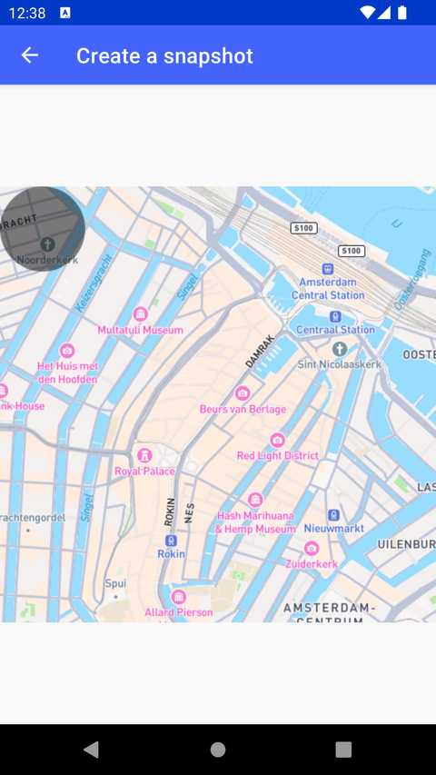

# 创建地图快照（Create a snapshot）

> 官方示例：[create-a-snapshot](https://docs.mapbox.com/android/maps/examples/android-view/create-a-snapshot/)

## 示例效果



## 功能说明

生成指定相机位置的静态地图快照（Bitmap）。

<details>
<summary>英文原文</summary>

This example demonstrates how to take a snapshot of a map using the Snapshotter plugin from the Mapbox Maps SDK for Android. The code below creates a Snapshotter instance, determining the size and pixel ratio of the snapshot and configures the style, camera position, and an overlay which draws an oval shape on the snapshot canvas before generating the snapshot image. The snapshot image is displayed in an ImageView on the screen and the Snapshotter is destroyed once the image is created.

</details>

## 示例 Activity

- `MapSnapshotterActivity.kt`

## 示例代码

```kotlin
package com.mapbox.maps.testapp.examples.snapshotter

import android.graphics.Paint
import android.graphics.RectF
import android.os.Bundle
import android.widget.ImageView
import android.widget.Toast
import androidx.appcompat.app.AppCompatActivity
import com.mapbox.geojson.Point
import com.mapbox.maps.*
import com.mapbox.maps.Snapshotter

/**
 * Example demonstrating taking simple snapshot using [Snapshotter].
 */
class MapSnapshotterActivity : AppCompatActivity(), SnapshotStyleListener {

  private lateinit var mapSnapshotter: Snapshotter

  override fun onCreate(savedInstanceState: Bundle?) {
    super.onCreate(savedInstanceState)
    val snapshotterOptions = MapSnapshotOptions.Builder()
      .size(Size(512.0f, 512.0f))
      .pixelRatio(1.0f)
      .build()

    mapSnapshotter = Snapshotter(this, snapshotterOptions,).apply {
      setStyleListener(this@MapSnapshotterActivity)
      setStyleUri(Style.STANDARD)
      setCamera(
        CameraOptions.Builder().zoom(14.0).center(
          Point.fromLngLat(
            4.895033, 52.374724
          )
        ).build()
      )
      start(
        overlayCallback = { overlay ->
          overlay.canvas.drawOval(
            RectF(0f, 0f, 100f, 100f),
            Paint().apply { alpha = 128 }
          )
        }
      ) { bitmap, errorMessage ->
        if (errorMessage != null) {
          Toast.makeText(
            this@MapSnapshotterActivity,
            errorMessage,
            Toast.LENGTH_SHORT
          ).show()
        }
        val imageView = ImageView(this@MapSnapshotterActivity)
        imageView.setImageBitmap(bitmap)
        setContentView(imageView)
      }
    }
  }

  override fun onDidFinishLoadingStyle(style: Style) {
    logI(TAG, "OnStyleLoaded: ${style.styleURI}")
  }

  override fun onDestroy() {
    super.onDestroy()
    mapSnapshotter.destroy()
  }

  companion object {
    const val TAG: String = "MapSnapshotterActivity"
  }
}
```

## 在 Aura 项目中使用

- UI 框架：**Android View**（与 Aura 当前 `MapFragment` + `MapView` 一致）
- 包名请替换为 `com.catclaw.aura`
- 需在 `local.properties` 配置 `MAPBOX_ACCESS_TOKEN`
- 部分示例依赖 `assets/` 或额外布局文件，请参考 GitHub 示例工程

## 参考链接

- [官方文档（英文）](https://docs.mapbox.com/android/maps/examples/android-view/create-a-snapshot/)
- [GitHub 源码](https://github.com/mapbox/mapbox-maps-android/blob/v11.24.3/app/src/main/java/com/mapbox/maps/testapp/examples/snapshotter/MapSnapshotterActivity.kt)
- [Android View 示例索引](./README.md)
- [Mapbox 中文指南](../../README.md)
