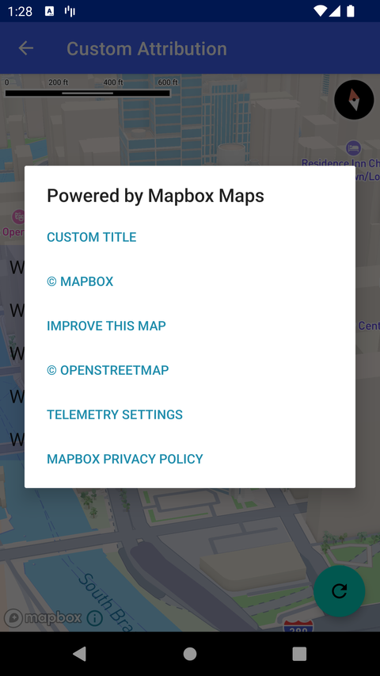

# 自定义归属信息（Custom Attribution）

> 官方示例：[custom-attribution](https://docs.mapbox.com/android/maps/examples/android-view/custom-attribution/)

## 示例效果



## 功能说明

自定义地图归属（Attribution）显示。

<details>
<summary>英文原文</summary>

This example demonstrates how to add a custom attribution using the Mapbox Maps SDK for Android. The code below includes creates a dialog element to display links to the map's attribution that links to relevant information about as map improvement, copyright details, telemetry data, Mapbox attributions, and Mapbox privacy policies.

</details>

## 示例 Activity

- `CustomAttributionActivity.kt`

## 示例代码

```kotlin
package com.mapbox.maps.testapp.examples

import android.app.Activity
import android.app.AlertDialog
import android.content.ActivityNotFoundException
import android.content.Context
import android.content.DialogInterface
import android.content.Intent
import android.net.Uri
import android.os.Bundle
import android.widget.ArrayAdapter
import android.widget.CheckedTextView
import android.widget.Toast
import androidx.appcompat.app.AppCompatActivity
import com.mapbox.maps.Style
import com.mapbox.maps.module.MapTelemetry
import com.mapbox.maps.plugin.attribution.Attribution
import com.mapbox.maps.plugin.attribution.AttributionDialogManager
import com.mapbox.maps.plugin.attribution.AttributionParserConfig
import com.mapbox.maps.plugin.attribution.attribution
import com.mapbox.maps.plugin.delegates.MapAttributionDelegate
import com.mapbox.maps.testapp.R
import com.mapbox.maps.testapp.databinding.ActivityCustomAttributionBinding

/**
 * This activity demonstrates how to use a custom attribution dialog.
 */
class CustomAttributionActivity : AppCompatActivity() {

  private lateinit var checkBoxes: List<CheckedTextView>

  override fun onCreate(savedInstanceState: Bundle?) {
    super.onCreate(savedInstanceState)
    val binding = ActivityCustomAttributionBinding.inflate(layoutInflater)
    setContentView(binding.root)

    binding.mapView.mapboxMap.loadStyle(Style.STANDARD)
    checkBoxes = listOf(
      binding.withImproveMap,
      binding.withCopyrightSign,
      binding.withTelemetryAttribution,
      binding.withMapboxAttribution,
      binding.withMapboxPrivacyPolicy,
    )
    checkBoxes.forEach { checkedTextView ->
      checkedTextView.setOnClickListener { checkedTextView.toggle() }
    }
    val attributionPlugin = binding.mapView.attribution
    // set custom content description for the attribution plugin.
    attributionPlugin.setContentDescription("Show Mapbox Attributions")
    binding.customAttributionFab.setOnClickListener {
      Toast.makeText(this, R.string.custom_attribution_custom, Toast.LENGTH_LONG).show()
      val config = AttributionParserConfig(
        withImproveMap = checkBoxes[0].isChecked,
        withCopyrightSign = checkBoxes[1].isChecked,
        withTelemetryAttribution = checkBoxes[2].isChecked,
        withMapboxAttribution = checkBoxes[3].isChecked,
        withMapboxPrivacyPolicy = checkBoxes[4].isChecked,
        withMapboxGeofencingConsent = false // This custom dialog does not support geofencing user consent
      )
      attributionPlugin.setCustomAttributionDialogManager(
        CustomAttributionDialog(this, config)
      )
    }
  }

  inner class CustomAttributionDialog(
    private val context: Context,
    private val attributionParserConfig: AttributionParserConfig
  ) : AttributionDialogManager, DialogInterface.OnClickListener {

    private lateinit var attributionList: MutableList<Attribution>
    private var dialog: AlertDialog? = null
    private var telemetryDialog: AlertDialog? = null
    private var mapAttributionDelegate: MapAttributionDelegate? = null
    private var telemetry: MapTelemetry? = null

    override fun showAttribution(mapAttributionDelegate: MapAttributionDelegate) {
      this.mapAttributionDelegate = mapAttributionDelegate
      this.telemetry = mapAttributionDelegate.telemetry()
      attributionList =
        mapAttributionDelegate.parseAttributions(context, attributionParserConfig).toMutableList()
      // Add additional Attribution
      attributionList.add(0, Attribution("Custom title", "https://www.mapbox.com/"))
      var isActivityFinishing = false
      if (context is Activity) {
        isActivityFinishing = context.isFinishing
      }
      // check if hosting activity isn't finishing
      if (!isActivityFinishing) {
        val attributionTitles = attributionList.map { it.title }.toTypedArray()
        val builder = AlertDialog.Builder(context)
        builder.setTitle(com.mapbox.maps.plugin.attribution.R.string.mapbox_attributionsDialogTitle)
        builder.setAdapter(
          ArrayAdapter(
            context,
            com.mapbox.maps.plugin.attribution.R.layout.mapbox_attribution_list_item,
            attributionTitles
          ),
          this
        )
        dialog = builder.show()
      }
    }

    override fun onStop() {
      dialog?.takeIf { it.isShowing }?.dismiss()
      telemetryDialog?.takeIf { it.isShowing }?.dismiss()
    }

    override fun onClick(dialog: DialogInterface?, which: Int) {
      if (attributionList[which].title.contains(TELEMETRY_KEY_WORLD)) {
        showTelemetryDialog()
      } else {
        showWebPage(attributionList[which].url)
      }
    }

    private fun showTelemetryDialog() {
      val builder = AlertDialog.Builder(context)
      builder.setTitle(com.mapbox.maps.plugin.attribution.R.string.mapbox_attributionTelemetryTitle)
      builder.setMessage(com.mapbox.maps.plugin.attribution.R.string.mapbox_attributionTelemetryMessage)
      builder.setPositiveButton(com.mapbox.maps.plugin.attribution.R.string.mapbox_attributionTelemetryPositive) { dialog, _ ->
        telemetry?.setUserTelemetryRequestState(true)
        dialog.cancel()
      }
      builder.setNeutralButton(com.mapbox.maps.plugin.attribution.R.string.mapbox_attributionTelemetryNeutral) { dialog, _ ->
        showWebPage(context.resources.getString(com.mapbox.maps.plugin.attribution.R.string.mapbox_telemetryLink))
        dialog.cancel()
      }
      builder.setNegativeButton(com.mapbox.maps.plugin.attribution.R.string.mapbox_attributionTelemetryNegative) { dialog, _ ->
        telemetry?.setUserTelemetryRequestState(false)
        dialog.cancel()
      }
      telemetryDialog = builder.show()
    }

    private fun showWebPage(url: String) {
      val webUrl = if (url.contains(FEEDBACK_KEY_WORLD) && mapAttributionDelegate != null) {
        mapAttributionDelegate!!.buildMapBoxFeedbackUrl(context)
      } else {
        url
      }
      if (context is Activity) {
        try {
          val intent = Intent(Intent.ACTION_VIEW)
          intent.data = Uri.parse(webUrl)
          context.startActivity(intent)
        } catch (exception: ActivityNotFoundException) { // explicitly handling if the device hasn't have a web browser installed. #8899
          Toast.makeText(
            context,
            com.mapbox.maps.plugin.attribution.R.string.mapbox_attributionErrorNoBrowser,
            Toast.LENGTH_LONG
          ).show()
        }
      }
    }
  }

  companion object {
    private const val FEEDBACK_KEY_WORLD = "feedback"
    private const val TELEMETRY_KEY_WORLD = "Telemetry"
  }
}
```

## 在 Aura 项目中使用

- UI 框架：**Android View**（与 Aura 当前 `MapFragment` + `MapView` 一致）
- 包名请替换为 `com.catclaw.aura`
- 需在 `local.properties` 配置 `MAPBOX_ACCESS_TOKEN`
- 部分示例依赖 `assets/` 或额外布局文件，请参考 GitHub 示例工程

## 参考链接

- [官方文档（英文）](https://docs.mapbox.com/android/maps/examples/android-view/custom-attribution/)
- [GitHub 源码](https://github.com/mapbox/mapbox-maps-android/blob/v11.24.3/app/src/main/java/com/mapbox/maps/testapp/examples/CustomAttributionActivity.kt)
- [Android View 示例索引](./README.md)
- [Mapbox 中文指南](../../README.md)
