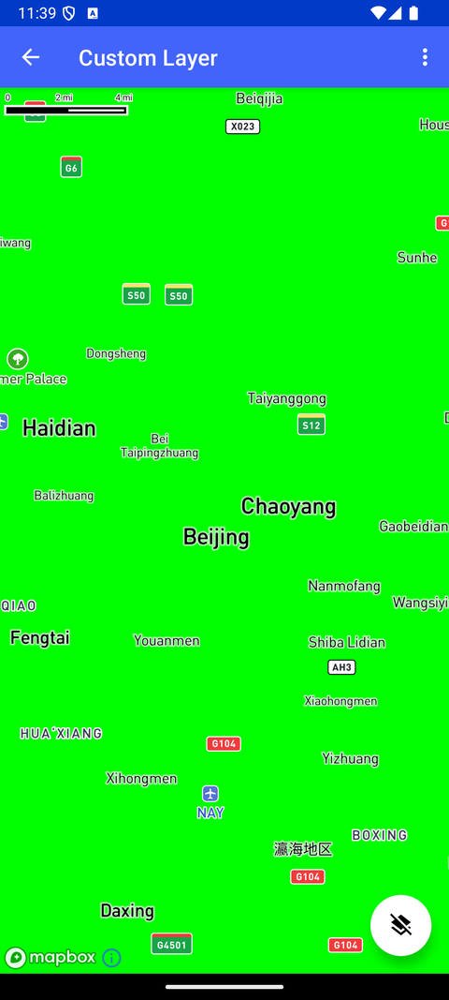

# 自定义图层（Kotlin）（Custom Layer）

> 官方示例：[custom-layer](https://docs.mapbox.com/android/maps/examples/android-view/custom-layer/)

## 示例效果



## 功能说明

使用 Kotlin 实现自定义图层（Custom Layer）。

<details>
<summary>英文原文</summary>

This example demonstrates how to add a custom layer with the Mapbox Maps SDK for Android. In the code below, a custom layer is added to the map with a unique layer ID (CUSTOM_LAYER_ID). The custom layer is then added to the "bottom" slot in the Mapbox Standard style. The example allows users to interact with the custom layer and switching it on and off by clicking the floating action button, repainting the layer and setting different colors for the custom layer.

</details>

## 示例 Activity

- `CustomLayerActivity.kt`

## 示例代码

```kotlin
package com.mapbox.maps.testapp.examples.customlayer

import android.os.Bundle
import android.view.Menu
import android.view.MenuItem
import androidx.appcompat.app.AppCompatActivity
import com.mapbox.geojson.Point
import com.mapbox.maps.MapboxMap
import com.mapbox.maps.Style
import com.mapbox.maps.dsl.cameraOptions
import com.mapbox.maps.extension.style.layers.CustomLayer
import com.mapbox.maps.extension.style.layers.addLayer
import com.mapbox.maps.extension.style.layers.customLayer
import com.mapbox.maps.extension.style.style
import com.mapbox.maps.testapp.R
import com.mapbox.maps.testapp.databinding.ActivityCustomLayerBinding

/**
 * Test activity showcasing the Custom Layer API
 */
class CustomLayerActivity : AppCompatActivity() {
  private lateinit var mapboxMap: MapboxMap
  private lateinit var binding: ActivityCustomLayerBinding

  override fun onCreate(savedInstanceState: Bundle?) {
    super.onCreate(savedInstanceState)
    binding = ActivityCustomLayerBinding.inflate(layoutInflater)
    setContentView(binding.root)
    mapboxMap = binding.mapView.mapboxMap
    mapboxMap.loadStyle(
      style(Style.STANDARD) {
        +customLayer(
          layerId = CUSTOM_LAYER_ID,
          host = ExampleCustomLayer()
        ).slot("top")
      }
    ) {
      mapboxMap.setCamera(
        cameraOptions {
          center(Point.fromLngLat(116.39053, 39.91448))
          pitch(0.0)
          bearing(0.0)
          zoom(10.0)
        }
      )
      initFab()
    }
  }

  private fun initFab() {
    binding.fab.setOnClickListener {
      swapCustomLayer()
    }
  }

  private fun swapCustomLayer() {
    mapboxMap.style?.let { style ->
      if (style.styleLayerExists(CUSTOM_LAYER_ID)) {
        style.removeStyleLayer(CUSTOM_LAYER_ID)
        binding.fab.setImageResource(R.drawable.ic_layers)
      } else {
        style.addLayer(
          CustomLayer(CUSTOM_LAYER_ID, ExampleCustomLayer()).slot("bottom")
        )
        binding.fab.setImageResource(R.drawable.ic_layers_clear)
      }
    }
  }

  private fun updateLayer() {
    mapboxMap.triggerRepaint()
  }

  override fun onCreateOptionsMenu(menu: Menu): Boolean {
    menuInflater.inflate(R.menu.menu_custom_layer, menu)
    return true
  }

  override fun onOptionsItemSelected(item: MenuItem): Boolean {
    return when (item.itemId) {
      R.id.action_update_layer -> {
        updateLayer()
        true
      }

      R.id.action_set_color_red -> {
        ExampleCustomLayer.color = floatArrayOf(1.0f, 0.0f, 0.0f, 1.0f)
        true
      }

      R.id.action_set_color_green -> {
        ExampleCustomLayer.color = floatArrayOf(0.0f, 1.0f, 0.0f, 1.0f)
        true
      }

      R.id.action_set_color_blue -> {
        ExampleCustomLayer.color = floatArrayOf(0.0f, 0.0f, 1.0f, 1.0f)
        true
      }

      else -> super.onOptionsItemSelected(item)
    }
  }

  companion object {
    private const val CUSTOM_LAYER_ID = "customId"
  }
}
```

## 在 Aura 项目中使用

- UI 框架：**Android View**（与 Aura 当前 `MapFragment` + `MapView` 一致）
- 包名请替换为 `com.catclaw.aura`
- 需在 `local.properties` 配置 `MAPBOX_ACCESS_TOKEN`
- 部分示例依赖 `assets/` 或额外布局文件，请参考 GitHub 示例工程

## 参考链接

- [官方文档（英文）](https://docs.mapbox.com/android/maps/examples/android-view/custom-layer/)
- [GitHub 源码](https://github.com/mapbox/mapbox-maps-android/blob/v11.24.3/app/src/main/java/com/mapbox/maps/testapp/examples/customlayer/CustomLayerActivity.kt)
- [Android View 示例索引](./README.md)
- [Mapbox 中文指南](../../README.md)
