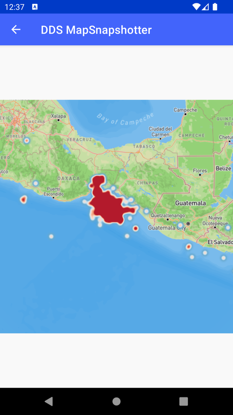

# DDS MapSnapshotter（DDS MapSnapshotter）

> 官方示例：[dds-mapsnapshotter](https://docs.mapbox.com/android/maps/examples/android-view/dds-mapsnapshotter/)

## 示例效果



## 功能说明

结合数据驱动样式（DDS）生成静态地图图片。

<details>
<summary>英文原文</summary>

This example uses Snapshotter to take a snapshot of an earthquake and creates a HeatMap to show off the magnitude with the Mapbox Maps SDK for Android. The code below loads a map, creates a heatmap layer using data from a GeoJSON source containing earthquake data and captures a snapshot of a map. Additionally, the example showcases how to manipulate the heatmap's color, weight, intensity, radius, and opacity. Once the snapshot is captured, it's displayed in an ImageView.

</details>

## 示例 Activity

- `DataDrivenMapSnapshotterActivity.kt`

## 示例代码

```kotlin
package com.mapbox.maps.testapp.examples.snapshotter

import android.os.Bundle
import android.widget.ImageView
import android.widget.Toast
import androidx.appcompat.app.AppCompatActivity
import com.mapbox.bindgen.Value
import com.mapbox.geojson.Point
import com.mapbox.maps.*
import com.mapbox.maps.Snapshotter
import com.mapbox.maps.extension.style.expressions.dsl.generated.heatmapDensity
import com.mapbox.maps.extension.style.expressions.dsl.generated.literal
import com.mapbox.maps.extension.style.expressions.dsl.generated.zoom
import com.mapbox.maps.extension.style.expressions.generated.Expression.Companion.get
import com.mapbox.maps.extension.style.expressions.generated.Expression.Companion.interpolate
import com.mapbox.maps.extension.style.expressions.generated.Expression.Companion.linear
import com.mapbox.maps.extension.style.expressions.generated.Expression.Companion.rgb
import com.mapbox.maps.extension.style.expressions.generated.Expression.Companion.rgba
import com.mapbox.maps.extension.style.layers.addLayer
import com.mapbox.maps.extension.style.layers.generated.HeatmapLayer

/**
 * Example that showcases using Snapshotter with data driven styling.
 *
 * In this example we highlight both the usage of the low as high level API of Style
 *
 */
class DataDrivenMapSnapshotterActivity : AppCompatActivity() {
  private lateinit var snapshotter: Snapshotter

  override fun onCreate(savedInstanceState: Bundle?) {
    super.onCreate(savedInstanceState)
    val snapshotMapOptions = MapSnapshotOptions.Builder()
      .size(Size(512.0f, 512.0f))
      .build()

    snapshotter = Snapshotter(this, snapshotMapOptions).apply {
      setStyleListener(object : SnapshotStyleListener {
        override fun onDidFinishLoadingStyle(style: Style) {
          Toast.makeText(
            this@DataDrivenMapSnapshotterActivity,
            "Map load style success!",
            Toast.LENGTH_LONG
          ).show()

          // GeoJSON earthquake source using low level style API
          val properties = HashMap<String, Value>()
          properties["type"] = Value.valueOf("geojson")
          properties["data"] = Value.valueOf(EARTHQUAKE_SOURCE_URL)
          val sourceResult = style.addStyleSource(EARTHQUAKE_SOURCE_ID, Value.valueOf(properties))
          if (sourceResult.isError) {
            throw RuntimeException(sourceResult.error)
          }

          // Heatmap layer using high level style PI
          style.addLayer(getHeatmapLayer())
        }
      })
      setCamera(
        CameraOptions.Builder()
          .center(Point.fromLngLat(-94.0, 15.0))
          .zoom(5.0)
          .padding(EdgeInsets(1.0, 1.0, 1.0, 1.0))
          .build()
      )
      setStyleUri(Style.OUTDOORS)
    }
    // ignore error in this example
    snapshotter.start { bitmap, _ ->
      val imageView = ImageView(this@DataDrivenMapSnapshotterActivity)
      imageView.setImageBitmap(bitmap)
      setContentView(imageView)
    }
  }

  private fun getHeatmapLayer(): HeatmapLayer {
    val layer = HeatmapLayer(LAYER_ID, EARTHQUAKE_SOURCE_ID)
    layer.maxZoom(9.0)
    layer.sourceLayer(HEATMAP_LAYER_SOURCE)
    layer.heatmapColor(
      // Color ramp for heatmap.  Domain is 0 (low) to 1 (high).
      // Begin color ramp at 0-stop with a 0-transparency color
      // to create a blur-like effect.
      interpolate(
        linear(), heatmapDensity(),
        literal(0), rgba(33.0, 102.0, 172.0, 0.0),
        literal(0.2), rgb(103.0, 169.0, 207.0),
        literal(0.4), rgb(209.0, 229.0, 240.0),
        literal(0.6), rgb(253.0, 219.0, 199.0),
        literal(0.8), rgb(239.0, 138.0, 98.0),
        literal(1), rgb(178.0, 24.0, 43.0)
      )
    )
    // Increase the heatmap weight based on frequency and property magnitude
    layer.heatmapWeight(
      interpolate(
        linear(), get("mag"),
        literal(0), literal(0),
        literal(6), literal(1)
      )
    )

    // Increase the heatmap color weight weight by zoom level
    // heatmap-intensity is a multiplier on top of heatmap-weight
    layer.heatmapIntensity(
      interpolate(
        linear(), zoom(),
        literal(0), literal(1),
        literal(9), literal(3)
      )
    )

    // Adjust the heatmap radius by zoom level
    layer.heatmapRadius(
      interpolate(
        linear(), zoom(),
        literal(0), literal(2),
        literal(9), literal(20)
      )
    )

    // Transition from heatmap to circle layer by zoom level
    layer.heatmapOpacity(
      interpolate(
        linear(), zoom(),
        literal(7), literal(1),
        literal(9), literal(0)
      )
    )
    return layer
  }

  override fun onDestroy() {
    super.onDestroy()
    snapshotter.destroy()
  }

  companion object {
    const val TAG: String = "DataDrivenMapSnapshotterActivity"
    private const val EARTHQUAKE_SOURCE_URL =
      "https://www.mapbox.com/mapbox-gl-js/assets/earthquakes.geojson"
    private const val EARTHQUAKE_SOURCE_ID = "earthquakes"
    private const val LAYER_ID = "earthquakes-heat"
    private const val HEATMAP_LAYER_SOURCE = "earthquakes"
  }
}
```

## 在 Aura 项目中使用

- UI 框架：**Android View**（与 Aura 当前 `MapFragment` + `MapView` 一致）
- 包名请替换为 `com.catclaw.aura`
- 需在 `local.properties` 配置 `MAPBOX_ACCESS_TOKEN`
- 部分示例依赖 `assets/` 或额外布局文件，请参考 GitHub 示例工程

## 参考链接

- [官方文档（英文）](https://docs.mapbox.com/android/maps/examples/android-view/dds-mapsnapshotter/)
- [GitHub 源码](https://github.com/mapbox/mapbox-maps-android/blob/v11.24.3/app/src/main/java/com/mapbox/maps/testapp/examples/snapshotter/DataDrivenMapSnapshotterActivity.kt)
- [Android View 示例索引](./README.md)
- [Mapbox 中文指南](../../README.md)
