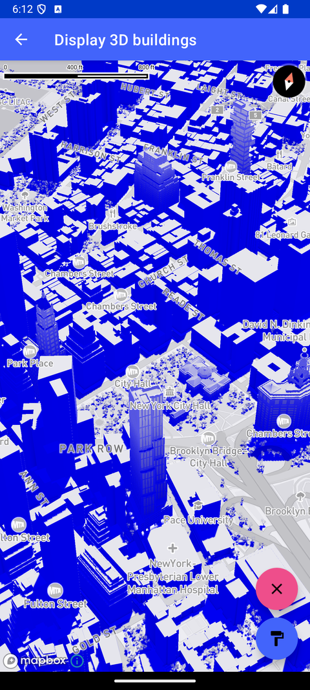

# 显示 3D 建筑（Display 3D buildings）

> 官方示例：[display-3d-buildings](https://docs.mapbox.com/android/maps/examples/android-view/display-3d-buildings/)

## 示例效果



## 功能说明

在 Mapbox Light 样式中使用 FillExtrusionLayer 挤出 3D 建筑并设置光照。

<details>
<summary>英文原文</summary>

This example demonstrates how to create 3d buildings on your map with the Maps SDK for Android. The code below renders buildings on the map using a FillExtrusionLayer(), which allows you to pass in values for building colors, height, opacity and ambient occlusion effects to provide a visually appealing 3D map representation. This layer is then added to the style which adds the buildings onto the map. The example also adjusts the light color and direction dynamically, with an ambientLight and a directionalLight with customizable colors, intensity, and shadows.

</details>

## 示例 Activity

- `FillExtrusionActivity.kt`

## 示例代码

```kotlin
package com.mapbox.maps.testapp.examples.terrain3D

import android.graphics.Color
import android.os.Bundle
import androidx.appcompat.app.AppCompatActivity
import com.mapbox.bindgen.Value
import com.mapbox.geojson.Point
import com.mapbox.maps.CameraOptions
import com.mapbox.maps.MapboxExperimental
import com.mapbox.maps.Style
import com.mapbox.maps.extension.style.expressions.generated.Expression.Companion.all
import com.mapbox.maps.extension.style.expressions.generated.Expression.Companion.eq
import com.mapbox.maps.extension.style.expressions.generated.Expression.Companion.get
import com.mapbox.maps.extension.style.expressions.generated.Expression.Companion.gt
import com.mapbox.maps.extension.style.expressions.generated.Expression.Companion.literal
import com.mapbox.maps.extension.style.expressions.generated.Expression.Companion.lte
import com.mapbox.maps.extension.style.layers.generated.fillExtrusionLayer
import com.mapbox.maps.extension.style.light.generated.ambientLight
import com.mapbox.maps.extension.style.light.generated.directionalLight
import com.mapbox.maps.extension.style.light.setLight
import com.mapbox.maps.extension.style.style
import com.mapbox.maps.testapp.databinding.ActivityFillExtrusionBinding

/**
 * Extrude the building layer in the Mapbox Light style using FillExtrusionLayer
 * and set up the light position.
 */
class FillExtrusionActivity : AppCompatActivity() {

  private var isRedColor: Boolean = false
  private lateinit var binding: ActivityFillExtrusionBinding

  @OptIn(MapboxExperimental::class)
  override fun onCreate(savedInstanceState: Bundle?) {
    super.onCreate(savedInstanceState)
    binding = ActivityFillExtrusionBinding.inflate(layoutInflater)
    setContentView(binding.root)
    val mapboxMap = binding.mapView.mapboxMap
    mapboxMap.setCamera(
      CameraOptions.Builder()
        .center(Point.fromLngLat(-74.0066, 40.7135))
        .pitch(45.0)
        .zoom(15.5)
        .bearing(-17.6)
        .build()
    )

    // buildings lower than 20 meters will be rendered in wall-only mode
    val wallOnlyThreshold = 20.0
    val extrudeFilter = eq(get("extrude"), literal("true"))

    mapboxMap.loadStyle(
      style(style = Style.STANDARD) {
        +fillExtrusionLayer("3d-buildings", "composite") {
          sourceLayer("building")
          filter(
            all(
              extrudeFilter,
              gt(get("height"), literal(wallOnlyThreshold))
            )
          )
          minZoom(15.0)
          fillExtrusionColor(Color.parseColor("#aaaaaa"))
          fillExtrusionHeight(get("height"))
          fillExtrusionBase(get("min_height"))
          fillExtrusionOpacity(0.6)
          fillExtrusionAmbientOcclusionIntensity(0.3)
          fillExtrusionAmbientOcclusionRadius(3.0)
          fillExtrusionEdgeRadius(0.6)
        }

        +fillExtrusionLayer("3d-buildings-wall", "composite") {
          sourceLayer("building")
          filter(
            all(
              extrudeFilter,
              lte(get("height"), literal(wallOnlyThreshold))
            )
          )
          fillExtrusionLineWidth(2.0)
          minZoom(15.0)
          fillExtrusionColor(Color.parseColor("#aaaaaa"))
          fillExtrusionHeight(get("height"))
          fillExtrusionBase(get("min_height"))
          fillExtrusionOpacity(0.6)
        }
      }
    ) {
      mapboxMap.setStyleImportConfigProperty("basemap", "theme", Value.valueOf("monochrome"))
      setupLights3D(it)
    }
  }

  private fun setupLights3D(style: Style) {
    // setup 3d light
    val ambientLight = ambientLight {
      color(Color.BLUE)
      intensity(0.9)
    }
    val directionalLight = directionalLight {
      color(Color.YELLOW)
      intensity(0.9)
      castShadows(true)
      direction(listOf(0.0, 15.0))
    }
    style.setLight(ambientLight, directionalLight)
    // change color on fab click
    binding.fabLightColor.setOnClickListener {
      isRedColor = !isRedColor
      if (isRedColor) {
        ambientLight.color(Color.RED)
      } else {
        ambientLight.color(Color.BLUE)
      }
    }

    binding.fabLightPosition.setOnClickListener {
      directionalLight.direction(listOf(0.0, (directionalLight.direction!![1] + 5.0) % 90.0))
    }
  }
}
```

## 在 Aura 项目中使用

- UI 框架：**Android View**（与 Aura 当前 `MapFragment` + `MapView` 一致）
- 包名请替换为 `com.catclaw.aura`
- 需在 `local.properties` 配置 `MAPBOX_ACCESS_TOKEN`
- 部分示例依赖 `assets/` 或额外布局文件，请参考 GitHub 示例工程

## 参考链接

- [官方文档（英文）](https://docs.mapbox.com/android/maps/examples/android-view/display-3d-buildings/)
- [GitHub 源码](https://github.com/mapbox/mapbox-maps-android/blob/v11.24.3/app/src/main/java/com/mapbox/maps/testapp/examples/terrain3D/FillExtrusionActivity.kt)
- [Android View 示例索引](./README.md)
- [Mapbox 中文指南](../../README.md)
