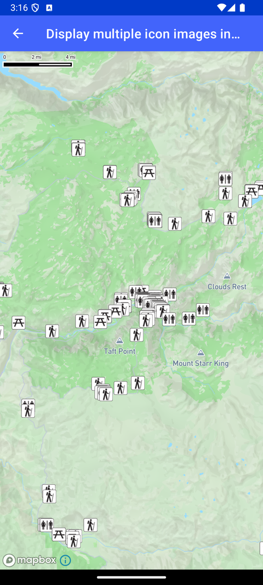

# Symbol 图层多图标（Display multiple icon images in a symbol layer）

> 官方示例：[display-multiple-icon-images-in-a-symbol-layer](https://docs.mapbox.com/android/maps/examples/android-view/display-multiple-icon-images-in-a-symbol-layer/)

## 示例效果



## 功能说明

向 SymbolLayer 添加多点与多图标，用 switchCase/get 表达式按属性选择图标。

<details>
<summary>英文原文</summary>

This example demonstrates how to create data-driven symbols on a map using the Mapbox Maps SDK for Android. The code below adds icons onto a SymbolLayer and places them based on a group of Point of Interest (POI) data. First, BitmapFactory.decodeResource create 3 objects, based on the images in the drawables folder. These objects are referenced to assign an image to each icon based on their POITYPE, and using a switchCase, the icons are assigned either a restroom, trailhead, or picnic area and assigns the icon a .png from the U.S. National Parks Service symbol library. For more information on leveraging data-driven styling techniques with expressions, see the Mapbox Style Specification documentation.

</details>

## 示例 Activity

- `IconPropertyActivity.kt`

## 示例代码

```kotlin
package com.mapbox.maps.testapp.examples

import android.graphics.BitmapFactory
import android.os.Bundle
import androidx.appcompat.app.AppCompatActivity
import com.mapbox.maps.Style
import com.mapbox.maps.extension.style.expressions.dsl.generated.switchCase
import com.mapbox.maps.extension.style.image.image
import com.mapbox.maps.extension.style.layers.generated.symbolLayer
import com.mapbox.maps.extension.style.layers.properties.generated.IconAnchor
import com.mapbox.maps.extension.style.sources.generated.vectorSource
import com.mapbox.maps.extension.style.style
import com.mapbox.maps.testapp.R
import com.mapbox.maps.testapp.databinding.ActivityIconPropertyBinding

/**
 * Add point data and several images to a style and use the switchCase and
 * get expressions to choose which image to display at each point in a SymbolLayer
 * based on a data property.
 */
class IconPropertyActivity : AppCompatActivity() {

  override fun onCreate(savedInstanceState: Bundle?) {
    super.onCreate(savedInstanceState)
    val binding = ActivityIconPropertyBinding.inflate(layoutInflater)
    setContentView(binding.root)

    binding.mapView.mapboxMap.loadStyle(
      styleExtension = style(Style.STANDARD) {
        // Add icons from the U.S. National Parks Service to the map's style.
        +image(RESTROOMS, BitmapFactory.decodeResource(resources, R.drawable.nps_restrooms))
        +image(TRAIL_HEAD, BitmapFactory.decodeResource(resources, R.drawable.nps_trailhead))
        +image(PICNIC_AREA, BitmapFactory.decodeResource(resources, R.drawable.nps_picnic_area))
        // Access a vector tileset that contains places of interest at Yosemite National Park.
        // This tileset was created by uploading NPS shape files to Mapbox Studio.
        +vectorSource(SOURCE_ID) {
          url(SOURCE_URI)
        }
        // Create a symbol layer and access the layer contained.
        +symbolLayer(LAYER_ID, SOURCE_ID) {
          // Access the layer that contains the Point of Interest (POI) data.
          // The source layer property is a unique identifier for a layer within a vector tile source.
          sourceLayer(SOURCE_LAYER_ID)
          // Expression that adds conditions to the source to determine styling.
          // `POITYPE` refers to a key in the data source. The values tell us which icon to use from the sprite sheet
          iconImage(
            switchCase {
              eq {
                get {
                  literal(ICON_KEY)
                }
                literal(KEY_PICNIC_AREA)
              }
              literal(PICNIC_AREA)
              eq {
                get {
                  literal(ICON_KEY)
                }
                literal(KEY_RESTROOMS)
              }
              literal(RESTROOMS)
              eq {
                get {
                  literal(ICON_KEY)
                }
                literal(KEY_TRAIL_HEAD)
              }
              literal(TRAIL_HEAD)
              // default case is to return an empty string so no icon will be loaded
              literal("")
            }
          )
          iconAllowOverlap(true)
          iconAnchor(IconAnchor.BOTTOM)
        }
      }
    )
  }

  companion object {
    private const val SOURCE_URI = "mapbox://examples.ciuz0vpc"
    private const val SOURCE_LAYER_ID = "Yosemite_POI-38jhes"
    private const val RESTROOMS = "restrooms"
    private const val TRAIL_HEAD = "trailhead"
    private const val PICNIC_AREA = "picnic-area"
    private const val KEY_PICNIC_AREA = "Picnic Area"
    private const val KEY_RESTROOMS = "Restroom"
    private const val KEY_TRAIL_HEAD = "Trailhead"
    private const val SOURCE_ID = "source_id"
    private const val LAYER_ID = "layer_id"
    private const val ICON_KEY = "POITYPE"
  }
}
```

## 在 Aura 项目中使用

- UI 框架：**Android View**（与 Aura 当前 `MapFragment` + `MapView` 一致）
- 包名请替换为 `com.catclaw.aura`
- 需在 `local.properties` 配置 `MAPBOX_ACCESS_TOKEN`
- 部分示例依赖 `assets/` 或额外布局文件，请参考 GitHub 示例工程

## 参考链接

- [官方文档（英文）](https://docs.mapbox.com/android/maps/examples/android-view/display-multiple-icon-images-in-a-symbol-layer/)
- [GitHub 源码](https://github.com/mapbox/mapbox-maps-android/blob/v11.24.3/app/src/main/java/com/mapbox/maps/testapp/examples/IconPropertyActivity.kt)
- [Android View 示例索引](./README.md)
- [Mapbox 中文指南](../../README.md)
