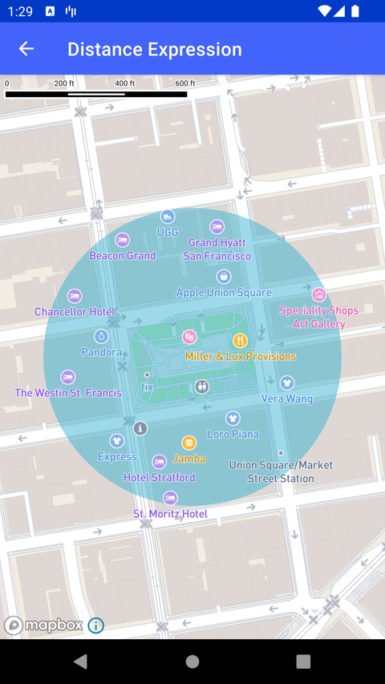

# 距离表达式（Distance Expression）

> 官方示例：[distance-expression](https://docs.mapbox.com/android/maps/examples/android-view/distance-expression/)

## 示例效果



## 功能说明

使用 distance 表达式过滤并显示 POI。

<details>
<summary>英文原文</summary>

This example demonstrates how to add a filter that hides features outside a specified geometry using Mapbox Maps SDK for Android. The code below creates a fillLayer, displaying a semi-transparent circle on the map. A SymbolLayer then filters through points of interest (POI) labels, using an expression to grab any within the range of the circle and displaying them on the map. All other types of labels on the map are then hidden, such as road labels and transit labels, to help highlight the POI labels by passing Visibility.NONE into the .visibility() function.

</details>

## 示例 Activity

- `DistanceExpressionActivity.kt`

## 示例代码

```kotlin
package com.mapbox.maps.testapp.examples

import android.os.Bundle
import androidx.appcompat.app.AppCompatActivity
import com.mapbox.geojson.Point
import com.mapbox.maps.CameraOptions
import com.mapbox.maps.MapView
import com.mapbox.maps.Style
import com.mapbox.maps.extension.style.expressions.dsl.generated.lt
import com.mapbox.maps.extension.style.layers.generated.SymbolLayer
import com.mapbox.maps.extension.style.layers.generated.fillLayer
import com.mapbox.maps.extension.style.layers.getLayer
import com.mapbox.maps.extension.style.layers.properties.generated.Visibility
import com.mapbox.maps.extension.style.sources.generated.geoJsonSource
import com.mapbox.maps.extension.style.style
import com.mapbox.turf.TurfConstants
import com.mapbox.turf.TurfTransformation

/**
 * An Activity that showcases the within expression to filter features outside a geometry
 */
class DistanceExpressionActivity : AppCompatActivity() {

  override fun onCreate(savedInstanceState: Bundle?) {
    super.onCreate(savedInstanceState)
    val mapView = MapView(this)
    setContentView(mapView)

    val center = Point.fromLngLat(LON, LAT)
    val circle = TurfTransformation.circle(center, RADIUS, TurfConstants.UNIT_METERS)

    // Setup camera position above Georgetown
    mapView.mapboxMap.setCamera(CameraOptions.Builder().center(center).zoom(16.0).build())

    mapView.mapboxMap.loadStyle(
      style(Style.MAPBOX_STREETS) {
        +geoJsonSource(POINT_ID) {
          geometry(center)
        }
        +geoJsonSource(CIRCLE_ID) {
          geometry(circle)
        }
        +layerAtPosition(
          fillLayer(CIRCLE_ID, CIRCLE_ID) {
            fillOpacity(0.5)
            fillColor("#3bb2d0")
          },
          below = POI_LABEL
        )
      }
    ) {
      val symbolLayer = it.getLayer("poi-label") as SymbolLayer
      symbolLayer.filter(
        lt {
          distance(Point.fromLngLat(LON, LAT))
          literal(150)
        }
      )
      // Hide other types of labels to highlight POI labels
      (it.getLayer(ROAD_LABEL) as SymbolLayer).visibility(Visibility.NONE)
      (it.getLayer(TRANSIT_LABEL) as SymbolLayer).visibility(Visibility.NONE)
      (it.getLayer(ROAD_NUMBER_SHIELD) as SymbolLayer).visibility(Visibility.NONE)
    }
  }

  companion object {
    const val POINT_ID = "point"
    const val CIRCLE_ID = "circle"
    const val LAT = 37.78794572301525
    const val LON = -122.40752220153807
    const val RADIUS = 150.0
    const val POI_LABEL = "poi-label"
    const val ROAD_LABEL = "road-label"
    const val TRANSIT_LABEL = "transit-label"
    const val ROAD_NUMBER_SHIELD = "road-number-shield"
  }
}
```

## 在 Aura 项目中使用

- UI 框架：**Android View**（与 Aura 当前 `MapFragment` + `MapView` 一致）
- 包名请替换为 `com.catclaw.aura`
- 需在 `local.properties` 配置 `MAPBOX_ACCESS_TOKEN`
- 部分示例依赖 `assets/` 或额外布局文件，请参考 GitHub 示例工程

## 参考链接

- [官方文档（英文）](https://docs.mapbox.com/android/maps/examples/android-view/distance-expression/)
- [GitHub 源码](https://github.com/mapbox/mapbox-maps-android/blob/v11.24.3/app/src/main/java/com/mapbox/maps/testapp/examples/DistanceExpressionActivity.kt)
- [Android View 示例索引](./README.md)
- [Mapbox 中文指南](../../README.md)
