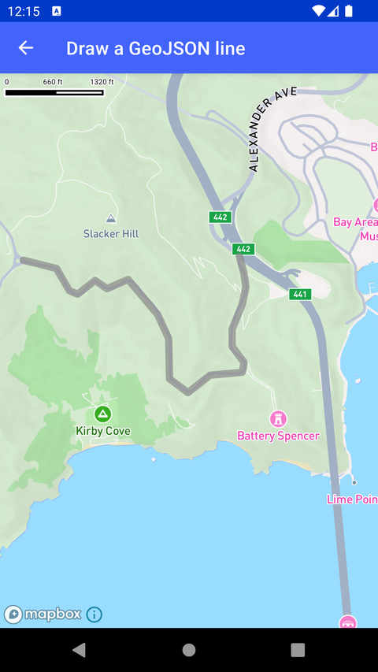

# 绘制 GeoJSON 线（Draw a GeoJSON line）

> 官方示例：[draw-a-geojson-line](https://docs.mapbox.com/android/maps/examples/android-view/draw-a-geojson-line/)

## 示例效果



## 功能说明

通过 GeoJsonSource 加载折线，用 LineLayer 显示在地图上。

<details>
<summary>英文原文</summary>

This example demonstrates how to load a polyline into a map style in the Mapbox Maps SDK for Android. The code below loads data from a GeoJSON file into the map using the GeoJsonSource method and then displays the information in a polyline on the map using a LineLayer. The polyline is defined by geographical points and styled with specific properties such as line cap, line join, opacity, width, and color.

</details>

## 示例 Activity

- `DrawGeoJsonLineActivity.kt`

## 示例代码

```kotlin
package com.mapbox.maps.testapp.examples.linesandpolygons

import android.os.Bundle
import androidx.appcompat.app.AppCompatActivity
import com.mapbox.geojson.Point
import com.mapbox.maps.CameraOptions
import com.mapbox.maps.MapView
import com.mapbox.maps.Style
import com.mapbox.maps.extension.style.layers.generated.lineLayer
import com.mapbox.maps.extension.style.layers.properties.generated.LineCap
import com.mapbox.maps.extension.style.layers.properties.generated.LineJoin
import com.mapbox.maps.extension.style.sources.generated.geoJsonSource
import com.mapbox.maps.extension.style.style

/**
 * Load a polyline to a style using GeoJsonSource and display it on a map using LineLayer.
 */
class DrawGeoJsonLineActivity : AppCompatActivity() {

  public override fun onCreate(savedInstanceState: Bundle?) {
    super.onCreate(savedInstanceState)
    val mapView = MapView(this)
    setContentView(mapView)
    mapView.mapboxMap.setCamera(
      CameraOptions.Builder().center(
        Point.fromLngLat(
          LATITUDE,
          LONGITUDE
        )
      ).zoom(ZOOM).build()
    )
    mapView.mapboxMap.loadStyle(
      (
        style(style = Style.STANDARD) {
          +geoJsonSource(GEOJSON_SOURCE_ID) {
            data("asset://from_crema_to_council_crest.geojson")
          }
          +lineLayer("linelayer", GEOJSON_SOURCE_ID) {
            lineCap(LineCap.ROUND)
            lineJoin(LineJoin.ROUND)
            lineOpacity(0.7)
            lineWidth(8.0)
            lineColor("#888")
          }
        }
        )
    )
  }

  companion object {
    private const val GEOJSON_SOURCE_ID = "line"
    private const val LATITUDE = -122.486052
    private const val LONGITUDE = 37.830348
    private const val ZOOM = 14.0
  }
}
```

## 在 Aura 项目中使用

- UI 框架：**Android View**（与 Aura 当前 `MapFragment` + `MapView` 一致）
- 包名请替换为 `com.catclaw.aura`
- 需在 `local.properties` 配置 `MAPBOX_ACCESS_TOKEN`
- 部分示例依赖 `assets/` 或额外布局文件，请参考 GitHub 示例工程

## 参考链接

- [官方文档（英文）](https://docs.mapbox.com/android/maps/examples/android-view/draw-a-geojson-line/)
- [GitHub 源码](https://github.com/mapbox/mapbox-maps-android/blob/v11.24.3/app/src/main/java/com/mapbox/maps/testapp/examples/linesandpolygons/DrawGeoJsonLineActivity.kt)
- [Android View 示例索引](./README.md)
- [Mapbox 中文指南](../../README.md)
