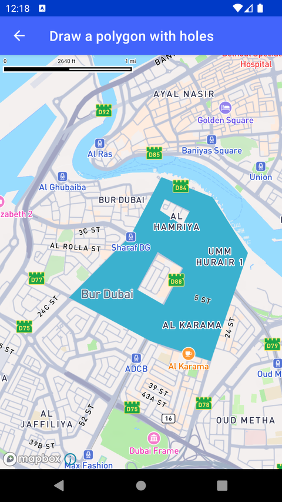

# 绘制带洞多边形（Draw a polygon with holes）

> 官方示例：[draw-a-polygon-with-holes](https://docs.mapbox.com/android/maps/examples/android-view/draw-a-polygon-with-holes/)

## 示例效果



## 功能说明

添加带内洞的多边形图层。

<details>
<summary>英文原文</summary>

This example demonstrates how create a polygon with holes and add it to a map using the Mapbox Maps SDK for Android. The code below defines the bounds of the outer polygon and inner holes by using LineString. These LineStrings are then passed into the Feature.fromGeometry() function to create the polygon and then added to the a FillLayer.

</details>

## 示例 Activity

- `PolygonHolesActivity.kt`

## 示例代码

```kotlin
package com.mapbox.maps.testapp.examples.linesandpolygons

import android.graphics.Color
import android.os.Bundle
import androidx.appcompat.app.AppCompatActivity
import com.mapbox.geojson.Feature
import com.mapbox.geojson.LineString
import com.mapbox.geojson.Point
import com.mapbox.geojson.Polygon
import com.mapbox.maps.CameraOptions
import com.mapbox.maps.MapView
import com.mapbox.maps.Style
import com.mapbox.maps.extension.style.layers.addLayer
import com.mapbox.maps.extension.style.layers.addLayerBelow
import com.mapbox.maps.extension.style.layers.generated.FillLayer
import com.mapbox.maps.extension.style.layers.getLayer
import com.mapbox.maps.extension.style.sources.addSource
import com.mapbox.maps.extension.style.sources.generated.geoJsonSource

/**
 * Add holes to a polygon drawn on top of the map.
 */
class PolygonHolesActivity : AppCompatActivity() {

  private lateinit var mapView: MapView

  override fun onCreate(savedInstanceState: Bundle?) {
    super.onCreate(savedInstanceState)

    mapView = MapView(this)
    setContentView(mapView)
    with(mapView.mapboxMap) {
      // TODO attributionTintColor(RED_COLOR) missing
      // TODO compassFadesWhenFacingNorth missing
      setCamera(
        CameraOptions.Builder()
          .center(Point.fromLngLat(55.3089185, 25.255377))
          .zoom(13.0)
          .build()
      )
      loadStyle(
        Style.STANDARD
      ) { style ->
        val outerLineString: LineString = LineString.fromLngLats(POLYGON_COORDINATES)
        val innerLineString: LineString = LineString.fromLngLats(HOLE_COORDINATES[0])
        val secondInnerLineString: LineString = LineString.fromLngLats(HOLE_COORDINATES[1])
        val innerList: MutableList<LineString> = ArrayList()
        innerList.add(innerLineString)
        innerList.add(secondInnerLineString)
        style.addSource(
          geoJsonSource(
            "source-id"
          ) {
            feature(Feature.fromGeometry(Polygon.fromOuterInner(outerLineString, innerList)))
          }
        )
        val polygonFillLayer: FillLayer = FillLayer("layer-id", "source-id").apply {
          fillColor(BLUE_COLOR)
        }
        if (style.getLayer("road-number-shield") != null) {
          style.addLayerBelow(polygonFillLayer, "road-number-shield")
        } else {
          style.addLayer(polygonFillLayer)
        }
      }
    }
  }

  override fun onStart() {
    super.onStart()
    mapView.onStart()
  }

  override fun onStop() {
    super.onStop()
    mapView.onStop()
  }

  override fun onLowMemory() {
    super.onLowMemory()
    mapView.onLowMemory()
  }

  override fun onDestroy() {
    super.onDestroy()
    mapView.onDestroy()
  }

  companion object {
    val BLUE_COLOR = Color.parseColor("#3bb2d0")
    val POLYGON_COORDINATES = listOf(
      Point.fromLngLat(55.30122473231012, 25.26476622289597),
      Point.fromLngLat(55.29743486255916, 25.25827212207261),
      Point.fromLngLat(55.28978863411328, 25.251356725509737),
      Point.fromLngLat(55.300027931336984, 25.246425506635504),
      Point.fromLngLat(55.307474692951274, 25.244200378933655),
      Point.fromLngLat(55.31212891895635, 25.256408010450187),
      Point.fromLngLat(55.30774064871093, 25.26266169122738),
      Point.fromLngLat(55.301357710197806, 25.264946609615492),
      Point.fromLngLat(55.30122473231012, 25.26476622289597)
    )
    val HOLE_COORDINATES = listOf(
      listOf(
        Point.fromLngLat(55.30084858315658, 25.256531695820797),
        Point.fromLngLat(55.298280197635705, 25.252243254705405),
        Point.fromLngLat(55.30163885563897, 25.250501032248863),
        Point.fromLngLat(55.304059065092645, 25.254700192612702),
        Point.fromLngLat(55.30084858315658, 25.256531695820797)
      ),
      listOf(
        Point.fromLngLat(55.30173763969924, 25.262517391695198),
        Point.fromLngLat(55.301095543307355, 25.26122200491396),
        Point.fromLngLat(55.30396028103232, 25.259479911263526),
        Point.fromLngLat(55.30489872958182, 25.261132667394975),
        Point.fromLngLat(55.30173763969924, 25.262517391695198)
      )
    )
  }
}
```

## 在 Aura 项目中使用

- UI 框架：**Android View**（与 Aura 当前 `MapFragment` + `MapView` 一致）
- 包名请替换为 `com.catclaw.aura`
- 需在 `local.properties` 配置 `MAPBOX_ACCESS_TOKEN`
- 部分示例依赖 `assets/` 或额外布局文件，请参考 GitHub 示例工程

## 参考链接

- [官方文档（英文）](https://docs.mapbox.com/android/maps/examples/android-view/draw-a-polygon-with-holes/)
- [GitHub 源码](https://github.com/mapbox/mapbox-maps-android/blob/v11.24.3/app/src/main/java/com/mapbox/maps/testapp/examples/linesandpolygons/PolygonHolesActivity.kt)
- [Android View 示例索引](./README.md)
- [Mapbox 中文指南](../../README.md)
