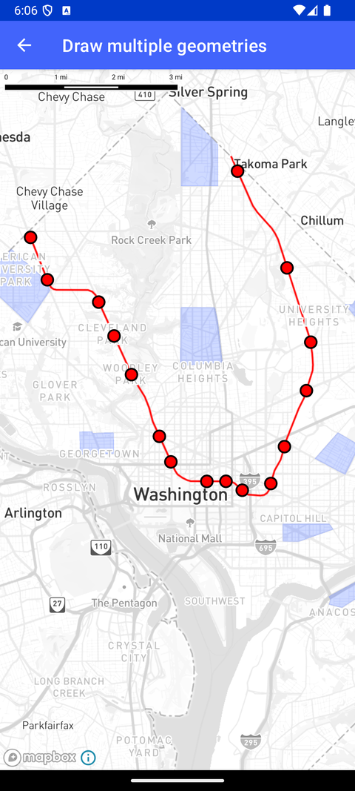

# 绘制多种几何体（Draw multiple geometries）

> 官方示例：[draw-multiple-geometries](https://docs.mapbox.com/android/maps/examples/android-view/draw-multiple-geometries/)

## 示例效果



## 功能说明

在同一地图上显示多种几何形状。

<details>
<summary>英文原文</summary>

This example demonstrates drawing several different geometries for one source with the Maps SDK for Android. The MultipleGeometriesActivity initializes various geometries such as polygons, line strings, and points using GeoJSON data. The createGeoJsonSource method loads data from a GeoJSON file in the assets folder and adds it as a source to the map style. Different layers are then added to the map style using addPolygonLayer, addLineStringLayer, and addPointLayer methods, each customizing the visualization of the corresponding geometry types. This example showcases the creation and styling of fill layers for polygons, line layers for line strings, and circle layers for points, providing a visual representation of geographic data. For handling the GeoJSON source, the geoJsonSource, fillLayer, lineLayer, and circleLayer classes from the Mapbox Maps SDK are utilized to define the source data and style properties for each layer type. Color, opacity, stroke width, and other visual attributes are customized for the layers based on the geometry type specified in the GeoJSON data. Additionally, the inclusion of error handling for URI syntax exceptions ensures robustness when creating the GeoJSON source.

</details>

## 示例 Activity

- `MultipleGeometriesActivity.kt`

## 示例代码

```kotlin
package com.mapbox.maps.testapp.examples.markersandcallouts

import android.graphics.Color
import android.os.Bundle
import androidx.appcompat.app.AppCompatActivity
import com.mapbox.bindgen.Value
import com.mapbox.maps.MapboxMap
import com.mapbox.maps.Style
import com.mapbox.maps.extension.style.expressions.dsl.generated.eq
import com.mapbox.maps.extension.style.layers.addLayer
import com.mapbox.maps.extension.style.layers.generated.*
import com.mapbox.maps.extension.style.sources.addSource
import com.mapbox.maps.extension.style.sources.generated.geoJsonSource
import com.mapbox.maps.logE
import com.mapbox.maps.testapp.databinding.ActivityMultipleGeometriesBinding
import java.net.URISyntaxException

/**
 * Example showing drawing several different geometries for one source.
 */
class MultipleGeometriesActivity : AppCompatActivity() {

  private lateinit var mapboxMap: MapboxMap

  override fun onCreate(savedInstanceState: Bundle?) {
    super.onCreate(savedInstanceState)
    val binding = ActivityMultipleGeometriesBinding.inflate(layoutInflater)
    setContentView(binding.root)

    mapboxMap = binding.mapView.mapboxMap
    mapboxMap.loadStyle(
      Style.STANDARD
    ) {
      createGeoJsonSource(it)
      addPolygonLayer(it)
      addLineStringLayer(it)
      addPointLayer(it)
      mapboxMap.setStyleImportConfigProperty("basemap", "theme", Value.valueOf("monochrome"))
    }
  }

  private fun createGeoJsonSource(loadedMapStyle: Style) {
    try {
      // Load data from GeoJSON file in the assets folder
      loadedMapStyle.addSource(
        geoJsonSource(GEOJSON_SOURCE_ID) {
          data(GEOJSON_SOURCE_URL)
        }
      )
    } catch (exception: URISyntaxException) {
      logE(TAG, "Creating geojson source failed ${exception.message}")
    }
  }

  private fun addPolygonLayer(loadedMapStyle: Style) {
    // Create and style a FillLayer that uses the Polygon Feature's coordinates in the GeoJSON data
    loadedMapStyle.addLayer(
      fillLayer(POLYGON_LAYER_ID, GEOJSON_SOURCE_ID) {
        fillColor(Color.parseColor("#4469f7"))
        fillOpacity(POLYGON_OPACITY)
        filter(
          eq {
            literal("\$type")
            literal("Polygon")
          }
        )
      }
    )
  }

  private fun addLineStringLayer(loadedMapStyle: Style) {
    // Create and style a LineLayer that uses the Line String Feature's coordinates in the GeoJSON data
    loadedMapStyle.addLayer(
      lineLayer(LINE_LAYER_ID, GEOJSON_SOURCE_ID) {
        lineColor(Color.RED)
        lineWidth(LINE_WIDTH)
        filter(
          eq {
            literal("\$type")
            literal("LineString")
          }
        )
      }
    )
  }

  private fun addPointLayer(loadedMapStyle: Style) {
    // Create and style a Circle layer that uses the Point Feature's coordinates in the GeoJSON data
    loadedMapStyle.addLayer(
      circleLayer(CIRCLE_LAYER_ID, GEOJSON_SOURCE_ID) {
        filter(
          eq {
            literal("\$type")
            literal("Point")
          }
        )
        circleColor(Color.RED)
        circleRadius(CIRCLE_RADIUS)
        circleStrokeWidth(CIRCLE_STROKE_WIDTH)
        circleStrokeColor(Color.BLACK)
      }
    )
  }

  companion object {
    private val TAG = MultipleGeometriesActivity::class.java.simpleName
    private const val GEOJSON_SOURCE_ID = "geojson_sample"
    private const val CIRCLE_LAYER_ID = "circle-layer"
    private const val LINE_LAYER_ID = "line_string"
    private const val POLYGON_LAYER_ID = "polygon"
    private const val GEOJSON_SOURCE_URL = "asset://multiple_geometry_example.geojson"
    private const val LINE_WIDTH = 2.0
    private const val CIRCLE_RADIUS = 6.0
    private const val CIRCLE_STROKE_WIDTH = 2.0
    private const val POLYGON_OPACITY = 0.3
  }
}
```

## 在 Aura 项目中使用

- UI 框架：**Android View**（与 Aura 当前 `MapFragment` + `MapView` 一致）
- 包名请替换为 `com.catclaw.aura`
- 需在 `local.properties` 配置 `MAPBOX_ACCESS_TOKEN`
- 部分示例依赖 `assets/` 或额外布局文件，请参考 GitHub 示例工程

## 参考链接

- [官方文档（英文）](https://docs.mapbox.com/android/maps/examples/android-view/draw-multiple-geometries/)
- [GitHub 源码](https://github.com/mapbox/mapbox-maps-android/blob/v11.24.3/app/src/main/java/com/mapbox/maps/testapp/examples/markersandcallouts/MultipleGeometriesActivity.kt)
- [Android View 示例索引](./README.md)
- [Mapbox 中文指南](../../README.md)
