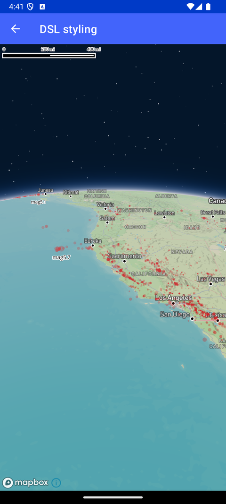

# DSL 样式（DSL styling）

> 官方示例：[dsl-styling](https://docs.mapbox.com/android/maps/examples/android-view/dsl-styling/)

## 示例效果



## 功能说明

使用 DSL 进行运行时样式设置。

<details>
<summary>英文原文</summary>

This example showcases the usage of style extension with the Mapbox Maps SDK for Android. The DSLStylingActivity class implements OnMapClickListener. It demonstrates creating a custom style for the map by defining various layers and sources. The style includes features like imageSource, geoJSONSource, circleLayer, symbolLayer, and rasterLayer with specific styling properties such as colors, opacities, and text formatting. The activity also handles map click events and provides information about clicked features, including the time and associated layers. The style creation utilizes DSL (Domain Specific Language) functions provided by the Mapbox SDK, allowing for expressive and concise styling configurations. Dynamic lighting effects like ambientLight and directionalLight are incorporated, enhancing the visual appeal of the map. The example demonstrates the power and flexibility of the Mapbox Maps SDK for creating interactive and visually appealing maps.

</details>

## 示例 Activity

- `DSLStylingActivity.kt`

## 示例代码

```kotlin
package com.mapbox.maps.testapp.examples

import android.graphics.Color
import android.os.Bundle
import android.widget.Toast
import androidx.appcompat.app.AppCompatActivity
import com.mapbox.bindgen.Expected
import com.mapbox.geojson.Point
import com.mapbox.maps.MapView
import com.mapbox.maps.MapboxMap
import com.mapbox.maps.QueriedRenderedFeature
import com.mapbox.maps.RenderedQueryGeometry
import com.mapbox.maps.RenderedQueryOptions
import com.mapbox.maps.ScreenBox
import com.mapbox.maps.ScreenCoordinate
import com.mapbox.maps.Style
import com.mapbox.maps.dsl.cameraOptions
import com.mapbox.maps.extension.style.expressions.dsl.generated.concat
import com.mapbox.maps.extension.style.expressions.dsl.generated.format
import com.mapbox.maps.extension.style.expressions.dsl.generated.get
import com.mapbox.maps.extension.style.expressions.dsl.generated.literal
import com.mapbox.maps.extension.style.expressions.dsl.generated.rgb
import com.mapbox.maps.extension.style.expressions.dsl.generated.subtract
import com.mapbox.maps.extension.style.expressions.generated.Expression.Companion.all
import com.mapbox.maps.extension.style.layers.generated.circleLayer
import com.mapbox.maps.extension.style.layers.generated.rasterLayer
import com.mapbox.maps.extension.style.layers.generated.symbolLayer
import com.mapbox.maps.extension.style.layers.properties.generated.TextAnchor
import com.mapbox.maps.extension.style.light.dynamicLight
import com.mapbox.maps.extension.style.light.generated.ambientLight
import com.mapbox.maps.extension.style.light.generated.directionalLight
import com.mapbox.maps.extension.style.sources.generated.geoJsonSource
import com.mapbox.maps.extension.style.sources.generated.imageSource
import com.mapbox.maps.extension.style.style
import com.mapbox.maps.plugin.gestures.OnMapClickListener
import com.mapbox.maps.plugin.gestures.addOnMapClickListener
import java.text.DateFormat.getDateTimeInstance
import java.util.Date

/**
 * Example showcasing usage of style extension.
 */
class DSLStylingActivity : AppCompatActivity(), OnMapClickListener {
  private lateinit var mapboxMap: MapboxMap

  override fun onCreate(savedInstanceState: Bundle?) {
    super.onCreate(savedInstanceState)
    val mapView = MapView(this)
    setContentView(mapView)

    mapboxMap = mapView.mapboxMap
    mapboxMap.loadStyle(createStyle()) {
      mapboxMap.setCamera(
        cameraOptions {
          center(Point.fromLngLat(-122.40276277449118, 37.79608281254676))
          zoom(4.0)
          bearing(359.63)
          pitch(60.0)
        }
      )
    }
    mapboxMap.addOnMapClickListener(this)
  }

  override fun onMapClick(point: Point): Boolean {
    val clicked = mapboxMap.pixelForCoordinate(point)
    mapboxMap.queryRenderedFeatures(
      RenderedQueryGeometry(
        ScreenBox(
          ScreenCoordinate(clicked.x - 50, clicked.y - 50),
          ScreenCoordinate(clicked.x + 50, clicked.y + 50)
        )
      ),
      RenderedQueryOptions(listOf("earthquakeCircle", "earthquakeText"), literal(true))
    ) { expected: Expected<String, MutableList<QueriedRenderedFeature>> ->
      val features = expected.value!!
      features.takeIf { it.isNotEmpty() }?.let {
        val time = it.first().queriedFeature.feature.getNumberProperty("time")
        // log feature layers
        val featureLayer = it.first().layers.joinToString(" ")
        Toast.makeText(
          this,
          "time = ${getDateTime(time.toLong())}, layers = $featureLayer",
          Toast.LENGTH_SHORT
        ).show()
      }
    }
    return true
  }

  private fun getDateTime(time: Long): String = try {
    val sdf = getDateTimeInstance()
    val netDate = Date(time)
    sdf.format(netDate)
  } catch (e: Exception) {
    e.toString()
  }

  private fun createStyle() = style(style = Style.STANDARD) {
    +imageSource("imag") {
      url(IMAGE_URL)
      coordinates(
        listOf(
          listOf(-35.859375, 58.44773280389084),
          listOf(-16.171875, 58.44773280389084),
          listOf(-16.171875, 54.7246201949245),
          listOf(-35.859375, 54.7246201949245)
        )
      )
    }
    +geoJsonSource(id = "earthquakes") {
      data(GEOJSON_URL)
      cluster(false)
    }
    +circleLayer(layerId = "earthquakeCircle", sourceId = "earthquakes") {
      circleRadius(get { literal("mag") })
      circleColor(rgb(255.0, 0.0, 0.0))
      circleOpacity(0.3)
      circleStrokeColor(Color.WHITE)
    }
    +layerAtPosition(
      symbolLayer(
        layerId = "earthquakeText",
        sourceId = "earthquakes"
      ) {
        // Only show the magnitude scale if the value is >4.0 and:
        // - the map pitch is < 70º or
        // - objects are close to the camera
        filter(
          all {
            gt {
              get {
                literal("mag")
              }
              literal(4.0)
            }
            switchCase {
              // 1st case: return true if pitch <70º
              lt {
                pitch()
                literal(70.0)
              }
              literal(true)

              // 2nd case: return true if close to camera
              lte {
                distanceFromCenter()
                literal(-0.5)
              }
              literal(true)

              // otherwise: return false
              literal(false)
            }
          }
        )
        textField(
          format {
            formatSection(
              concat {
                literal("mag")
                toString {
                  get {
                    literal("mag")
                  }
                }
              }
            ) {
              textFont(listOf("Open Sans Regular", "Arial Unicode MS Regular"))
              textColor(Color.BLACK)
            }
          }
        )
        textHaloColor(Color.WHITE)
        textHaloWidth(1.0)
        textAnchor(TextAnchor.TOP)
        textOffset(listOf(0.0, 1.0))
        textSize(10.0)
        textIgnorePlacement(false)
        symbolSortKey(
          subtract {
            toNumber {
              get {
                literal("mag")
              }
            }
          }
        )
      },
      above = "earthquakeCircle"
    )
    +rasterLayer("raster", "imag") {
      rasterOpacity(0.8)
    }
    +dynamicLight(
      ambientLight {
        intensity(0.2)
        color(Color.YELLOW)
      },
      directionalLight {
        shadowIntensity(0.5)
        castShadows(true)
        color(Color.WHITE)
      }
    )
  }

  companion object {
    private const val IMAGE_URL =
      "https://upload.wikimedia.org/wikipedia/commons/thumb/1/1f/Mapbox_logo_2019.svg/2560px-Mapbox_logo_2019.svg.png"
    private const val GEOJSON_URL =
      "https://www.mapbox.com/mapbox-gl-js/assets/earthquakes.geojson"
  }
}
```

## 在 Aura 项目中使用

- UI 框架：**Android View**（与 Aura 当前 `MapFragment` + `MapView` 一致）
- 包名请替换为 `com.catclaw.aura`
- 需在 `local.properties` 配置 `MAPBOX_ACCESS_TOKEN`
- 部分示例依赖 `assets/` 或额外布局文件，请参考 GitHub 示例工程

## 参考链接

- [官方文档（英文）](https://docs.mapbox.com/android/maps/examples/android-view/dsl-styling/)
- [GitHub 源码](https://github.com/mapbox/mapbox-maps-android/blob/v11.24.3/app/src/main/java/com/mapbox/maps/testapp/examples/DSLStylingActivity.kt)
- [Android View 示例索引](./README.md)
- [Mapbox 中文指南](../../README.md)
