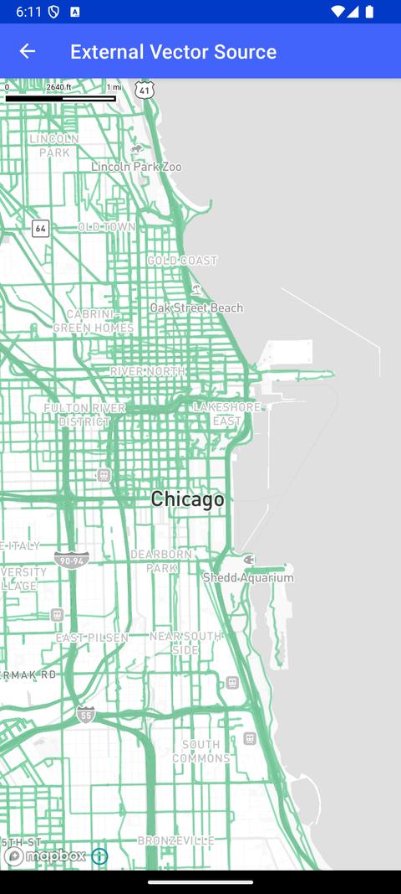

# 外部矢量源（External Vector Source）

> 官方示例：[external-vector-source](https://docs.mapbox.com/android/maps/examples/android-view/external-vector-source/)

## 示例效果



## 功能说明

添加第三方矢量瓦片数据源。

<details>
<summary>英文原文</summary>

This example demonstrates how to render vector tiles using a third-party vector tile source on a map using the Mapbox Maps SDK for Android. The activity named ThirdPartyVectorSourceActivity sets up the map view and loads the Mapbox map with vector tiles provided by Mapillary through the addSource method. The vector tiles are sourced from Mapillary's URL and styled with specified zoom levels and layer properties. The map is configured to display a line layer using lineLayer, defining attributes such as lineCap, lineJoin, lineOpacity, lineColor, and lineWidth. These features are added to the map's style below a specific layer using addLayerBelow.

</details>

## 示例 Activity

- `ThirdPartyVectorSourceActivity.kt`

## 示例代码

```kotlin
package com.mapbox.maps.testapp.examples.style

import android.os.Bundle
import androidx.appcompat.app.AppCompatActivity
import com.mapbox.bindgen.Value
import com.mapbox.geojson.Point
import com.mapbox.maps.*
import com.mapbox.maps.extension.style.expressions.generated.Expression
import com.mapbox.maps.extension.style.layers.addLayer
import com.mapbox.maps.extension.style.layers.generated.lineLayer
import com.mapbox.maps.extension.style.layers.properties.generated.LineCap
import com.mapbox.maps.extension.style.layers.properties.generated.LineJoin
import com.mapbox.maps.extension.style.sources.addSource
import com.mapbox.maps.extension.style.sources.generated.vectorSource

/**
 * Activity renders vector tiles using a third party vector tile source.
 *
 * In this case, Mapillary provides the vector tiles, which are added to the map using addSource.
 */
class ThirdPartyVectorSourceActivity : AppCompatActivity() {

  private lateinit var mapboxMap: MapboxMap

  override fun onCreate(savedInstanceState: Bundle?) {
    super.onCreate(savedInstanceState)
    val mapView = MapView(this)
    setContentView(mapView)
    mapboxMap = mapView.mapboxMap

    mapboxMap.setCamera(
      CameraOptions.Builder()
        .zoom(12.0)
        .center(Point.fromLngLat(-87.622088, 41.878781))
        .build()
    )

    mapboxMap.loadStyle(Style.STANDARD) {
      it.addSource(
        vectorSource(SOURCE_ID) {
          tiles(listOf("https://tiles.mapillary.com/maps/vtp/mly1_public/2/{z}/{x}/{y}?access_token=MLY|4142433049200173|72206abe5035850d6743b23a49c41333"))
          minzoom(6)
          maxzoom(14)
        }
      )

      it.addLayer(
        lineLayer(LAYER_ID, SOURCE_ID) {
          sourceLayer(SOURCE_LAYER_ID)
          lineCap(LineCap.ROUND)
          lineJoin(LineJoin.ROUND)
          lineOpacity(0.6)
          lineColor(Expression.rgb(53.0, 175.0, 109.0))
          lineWidth(2.0)
          slot("middle")
        }
      )
      mapboxMap.setStyleImportConfigProperty("basemap", "theme", Value.valueOf("monochrome"))
    }
  }

  private companion object {
    const val SOURCE_ID = "mapillary"
    const val LAYER_ID = SOURCE_ID
    const val TAG = SOURCE_ID
    const val SOURCE_LAYER_ID = "sequence"
  }
}
```

## 在 Aura 项目中使用

- UI 框架：**Android View**（与 Aura 当前 `MapFragment` + `MapView` 一致）
- 包名请替换为 `com.catclaw.aura`
- 需在 `local.properties` 配置 `MAPBOX_ACCESS_TOKEN`
- 部分示例依赖 `assets/` 或额外布局文件，请参考 GitHub 示例工程

## 参考链接

- [官方文档（英文）](https://docs.mapbox.com/android/maps/examples/android-view/external-vector-source/)
- [GitHub 源码](https://github.com/mapbox/mapbox-maps-android/blob/v11.24.3/app/src/main/java/com/mapbox/maps/testapp/examples/style/ThirdPartyVectorSourceActivity.kt)
- [Android View 示例索引](./README.md)
- [Mapbox 中文指南](../../README.md)
